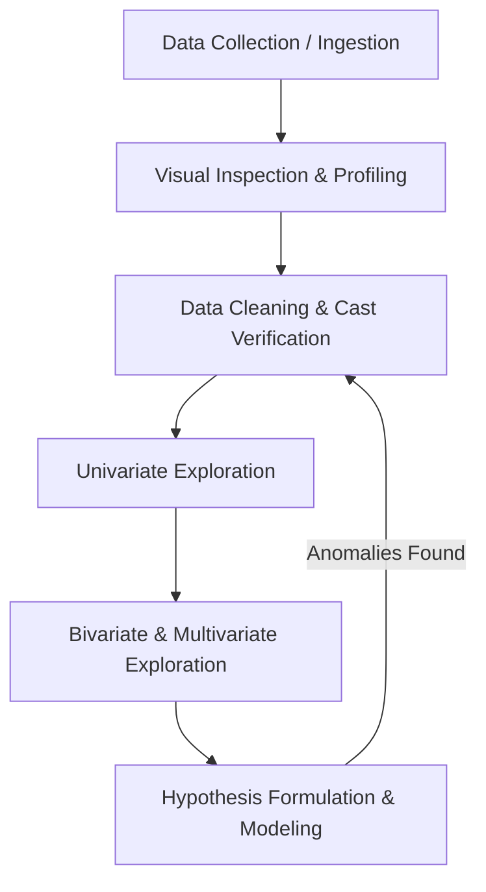

## Why This Matters

Before you can build predictive models, run statistical tests, or draw business conclusions, you must understand your data. Exploratory Data Analysis (EDA) is the critical first step that reveals the hidden structure, anomalies, patterns, and limitations of a dataset, saving you from making flawed assumptions that ruin downstream models.

---

## The Visual Analogy: The Vital Signs Check

Imagine you are an emergency room physician. A patient walks in feeling unwell. You do not immediately wheel them into surgery or prescribe heavy medication without checking their basic indicators. 

```text
    Patient Profile (Raw Dataset)
  ┌─────────────────────────────────────────────────────────────┐
  │   Stethoscope Check (Info)  --> Are all systems intact?      │
  │   Blood Pressure (Describe) --> What is the normal range?   │
  │   Thermometer (Dtypes)      --> What format is the signal?  │
  └─────────────────────────────────────────────────────────────┘
```

You start with a vital signs check:
* **Temperature:** Are they running a fever? (Analogue to checking for extreme values or outliers).
* **Heart Rate & Blood Pressure:** Are the baseline numbers within a standard distribution? (Analogue to checking the mean, median, and standard deviation).
* **Medical History Checklist:** Are there any missing files or incomplete records? (Analogue to checking for null values).

Running an EDA is the "vital signs check" for your dataset. If you bypass this diagnostic phase and jump straight to building machine learning models or writing production scripts, you risk feeding "sick" data into your system. The result? Garbage in, garbage out.

---

## Historical Context: John Tukey and the Birth of EDA

For decades, statistics was dominated by **Confirmatory Data Analysis (CDA)**. Under the CDA paradigm, researchers formulated a strict hypothesis, designed a controlled experiment, collected data, and ran mathematical tests (like t-tests or ANOVA) to accept or reject the hypothesis. 

In 1977, mathematician **John W. Tukey** published his seminal book *Exploratory Data Analysis*. Tukey argued that statistics had become too rigid and obsessed with proving hypotheses before researchers even understood what their data looked like. He famously wrote:

> *"Exploratory data analysis is an attitude, a state of flexibility, a willingness to look for those things that we believe are not there, as well as those we believe to be there."*

Tukey championed a shift in perspective:
* **CDA (Confirmatory Data Analysis)** acts as a **trial**, where the data is the defendant and the statistician acts as the judge or jury to confirm a verdict.
* **EDA (Exploratory Data Analysis)** acts as a **detective investigation**, where the analyst gathers clues, explores leads, and builds a case from the ground up without preconceived notions.

Modern data analytics is a blend of both. You use EDA to generate hypotheses, find patterns, and clean data. You then use CDA to test those hypotheses and validate your findings.

---

## The Systematic EDA Workflow

A disciplined data analyst approaches every dataset with a structured pipeline. The process is iterative, meaning you will often loop back to earlier steps as you discover new details about your data.



1. **Data Collection & Ingestion:** Loading raw files (CSVs, database tables, JSON logs) into memory.
2. **Visual Inspection & Profiling:** Inspecting the raw tables, scanning the columns, and understanding the basic shape of the dataset.
3. **Data Cleaning & Cast Verification:** Fixing misaligned types, handling missing data, and trimming outliers (covered in detail in the next lesson).
4. **Univariate Exploration:** Analyzing individual variables one by one (distribution shapes, center, spread).
5. **Bivariate & Multivariate Exploration:** Analyzing how two or more variables interact with one another (correlations, group comparisons).
6. **Hypothesis Formulation:** Documenting assumptions and preparing the dataset for feature engineering and machine learning models.

---

## Step-by-Step Profiling Mechanics in Pandas

Let's explore the core Pandas tools used to perform the initial vital signs check on any dataset. 

To demonstrate these commands, we will generate a mock ecommerce transactions dataset containing representative real-world challenges: missing values, mixed data types, and varying scales of measurement.

```python
import numpy as np
import pandas as pd

# Setting seed for reproducibility
np.random.seed(42)

# Generate mock data
n_rows = 1000
data = {
    "transaction_id": [f"TX-{10000 + i}" for i in range(n_rows)],
    "customer_age": np.random.choice([np.nan, 18, 25, 34, 45, 52, 60, 68], size=n_rows, p=[0.1, 0.1, 0.15, 0.2, 0.2, 0.1, 0.1, 0.05]),
    "signup_state": np.random.choice(["NY", "CA", "TX", "FL", "IL", "WA", None], size=n_rows, p=[0.2, 0.2, 0.15, 0.15, 0.1, 0.1, 0.1]),
    "order_amount": np.random.exponential(scale=120.0, size=n_rows) + 5.0,
    "loyalty_tier": np.random.choice(["Bronze", "Silver", "Gold", "Platinum"], size=n_rows, p=[0.5, 0.3, 0.15, 0.05]),
    "device_type": np.random.choice(["Mobile", "Desktop", "Tablet", 100, 200], size=n_rows, p=[0.6, 0.3, 0.08, 0.01, 0.01]) # Intentional mixed type gotcha
}

df = pd.DataFrame(data)
```

Now let's break down the functions we run immediately after loading this dataframe.

### 1. `.shape` — Dimensional Inspection
Before looking at the data, you need to know how large it is. The `.shape` property returns a tuple containing the number of rows and columns. Because it is a property and not a method, you do not write parentheses `()` at the end.

```python
# Check dataset dimensions
print("Dimensions:", df.shape)
print("Number of Rows:", df.shape[0])
print("Number of Columns:", df.shape[1])
```

```text
# Output:
Dimensions: (1000, 6)
Number of Rows: 1000
Number of Columns: 6
```

### 2. `.dtypes` — Data Type Mapping
Understanding how Pandas parsed your columns is critical. Numeric columns loaded as objects will prevent you from calculating averages, and dates loaded as strings will prevent time-series slicing.

```python
# Inspect raw datatypes
print(df.dtypes)
```

```text
# Output:
transaction_id     object
customer_age      float64
signup_state       object
order_amount      float64
loyalty_tier       object
device_type        object
dtype: object
```

### 3. `.info(memory_usage='deep')` — The Structural Diagnostic
The `.info()` method is the single most powerful initial profiling tool. It provides:
* The class type (Pandas DataFrame).
* The RangeIndex (total rows).
* The column list with non-null counts (allowing you to spot missing data instantly).
* The data type of each column.
* The actual memory usage of the DataFrame.

> [!IMPORTANT]
> By default, `.info()` only estimates memory usage based on pointer structures. To see the true memory impact of text/string columns, you must pass `memory_usage='deep'`.

```python
# Deep memory and structural audit
df.info(memory_usage="deep")
```

```text
# Output:
<class 'pandas.core.frame.DataFrame'>
RangeIndex: 1000 entries, 0 to 999
Data columns (total 6 columns):
 #   Column          Non-Null Count  Dtype  
---  ------          --------------  -----  
 0   transaction_id  1000 non-null   object 
 1   customer_age    909 non-null    float64
 2   signup_state    900 non-null    object 
 3   order_amount    1000 non-null   float64
 4   loyalty_tier    1000 non-null   object 
 5   device_type     1000 non-null   object 
dtypes: float64(2), object(4)
memory usage: 279.7 KB
```

From this output, we can deduce:
* `customer_age` has only `909` non-null values, meaning `91` records (9.1%) are missing.
* `signup_state` has only `900` non-null values, meaning `100` records (10%) are missing.
* String columns are typed as `object`.

### 4. `.describe()` — Baseline Summary Statistics
The `.describe()` method returns a summary of the distribution's shape, central tendency, and dispersion. By default, it only processes numerical columns.

```python
# Summary statistics for numerical columns
print(df.describe())
```

```text
# Output:
       customer_age  order_amount
count    909.000000   1000.000000
mean      39.566557    117.935749
std       16.147136    111.458285
min       18.000000      5.011681
25%       25.000000     37.336496
50%       34.000000     81.728956
75%       52.000000    163.565989
max       68.000000    780.203350
```

To profile categorical or text columns, you must pass `include='object'` or `include='all'`.

```python
# Summary statistics for categorical columns
print(df.describe(include="object"))
```

```text
# Output:
       transaction_id signup_state loyalty_tier device_type
count            1000          900         1000        1000
unique           1000            6            4           5
top          TX-10000           NY       Bronze      Mobile
freq                1           224          503         576
```

Key insights from these summaries:
* **Numeric:** The average order amount is `$117.94`, but the median (50th percentile) is `$81.73`. The maximum value is `$780.20`. This gap between median and max suggests a right-skewed distribution with potential outliers.
* **Categorical:** `loyalty_tier` has 4 unique values, with `Bronze` being the most frequent (`503` times). `device_type` has 5 unique values, which is strange because we only expected `Mobile`, `Desktop`, and `Tablet`. Let's investigate this.

### 5. `value_counts(dropna=False)` — Cardinality and Frequency
To understand the distribution of values inside a categorical column, we use `.value_counts()`. Always set `dropna=False` to verify if missing values (`NaN`) are present and how they rank in frequency.

```python
# Check distribution of loyalty tiers
print(df["loyalty_tier"].value_counts(dropna=False))
```

```text
# Output:
Bronze      503
Silver      289
Gold        152
Platinum     56
Name: loyalty_tier, dtype: int64
```

Let's check the anomalous `device_type` column:

```python
# Check values of device_type
print(df["device_type"].value_counts(dropna=False))
```

```text
# Output:
Mobile     576
Desktop    324
Tablet      80
100         11
200          9
Name: device_type, dtype: int64
```

We caught an anomaly: the numbers `100` and `200` are embedded inside a string column. This is a classic mixed-type gotcha that will break downstream string parsing or database operations.

### 6. `.nunique()` — Checking Distinct Values
To verify cardinality (how many unique categories exist in each column), we run `.nunique()`. This helps identify columns that could be converted to categorical data types to save memory, or ID columns that should have a unique value for every row.

```python
# Unique counts across all columns
print(df.nunique())
```

```text
# Output:
transaction_id    1000
customer_age         7
signup_state         6
order_amount      1000
loyalty_tier         4
device_type          5
dtype: int64
```

---

## Data Type Inspection: Scales of Measurement

Understanding the mathematical scale of a variable dictates what calculations and charts are valid for it. We split columns into two main groups: Categorical (Qualitative) and Numerical (Quantitative).

```text
                        Data Scales
         ┌───────────────────┴───────────────────┐
    Categorical                             Numerical
   ┌─────┴─────┐                           ┌─────┴─────┐
Nominal     Ordinal                     Interval      Ratio
```

### 1. Categorical Scales

* **Nominal Scale:** Data that represents distinct, unordered categories. You can count frequencies and find the mode, but you cannot perform arithmetic or rank them.
  * *Examples:* `signup_state` ("NY", "CA"), `device_type` ("Mobile", "Desktop").
  * *Pandas Representation:* `object` or `category`.
* **Ordinal Scale:** Data with categories that have a logical order or ranking, but the difference between values is not quantifiable.
  * *Examples:* `loyalty_tier` ("Bronze" < "Silver" < "Gold" < "Platinum").
  * *Pandas Representation:* Categorical data type with `ordered=True`.

Let's define `loyalty_tier` correctly as an ordered ordinal category:

```python
# Cast loyalty tier to an ordered category
tier_order = ["Bronze", "Silver", "Gold", "Platinum"]
df["loyalty_tier"] = pd.Categorical(df["loyalty_tier"], categories=tier_order, ordered=True)

# Now sorting works logically instead of alphabetically
print(df.sort_values(by="loyalty_tier").head(3))
```

```text
# Output:
    transaction_id  customer_age signup_state  order_amount loyalty_tier device_type
0         TX-10000          45.0           NY     47.458925       Bronze      Mobile
6         TX-10006          52.0           CA    112.569420       Bronze      Mobile
7         TX-10007          45.0           WA     10.514081       Bronze      Tablet
```

### 2. Numerical Scales

* **Interval Scale:** Data with a consistent, measurable distance between points, but no true zero point. A value of zero does not mean "nothing."
  * *Examples:* Temperature in Celsius (0°C does not mean there is no heat), standardized test scores.
  * *Pandas Representation:* `float64` or `int64`.
* **Ratio Scale:** Data with a consistent distance between values and a true zero point. A value of zero represents the complete absence of the property.
  * *Examples:* `order_amount` ($0.00 means no purchase), `customer_age` (0 years old).
  * *Pandas Representation:* `float64` or `int64`.

---

## Code Walkthroughs: Real-World Scenarios

Let's walk through two distinct business analytics examples, implementing a systematic profiling routine.

### Example 1: E-Commerce Transaction Profile & Data Audit
Here we profile a transactional dataset, calculating critical operational metrics and auditing for parsing issues.

```python
import pandas as pd
import numpy as np

# Generate Transactional Data
sales_data = {
    "OrderID": [1001, 1002, 1003, 1004, 1005],
    "OrderDate": ["2026-03-01", "2026-03-02", "2026-03-02", "2026-03-03", "2026-03-04"],
    "CustomerID": ["C-99", "C-88", "C-99", "C-77", "C-88"],
    "OrderTotal": ["$120.50", "$85.00", "ERROR", "$450.00", "$92.75"],
    "Returned": [0, 1, 0, 0, 1]
}
sales_df = pd.DataFrame(sales_data)

# Step 1: Initial Profiling
print("--- Raw Dtypes ---")
print(sales_df.dtypes)

# Step 2: Clean the numeric column (OrderTotal has text/dollar signs and 'ERROR')
# We coerce errors to NaN so that parsing doesn't crash the script
sales_df["OrderTotal_Clean"] = (
    sales_df["OrderTotal"]
    .str.replace("$", "", regex=False)
    .replace("ERROR", np.nan)
)
sales_df["OrderTotal_Clean"] = pd.to_numeric(sales_df["OrderTotal_Clean"])

# Convert Date to proper Datetime
sales_df["OrderDate"] = pd.to_datetime(sales_df["OrderDate"])

# Step 3: Verify the profile again
print("\n--- Audited Dtypes & Summary ---")
sales_df.info()
print("\nDescriptive Stats for Cleaned Numeric Value:")
print(sales_df["OrderTotal_Clean"].describe())
```

```text
# Output:
--- Raw Dtypes ---
OrderID        int64
OrderDate     object
CustomerID    object
OrderTotal    object
Returned       int64
dtype: object

--- Audited Dtypes & Summary ---
<class 'pandas.core.frame.DataFrame'>
RangeIndex: 5 entries, 0 to 4
Data columns (total 6 columns):
 #   Column            Non-Null Count  Dtype         
---  ------            --------------  -----         
 0   OrderID           5 non-null      int64         
 1   OrderDate         5 non-null      datetime64[ns]
 2   CustomerID        5 non-null      object        
 3   OrderTotal        5 non-null      object        
 4   Returned          5 non-null      int64         
 5   OrderTotal_Clean  4 non-null      float64       
dtypes: datetime64[ns](1), float64(1), int64(2), object(2)
memory usage: 368.0 + bytes

Descriptive Stats for Cleaned Numeric Value:
count      4.000000
mean     187.062500
std      176.108253
min       85.000000
25%       90.812500
50%      106.625000
75%      202.875000
max      450.000000
Name: OrderTotal_Clean, dtype: float64
```

### Example 2: Web Server Activity Log Inspection
Let's profile a raw web access log dataset, looking at traffic volumes and response codes.

```python
import pandas as pd

log_records = [
    {"ip": "192.168.1.1", "timestamp": "2026-07-09 10:00:00", "method": "GET", "status": 200, "bytes_sent": 4500},
    {"ip": "10.0.0.5", "timestamp": "2026-07-09 10:01:05", "method": "POST", "status": 201, "bytes_sent": 1200},
    {"ip": "192.168.1.1", "timestamp": "2026-07-09 10:02:10", "method": "GET", "status": 404, "bytes_sent": 0},
    {"ip": "172.16.0.22", "timestamp": "2026-07-09 10:03:00", "method": "GET", "status": 500, "bytes_sent": 250},
    {"ip": "10.0.0.5", "timestamp": "2026-07-09 10:04:12", "method": "GET", "status": 200, "bytes_sent": 8900}
]

log_df = pd.DataFrame(log_records)

# Deep Profile of memory usage
print("--- Memory Audit ---")
log_df.info(memory_usage="deep")

# Check distribution of status codes
print("\n--- HTTP Status Code Frequencies ---")
print(log_df["status"].value_counts(dropna=False))

# Identify High-Volume Requests
print("\n--- IP Traffic Summary ---")
print(log_df.groupby("ip")["bytes_sent"].sum().sort_values(ascending=False))
```

```text
# Output:
--- Memory Audit ---
<class 'pandas.core.frame.DataFrame'>
RangeIndex: 5 entries, 0 to 4
Data columns (total 5 columns):
 #   Column      Non-Null Count  Dtype 
---  ------      --------------  ----- 
 0   ip          5 non-null      object
 1   timestamp   5 non-null      object
 2   method      5 non-null      object
 3   status      5 non-null      int64 
 4   bytes_sent  5 non-null      int64 
dtypes: int64(2), object(3)
memory usage: 1.1 KB

--- HTTP Status Code Frequencies ---
200    2
201    1
404    1
500    1
Name: status, dtype: int64

--- IP Traffic Summary ---
ip
10.0.0.5       10100
192.168.1.1     4500
172.16.0.22      250
Name: bytes_sent, dtype: int64
```

---

## Edge Cases, Gotchas & Industry Best Practices

### 1. The "Object" Column Trap (Hidden Mixed Types)
In Pandas, string or text columns are labeled as `object` datatypes. However, the `object` type is a catch-all container for any Python pointer. This means a single column can contain a mix of strings, floats, integers, and dictionaries without raising a dtype error.

```python
# Demonstrating the object column trap
mixed_series = pd.Series(["Chicago", 1500, np.nan, True, {"key": "val"}])
print("Dtype:", mixed_series.dtype)

# Apply a string method on mixed type
try:
    print(mixed_series.str.upper())
except AttributeError as e:
    print("Error:", e)
```

```text
# Output:
Dtype: object
Error: Can only use .str accessor with string values!
```

**Best Practice:** Always inspect the underlying Python types of an object column using a type audit query:

```python
# Audit underlying python classes in the column
print(mixed_series.apply(type).value_counts())
```

```text
# Output:
<class 'str'>     1
<class 'int'>     1
<class 'float'>   1
<class 'bool'>    1
<class 'dict'>    1
dtype: int64
```

### 2. Deep Memory Profiling
If you load a 10GB dataset into memory, Pandas might show memory usage of "only 500MB" if you run `.info()` without parameters. This is because Pandas only looks at the size of the references (pointers) in object columns, not the underlying strings.

```python
# Create a dataframe with long text fields
large_text_df = pd.DataFrame({"text_col": ["a" * 1000000 for _ in range(5)]})

# Standard info
print("--- Standard Estimation ---")
large_text_df.info()

# Deep info
print("\n--- Deep Memory Audit ---")
large_text_df.info(memory_usage="deep")
```

```text
# Output:
--- Standard Estimation ---
<class 'pandas.core.frame.DataFrame'>
RangeIndex: 5 entries, 0 to 4
Data columns (total 1 columns):
 #   Column    Non-Null Count  Dtype 
---  ------    --------------  ----- 
 0   text_col  5 non-null      object
dtypes: object(1)
memory usage: 168.0+ bytes

--- Deep Memory Audit ---
<class 'pandas.core.frame.DataFrame'>
RangeIndex: 5 entries, 0 to 4
Data columns (total 1 columns):
 #   Column    Non-Null Count  Dtype 
---  ------    --------------  ----- 
 0   text_col  5 non-null      object
dtypes: object(1)
memory usage: 4.8 MB
```

Notice the massive discrepancy: standard estimation shows **168 bytes**, while deep memory auditing reveals **4.8 megabytes** of actual RAM usage!

---

## Practice Exercises

<div class="challenge">
<h3>Challenge 1: The Mixed-Type Sleuth</h3>
<p>You have been given a dataset containing raw registration entries. The <code>phone_number</code> column has been parsed as an object, but it contains a mix of integers, strings with hyphens, and float NaNs.</p>
<p>Write a script to:
1. Generate this mock dataset.
2. Find the counts of each raw data type in the column.
3. Clean the column so all entries are either standard 10-digit numeric strings or NaN.</p>
</div>

#### Solution Walkthrough:

```python
import pandas as pd
import numpy as np

# 1. Generate Mock Dataset
data = {
    "username": ["UserA", "UserB", "UserC", "UserD", "UserE"],
    "phone_number": [5550199, "555-0182", np.nan, 5550144.0, "Invalid Number"]
}
df_phones = pd.DataFrame(data)

# 2. Audit raw types
print("Raw Type Audit:")
print(df_phones["phone_number"].apply(type).value_counts())

# 3. Clean logic
def clean_phone(val):
    if pd.isna(val):
        return np.nan
    # Convert numerical types to flat strings
    val_str = str(val).split(".")[0] # Strip decimal floats
    # Remove non-numeric characters
    cleaned = "".join(c for c in val_str if c.isdigit())
    # Return NaN if not a valid length or format
    if len(cleaned) < 7:
        return np.nan
    return cleaned

df_phones["cleaned_phone"] = df_phones["phone_number"].apply(clean_phone)
print("\nCleaned DataFrame:")
print(df_phones)
```

```text
# Output:
Raw Type Audit:
<class 'int'>      2
<class 'str'>      2
<class 'float'>    1
Name: phone_number, dtype: int64

Cleaned DataFrame:
  username    phone_number cleaned_phone
0    UserA         5550199       5550199
1    UserB        555-0182       5550182
2    UserC             NaN           NaN
3    UserD  5550144.000000       5550144
4    UserE  Invalid Number           NaN
```

---

## Section Recaps

* **The EDA Mindset:** Approach data as a detective, not as a judge. Understand what is there before testing hypotheses.
* **Vital Checks:** Use `.shape` for table boundaries, `.info(memory_usage='deep')` for null status and memory footprints, and `.describe()` for distribution snapshots.
* **Scale Awareness:** Map columns to Categorical (Nominal/Ordinal) and Numerical (Interval/Ratio) scales to choose correct analytical operations.
* **The Object Trap:** String columns are parsed as `object`, which can silently hide mixed python data types. Run type auditing checks to locate them.

---

## Common Interview Questions

### Q1: What is the fundamental difference between Exploratory Data Analysis (EDA) and Confirmatory Data Analysis (CDA)?
**Answer:**
EDA is an inductive process focused on discovery, pattern identification, anomaly detection, and hypothesis generation. There are no rigid assumptions, and analysts use visual and statistical summarizations to let the dataset speak for itself. 

CDA is a deductive process focused on hypothesis testing and confirmation. It begins with a specific, predefined hypothesis and uses formal statistical tests (such as p-values, confidence intervals, and significance levels) to validate or invalidate the hypothesis. 

---

### Q2: Why is the `memory_usage='deep'` parameter necessary when calling `.info()` on a Pandas DataFrame?
**Answer:**
By default, Pandas only computes the memory footprint of the DataFrame's index and column container structures. For `object` columns (which contain text, strings, or mixed Python objects), Pandas only counts the memory used by the 64-bit memory addresses (pointers) pointing to those objects, not the size of the objects themselves. 

Passing `memory_usage='deep'` forces Pandas to traverse the pointers and look up the actual size of the strings or Python objects in system memory. Without this parameter, memory usage for string-heavy tables is severely underestimated.

---

### Q3: How do you identify whether an object column contains mixed data types in a Pandas DataFrame?
**Answer:**
You cannot rely on the column's `.dtype` alone, as it will simply display `object`. Instead, use the `.apply()` method combined with Python's built-in `type()` function to evaluate the type of each cell, and then use `.value_counts()` to summarize:
```python
df["column_name"].apply(type).value_counts()
```
If this returns multiple classes (such as `int`, `str`, and `float`), the column contains mixed data types, which must be cleaned before performing downstream analytical or machine learning tasks.

---

### Q4: Explain the differences between Nominal and Ordinal data scales, and how you should represent them in Pandas.
**Answer:**
Nominal and Ordinal are categories of Qualitative/Categorical data:
* **Nominal data** has no inherent, logical order or rank. Examples include country names, colors, or gender. In Pandas, these are best represented as standard string/object columns or nominal `category` types to save memory.
* **Ordinal data** has a strict, logical ranking or order. Examples include education levels (High School < Bachelor's < Ph.D.) or feedback ratings (Bad < Neutral < Good). In Pandas, these must be cast using `pd.Categorical` with the `categories` parameter set to the logical order and the `ordered` flag set to `True`.

---

### Q5: What is target variable imbalance, and why is it important to detect it during the initial profiling phase?
**Answer:**
Target variable imbalance occurs when one class in a categorical variable significantly outnumbers the other classes (e.g., in a credit card fraud dataset, 99.9% of transactions are legitimate and 0.1% are fraudulent). 

It is crucial to detect this during the initial profiling phase (typically using `value_counts(normalize=True)`) because highly imbalanced target variables will bias machine learning classifiers. Standard models will achieve 99.9% accuracy by simply predicting the majority class every time, failing to detect the minority class. Detecting this early tells the analyst they need to use specialized metrics (such as Precision-Recall AUC) and sampling techniques (like SMOTE or class weighting).
