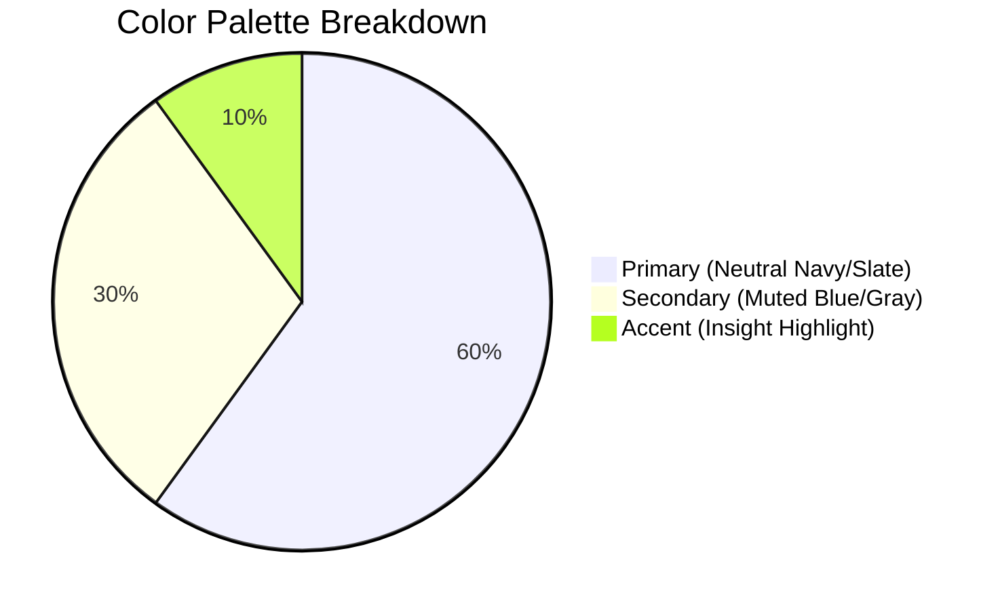

## Why This Matters: The Speed of Sight

Imagine driving a modern sports car down a dark, winding mountain road at night. Under the hood, the engine is generating a massive stream of complex telemetry: oil pressure, combustion temperature, exhaust oxygen levels, gear ratios, fuel flow rates, and piston cycles per second. If you, the driver, had to read that raw numerical telemetry in real-time, you would crash within seconds. 

Instead, the car's dashboard translates those thousands of data points into a few clean, visual indicators: a speedometer, a fuel gauge, and a check engine light. 

**Charts are the headlights of your data analysis.** 

In any data analytics role, nobody has the time or cognitive energy to read a 10,000-row spreadsheet. Raw numbers represent the "engine telemetry" of a business, while charts are the "headlights" that guide the driver (executives, stakeholders, and managers) in the right direction. 

Data visualization works because of **pre-attentive visual processing**. Before our conscious brain reads a single digit or letter, our visual cortex has already identified shapes, lengths, colors, and trends. When you present a wall of numbers to a stakeholder, you force their brain to perform heavy cognitive lifting—they must read, translate, compare, and then decide. A well-designed chart bypasses this translation phase. It taps directly into the brain's pre-attentive processing, delivering insights in milliseconds. A poorly formatted or incorrectly chosen chart is like a broken headlight—it creates confusion, misrepresents the road ahead, and can lead to disastrous business decisions. This lesson teaches you how to select, build, format, and organize charts so they tell clear, honest, and actionable stories.

---

## The Concept of Data-Ink Ratio

Before diving into specific chart types, we must understand the core philosophy of professional design. Pioneered by statistician Edward Tufte, the **Data-Ink Ratio** is defined as the proportion of ink (or pixels) on a graphic that is used to present actual data, compared to the total ink used.

$$\text{Data-Ink Ratio} = \frac{\text{Data-Ink}}{\text{Total Ink Used to Print the Graphic}}$$

To maximize this ratio:
* **Delete non-data ink:** Gridlines, borders, drop shadows, 3D rotations, background gradients, and redundant labels.
* **Enhance data ink:** Make the data points, trendlines, bars, and markers clear and dominant.

A professional chart should be as simple as possible, but no simpler. Every pixel must justify its existence. If a visual element does not help the reader understand the numbers, it is **chart junk** and must be removed.

---

## The Chart Selection Matrix

The single most common mistake in data visualization is picking a chart because it "looks cool" rather than because it fits the mathematical nature of the data. Use this decision matrix as your visual compass:

| Analytical Goal | Best Chart Type | Underlying Data Nature | Business Example |
| :--- | :--- | :--- | :--- |
| **Categorical Comparison** | Bar / Column Chart | Discrete categories, non-temporal | Revenue across different regions or product categories |
| **Time-Series Trend** | Line Chart | Continuous variables measured over sequential time periods | Monthly sales performance over a 12-month fiscal year |
| **Relationship / Correlation** | Scatter Plot | Two numeric variables for the same observations | Ad spend (X-axis) vs. conversion revenue (Y-axis) |
| **Parts-to-Whole** | Pie / Donut Chart | Proportions that sum to exactly 100% (limit to $\le$ 5 slices) | Market share of the top 4 competitors in an industry |
| **Incremental Variance** | Waterfall Chart | Sequential positive and negative steps leading to a final total | A profit bridge showing Revenue minus COGS, minus SG&A, to Net Profit |
| **Bivariate Distribution** | Bubble Chart | Three numeric variables (X, Y, and Z size) | Market Share (X) vs. Profit Margin (Y) vs. Total Revenue (Bubble Size) |

---

## Bar & Column Charts — Comparing Categories

Bar and column charts rely on the length or height of rectangles to represent data values. Because the human eye is highly sensitive to relative lengths, these are the most effective charts for comparison.

### Example Data: Sales by Product Line

Before creating our chart, let's look at our source data table:

| Product Category | Monthly Sales (₹) | Units Sold | Average Unit Price (₹) |
| :--- | :--- | :--- | :--- |
| Electronics | 15,20,000 | 1,200 | 1,267 |
| Apparel | 8,90,000 | 2,300 | 387 |
| Home & Kitchen | 12,10,000 | 1,800 | 672 |
| Beauty & Personal Care | 4,30,000 | 950 | 453 |
| Books & Stationery | 2,10,000 | 1,400 | 150 |

### Step-by-Step Walkthrough: Creating a Clean Column Chart

To present this categorical comparison cleanly:

1. **Select the Range:** Highlight cells `A1:B6` (omitting the "Units Sold" and "Average Unit Price" columns to focus strictly on revenue).
2. **Insert Chart:** Navigate to the ribbon: **Insert → Charts group → Insert Column or Bar Chart → Clustered Column (2D)**.
3. **Sort the Data:** To make the chart instantly readable, sort the raw table data by `Monthly Sales` from **Largest to Smallest** (Data tab → Sort). This arranges your chart columns in a clean descending stair-step pattern.
4. **Remove Gridlines:** Click on any vertical or horizontal gridline in the chart. You will see blue dots appear on all gridlines. Press **Delete**.
5. **Adjust Gap Width:** Right-click one of the columns and select **Format Data Series**. Under the Series Options tab, change **Gap Width** from the default 150% to **80%** or **100%**. This makes the columns thicker and more visually dominant, preventing "skinny columns" that look unprofessional.
6. **Add Data Labels:** Right-click the columns → select **Add Data Labels**. This allows you to delete the vertical Y-axis entirely, removing redundant ink.
7. **Clean the Axis:** Double-click the X-axis to open the formatting pane. Go to **Axis Options → Tick Marks** and set **Major type** to **None** to remove the tiny tick marks between labels.
8. **Remove Border:** Click the outer chart area, go to **Format Chart Area → Border**, and select **No Line**.

```excel
=A2
```

```text
# Output:
A clean, vertical column chart sorted from highest-performing category (Electronics: ₹15,20,000) 
to lowest (Books & Stationery: ₹2,10,000) with labels placed directly on top of the columns.
No clutter, no unnecessary gridlines, and maximum data-ink ratio.
```

---

## Line Charts — Visualizing Trends Over Time

Line charts connect individual data points with straight lines. They are designed to show how a metric changes across a continuous variable, almost always time (days, weeks, months, quarters, or years).

### Example Data: Monthly Software Subscription Revenue

Here is our 6-month historical database for a SaaS product:

| Month | Active Subscribers | Monthly Recurring Revenue (MRR - ₹) | Churn Rate % |
| :--- | :--- | :--- | :--- |
| Jan | 1,200 | 12,00,000 | 2.1% |
| Feb | 1,350 | 13,50,000 | 1.8% |
| Mar | 1,410 | 14,10,000 | 2.5% |
| Apr | 1,600 | 16,00,000 | 1.9% |
| May | 1,750 | 17,50,000 | 1.5% |
| Jun | 2,100 | 21,00,000 | 1.2% |

### Step-by-Step Walkthrough: Creating a Trendline Chart

1. **Select Time Series Data:** Highlight cells `A1:A7` and, holding the `Ctrl` key, highlight cells `C1:C7`. This skips the subscriber count and churn rate.
2. **Insert Chart:** Click **Insert → Charts group → Insert Line Chart → Line with Markers**.
3. **Format the Line:** Right-click the line and select **Format Data Series**. Navigate to the Fill & Line (paint bucket) tab.
   * Under **Line**, choose a solid corporate color (like Navy Blue) and set the width to **2.5 pt**.
   * Under **Marker**, select **Marker Options → Built-in**, choose a circle marker, and increase its size to **7**. Set the Marker Fill to White and the Marker Border to Navy Blue. This creates a professional "hollow circle" indicator at each data point.
4. **Smooth the Line:** Scroll to the bottom of the line formatting panel and check the **Smoothed Line** box. This rounds out the sharp angles, making the trend look organic and premium.
5. **Add Axis Titles:** Click the chart, select the green **+** sign (Chart Elements) on the top right, check **Axis Titles**, and change the Y-axis label to "Revenue (₹ in Lakhs)".

```excel
=TEXT(C2, "₹#,##,##0")
```

```text
# Output:
A professional, smoothed line chart tracking MRR. 
The line starts at ₹12,00,000 in January and steadily climbs to ₹21,00,000 in June.
Hollow markers draw the reader's eye directly to individual monthly values.
```

---

## Scatter Charts — Finding Correlation

Scatter charts map observations using Cartesian coordinates to show the relationship between two numerical variables. They are the primary tools for exploratory data analysis before running regressions.

### Example Data: Marketing Spend vs. Customer Acquisition

Let's analyze 8 marketing campaigns to determine if budget increases lead to linear increases in client conversion:

| Campaign ID | Ad Spend (₹) | Sign-ups | Customer Acquisition Cost (CAC - ₹) |
| :--- | :--- | :--- | :--- |
| C-01 | 45,000 | 450 | 100 |
| C-02 | 80,000 | 720 | 111 |
| C-03 | 30,000 | 310 | 97 |
| C-04 | 1,10,000 | 900 | 122 |
| C-05 | 65,000 | 610 | 107 |
| C-06 | 50,000 | 490 | 102 |
| C-07 | 95,000 | 810 | 117 |
| C-08 | 1,20,000 | 950 | 126 |

### Step-by-Step Walkthrough: Building a Scatter Plot with a Regression Line

1. **Select Variables:** Select the independent variable (X-axis: `B2:B9` Ad Spend) and the dependent variable (Y-axis: `C2:C9` Sign-ups). Do not select the Campaign IDs.
2. **Insert Scatter:** Go to **Insert → Charts group → Scatter (X, Y) or Bubble Chart → Scatter**.
3. **Add Trendline:** Right-click any plotted dot on the chart and select **Add Trendline...**
4. **Configure Trendline:** In the Format Trendline pane:
   * Select **Linear**.
   * Scroll down and check **Display Equation on Chart**.
   * Check **Display R-squared value on Chart**.
5. **Format Axes:** Double-click the X-axis numbers. In Axis Options, change the Number category to Currency with 0 decimal places, so the numbers display clearly as currency.

```excel
=CORREL(B2:B9, C2:C9)^2
```

```text
# Output:
A scatter plot showing a clear upward-sloping correlation.
Equation: y = 0.0071x + 138.4
R² = 0.985
This R² value tells us that 98.5% of the variation in user Sign-ups is explained by the money spent on ads.
```

---

## Waterfall Charts — Explaining Variance

Waterfall charts illustrate the cumulative effect of sequentially introduced positive or negative values. The columns are color-coded to show increases and decreases, with floating blocks representing changes and anchored columns representing totals.

### Example Data: Q1 Earnings Bridge

Here is the financial progression of a startup's quarterly earnings statement:

| Item | Amount (₹) | Type |
| :--- | :--- | :--- |
| Revenue | 25,00,000 | Starting Point |
| COGS | -8,50,000 | Decrease |
| Gross Margin | 16,50,000 | Subtotal / Intermediate |
| Marketing Expense | -3,00,000 | Decrease |
| Administrative Costs | -4,50,000 | Decrease |
| Tax Provision | -1,80,000 | Decrease |
| Net Income | 7,20,000 | Final Total |

### Step-by-Step Walkthrough: Formatting Subtotals and Totals

1. **Select Data:** Highlight cells `A1:B8`.
2. **Insert Waterfall:** Select **Insert → Charts group → Insert Waterfall, Funnel, Stock, Surface, or Radar Chart → Waterfall**.
3. **Define Totals (Crucial Step):** By default, Excel treats every category as a floating step. You must specify which categories are actual static totals:
   * Double-click the **Gross Margin** bar. Ensure that only this single bar is selected (you will see selection handles on just this block).
   * Right-click the bar and select **Set as Total**. The bar will change color (usually from blue/red to a neutral gray) and anchor itself to the bottom X-axis at zero.
   * Repeat this exact process for the **Net Income** bar.
4. **Color Customization:** Double-click the legend to select individual groups (Increase, Decrease, Total). Set standard business colors:
   * Increase: Soft Green (e.g., `#A9DFBF`)
   * Decrease: Soft Red (e.g., `#FADBD8`)
   * Total: Deep Slate Blue (e.g., `#2E4053`)

```excel
=B2+B3+B5+B6+B7
```

```text
# Output:
A visual profit bridge showing the ₹25L Revenue column on the left.
COGS drops the bridge down by ₹8.5L to anchor at Gross Margin (₹16.5L).
Operating costs drop it further until the final Net Income anchors at ₹7.2L.
```

---

## Combo Charts with Dual Axis

A combo chart combines two distinct chart types (such as column and line) into a single visualization. A dual-axis (secondary axis) is required when you plot two metrics that have completely different units or scales (e.g., Revenue in millions vs. Profit Margin in percent). Without a secondary axis, the percentage values (ranging from 0.0 to 1.0) would plot as flat lines at the very bottom of a multi-million rupee column chart.

### Example Data: Sales vs. Gross Profit Margin %

Here is a monthly divisional performance report:

| Month | Revenue (₹ Lakhs) | Gross Margin % |
| :--- | :--- | :--- |
| January | 12.0 | 45% |
| February | 15.5 | 40% |
| March | 9.0 | 50% |
| April | 18.0 | 38% |
| May | 22.4 | 35% |
| June | 25.0 | 42% |

### Step-by-Step Walkthrough: Building a Professional Combo Chart

1. **Highlight the Source Range:** Select `A1:C7`.
2. **Insert Combo Chart:** Navigate to **Insert → Charts group → Insert Combo Chart → Create Custom Combo Chart**.
3. **Configure the Axes and Chart Types:**
   * Set **Revenue (₹ Lakhs)** to **Clustered Column** and leave the Secondary Axis box **unchecked** (this maps it to the primary left axis).
   * Set **Gross Margin %** to **Line with Markers** and check the **Secondary Axis** box on the right.
   * Click **OK**.
4. **Align Zero Points:** If you have negative numbers or want clean gridline layouts, ensure the gridlines align. In this case, format both axes to have identical division counts. Right-click the primary Y-axis, select Format Axis, and set bounds (e.g., Minimum: 0, Maximum: 30, Major Units: 5). Right-click the secondary Y-axis and set bounds (e.g., Minimum: 0, Maximum: 0.60, Major Units: 0.10). This ensures exactly 6 horizontal grid lines, keeping the chart mathematically clean.
5. **Link a Dynamic Title:** Let's write a formula that dynamically formats our title based on a cell.
   * Click the Chart Title box once.
   * Click into the Formula Bar at the top of Excel.
   * Type `=Dashboard!$A$1` (where cell A1 contains the formula: `="Monthly Revenue & Margin Performance Trend (H1 2026)"`).
   * Press Enter. The chart title will now change dynamically whenever the formula in cell A1 updates.

```excel
="Monthly Revenue & Margin Performance Trend (H1 2026)"
```

```text
# Output:
A dual-axis chart where vertical blue columns representing Revenue (scale on left, 0 to 25 Lakhs)
are overlayed by a clean orange trendline showing Gross Margin % (scale on right, 0% to 50%).
This instantly highlights that while revenue surged in May (₹22.4L), margin dropped to its lowest point (35%).
```

---

## 5 Golden Rules of Dashboard Design

An Excel dashboard is a collection of key reports and visualizations arranged in a single worksheet, designed to give stakeholders a high-level overview of business health. Follow these five rules to create clean, readable dashboards:

### Rule 1: KPI Blocks on the Top-Left
The human eye reads in an "F" pattern, starting at the top-left corner and scanning across and down. Place your most critical high-level numbers (KPIs) in large, bold cells in this sector.
* Merge a small group of cells (e.g., 2 rows by 3 columns).
* Write a dynamic reference to your summary table:
  ```excel
  =TEXT(SUM(B2:B7), "₹#,##,##0")
  ```
* Format the text size to **20pt or 24pt**, make it bold, and label it with a smaller **9pt gray descriptor** directly above (e.g., "TOTAL REVENUE H1").

### Rule 2: The 3-Color Corporate Palette
Rainbow charts scream amateurism. Restrict your color choices to a strict palette of 3 colors:
1. **Primary Color (60% of layout):** A neutral, dark shade (navy blue, slate gray, charcoal) for the majority of the data series.
2. **Secondary Color (30% of layout):** A muted tone (light blue, light gray) for comparative series or secondary axes.
3. **Accent Color (10% of layout):** A vibrant color (orange, teal, gold) reserved *only* for highlighting critical insights, outliers, or target thresholds.
* Use soft green for positive performance variance and soft red for negative indicators.



### Rule 3: Interactive Slicers for Real-Time Analysis
If you build pivot charts, you can link visual buttons called Slicers to multiple charts simultaneously.
1. Click on a Pivot Chart.
2. Go to **PivotChart Analyze → Insert Slicer** → Select your dimension (e.g., "Region").
3. Right-click the generated Slicer box and select **Report Connections...**
4. Check the box for every Pivot Table and Pivot Chart on your dashboard worksheet.
* Now, clicking "North" will filter all charts, KPI blocks, and tables at once.

### Rule 4: Snap to Grid Layout
A messy dashboard with misaligned charts feels chaotic.
* Hold down the **Alt** key while clicking and dragging your charts.
* Excel will automatically snap the corners of the chart to the nearest gridline.
* Keep 1-2 empty rows/columns between charts to act as whitespace, letting the dashboard breathe.

### Rule 5: Contextual & Dynamic Titles
Never use generic names like "Chart 1" or "Sales". Use formula-driven titles that reflect the user's current slicer selection.
* If your Region slicer is outputting its current selection to cell `F1`, write this formula in cell `A1`:
  ```excel
  ="Sales Performance Analysis — " & IF(F1="","All Regions",F1)
  ```
* Bind your chart title to this cell to ensure that when a user clicks "South", the title automatically changes to "Sales Performance Analysis — South".

---

## De-junking Example: Transforming a Default Excel Chart

Let's walk through the transformation of a default, cluttered Excel chart into a clean, presentation-ready visualization.

### The Source Data: Customer Service Wait Times

| Team | Average Response Time (Minutes) |
| :--- | :--- |
| Tier 1 Support | 42 |
| Tier 2 Technical | 128 |
| Enterprise Desk | 18 |
| Social Media Team | 5 |
| Billing & Accounts | 67 |

### The "Ugly" Default Setup
By default, Excel generates a vertical column chart with:
1. Gray horizontal gridlines at 20-minute intervals.
2. An outer border outline around the chart area.
3. Vertical axis numbers from 0 to 140.
4. A legend at the bottom saying "Average Response Time (Minutes)".
5. Muted blue columns with a wide gap width (150%).
6. A generic chart title "Average Response Time (Minutes)".

### Step-by-Step De-junking Process

Let's clean this up to maximize the data-ink ratio:

1. **Switch to Horizontal Bars:** Because our category names (e.g., "Tier 2 Technical", "Billing & Accounts") are long, a vertical column chart forces the labels to tilt diagonally or wrap awkwardly. 
   * Right-click the chart → **Change Chart Type → Bar → Clustered Bar**.
2. **Sort the Data:** In our data sheet, sort the table by `Average Response Time` from **Largest to Smallest**. In horizontal bar charts, this displays the longest bar at the top and the shortest bar at the bottom.
3. **Remove Gridlines:** Click any vertical gridline. Press **Delete**.
4. **Delete the Legend:** Since we only have a single data series (Response Time), the legend is redundant. Click the legend box at the bottom and press **Delete**.
5. **Delete the X-Axis:** Since we will add data labels directly to the bars, we don't need the bottom axis numbers. Click the horizontal axis numbers and press **Delete**.
6. **Thicken the Bars:** Right-click any bar → **Format Data Series**. Set **Gap Width** to **75%**.
7. **Add Data Labels:** Right-click the bars → **Add Data Labels**. Select the labels, go to the Formatting Pane, and set their position to **Inside End** or **Outside End**. Format them to be bold.
8. **Mute Secondary Categories:** Let's highlight only the team that is failing our SLA (Response Time > 60 minutes).
   * Click once on the bars to select the whole series.
   * Click a second time *only* on the **Tier 2 Technical** bar. Go to Fill and set it to a solid **Accent Coral/Red**.
   * Click a second time *only* on the **Billing & Accounts** bar. Set it to the same **Accent Coral/Red**.
   * Format all other bars to a neutral **Muted Gray**.
9. **Write an Action Title:** Replace the generic title with an active headline:
   * *"Action Required: Tier 2 Tech & Billing Exceed 60-Min Response SLA"*

```text
# Output:
A clean, professional horizontal bar chart. 
The viewer's eye is instantly drawn to Tier 2 Technical (128 min) and Billing & Accounts (67 min)
highlighted in red, while the compliant teams fade into a clean gray background. 
There are no distracting borders, gridlines, or axes.
```

---

## Edge Cases & Common Mistakes (Gotchas)

### 1. The Spaghetti Line Chart
**The Problem:** Trying to show 15 different product lines on a single line chart. The lines overlap, cross, and turn the visualization into an unreadable mess of colors.
**The Fix:** Limit line charts to a maximum of **4 or 5 lines**. If you must show more, use **Small Multiples** (creating multiple tiny, simplified charts side-by-side) or use a conditional formula to highlight only the top 3 and group the rest into an "Others" category.

### 2. Truncated Y-Axis on Column/Bar Charts
**The Problem:** Adjusting the Y-axis of a column chart so it starts at ₹5,00,000 instead of ₹0 to make small differences look massive. This visually distorts the data and misleads the reader.
**The Fix:** **Columns and bars must always start at a zero baseline.** Because the eye compares the relative area and height of the bar, truncating the axis makes a 5% difference look like a 500% difference. If the differences are small but critical to show, switch to a line chart or a text-based variance table.

### 3. Misleading Pie Charts
**The Problem:** Pie charts containing 12 slices, or slices representing categories that do not sum to 100% of the total.
**The Fix:** Limit pie and donut charts to **5 slices or fewer**. Sort the slices from largest to smallest, starting at 12 o'clock and moving clockwise. If you have more than 5 categories, combine the smaller categories into a single "Other" slice, or convert the entire chart into a sorted horizontal bar chart.

---

## Practice Exercises

### Exercise 1: Build a Sales Representative Performance Dashboard
**Dataset:** You have the following quarterly sales table:

| Rep Name | Region | Q1 Sales (₹) | Q2 Sales (₹) | Target Met? |
| :--- | :--- | :--- | :--- | :--- |
| Rajesh | North | 6,50,000 | 7,10,000 | Yes |
| Priya | South | 4,20,000 | 3,90,000 | No |
| Ankit | East | 5,80,000 | 6,20,000 | Yes |
| Sarah | West | 7,10,000 | 8,00,000 | Yes |
| Vikram | North | 3,10,000 | 2,90,000 | No |

**Your Task:**
1. Create a clustered column chart comparing Q1 vs. Q2 sales for all reps.
2. Format the chart by removing gridlines, changing the gap width to 90%, and setting Rajesh and Sarah (top performers) to a primary blue color while using a muted gray for the other reps.
3. Write a dynamic title in cell `A10` that counts how many reps met their target using standard functions, and link your chart title to that cell.

### Exercise 2: The Profit & Loss Waterfall
**Dataset:** Use the following cost structure:

| Line Item | Value (₹) |
| :--- | :--- |
| Gross Revenue | 12,00,000 |
| Returns & Allowances | -1,20,000 |
| Net Sales | 10,80,000 |
| Cost of Goods Sold | -4,50,000 |
| Operating Expenses | -3,00,000 |
| Interest Expense | -50,000 |
| Net Income | 2,80,000 |

**Your Task:**
1. Generate a Waterfall chart from this data.
2. Correctly set the `Net Sales` and `Net Income` columns as totals.
3. Ensure the colors clearly distinguish between positive cash inflows, expenses, and key financial milestones.

---

## Section Recaps

* **The Selection Principle:** Choose charts based on the relationship you want to highlight, not visual styling. Column charts compare categories; line charts show trends over time; scatter plots find correlations; and waterfalls explain changes.
* **The Data-Ink Ratio:** Maximize readability by removing chart junk—borders, 3D effects, bright backgrounds, and heavy gridlines.
* **Combo Charts:** Combine column and line series to plot distinct variables (e.g., sales volume and margin rate) on a dual-axis layout.
* **Dashboard Design:** Place high-level KPI blocks in the top-left corner, align all charts to a grid layout using `Alt+drag`, and keep colors restricted to a clean 3-color palette.

---

## Common Interview Questions

### Q1: When is it appropriate to use a secondary Y-axis, and what are the dangers?
**Answer:** A secondary Y-axis is appropriate when you need to plot two variables with different units of measure or scale on the same chart (such as tracking monthly sales volume in rupees on the left axis alongside profit margin percentage on the right axis). 

The primary danger is visual distortion. By adjusting the scale of the secondary axis, you can make a small change in margin look massive compared to a large change in sales, leading the viewer to draw incorrect conclusions. To prevent this, always label both axes clearly, use contrasting colors to match the data series to its respective axis, and align the zero lines.

### Q2: Why are 3D charts heavily discouraged by data analysts?
**Answer:** 3D charts are discouraged because they introduce perspective distortion. Skewing the chart introduces depth angles, which alters the apparent size of the columns or slices. The viewer's brain struggles to accurately compare heights or angles when they are projected in 3D space—for example, a slice of a pie chart tilted forward will look larger than an identical slice tilted backward. Stick to clean, flat 2D representations.

### Q3: How do you handle category labels that are overlapping or cut off on the X-axis of a column chart?
**Answer:** There are two primary solutions:
1. **Pivot the Chart:** Change the chart type from a vertical column chart to a horizontal bar chart. This aligns the category labels horizontally on the left side of the chart, providing unlimited space to read left-to-right.
2. **Abbreviate or Wrap:** If a column chart must be used, clean up the source labels. You can wrap the text, change the font size, or rotate the labels to a clean 45-degree angle. Never use 90-degree vertical labels, as they force the reader to tilt their head.

### Q4: If you have an R-squared value of 0.35 on a scatter plot trendline, what does this tell you?
**Answer:** An R-squared value of 0.35 means that only 35% of the variance in the dependent variable (Y) is explained by the variance in the independent variable (X). The remaining 65% is driven by random noise or other external factors. 

In a business context, this suggests a weak relationship. While there might be a general trend, you cannot reliably predict the output based on this single input. You should look for other explanatory variables or use multivariate regression.

### Q5: How do you build a dynamic KPI card in Excel that changes format based on whether a target is met?
**Answer:** 
1. Create a cell containing the KPI value using a formula like `=SUM(Revenue)`.
2. Select the card cell, navigate to **Home → Conditional Formatting → New Rule**.
3. Select **Use a formula to determine which cells to format**.
4. Write a comparison formula checking if the KPI value exceeds your target:
   ```excel
   =B1>=TargetValue
   ```
5. Set the format to show green text and fill if the target is met.
6. Create a second rule with the inverse check:
   ```excel
   =B1<TargetValue
   ```
   Set it to show red text if the target is missed. This ensures the card updates color automatically based on your data.
