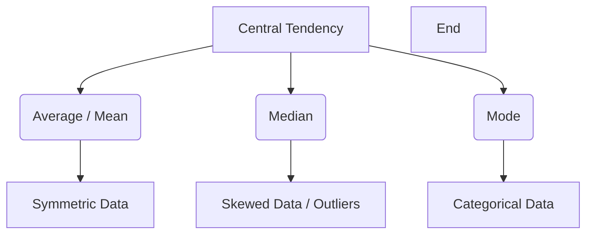

## Why This Matters: The Metal Detector in the Field

A spreadsheet filled with thousands of rows of raw data is like a large, overgrown field. If you walk through it looking only at individual rows, you will see a lot of tall grass but miss the treasure hidden beneath the soil. 

**Statistical functions are the metal detector for your data.** 

They allow you to scan beneath the surface of raw numbers, finding hidden patterns, pointing out anomalies, and helping you predict what lies ahead. 

In business, data is rarely uniform. Sales fluctuate, delivery times vary, and customer behavior changes. As a data analyst, basic summaries like "What was the average?" are only the beginning of your work. True business insights come from understanding the spread (variance) of your data, the relationships (correlation) between different variables, and the outliers that distort your results. 

For instance, if you tell a logistics manager that the average delivery time is 4 days, they might think the process is running smoothly. But if the standard deviation is 3 days, it means some customers get their packages in 1 day, while others wait a week. That volatility is what destroys customer satisfaction. This lesson teaches you the mathematical foundations and practical steps for using statistical formulas in Excel to extract these insights.

---

## Central Tendency — Describing the Center

Central tendency describes where the "middle" or "typical" value of a dataset lies. While beginners rely heavily on the arithmetic mean (average), intermediate analysts know that the mean can be highly misleading when data is skewed.



### Example Data: Sales Representative Monthly Performance

Let's examine a sales database where one rep has had an exceptional month:

| Sales Rep | Region | Monthly Closed Deals (₹) |
| :--- | :--- | :--- |
| Rajesh | North | 2,80,000 |
| Priya | South | 3,10,000 |
| Ankit | East | 2,90,000 |
| Sarah | West | 14,50,000 |
| Vikram | North | 3,20,000 |
| Neha | South | 2,70,000 |
| Sunil | East | 3,30,000 |

### 1. AVERAGE (Arithmetic Mean)
Calculates the arithmetic mean by summing all values and dividing by the count of observations.

```excel
=AVERAGE(C2:C8)
```

```text
# Output:
₹4,64,286
```

### 2. MEDIAN
Sorts all values in order and returns the middle value. If there is an even number of values, it averages the two middle values.

```excel
=MEDIAN(C2:C8)
```

```text
# Output:
₹3,10,000
```

### 3. MODE.SNGL
Returns the most frequently occurring value in the dataset. If no values repeat, it returns an `#N/A` error.

```excel
=MODE.SNGL(C2:C8)
```

```text
# Output:
#N/A
```

### 4. Advanced: GEOMEAN and HARMEAN
* **GEOMEAN (Geometric Mean):** Used for calculating rates of change, compound interest, or investment returns.
* **HARMEAN (Harmonic Mean):** Used when averaging rates, such as speed (km/h) or price-to-earnings ratios.

### The Analytical Insight: Mean vs. Median Skew
Looking at the results, the average monthly sales is **₹4,64,286**, but **six out of seven** sales reps earned less than this amount. 

Why? Because Sarah's massive enterprise deal of **₹14,50,000** acts as a statistical anchor, pulling the mean upward. 

The median of **₹3,10,000** represents a much more realistic picture of typical performance. 

When presenting performance reviews or building financial models, always look at both metrics. A large gap between the mean and median indicates that your data is heavily skewed by outliers.

---

## Understanding Variation — Standard Deviation & Variance

Knowing the center of your data only tells you half the story. To understand operational stability, risk, or predictability, you must measure how far your data points spread out from that center.

### The Math: Sample vs. Population

When calculating variance and standard deviation, Excel provides two options: **Sample (.S)** and **Population (.P)**.

* **Population (VAR.P / STDEV.P):** Used when you possess the complete dataset for every member of the group you are analyzing. The mathematical formula divides the sum of squared differences by $N$ (the total population size).
* **Sample (VAR.S / STDEV.S):** Used when your data represents a subset of a larger population (which is almost always the case in business analysis). The formula divides by $n-1$ (Bessel's Correction). This mathematically compensates for the fact that a sample tends to underestimate the true spread of the wider population.

$$\text{Sample Variance } (s^2) = \frac{\sum (x_i - \bar{x})^2}{n - 1}$$

$$\text{Population Variance } (\sigma^2) = \frac{\sum (x_i - \mu)^2}{N}$$

### Example Data: Delivery Times (in Days)

Here is a log of delivery times for 10 orders:

| Order ID | Delivery Days |
| :--- | :--- |
| ORD-101 | 3 |
| ORD-102 | 5 |
| ORD-103 | 4 |
| ORD-104 | 8 |
| ORD-105 | 3 |
| ORD-106 | 4 |
| ORD-107 | 6 |
| ORD-108 | 2 |
| ORD-109 | 5 |
| ORD-110 | 4 |

### Calculating Spread in Excel

```excel
=AVERAGE(B2:B11)
```

```text
# Output:
4.4
```

```excel
=VAR.S(B2:B11)
```

```text
# Output:
2.71
```

```excel
=STDEV.S(B2:B11)
```

```text
# Output:
1.65
```

### Interpreting Standard Deviation
The average delivery time is **4.4 days**, with a standard deviation of **1.65 days**. 

Under a normal distribution:
* **~68% of orders** will fall within $\pm 1$ Standard Deviation of the mean ($4.4 - 1.65$ to $4.4 + 1.65$), which is between **2.75 and 6.05 days**.
* **~95% of orders** will fall within $\pm 2$ Standard Deviations ($4.4 - 3.30$ to $4.4 + 3.30$), which is between **1.10 and 7.70 days**.
* Any order taking **more than 8 days** is more than 2 standard deviations away from the mean, flagging it as an operational issue.

---

## Outlier Detection — Threshold Calculations

Outliers can distort statistical models and forecast formulas. Identifying them using standard thresholds is a core data-cleaning best practice.

### Method 1: The Standard Deviation Rule (Mean $\pm$ 2 SD)
This method is best when the data is roughly symmetric and follows a normal distribution.

Let's write a formula to flag outliers in our sales representative performance data:

| Sales Rep | Monthly Closed Deals (₹) |
| :--- | :--- |
| Rajesh | 2,80,000 |
| Priya | 3,10,000 |
| Ankit | 2,90,000 |
| Sarah | 14,50,000 |
| Vikram | 3,20,000 |
| Neha | 2,70,000 |
| Sunil | 3,30,000 |

Enter this formula in cell `D2` and drag it down:

```excel
=IF(OR(C2 > AVERAGE($C$2:$C$8) + 2*STDEV.S($C$2:$C$8), C2 < AVERAGE($C$2:$C$8) - 2*STDEV.S($C$2:$C$8)), "OUTLIER", "Normal")
```

```text
# Output:
Rajesh: Normal
Priya: Normal
Ankit: Normal
Sarah: OUTLIER (Value of 14,50,000 exceeds upper bound of 13,31,043)
Vikram: Normal
Neha: Normal
Sunil: Normal
```

### Method 2: The Interquartile Range Rule (IQR)
When your data is highly skewed, the mean and standard deviation are themselves pulled by the outliers. This makes the standard deviation rule less reliable. 

A more robust approach is the **IQR Method**, which uses percentiles that are resistant to outliers.

* **Q1 (First Quartile / 25th Percentile):** The point below which 25% of the data falls.
* **Q3 (Third Quartile / 75th Percentile):** The point below which 75% of the data falls.
* **IQR:** The distance between the 75th and 25th percentiles ($Q3 - Q1$).
* **Outlier Fences:**
  * **Upper Fence:** $Q3 + 1.5 \times \text{IQR}$
  * **Lower Fence:** $Q1 - 1.5 \times \text{IQR}$

Let's calculate the fences for our dataset:

```excel
=PERCENTILE.INC(C2:C8, 0.25)
```

```text
# Output (Q1):
₹2,85,000
```

```excel
=PERCENTILE.INC(C2:C8, 0.75)
```

```text
# Output (Q3):
₹3,25,000
```

```excel
=QUARTILE.INC(C2:C8, 3) - QUARTILE.INC(C2:C8, 1)
```

```text
# Output (IQR):
₹40,000
```

Our Upper Fence is $3,25,000 + (1.5 \times 40,000) = \mathbf{₹3,85,000}$. Any value above this is flagged as an outlier. 

Let's use an Excel formula to check this for Rajesh in row 2:

```excel
=IF(OR(C2 > QUARTILE.INC($C$2:$C$8,3) + 1.5*(QUARTILE.INC($C$2:$C$8,3)-QUARTILE.INC($C$2:$C$8,1)), C2 < QUARTILE.INC($C$2:$C$8,1) - 1.5*(QUARTILE.INC($C$2:$C$8,3)-QUARTILE.INC($C$2:$C$8,1))), "OUTLIER", "Normal")
```

```text
# Output:
Rajesh: Normal
Priya: Normal
Ankit: Normal
Sarah: OUTLIER (14,50,000 is far above the fence of 3,85,000)
...
```

---

## CORREL — Measuring Linear Relationships

The `CORREL` function calculates the Pearson correlation coefficient ($r$), which measures the strength and direction of a linear relationship between two variables. It returns a value between **-1.0 and +1.0**.

| Coefficient Value | Strength of Relationship | Meaning |
| :--- | :--- | :--- |
| **+0.7 to +1.0** | Strong Positive | As X increases, Y increases rapidly (e.g., ad spend and revenue). |
| **+0.3 to +0.7** | Moderate Positive | General upward trend, but with some variance. |
| **-0.3 to +0.3** | Weak or None | No discernible linear pattern. |
| **-0.7 to -0.3** | Moderate Negative | General downward trend. |
| **-1.0 to -0.7** | Strong Negative | As X increases, Y decreases rapidly (e.g., price increases and units sold). |

### Example Data: Marketing Spend vs. Conversion Rate

Let's analyze whether higher campaign budgets improve conversion rates:

| Campaign | Ad Spend (₹) | Conversion Rate % |
| :--- | :--- | :--- |
| C-01 | 50,000 | 2.5% |
| C-02 | 1,00,000 | 4.8% |
| C-03 | 1,50,000 | 6.2% |
| C-04 | 2,00,000 | 7.5% |
| C-05 | 2,50,000 | 7.9% |

### Calculating Correlation in Excel

```excel
=CORREL(B2:B6, C2:C6)
```

```text
# Output:
0.981
```

This output of **0.981** shows a strong positive correlation. Increasing ad spend is closely associated with higher conversion rates.

### Anscombe's Quartet: Why Visualizing is Crucial
Anscombe's Quartet consists of four datasets that have nearly identical simple statistical properties (mean, variance, correlation, and regression line), yet look completely different when graphed. One is linear, one is a non-linear curve, one contains a single outlier that skews the line, and one has a vertical line with a single outlier. 

**Never rely on CORREL alone.** Always create a scatter plot first to verify that the relationship is linear.

---

## Business Forecasting in Excel

### 1. FORECAST.LINEAR
Predicts a future value along a linear trend based on existing historical X and Y values.

```excel
=FORECAST.LINEAR(x, known_y's, known_x's)
```

### Example Data: Historic Sales Revenue

Let's forecast sales for July and August (Months 7 and 8):

| Month (X) | Revenue (₹ Lakhs) (Y) |
| :--- | :--- |
| 1 (Jan) | 12.0 |
| 2 (Feb) | 13.5 |
| 3 (Mar) | 15.0 |
| 4 (Apr) | 17.2 |
| 5 (May) | 19.0 |
| 6 (Jun) | 21.5 |

### Forecasting July Sales in Excel

```excel
=FORECAST.LINEAR(7, B2:B7, A2:A7)
```

```text
# Output:
23.13 (₹ Lakhs)
```

### 2. FORECAST.ETS (Advanced Forecasting)
For business data that contains seasonality (e.g., higher sales during Q4 holidays), standard linear forecasting fails. `FORECAST.ETS` uses triple exponential smoothing to predict future values while accounting for seasonal cycles.

```excel
=FORECAST.ETS(target_date, values, timeline, [seasonality], [data_completion], [aggregation])
```

---

## Trendline Options in Charts

When adding a trendline to a visual chart, Excel fits a mathematical equation to your data points. Understanding which curve to select is critical:

* **Linear:** A straight line model ($y = mx + c$). Best for steady, incremental increases or decreases.
* **Exponential:** A curved line ($y = ab^x$). Used when values rise or fall at constantly increasing rates (e.g., viral user growth or compound interest).
* **Logarithmic:** A curved line ($y = a \ln(x) + b$). Best for processes that rise rapidly and then level off (e.g., employee learning curves).
* **Polynomial:** A wave-like line ($y = ax^2 + bx + c$). Best for data that fluctuates, such as seasonal temperatures or economic cycles.

---

## Edge Cases & Common Mistakes (Gotchas)

### 1. The \#NUM! Error in CORREL
**The Problem:** The `CORREL` function returns a `#NUM!` error.
**The Fix:** This occurs if one of your data ranges has a standard deviation of zero (i.e., all values in the column are identical). Because the mathematical calculation divides by the product of the standard deviations, a zero standard deviation leads to division by zero. Ensure your data contains variation before running correlation analyses.

### 2. Outliers Distorting FORECAST.LINEAR
**The Problem:** Running `FORECAST.LINEAR` on a dataset that contains a major one-time outlier (like a single massive product launch or a temporary warehouse closure). The regression line adjusts to fit the outlier, skewing your predictions.
**The Fix:** Identify outliers using the IQR rule. Clean the dataset by replacing outliers with the median value, or exclude those periods from the forecast range entirely to keep your baseline prediction stable.

### 3. Misinterpreting R-Squared
**The Problem:** Assuming a high correlation ($r > 0.90$) means your regression model is highly predictive, without checking the sample size.
**The Fix:** A correlation based on only 3 or 4 data points can easily show a high correlation by chance. Check the sample size ($n$) and look at a scatter plot to confirm the linear trend is consistent.

---

## Practice Exercises

### Exercise 1: Identify Outliers in Warehouse Processing Times
**Dataset:** Here is the tracking log for 12 order shipments:

| Order ID | Processing Time (Hours) |
| :--- | :--- |
| ORD-01 | 14 |
| ORD-02 | 16 |
| ORD-03 | 15 |
| ORD-04 | 48 |
| ORD-05 | 13 |
| ORD-06 | 17 |
| ORD-07 | 15 |
| ORD-08 | 12 |
| ORD-09 | 52 |
| ORD-10 | 16 |
| ORD-11 | 14 |
| ORD-12 | 15 |

**Your Task:**
1. Calculate the mean, median, standard deviation, and IQR for this dataset.
2. Write a formula to flag any outlier processing times using the **IQR method** (Q3 + 1.5 IQR).
3. Compare the outlier flags to the **Standard Deviation method** (Mean $\pm$ 2 SD). Note which method is more effective when multiple extreme values are present.

### Exercise 2: Revenue Correlation and Q3 Forecast
**Dataset:** You have the following ad spend and revenue data:

| Quarter | Ad Spend (₹) | Revenue (₹) |
| :--- | :--- | :--- |
| Q1-24 | 1,20,000 | 10,50,000 |
| Q2-24 | 1,40,000 | 12,20,000 |
| Q3-24 | 1,10,000 | 9,80,000 |
| Q4-24 | 1,80,000 | 15,10,000 |
| Q1-25 | 1,50,000 | 13,00,000 |
| Q2-25 | 1,60,000 | 14,20,000 |

**Your Task:**
1. Calculate the correlation coefficient between Ad Spend and Revenue.
2. Determine the R-squared value and write a brief interpretation of the results.
3. Predict the revenue for Q3-25 assuming a planned ad spend of **₹2,00,000** using `FORECAST.LINEAR`.

---

## Section Recaps

* **Central Tendencies:** Use `AVERAGE` for symmetric data, but default to `MEDIAN` when datasets contain outliers or are heavily skewed.
* **Spread of Data:** `STDEV.S` and `VAR.S` calculate sample variation, using $n-1$ to compensate for sample bias. Use `STDEV.P` only when you have the entire population.
* **Outlier Detection:** Use the Standard Deviation rule (Mean $\pm$ 2 SD) for normal distributions, and the IQR method (Q3 $\pm$ 1.5 IQR) for skewed distributions.
* **Correlation:** `CORREL` calculates the linear relationship between variables from -1.0 to +1.0. A high correlation shows a strong association but does not prove causation.
* **Forecasting:** `FORECAST.LINEAR` projects future trends by fitting a linear regression line ($y = mx + c$) through historical data points.

---

## Common Interview Questions

### Q1: Why does STDEV.S divide by n-1 instead of n? What is this adjustment called?
**Answer:** Dividing by $n-1$ instead of $n$ is called **Bessel's Correction**. 

It is used because calculating variance from a sample instead of the entire population tends to underestimate the true variation. The sample mean is mathematically closer to the sample data points than the true population mean. Dividing by the smaller value ($n-1$) increases the standard deviation slightly, correcting for this bias and providing a more accurate estimate of the population's true variance.

### Q2: If the mean of a dataset is 100 and the median is 50, what does this tell you about the distribution of the data?
**Answer:** This indicates that the dataset is **positively skewed (skewed to the right)**. 

A median of 50 tells us that half of the observations are below 50. A mean of 100 shows that the average is pulled upward by a small number of very high values (outliers) on the right side of the distribution. This is common in metrics like household wealth or corporate customer contract values, where a few large observations distort the average.

### Q3: How do you identify outliers in a dataset that does not follow a normal distribution?
**Answer:** For datasets that do not follow a normal distribution, you should use the **Interquartile Range (IQR) method** rather than the Standard Deviation method. 

The IQR method uses percentiles ($Q1$ and $Q3$), which are resistant to outliers. Calculate the IQR as $Q3 - Q1$. Then, set outlier thresholds at $Q1 - 1.5 \times \text{IQR}$ (lower fence) and $Q3 + 1.5 \times \text{IQR}$ (upper fence). Any data point falling outside these fences is flagged as an outlier.

### Q4: What is the difference between R-squared and the Correlation Coefficient (r)?
**Answer:** The Correlation Coefficient ($r$) measures the strength and direction of a linear relationship between two variables, ranging from -1.0 to +1.0. 

R-squared ($r^2$, or the coefficient of determination) is the square of the correlation coefficient and ranges from 0 to 1 (or 0% to 100%). It represents the proportion of variance in the dependent variable that can be explained by the independent variable in your model. For example, an $r$ of 0.90 gives an R-squared of 0.81, meaning 81% of the variation is explained by the model, while 19% is driven by other factors.

### Q5: What are the limitations of using FORECAST.LINEAR for business forecasting?
**Answer:** `FORECAST.LINEAR` has three key limitations:
1. **Assumes Linearity:** It fits a straight line to the data. If your business growth is exponential, seasonal, or cyclical, a linear projection will be inaccurate.
2. **Historical Assumption:** It assumes that the historical trend will continue unchanged. It cannot account for sudden market shifts, pricing changes, or competitor entries.
3. **Outlier Sensitivity:** Because it uses the least-squares regression method, it is sensitive to outliers. A single abnormal quarter can pull the entire forecast line off-course.
