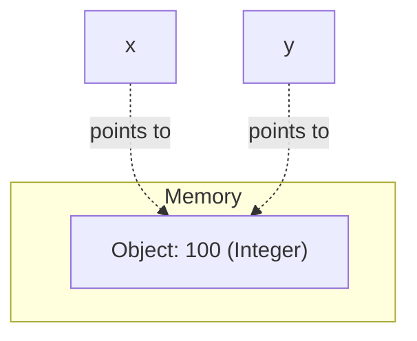
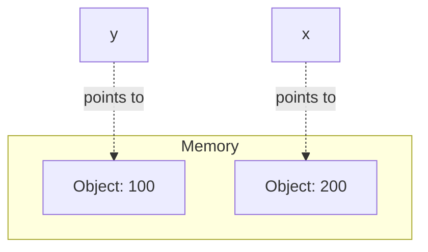

## Why This Matters

Every data analytics workflow starts with three fundamental actions: storing data, displaying results, and interacting with users. When you load a database table, fetch an API response, or write a custom automation script, you are using variables to store data in memory. When you report a metric, you use print statements and formatting to make it readable. And when you build interactive tools for business stakeholders, you use input mechanisms to receive their commands.

Mastering these basic elements allows you to translate business logic into executable Python code. Without a solid understanding of how Python manages variables under the hood, how numbers are formatted for reports, and how inputs are converted between types, your code will be prone to hard-to-debug errors. This guide builds your understanding from the ground up, preparing you for advanced libraries like Pandas, NumPy, and SQL integrations.

In a professional setting, data analysts don't just write code for machines; they write code for other analysts and stakeholders. Developing clean coding habits early—like following naming standards, writing descriptive variables, and designing readable reports—sets the stage for building robust data products that are maintainable over time.

---

## The Metaphor: Sticky Notes in a Warehouse

To understand variables, imagine a massive warehouse where items are stored. In many traditional programming languages (like C, C++, or Java), a variable is like a **fixed, labeled storage bin**. If you declare an integer bin named `sales`, that bin is carved out in physical memory to only hold integers. You cannot put a string (text) in that bin.

In Python, the mechanics are different. Python uses a **"Sticky Note" model**.

```mermaid
graph TD
    subgraph Memory (The Warehouse)
        obj1["Object: 142500 (Integer)"]
        obj2["Object: 'Wireless Headphones' (String)"]
    end
    
    var_rev["Variable: monthly_revenue"] -.->|points to| obj1
    var_prod["Variable: product_name"] -.->|points to| obj2
```

1. **The Object (The Box):** When you write `142500` or `"Wireless Headphones"`, Python creates a data object in the computer's memory. This object contains the actual data, its type (e.g., integer or string), and a reference count.
2. **The Variable (The Sticky Note):** The variable name (`monthly_revenue` or `product_name`) is simply a label you write on a sticky note.
3. **The Assignment (Sticking it on):** The equals sign (`=`) is the action of sticking that label onto the memory box.

If you write:
```python
x = 100
y = x
```
You are not creating two boxes containing the number `100`. You have created **one** box in memory containing the value `100`, and you have pasted two sticky notes (`x` and `y`) onto that same box.



If you later change `x`:
```python
x = 200
```
Python creates a new box containing `200`, peels the sticky note `x` off the `100` box, and sticks it onto the `200` box. The sticky note `y` remains stuck to the `100` box.



### Reference Counting and Garbage Collection
Because Python variables are sticky notes, what happens to a box in the warehouse if all sticky notes are peeled off?
```python
x = 500  # Sticky note 'x' points to box 500
x = 600  # Sticky note 'x' now points to box 600. No sticky notes point to box 500!
```
Under the hood, Python tracks how many variables point to each object. This is called the **reference count**. When an object's reference count drops to `0` (like the box `500` above), Python's automatic **Garbage Collector** detects it, reclaims that memory space, and clears the box. You do not need to manually free memory in Python, unlike languages like C.

#### Generational Garbage Collection
In addition to reference counting, Python uses a generational garbage collector to find "reference cycles"—situations where object A points to object B, and object B points to object A, but neither is accessible from your code. Python groups objects into three generations based on how long they have existed. New objects enter Generation 0. If they survive a garbage collection sweep, they are promoted to Generation 1, and eventually to Generation 2. By sweeping newer generations more frequently than older ones, Python optimizes performance while preventing memory leaks.

---

## Step-by-Step Concept Breakdown

### 1. Variables and Assignment
In Python, you assign variables using a single equals sign (`=`). The left side of the statement is the variable name, and the right side is the value you want to assign to it.

#### Variable Naming Rules & Pythonic Style (PEP 8)
PEP 8 is Python's official style guide. To write code that senior analysts and engineers can easily read, follow these naming conventions:
*   **Use Snake Case:** Write all variable names in lowercase, with words separated by underscores (e.g., `daily_active_users`, `gross_margin`).
*   **Start with a Letter or Underscore:** Variable names cannot start with a number (e.g., `1st_quarter` is invalid; use `quarter_1` or `first_quarter`).
*   **Keep it Descriptive:** Avoid single-letter variables like `x`, `y`, or `z` unless they are used as short-lived index variables in loops. Instead of `r`, use `retention_rate`.
*   **Case Sensitivity:** Python is strictly case-sensitive. `sales_target`, `Sales_Target`, and `SALES_TARGET` are three entirely different variables.
*   **Avoid Reserved Keywords:** Do not name variables after Python's built-in keywords (e.g., `print`, `input`, `if`, `else`, `class`, `import`). Overwriting these can break your code.

### 2. Statically Typed vs. Dynamically Typed
Why don't we have to specify data types when creating variables in Python?

*   **Statically Typed Languages (Java, C++):** You must declare the type of data a variable will hold *before* you use it. The type is bound to the variable itself.
    ```java
    // Java Example
    int monthlySales = 50000;
    monthlySales = "fifty thousand"; // Compile Error! Cannot convert String to int.
    ```
*   **Dynamically Typed Languages (Python):** Python determines the data type at runtime based on the value currently bound to the variable. The type is bound to the *value (object)*, not the *variable name*.
    ```python
    # Python Example
    monthly_sales = 50000            # monthly_sales points to an Integer object
    monthly_sales = "fifty thousand"  # Now it points to a String object. No error!
    ```

**The Analyst's Trade-off:** Dynamic typing allows you to write scripts rapidly and clean dirty data on the fly. However, the trade-off is that Python won't prevent you from performing invalid operations (like trying to add a string and a number) until that line of code actually runs. This is why thorough testing is essential.

### 3. Print Output vs. Variable Evaluation
Beginners often confuse displaying a value in the console with storing a value in memory.

*   **Variable Evaluation / Value:** When a variable holds a value, it resides in memory. You can use it in calculations, pass it to functions, or store it in databases.
*   **The `print()` Function:** The `print()` function is used to send a human-readable text representation of an object to the **Standard Output (stdout)** stream, which displays it on your screen.
*   **The Return Value Trap:** The `print()` function’s job is to show things on screen, not to calculate or return values. Under the hood, **`print()` always returns `None`**.

```python
# The print assignment trap
output = print("Calculating revenue...")
print(f"The variable 'output' holds: {output}")
```
```text
# Output:
Calculating revenue...
The variable 'output' holds: None
```
If you write `output = print(100)`, the console will show `100`, but the variable `output` will store `None` (Python's representation of "nothing").

### 4. Interactive Inputs with `input()`
The `input()` function allows your script to pause, wait for the user to type text into the terminal, and hit enter.
*   **The String Default:** **`input()` always returns a string (`str`)**, regardless of what the user types. If a user types `45`, Python reads it as the text `"45"`, not the number `45`.
*   **Type Casting:** If you need to perform calculations on user inputs, you must explicitly convert (or "cast") the input to a numeric type like an integer (`int`) or a float (`float`).

### 5. Namespaces and Scope Basics
Where do variable names live? Python tracks variables in a structure called a **namespace** (essentially a dictionary mapping names to objects).
*   **Global Scope:** Variables defined at the main level of your script. They are accessible anywhere in the script.
*   **Local Scope:** Variables defined inside a function. They only exist while the function is running and cannot be accessed outside it.
Understanding scope prevents variables from bleeding into other parts of your code and causing unexpected changes to your numbers.

---

## Code & Practical Walkthroughs

### Example 1: Storing and Reassigning Analytical Data
Let's see how variable assignment, multiple assignment, and basic math work in practice.

```python
# Assigning metrics to individual variables
quarterly_target = 500000
q1_sales = 485000

# Calculating performance
target_deficit = quarterly_target - q1_sales

# Multiple assignment in a single line (often used for dimensions or coordinates)
region, manager, is_active = "Northeast", "Sarah Chen", True

# Printing the variables to inspect their values
print("--- Q1 Performance Audit ---")
print("Target:   ", quarterly_target)
print("Sales:    ", q1_sales)
print("Deficit:  ", target_deficit)
print("Region:   ", region)
print("Manager:  ", manager)
print("Active:   ", is_active)
```
```text
# Output:
--- Q1 Performance Audit ---
Target:    500000
Sales:     485000
Deficit:   15000
Region:    Northeast
Manager:   Sarah Chen
Active:    True
```

### Example 2: In-Depth `print()` Configurations
The `print()` function is more versatile than most realize. Let's explore its arguments: `sep` (separator) and `end` (end character).

```python
region_1 = "North"
region_2 = "South"
region_3 = "West"

# 1. Custom Separators using 'sep'
# By default, print separates items with a space. We can change this to commas, tabs, or pipes.
print(region_1, region_2, region_3, sep=", ")
print(region_1, region_2, region_3, sep=" | ")
print(region_1, region_2, region_3, sep="\t") # \t is the tab character

# 2. Custom End Characters using 'end'
# By default, print appends a newline (\n) at the end. We can change it to keep printing on the same line.
print("Processing data...", end=" ")
print("Done!")
```
```text
# Output:
North, South, West
North | South | West
North	South	West
Processing data... Done!
```

### Example 3: Formatted Output using f-strings (The Analyst's Toolkit)
An f-string (formatted string literal) is created by putting an `f` before the opening quote. Inside the string, you can place Python variables or expressions inside curly braces `{}` to format them.

Let's explore the powerful formatting rules:

```python
total_revenue = 3847562.894
conversion_rate = 0.03487
total_customers = 14892

# 1. Thousands Separator & Decimal Rounding
# syntax: {variable:comma.precisionf}
print(f"Revenue: ${total_revenue:,.2f}") # Comma separator, rounded to 2 decimal places

# 2. Percentage Formatting
# syntax: {variable:.precision%}
# This multiplies the variable by 100 and appends a percent sign
print(f"Conversion Rate: {conversion_rate:.2%}") # Format as percentage with 2 decimals
print(f"Conversion Rate: {conversion_rate:.1%}") # Format as percentage with 1 decimal

# 3. Thousands Separator for Integers
print(f"Customers: {total_customers:,}")

# 4. Text Padding and Alignment
# Useful for printing clean console tables and ASCII reports
# '<' = left align, '>' = right align, '^' = center align
# The number represents the total width of the column
print("\n--- Sales Alignment Report ---")
print(f"{'Region':<15} | {'Sales':>15} | {'Status':^12}")
print("-" * 48)
print(f"{'North America':<15} | ${1245000:>14,} | {'On Track':^12}")
print(f"{'APAC':<15} | ${98300:>14,} | {'At Risk':^12}")
print(f"{'EMEA':<15} | ${2105400:>14,} | {'Exceeded':^12}")

# 5. Sign Indicators
# '+' forces displaying the sign for positive numbers as well
positive_growth = 0.125
negative_growth = -0.045
print(f"Positive Growth: {positive_growth:+.1%}")
print(f"Negative Growth: {negative_growth:+.1%}")
```
```text
# Output:
Revenue: $3,847,562.89
Conversion Rate: 3.49%
Conversion Rate: 3.5%
Customers: 14,892

--- Sales Alignment Report ---
Region          |           Sales |    Status  
------------------------------------------------
North America   |     $1,245,000  |   On Track  
APAC            |        $98,300  |   At Risk   
EMEA            |     $2,105,400  |   Exceeded  
Positive Growth: +12.5%
Negative Growth: -4.5%
```

### Example 4: Handling Interactive User Input
This script demonstrates how to receive input, check its raw type, cast it to the correct numeric type, and perform safety checks.

```python
# 1. Get raw string inputs
raw_cost_per_unit = input("Enter unit cost ($): ")
raw_units_sold = input("Enter quantity sold: ")

# Check the types before casting
print(f"\nRaw Cost Type: {type(raw_cost_per_unit)}")
print(f"Raw Units Type: {type(raw_units_sold)}")

# 2. Cast strings to numbers to perform calculations
# float() handles decimal inputs; int() handles whole numbers
cost_per_unit = float(raw_cost_per_unit)
units_sold = int(raw_units_sold)

# 3. Perform calculations
total_cost = cost_per_unit * units_sold

# 4. Print the formatted report
print("\n--- Calculation Result ---")
print(f"Cost per Unit: ${cost_per_unit:,.2f}")
print(f"Units Sold:    {units_sold:,}")
print(f"Total Cost:    ${total_cost:,.2f}")
```
```text
# Output:
Enter unit cost ($): 12.50
Enter quantity sold: 2500

Raw Cost Type: <class 'str'>
Raw Units Type: <class 'str'>

--- Calculation Result ---
Cost per Unit: $12.50
Units Sold:    2,500
Total Cost:    $31,250.00
```

### Example 5: Core Arithmetic & Modulo Operations
Data analysts use modulo (`%`) and floor division (`//`) for binning data, paginating reports, or cycling through colors in a chart.

```python
# Modulo (%) returns the remainder of a division
# Floor division (//) divides and rounds down to the nearest integer

total_hours = 27
hours_per_shift = 8

full_shifts = total_hours // hours_per_shift
remaining_hours = total_hours % hours_per_shift

print(f"Total Hours:     {total_hours}")
print(f"Full Shifts:     {full_shifts}")
print(f"Remaining Hours: {remaining_hours}")

# Exponentiation (**) is used for compound interest or growth modeling
initial_investment = 1000
interest_rate = 1.07 # 7% growth
years = 10
future_value = initial_investment * (interest_rate ** years)
print(f"Future Value of Investment: ${future_value:,.2f}")
```
```text
# Output:
Total Hours:     27
Full Shifts:     3
Remaining Hours: 3
Future Value of Investment: $1,967.15
```

### Example 6: Interactive Currency Conversion Utility
Data pipelines processing global sales records must convert currencies dynamically using exchange rates before performing roll-ups.

```python
# Input inputs from the terminal
raw_amount_usd = input("Enter USD transaction amount: ")
raw_exchange_rate = input("Enter USD-to-EUR exchange rate: ")

# Safe conversion
amount_usd = float(raw_amount_usd)
exchange_rate = float(raw_exchange_rate)

# Perform math
amount_eur = amount_usd * exchange_rate

# Output report with alignment and formatting
print("\n" + "=" * 40)
print(f"{'CURRENCY CONVERSION SYSTEM':^40}")
print("=" * 40)
print(f"{'USD Input:':<25} ${amount_usd:>12,.2f}")
print(f"{'Exchange Rate (EUR/USD):':<25} {exchange_rate:>13.4f}")
print("-" * 40)
print(f"{'EUR Equivalent:':<25} €{amount_eur:>12,.2f}")
print("=" * 40)
```
```text
# Output:
Enter USD transaction amount: 1500.50
Enter USD-to-EUR exchange rate: 0.9234

========================================
       CURRENCY CONVERSION SYSTEM       
========================================
USD Input:                $    1,500.50
Exchange Rate (EUR/USD):         0.9234
----------------------------------------
EUR Equivalent:           €    1,385.56
========================================
```

---

## Edge Cases & Common Mistakes

### 1. The Notorious `NameError: name 'x' is not defined`
This is one of the most common errors for beginners. It occurs when Python looks for a variable name in its list of defined labels (the namespace) but cannot find it.

#### Cause A: Misspelling and Case Sensitivity
```python
sales_target = 100000
# Attempting to print with a capital S or a spelling mistake
print(Sales_target) 
```
```text
# Output:
NameError: name 'Sales_target' is not defined. Did you mean: 'sales_target'?
```

#### Cause B: Wrong Order of Execution
Python executes code line-by-line from top to bottom. If you reference a variable before you define it, Python will crash.
```python
# Attempting to calculate revenue before declaring the variables
total_revenue = price * quantity
price = 10.99
quantity = 50
```
```text
# Output:
NameError: name 'price' is not defined
```
*Fix:* Always define variables on lines above where they are used.

### 2. The `input()` Concatenation Trap
Since `input()` returns a string, using the `+` operator on two raw inputs will concatenate the text instead of adding the numbers.

```python
# Let's say user inputs: 10 and 20
a = input("Enter first number: ")
b = input("Enter second number: ")

result = a + b
print(f"Result: {result}")
```
```text
# Output:
Enter first number: 10
Enter second number: 20
Result: 1020
```
*Fix:* Always cast numeric inputs explicitly: `result = float(a) + float(b)`.

### 3. Modifying Constants (Anti-Pattern)
In data work, you will have variables that should never change (e.g., tax rates, standard commission caps). While Python doesn't have a native `const` keyword to prevent changes, the industry standard is to write constant variables in **UPPER_SNAKE_CASE**. This warns other developers not to reassign them.

```python
# Best Practice
TAX_RATE = 0.0825  # Constant, do not reassign
sales_tax = order_total * TAX_RATE
```

### 4. Overwriting Built-in Functions
Because Python is dynamically typed, it does not prevent you from using built-in function names as variable names.

```python
# CRITICAL MISTAKE: Overwriting the print function
print = "New Sales Report"

# This works fine, but now 'print' is a string object
# The next time you try to call print(), your script will crash:
print("Hello World")
```
```text
# Output:
TypeError: 'str' object is not callable
```
*Fix:* Avoid using `print`, `input`, `sum`, `min`, `max`, `list`, or `dict` as variable names. If you accidentally do this, you can restore them by restarting your Python kernel or running `del print`.

---

## Practice Exercises & Mini-Projects

<div class="challenge">

### Exercise 1: Interactive Gross Profit Margin Calculator
**Scenario:** You need to build a simple interactive command-line tool for a regional manager to check profit margins.

**Task:** Write a Python script that:
1. Prompts the user to enter the **Store Location** (text).
2. Prompts the user to enter the **Monthly Revenue** (must support decimals).
3. Prompts the user to enter the **Cost of Goods Sold (COGS)** (must support decimals).
4. Calculates the **Gross Profit** (`Revenue - COGS`) and **Gross Margin Percentage** (`Gross Profit / Revenue`).
5. Prints a structured, formatted performance card. The numeric fields must align to the right, use commas for thousands, and round decimal values to 2 places. The margin percentage must be formatted as a percent (e.g., `24.5%`).

**Expected Interaction & Output:**
```text
Enter Store Location: Seattle Branch
Enter Monthly Revenue: 145000.75
Enter Cost of Goods Sold (COGS): 108340.50

========================================
Seattle Branch Performance Card
========================================
Monthly Revenue:        $145,000.75
Cost of Goods Sold:     $108,340.50
----------------------------------------
Gross Profit:           $36,660.25
Gross Margin:                 25.3%
========================================
```
</div>

<div class="challenge">

### Exercise 2: Warehouse SKU Alignment Tool
**Scenario:** Your warehouse inventory logs have uneven columns, making logs hard to audit.

**Task:** Write a script that takes the following raw variables:
```python
sku_1, name_1, qty_1 = "SKU-492-A", "Ergonomic Office Chair", 124
sku_2, name_2, qty_2 = "SKU-88-B", "Wireless Mechanical Keyboard", 8
sku_3, name_3, qty_3 = "SKU-1049-C", "4K Ultra-Wide Monitor", 1432
```
Write a script using f-strings to print these items in a perfectly formatted grid. 
*   The **SKU** column must be left-aligned and exactly 15 characters wide.
*   The **Product Name** column must be left-aligned and exactly 30 characters wide.
*   The **Quantity** column must be right-aligned, formatted with commas, and exactly 10 characters wide.
*   Include a header row.

**Expected Output:**
```text
SKU             | Product Name                   |   Quantity
-------------------------------------------------------------
SKU-492-A       | Ergonomic Office Chair         |        124
SKU-88-B        | Wireless Mechanical Keyboard   |          8
SKU-1049-C      | 4K Ultra-Wide Monitor          |      1,432
```
</div>

<div class="challenge">

### Exercise 3: Customer Retention Rate Calculator
**Scenario:** The marketing team wants to audit customer retention between quarters.

**Task:** Write a script that asks the user for:
1. Quarter name (e.g., `Q2 2026`).
2. Number of active customers at the start of the quarter.
3. Number of those same customers who remained active at the end of the quarter.
Calculate the retention rate (`End / Start`). Print a warning if the retention rate is below 80%. Format the output table cleanly using custom print separators (`sep=" | "`) and format the percentage with one decimal place.

**Expected Interaction & Output:**
```text
Enter Quarter: Q2 2026
Enter Starting Active Customers: 12500
Enter Ending Active Customers: 9800

--- Retention Report ---
Quarter | Starting Customers | Ending Customers | Retention Rate
Q2 2026 | 12,500             | 9,800            | 78.4%
*** Warning: Retention rate is below 80.0%! ***
```
</div>

<div class="challenge">

### Exercise 4: Marketing Campaign ROI Calculator
**Scenario:** You need to audit the performance of a recent digital ad spend.

**Task:** Write a Python script that prompts the user to enter:
1.  **Ad Campaign Name** (text)
2.  **Ad Spend in USD** (decimal)
3.  **Total Sales Revenue Generated in USD** (decimal)

The script should:
*   Calculate **Net Profit** (`Revenue - Spend`).
*   Calculate **Return on Investment (ROI) Ratio** (`Net Profit / Spend`).
*   Print a clean campaign card where profit is shown with commas and two decimals. The ROI must be formatted as a percentage with one decimal place (e.g., `185.7%` or `-42.3%`). Use sign formatting (`+` indicator) for the ROI.

**Expected Interaction & Output:**
```text
Enter Campaign Name: Summer Launch Adwards
Enter Ad Spend ($): 25000
Enter Revenue ($): 72450.50

========================================
Campaign ROI Card: Summer Launch Adwards
========================================
Ad Spend:               $25,000.00
Revenue Generated:      $72,450.50
----------------------------------------
Net Campaign Profit:    $47,450.50
Campaign ROI:              +189.8%
========================================
```
</div>

---

## Section Recaps

*   **Variables as References:** Python variables are not storage containers; they are labels (references) pointing to objects located in memory.
*   **Reference Counting:** Python dynamically tracks references to memory objects. When references drop to zero, garbage collection automatically cleans it up.
*   **Dynamic Typing:** Python determines object data types at runtime based on the value assigned. Variables can be reassigned to different data types throughout the script.
*   **Print vs Value:** `print()` displays a text representation of data to the console and returns `None`. It does not store or return values for calculations.
*   **Advanced Print Parameters:** Customize output formats in the console using the `sep` argument to change separators between variables, and `end` to modify what prints at the end of a print statement.
*   **f-string Formatting:** Use curly braces with colons (e.g., `{value:,.2f}`) to control rounding, thousands separators, percent conversion, sign symbols, and column alignment in text outputs.
*   **User Input Conversion:** The `input()` function pauses execution and captures data as a string. If numeric math is needed, you must cast it with `int()` or `float()`.
*   **Handling NameError:** A `NameError` means Python cannot find the variable name in its namespace. Double-check your spelling, case sensitivity, and order of operations.

---

## Common Interview Questions

<div class="interview-tip">

### Q1: Explain how Python's variable assignment works under the hood. Contrast it with statically typed languages.
**Answer:**
In statically typed languages like Java or C++, a variable is a named memory location with a fixed data type. The value is stored directly inside that specific box of memory. In Python, variables are references (or pointers) to objects in memory. 

When you write `x = 5`, Python creates an integer object representing `5` somewhere in memory, and then creates a reference label `x` pointing to that object. If you write `y = x`, Python does not duplicate the value `5`; instead, it points the label `y` to the same memory object. If you reassign `x = 10`, `x` now points to a new integer object `10`, while `y` still points to the original object `5`. 

Python objects also track how many references point to them (reference counting). Once an object has zero references (e.g., no variables point to it), Python's automatic garbage collector reclaims the memory.

### Q2: What does the `print()` function actually return when executed? Explain why this statement produces `None` in the terminal: `val = print("Total: $100")`
**Answer:**
The `print()` function's primary side-effect is writing a text representation of its arguments to the standard output stream (the console). However, it does not return any data for the program to use. In Python, functions that do not have an explicit return value return the default singleton object `None`. 

In the expression `val = print("Total: $100")`, the `print()` function executes first, outputting `"Total: $100"` to the screen. It then returns `None`, which is assigned to the variable `val`. Printing `val` afterwards will show `None`.

### Q3: How do you format a floating-point number in an f-string to display as a percentage with exactly one decimal place, and a large number to display with commas and two decimal places? Write the specific syntax.
**Answer:**
*   To format a floating-point number (e.g., `0.18765`) as a percentage with one decimal place: `{number:.1%}`. This multiplies the number by 100 and rounds to 1 decimal place (yielding `18.8%`).
*   To format a large number (e.g., `1250000.789`) with commas and two decimal places: `{number:,.2f}`. This adds commas as a thousands separator and rounds to 2 decimal places (yielding `1,250,000.79`).

Example:
```python
rate = 0.18765
amount = 1250000.789
print(f"Rate: {rate:.1%}")
print(f"Amount: ${amount:,.2f}")
```
```text
# Output:
Rate: 18.8%
Amount: $1,250,000.79
```

### Q4: What is a `NameError` in Python, what are its most common causes, and how do you resolve it?
**Answer:**
A `NameError` occurs when Python attempts to evaluate a variable name or function call that has not been defined in the current scope. The most common causes are:
1.  **Typographical Errors:** Misspelling a variable name or calling it with incorrect casing (e.g., writing `avg_revenue` but typing `average_revenue` or `Avg_Revenue` later).
2.  **Order of Execution:** Referencing a variable or calling a function on a line of code located *above* where the variable is assigned or defined.
3.  **Scope Issues:** Attempting to access a variable defined locally inside a function from the global scope (outside the function).

To resolve it, trace the line number provided in the traceback, check the spelling, verify that the variable was initialized prior to that line, and ensure it is defined in a scope that the current line can access.

### Q5: Why is Python described as a "dynamically typed" but "strongly typed" language? Provide an example where strong typing protects the developer.
**Answer:**
These terms describe two distinct characteristics of how Python handles data types:
*   **Dynamically Typed:** You do not need to declare a variable's data type before assigning a value to it, and the data type can change dynamically. Types are associated with values (objects) in memory, not the variables that point to them.
*   **Strongly Typed:** Python strictly enforces data types at runtime. It will not silently convert incompatible types during operations. 

For example, in a weakly typed language like JavaScript, writing `5 + "5"` yields `"55"` (automatic string conversion). In Python, writing `5 + "5"` raises a `TypeError` because it refuses to guess whether you want to perform addition or string concatenation. This protects developers from silent data corruption, such as adding a tax rate (float) directly to a formatted price (string) without explicitly cleaning the data first.

</div>
