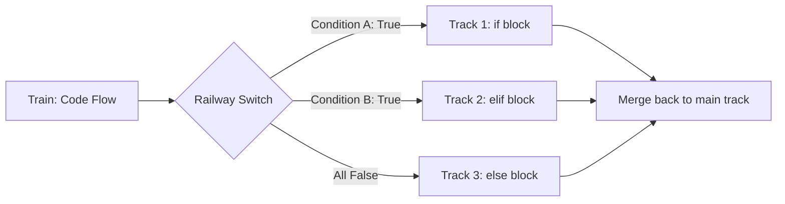

## Why This Matters

Data analytics is not just about writing formulas; it is about encoding business decisions. 
*   Should an e-commerce order trigger a fraud alert?
*   Does a customer's purchasing history qualify them for a "VIP" discount?
*   Should a machine learning data pipeline skip a database row because it has missing fields?

All of these actions require your code to make choices. Conditional statements (`if`, `elif`, `else`) are the mechanism you use to implement business rules, filter data, and build decision trees. Every automation script, ETL pipeline, and dashboard backend you build will rely on conditional logic. If your conditions are poorly structured, your script will produce silent logical bugs—such as sending marketing emails to unsubscribed users or miscalculating tax brackets.

---

## The Metaphor: The Railway Switch

To understand conditional logic, imagine a train traveling down a track towards its destination. In programming, the train represents the **flow of execution** (how Python reads and runs your code line-by-line).



A **railway switch** is a mechanical lever that directs the train down one specific track based on the position of the lever. 
*   **The Switch Lever** represents a **Boolean condition** (an expression that evaluates to either `True` or `False`).
*   If the lever is in position A (`True`), the train is routed down Track 1 (the code inside the `if` block).
*   If position A is `False` but position B is `True`, the train is routed down Track 2 (the `elif` block).
*   If all levers are `False`, the train defaults to Track 3 (the `else` block).

Just like a real train, **the execution flow can only travel down one track at a time**. Once a track is chosen and traversed, the train merges back onto the main line, bypassing all other alternate tracks.

---

## Step-by-Step Concept Breakdown

### 1. Conditional Syntax in Python
Python uses colons (`:`) and indentation to define blocks of code. Unlike other languages (like JavaScript or C++) that use curly braces `{}` to group code, Python relies strictly on whitespace.

```python
if condition:
    # 4 spaces of indentation
    # Runs if condition is True
    statement_1
    statement_2
```
*   **The Colon (`:`):** Tells Python that a code block is beginning.
*   **Indentation (4 Spaces):** Identifies which lines of code belong inside the conditional block. If you forget to indent, Python will raise an `IndentationError`. If you indent inconsistently, your code will fail or produce logical bugs.

### 2. Operators: Comparison & Logic
To build conditions, you compare values and chain checks together.

#### Comparison Operators (Value Checks)
These operators compare two values and return a Boolean (`True` or `False`).

| Operator | Meaning | Example | Result (if x = 10, y = 5) |
| :---: | :--- | :--- | :--- |
| `==` | Equal to | `x == y` | `False` |
| `!=` | Not equal to | `x != y` | `True` |
| `>` | Greater than | `x > y` | `True` |
| `<` | Less than | `x < y` | `False` |
| `>=` | Greater than or equal to | `x >= 10` | `True` |
| `<=` | Less than or equal to | `y <= 5` | `True` |

#### Logical Operators (Chaining Checks)
Use these to combine multiple comparison checks into a single condition.
*   **`and`:** Returns `True` only if **both** conditions are `True`.
*   **`or`:** Returns `True` if **at least one** condition is `True`.
*   **`not`:** Inverts the Boolean value (turns `True` to `False`, and vice versa).

---

### 3. Operator Precedence (Order of Operations)
Just as multiplication takes precedence over addition in math ($2 + 3 \times 5 = 17$), Python has a strict order of operations for logic.

#### Logical Precedence Table (High to Low)
1.  **Parentheses `()`** (Forces evaluation order)
2.  **Comparison Operators** (`==`, `!=`, `>`, `<`, etc.)
3.  **`not`**
4.  **`and`**
5.  **`or`**

#### The Logical Precedence Trap
Consider this statement:
```python
is_vip = True
has_coupon = False
is_sale_day = False

# Evaluate: is_vip or has_coupon and is_sale_day
result = is_vip or has_coupon and is_sale_day
```
What is the value of `result`?
*   Because `and` has higher precedence than `or`, Python evaluates `has_coupon and is_sale_day` first.
*   `False and False` evaluates to `False`.
*   The expression becomes `is_vip or False` $\rightarrow$ `True or False` $\rightarrow$ **`True`**.

If you wanted to check if the user has a VIP status or a coupon, AND it is a sale day, you must write:
```python
result = (is_vip or has_coupon) and is_sale_day
# (True or False) and False -> True and False -> False
```
*Best Practice:* Always use parentheses to make your logical intent explicit. It prevents bugs and makes the code readable for other team members.

---

### 4. Truthy vs. Falsy Values
In Python, you do not have to write `if length > 0:` or `if email != "":`. Every object in Python has an implicit Boolean truth value.

#### The Falsy List
These specific values always evaluate to `False` in a conditional check:
*   `False`
*   `None`
*   `0` (Integer zero)
*   `0.0` (Float zero)
*   `""` (Empty string)
*   `[]` (Empty list)
*   `{}` (Empty dictionary)
*   `set()` (Empty set)

**All other values are Truthy.** Any non-empty string (`"hello"`), non-zero number (`42`), or populated list (`[1, 2]`) evaluates to `True`.

#### How Python Resolves Object Truthiness Under the Hood
When you write `if x:`, Python calls the special method `x.__bool__()` to check if `x` is truthy or falsy. If `__bool__()` is not defined on the object's class, Python looks for `x.__len__()`. If `__len__()` returns `0`, the object is evaluated as `False`; otherwise, it is `True`. If neither method is defined, the object defaults to being `True`.

#### How Analysts Use This
Analysts use truthiness to write clean, concise checks for missing data or empty datasets:
```python
# Check if a list of loaded rows is empty
loaded_rows = fetch_db_rows()

if not loaded_rows:
    print("Warning: No database records were found.")
```

---

### 5. Nested Conditionals vs. Guard Clauses
Nested conditionals occur when you place an `if` block inside another `if` block. While sometimes necessary, nesting code more than two levels deep creates "spaghetti code" that is difficult to trace.

#### The "Arrow" Anti-Pattern (Bad Practice)
```python
# Processing a transaction
if transaction_amount > 0:
    if is_account_active:
        if is_balance_sufficient:
            process_payment()
        else:
            print("Error: Insufficient funds.")
    else:
        print("Error: Account is suspended.")
else:
    print("Error: Invalid transaction amount.")
```

#### The Guard Clause Pattern (Best Practice)
A **Guard Clause** checks for failure conditions first and exits the process early (using `return`, `break`, or `continue`). This flattens the logical structure, keeping code readable.
```python
# Flatter, cleaner design using Guard Clauses
if transaction_amount <= 0:
    print("Error: Invalid transaction amount.")
    # Exit early (e.g. exit function or continue loop)
    
if not is_account_active:
    print("Error: Account is suspended.")
    
if not is_balance_sufficient:
    print("Error: Insufficient funds.")

# Main success path is kept clear
process_payment()
```

---

## Code & Practical Walkthroughs

### Example 1: Multi-Tiered Lead Scoring Pipeline
In enterprise sales, inbound leads are routed based on company size (employee count) and yearly revenue. Let's see how `if/elif/else` order of execution matters.

```python
# Lead details
company_name = "Apex Tech"
employees = 150
annual_revenue = 45000000  # $45M

# Routing Logic
# Rule: Route based on highest tier qualifications first.
if employees >= 500 or annual_revenue >= 100000000:
    tier = "Enterprise"
    owner = "VP of Strategic Sales"
elif employees >= 100 or annual_revenue >= 10000000:
    tier = "Mid-Market"
    owner = "Senior Sales Director"
elif employees >= 10:
    tier = "SMB"
    owner = "Account Representative"
else:
    tier = "Self-Service"
    owner = "Automated Email Sequences"

print("--- Lead Routing Report ---")
print(f"Company:      {company_name}")
print(f"Employees:    {employees:,}")
print(f"Revenue:      ${annual_revenue:,.2f}")
print(f"Assigned Segment: {tier}")
print(f"Account Owner:    {owner}")
```
```text
# Output:
--- Lead Routing Report ---
Company:      Apex Tech
Employees:    150
Revenue:      $45,000,000.00
Assigned Segment: Mid-Market
Account Owner:    Senior Sales Director
```
*Crucial Detail:* If we evaluated the SMB condition (`employees >= 10`) at the very top of our script, Apex Tech (150 employees) would match SMB and get assigned to an Account Representative, bypassing the Mid-Market tier completely. **Always order checks from most restrictive to least restrictive.**

---

### Example 2: Financial Fraud Detection Pipeline
In financial analytics, transactions are flagged for verification based on transaction size, foreign location, and speed of consecutive transactions.

```python
# Transaction properties
amount = 12500.00
is_international = True
is_whitelisted_country = False
cardholder_active = True

# Logical rules:
# Flag transaction if:
# 1. Cardholder status is not active (Immediate fraud flag)
# 2. Transaction is over $10,000 and is international
# 3. Transaction is international and NOT in a whitelisted country

is_flagged = False
reason = ""

if not cardholder_active:
    is_flagged = True
    reason = "Suspended Cardholder Status"
elif amount > 10000.00 and is_international:
    is_flagged = True
    reason = "High Value International Transfer Limit Exceeded"
elif is_international and not is_whitelisted_country:
    is_flagged = True
    reason = "Non-whitelisted Country Code Access Attempt"
else:
    is_flagged = False
    reason = "Approved"

print("--- Transaction Screening Card ---")
print(f"Amount:        ${amount:,.2f}")
print(f"International: {is_international}")
print(f"Screen Status: {'⚠ FLAGGED' if is_flagged else '✓ APPROVED'}")
print(f"Details:       {reason}")
```
```text
# Output:
--- Transaction Screening Card ---
Amount:        $12,500.00
International: True
Screen Status: ⚠ FLAGGED
Details:       High Value International Transfer Limit Exceeded
```

---

### Example 3: The Ternary Operator (One-Line Conditions)
When you simply need to assign a value to a variable based on a single condition, using a full `if-else` block takes 4 lines of code. Python’s **Ternary Operator** allows you to write this inline.

#### Syntax:
$$\text{variable} = \text{value\_if\_true} \textbf{ if } \text{condition} \textbf{ else } \text{value\_if\_false}$$

Let's see this in action for pricing adjustments:

```python
# User status
sub_days = 450
is_renewing = True

# 1. Basic Ternary assignment
# If user has been subscribed for over a year (365 days), give VIP pricing
price_tier = "Loyalty VIP" if sub_days > 365 else "Standard"

# 2. Combining Ternary with math
# Give a 15% discount if they are VIP, else 0%
discount = 0.15 if price_tier == "Loyalty VIP" else 0.00

# 3. Nested Ternary (Use sparingly - readability can drop quickly)
# Tag status as Green, Yellow, or Red based on age
retention_status = "Green" if sub_days > 365 else ("Yellow" if sub_days > 180 else "Red")

print("--- Subscription Summary ---")
print(f"Days Subscribed:  {sub_days}")
print(f"Pricing Tier:     {price_tier}")
print(f"Applied Discount: {discount:.0%}")
print(f"Retention Status: {retention_status}")
```
```text
# Output:
--- Subscription Summary ---
Days Subscribed:  450
Pricing Tier:     Loyalty VIP
Applied Discount: 15%
Retention Status: Green
```

---

## Edge Cases & Common Mistakes

### 1. Using Assignment (`=`) instead of Equality (`==`)
This is a classic bug that trips up beginners transition from other languages.
```python
user_role = "Admin"

# Attempting to check the role using assignment operator
if user_role = "Admin":
    print("Welcome, Admin.")
```
```text
# Output:
SyntaxError: invalid syntax. Maybe you meant '==' or ':='?
```
*Why this is actually a benefit:* In languages like C and Java, writing `if (user_role = "Admin")` compiles without error. It assigns `"Admin"` to `user_role` dynamically, which evaluates to `True`, silently executing the block and introducing a major security vulnerability. Python's parser explicitly forbids assignment inside condition headers to prevent this bug.

### 2. Silent Logical Indentation Bugs
If you do not align your indentation, Python might execute code under a different block than you intended.

```python
# Scenario: Apply discount only if the account is premium
is_premium = False
total_bill = 100.00

if is_premium:
    discount = total_bill * 0.20
    total_bill -= discount
    print("Discount applied!")
    
# Notice this print is aligned globally, NOT inside the if statement
print(f"Final Bill: ${total_bill:.2f}")
```
```text
# Output:
Final Bill: $100.00
```
If we accidentally indent the final print:
```python
if is_premium:
    discount = total_bill * 0.20
    total_bill -= discount
    print("Discount applied!")
    print(f"Final Bill: ${total_bill:.2f}") # Nested inside if block
```
Now, if `is_premium` is `False`, the final bill is never printed to the screen, causing your pipeline output to be blank without throwing an error message.

### 3. Comparing Floats Directly
As discussed in Data Types, floating-point math can result in small precision errors. Comparing computed floats directly can cause conditions to fail silently.

```python
rate = 0.1 + 0.2
target = 0.3

# Direct comparison
if rate == target:
    print("Target Met!")
else:
    print("Target Missed!")
```
```text
# Output:
Target Missed!
```
*The Fix:* Use tolerance checks:
```python
import math
if math.isclose(rate, target):
    print("Target Met!") # Prints correctly
```

---

## Practice Exercises & Mini-Projects

<div class="challenge">

### Exercise 1: Advanced Credit Card Risk Engine
**Scenario:** A bank needs a microservice to instantly approve, manually review, or deny credit card applications based on credit score, annual income, and debt-to-income (DTI) ratio.

**Task:** Write a Python script that takes three input variables:
*   `credit_score` (integer, range 300 to 850)
*   `annual_income` (float)
*   `dti_ratio` (float, representing monthly debt payments divided by monthly gross income, e.g., `0.35` for 35%)

Implement the decision logic using these rules:
1.  **Deny Immediately** if the `credit_score` is below 580 OR the `dti_ratio` is greater than or equal to `0.50` (50%).
2.  **Approve Instantly** if the `credit_score` is 720 or higher AND the `annual_income` is at least `$80,000` AND the `dti_ratio` is less than `0.30`.
3.  **Approve Instantly** if the `credit_score` is 750 or higher, regardless of income, as long as `dti_ratio` is less than `0.40`.
4.  **Manual Review** if the application does not fit the Deny or instant Approve criteria.

**Test cases to run:**
*   Case A: Score = 600, Income = $95,000, DTI = 0.45
*   Case B: Score = 730, Income = $85,000, DTI = 0.25
*   Case C: Score = 550, Income = $120,000, DTI = 0.15
*   Case D: Score = 760, Income = $40,000, DTI = 0.35

**Expected Output:**
```text
Case A: Manual Review
Case B: Approved Instantly
Case C: Denied (Criteria: Credit Score below 580 or DTI >= 50%)
Case D: Approved Instantly
```

</div>

<div class="challenge">

### Exercise 2: Server Log Alert Routing System
**Scenario:** You are building an automated alerting script that parses server logs and routes them to Slack channels or triggers SMS alerts for on-call engineers.

**Task:** Write a script that checks three log properties:
*   `log_level` (string, can be `"INFO"`, `"WARNING"`, `"ERROR"`, or `"CRITICAL"`)
*   `is_database_related` (Boolean)
*   `consecutive_failures` (integer)

Implement routing rules using these parameters:
1.  If the level is `"CRITICAL"`, alert via `"SMS to On-Call Engineer"` immediately.
2.  If the level is `"ERROR"` and the issue is database-related, alert via `"SMS to DBA (Database Administrator)"`.
3.  If the level is `"ERROR"` but NOT database-related, alert via `"Slack #dev-alerts Channel"` if `consecutive_failures` is 3 or more. Otherwise, log to file.
4.  If the level is `"WARNING"`, route to `"Slack #dev-warnings Channel"` only if `consecutive_failures` is 5 or more.
5.  If the level is `"INFO"`, ignore the log (no action).

**Expected Output for test log:**
```python
level = "ERROR"
is_db = False
failures = 4
# Route destination should be: Slack #dev-alerts Channel
```

</div>

<div class="challenge">

### Exercise 3: E-commerce Fraud Risk Assessment Engine
**Scenario:** Online transactions need to be screened before shipping to flag potential high-risk orders.

**Task:** Write a script that prompts for:
1.  **Transaction Amount** (float)
2.  **Days Since Account Creation** (int)
3.  **Billing & Shipping Address Mismatch** (bool: True if they do not match)
4.  **IP Geolocation Country Matches Credit Card Country** (bool: False if mismatch)

Calculate a risk score using these rules:
*   Start with `risk_score = 0`
*   Add 50 points if `transaction_amount > 2000.00`
*   Add 30 points if `days_since_creation < 30` (new account)
*   Add 20 points if billing and shipping addresses mismatch
*   Add 40 points if IP location and credit card countries do not match
*   Double the total risk score if `transaction_amount > 5000.00`

Assign a final Risk Rating:
*   **Critical Risk:** Risk Score $\ge$ 100. (Route to: "Manual Fraud Review & Call Verification")
*   **High Risk:** Risk Score 70-99. (Route to: "Hold shipment, verify email")
*   **Medium Risk:** Risk Score 30-69. (Route to: "Log to transaction history, process normally")
*   **Low Risk:** Risk Score < 30. (Route to: "Direct Approval")

**Test Case:** Amount = $3,500.00, Account Age = 15 days, Mismatch Address = True, Match Country = False (IP Mismatch = True). Print the final score and routing.

**Expected Output:**
```text
Screening Results:
Base Score: 140
Multiplier Applied: False
Final Risk Score: 140
Risk Category: Critical Risk
Action: Manual Fraud Review & Call Verification
```

</div>

---

## Section Recaps

*   **Logic Routing:** Python reads code sequentially. In an `if/elif/else` chain, Python stops at the first expression that evaluates to `True`, runs that block, and exits the chain.
*   **Indentation Control:** Whitespace defines code blocks. Colons (`:`) indicate the beginning of a block, and all indented lines are executed within that block's scope.
*   **Operator Order:** Logical operators have a strict evaluation hierarchy: `not` evaluates first, followed by `and`, and finally `or`. Parentheses can override this order.
*   **Truthiness:** Python assigns implicit Boolean values to non-boolean types. Empty collections, zeros, and `None` evaluate to `False` (Falsy). Populated objects evaluate to `True` (Truthy).
*   **Guard Clauses:** Instead of writing deep nested branches, write flat conditions that check for errors early and exit. This simplifies code maintenance.
*   **Ternary Operator:** Use the single-line conditional format (`x if condition else y`) to perform simple variable assignments.

---

## Common Interview Questions

<div class="interview-tip">

### Q1: How does Python evaluate conditions using "short-circuit evaluation"? Explain with examples using `and` and `or`.
**Answer:**
Python evaluates logical expressions from left to right and stops as soon as the final result is determined. This is known as **short-circuit evaluation**.

*   **With the `and` operator:** If the first condition evaluates to `False`, the overall expression can never be `True`. Python stops and evaluates the expression to `False` immediately, bypassing the second condition.
    ```python
    x = None
    # Short-circuiting protects against crashes
    if x is not None and len(x) > 0:
        print("Valid data")
    ```
    If `x` is `None`, the first check `x is not None` is `False`. Python short-circuits and never runs `len(x)`, preventing a `TypeError`.
*   **With the `or` operator:** If the first condition evaluates to `True`, the overall expression must be `True`. Python short-circuits and skips evaluating the remaining conditions.
    ```python
    is_admin = True
    # The function check_database() is never called
    if is_admin or check_database():
        print("Access Granted")
    ```

### Q2: What are guard clauses, and how do they improve code readability compared to nested conditionals? Refactor a nested block.
**Answer:**
A **guard clause** is a style of coding where failure cases or validation checks are evaluated at the top of a function or code block. If a check fails, the script exits the block immediately (using `return`, `raise`, or `break`). This eliminates the need for large, nested conditional structures and keeps the happy path (success flow) flat and aligned to the left margin.

**Nested (Before):**
```python
def process_report(report):
    if report is not None:
        if report["status"] == "complete":
            if len(report["data"]) > 0:
                generate_pdf(report)
            else:
                raise ValueError("No data rows")
        else:
            raise ValueError("Report is incomplete")
    else:
        raise ValueError("No report provided")
```

**Guard Clauses (After):**
```python
def process_report(report):
    if report is None:
        raise ValueError("No report provided")
    if report["status"] != "complete":
        raise ValueError("Report is incomplete")
    if len(report["data"]) == 0:
        raise ValueError("No data rows")
        
    # Main process is clean and easy to read
    generate_pdf(report)
```

### Q3: What is operator precedence in Python logical expressions? How does Python evaluate `A or B and C`? How would you force evaluation of `A or B` first?
**Answer:**
Operator precedence defines the order in which Python evaluates different parts of a compound expression. For logical operators, the precedence order from highest to lowest is:
1.  `not`
2.  `and`
3.  `or`

In the expression `A or B and C`, Python evaluates `and` first. It groups the expression as `A or (B and C)`. 

To force Python to evaluate `or` first, you must use parentheses, which have the highest priority in Python's execution model: `(A or B) and C`.

### Q4: Why is it risky to compare floating-point calculations directly in conditional statements (e.g., `x == 0.3`), and what is the best practice to resolve this?
**Answer:**
Computers represent numbers using binary floating-point representations (IEEE 754 standard). Because base-2 fractions cannot precisely represent base-10 decimals, calculations like `0.1 + 0.2` result in small rounding differences (yielding `0.30000000000000004`). 

If you write a conditional check like `if x == 0.3:`, the condition will evaluate to `False` even if mathematical logic dictates it should be `True`.

**The Best Practice:**
Compare the values with a small tolerance window (often called machine epsilon) or use the `math.isclose()` function from Python's standard library:
```python
import math
x = 0.1 + 0.2
if math.isclose(x, 0.3, rel_tol=1e-9):
    print("Values are close enough to be considered equal")
```

### Q5: Explain the difference between `elif` and writing multiple consecutive `if` statements. Give an example of a bug caused by mixing them up.
**Answer:**
*   **`if / elif / else` (Mutually Exclusive):** Python links these checks together. Once it finds a condition that evaluates to `True`, it runs that specific block and skips the rest of the chain. Only **one** code block can execute.
*   **Consecutive `if` Statements (Independent):** Python evaluates every single `if` statement separately, regardless of whether the previous ones were `True` or `False`. Multiple code blocks can execute.

**The Bug Scenario:**
Suppose you want to apply tax discounts to transactions. VIP accounts get 10% off. Transactions over $100 get $5 off.
```python
# Mixed up: using consecutive if statements
price = 100.00
is_vip = True

if is_vip:
    price -= 10.00 # Price becomes 90.00
if price >= 100.00:
    price -= 5.00  # Skipped because price was modified in the block above!
```
If we wanted these to be independent, we wrote them as consecutive `if` statements (which worked, but order modified the intermediate value). However, if we wanted to only apply **one** discount (the best one), using consecutive `if` statements instead of `if / elif` would be a bug:
```python
# Bug: applying multiple discounts when only one should apply
price = 120.00
is_vip = True

if is_vip:
    price *= 0.90 # VIP discount -> $108.00
if price > 100.00:
    price -= 5.00 # ALSO applies Over-100 discount -> $103.00!
```
To ensure that only the VIP discount is applied, you must use `elif`:
```python
if is_vip:
    price *= 0.90
elif price > 100.00:
    price -= 5.00
```
Using consecutive `if` statements here would cost the business double-applied discounts.

</div>
