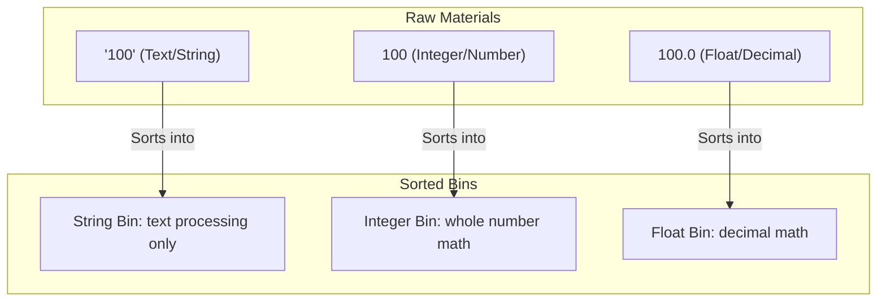

## Why This Matters

In the world of data analytics, messy data is the default setting. When you export logs from a server, fetch data from a third-party REST API, or load a legacy CSV spreadsheet, you rarely receive perfectly structured types. 
*   A database export might represent currency as the string `"$1,250.50"` instead of a floating-point number.
*   An API might return the string `"true"` instead of a proper Boolean `True` value.
*   A user registration form might leave fields blank, producing missing or `None` values that crash mathematical calculations.

If you attempt to perform arithmetic on a string, or clean a value that is actually `None`, Python will halt your entire script with a `TypeError`. As a data analyst, you will spend roughly 80% of your time cleaning, standardizing, and casting data types before you can run a single calculation or build a predictive model. Mastering data types is the prerequisite for data hygiene and ETL (Extract, Transform, Load) pipelines.

---

## The Metaphor: Sorting Bins in a Recycling Center

To understand data types, imagine a recycling center where items must be sorted into specific bins: paper, plastics, metals, and organic waste.



Each bin represents a different **data type** in Python:
*   **Strings (`str`):** Cans and containers that contain text labels. You can paste them together (concatenate), but you cannot perform mathematical operations on them.
*   **Integers (`int`):** Whole counting units. Perfect for counting things that cannot be split, such as active users, transactions, or units in stock.
*   **Floats (`float`):** Continuous, fractional measurements. Perfect for currency, calculations, rates, and scientific measurements.
*   **Booleans (`bool`):** Simple light switches that are either `True` (ON) or `False` (OFF).

Just as you cannot compost a soda can, **you cannot perform integer math on string text**, even if that text looks like a number (e.g., adding `"100"` and `5` will cause a crash). You must first sort or transform that object into the correct bin.

---

## Step-by-Step Concept Breakdown

### 1. The Core Data Types
Python has several built-in data types, but these four form the foundation of all analytics work:

| Type Name | Python Class | Purpose | Example |
| :--- | :--- | :--- | :--- |
| **String** | `str` | Textual data, identifiers, and codes | `"Seattle"`, `"SKU-492"` |
| **Integer** | `int` | Whole numbers (positive, negative, zero) | `450`, `-12` |
| **Float** | `float` | Decimal or floating-point numbers | `79.99`, `0.045` |
| **Boolean** | `bool` | Logical flags representing state | `True`, `False` |
| **NoneType** | `NoneType` | The absence of a value (missing data) | `None` |

### 2. Mutability vs. Immutability (Under the Hood)
One of the most important computer science concepts in Python is the difference between **mutable** and **immutable** objects.
*   **Immutable Types:** Once created in memory, their value *cannot* be changed. These include `int`, `float`, `str`, `bool`, and `tuple`.
*   **Mutable Types:** Their values *can* be modified in place without changing their location in memory. These include `list`, `dict`, and `set`.

#### What happens in memory when you change a string?
Because strings are immutable, any operation that appears to modify a string (like stripping spaces or converting to uppercase) does **not** change the original string. Instead, Python creates a brand-new string object at a new memory address.

```python
name = "Sarah"
# Check memory address of the string object
address_1 = id(name) 

# Convert to uppercase
name = name.upper() 
address_2 = id(name)

print(f"Address 1: {address_1}")
print(f"Address 2: {address_2}")
```
```text
# Output:
Address 1: 140728475620400
Address 2: 140728475620976
```
Because the memory addresses differ, Python did not edit `"Sarah"` in place. It created `"SARAH"` in a new memory slot and pointed the `name` sticky note to it. The original `"Sarah"` object was marked for garbage collection.

#### Why does this matter?
1.  **Performance:** Modifying strings inside a loop using `+` or `+=` forces Python to constantly allocate new memory and copy data, resulting in extremely slow code for large datasets ($O(n^2)$ time complexity).
2.  **Hashability:** Only immutable objects can be used as keys in a dictionary or elements in a set. This is because dictionary keys must have a stable value so Python can locate them quickly in memory. A mutable list cannot be a dictionary key.

#### Memory Footprints: List vs. Tuple
Tuples are immutable sequences, while lists are mutable sequences. Under the hood, Python allocates extra memory for lists to allow for fast `.append()` operations (over-allocation). Tuples, being immutable, are allocated with the exact size required.
```python
import sys
empty_list = []
empty_tuple = ()
print(f"Empty List size:  {sys.getsizeof(empty_list)} bytes")
print(f"Empty Tuple size: {sys.getsizeof(empty_tuple)} bytes")
```
For large datasets, using tuples instead of lists can significantly reduce memory overhead.

---

### 3. Precision Math: `float` vs. `decimal.Decimal`
A major trap in Python analytics is floating-point representation.
*   **Float Type:** Python’s float uses standard binary floating-point representation (IEEE 754). It is fast but cannot precisely represent some decimal fractions (e.g., `0.1` or `0.2`).
*   **Decimal Type:** The `decimal.Decimal` class in Python’s standard library represents numbers as base-10 decimals. It is slower than float but provides exact precision.

#### The Financial Formula Trap
If you are building an billing or accounting pipeline, float errors can compound and cause auditor reviews:
```python
from decimal import Decimal

# Float calculation
float_price = 0.1 + 0.2
print(f"Float total:   {float_price}")

# Decimal calculation
decimal_price = Decimal('0.1') + Decimal('0.2')
print(f"Decimal total: {decimal_price}")
```
```text
# Output:
Float total:   0.30000000000000004
Decimal total: 0.3
```
*Best Practice:* Always pass strings into the `Decimal()` constructor (e.g. `Decimal('0.1')`). Passing a float like `Decimal(0.1)` preserves the float's precision error.

---

### 4. Text Encodings: Strings vs. Bytes
When scraping web data or downloading raw legacy logs, you will occasionally see string values represented as **bytes** (prefixed with `b`, like `b'Hello'`).
*   **Bytes (`bytes`):** Raw 8-bit values representing binary data.
*   **Strings (`str`):** Unicode character representations.
*   **Conversion (Casting):** 
    *   To convert bytes to string, use `.decode('utf-8')`.
    *   To convert string to bytes, use `.encode('utf-8')`.

If your pipeline reads files containing foreign characters (like accent marks or emojis) using the wrong encoding, Python raises a `UnicodeDecodeError`. Explicitly decoding to UTF-8 handles these characters safely.

```python
# Raw bytes from an API stream
raw_api_bytes = b'Total: \xc2\xa350.00' # Represents £50.00 in UTF-8 bytes

# Decoding bytes to Unicode string
clean_string = raw_api_bytes.decode('utf-8')
print("Decoded String:", clean_string)
```
```text
# Output:
Decoded String: Total: £50.00
```

---

### 5. Type Casting Mechanics and Gotchas
Type casting is the process of converting a value from one data type to another. 

#### Explicit vs. Implicit Casting
*   **Implicit Casting:** Python automatically converts one data type to another to prevent data loss. For example, adding an `int` and a `float` results in a `float`:
    ```python
    x = 10    # int
    y = 5.5   # float
    result = x + y  # result is 15.5 (float)
    ```
*   **Explicit Casting:** You manually convert the type using built-in functions: `str()`, `int()`, `float()`, `bool()`.

#### The `int()` Casting Gotcha
Why does `int("12.5")` crash, while `int(float("12.5"))` works?
*   When you call `int()`, Python expects the string to represent a whole base-10 number (e.g., `"12"`). The decimal point `.` is an invalid character for an integer string. Since Python does not know if you want to round up, round down, or truncate, it throws a `ValueError`.
*   When you write `int(float("12.5"))`, you break it into two logical steps:
    1.  `float("12.5")` parses the string successfully and creates a floating-point object `12.5`.
    2.  `int(12.5)` truncates the decimal part of the float, returning the integer `12`.

---

### 6. `None`: Representing Missing Data
In analytics, missing data is a constant challenge.
*   In SQL databases, missing data is represented as `NULL`.
*   In Pandas and data science libraries, it is represented as `NaN` (Not a Number) or `None`.
*   In native Python, the absence of a value is represented by the singleton object **`None`** (which belongs to its own class, `NoneType`).

#### The Importance of Identity Checking
Always compare values to `None` using the identity operators **`is`** or **`is not`**, rather than the equality operators `==` or `!=`.
```python
x = None
# Correct
print(x is None)  # True

# Incorrect (Avoid)
print(x == None)  # True
```
*Why?* `is` compares the actual memory addresses (identity), while `==` checks value equality. Because `None` is a singleton (only one copy of it exists in memory), checking identity is faster and safer. Furthermore, custom classes can override the `==` operator to return misleading results, but they cannot override the `is` operator.

---

## Code & Practical Walkthroughs

### Example 1: In-depth String Cleaning for Data Pipelines
Raw text strings from CSVs often contain trailing tabs, inconsistent casing, and unwanted formatting. Here is how to clean them using string methods.

```python
# Raw customer records from a messy text log
raw_record = "  \tUSR-98421_NA  |  $1,540.80  |  ACTIVE \n"

# 1. Splitting the fields by the pipe character '|'
fields = raw_record.split("|")
print("Raw Fields:", fields)

# 2. Extracting and cleaning the ID
# We want to strip the whitespace/tabs and replace underscores with dashes
raw_id = fields[0]
clean_id = raw_id.strip().replace("_", "-")

# 3. Extracting and cleaning the Revenue
# We must strip spaces, remove the dollar sign '$', and remove commas ','
raw_rev = fields[1]
clean_rev = raw_rev.strip().replace("$", "").replace(",", "")
# Cast to float for mathematical calculations
revenue_float = float(clean_rev)

# 4. Extracting and cleaning the Status
# We strip the newline character and force lowercase
raw_status = fields[2]
clean_status = raw_status.strip().lower()

# Print the cleaned, typed records
print("\n--- Cleaned Record Details ---")
print(f"ID:      {clean_id} (Type: {type(clean_id).__name__})")
print(f"Revenue: {revenue_float} (Type: {type(revenue_float).__name__})")
print(f"Status:  {clean_status} (Type: {type(clean_status).__name__})")
```
```text
# Output:
Raw Fields: ['  \tUSR-98421_NA  ', '  $1,540.80  ', '  ACTIVE \n']

--- Cleaned Record Details ---
ID:      USR-98421-NA (Type: str)
Revenue: 1540.8 (Type: float)
Status:  active (Type: str)
```

### Example 2: String Validation with Advanced Inspectors
Data pipelines often validate if fields like postal codes, customer names, or item tags are structural values.

```python
postal_code = "98101"
user_name = "Sarah123"
blank_field = "   \n\t"

# .isdigit() checks if the string contains only numeric characters
print(f"Is Postal Code numeric?   {postal_code.isdigit()}")

# .isalpha() checks if the string contains only alphabetic characters
print(f"Is User Name purely text? {user_name.isalpha()}")

# .isalnum() checks if string contains only text and numbers (no punctuation/spaces)
print(f"Is User Name alphanumeric? {user_name.isalnum()}")

# .isspace() checks if string contains only whitespace characters (spaces, tabs, newlines)
print(f"Is Field empty/space?      {blank_field.isspace()}")
```
```text
# Output:
Is Postal Code numeric?   True
Is User Name purely text? False
Is User Name alphanumeric? True
Is Field empty/space?      True
```

### Example 3: String Searching and Substring Validation
Data analysts often check email domains, search for patterns in logs, or check file extensions before running processing scripts.

```python
filename = "quarterly_sales_report_2026_v2.csv"
email_address = "analyst.support@company.com"

# 1. Checking start and end patterns
is_csv = filename.endswith(".csv")
is_excel = filename.endswith(".xlsx")
is_report = filename.startswith("quarterly")

print(f"File Name: {filename}")
print(f"Is CSV?    {is_csv}")
print(f"Is Excel?  {is_excel}")
print(f"Is Report? {is_report}")

# 2. Searching for substrings using .find()
# .find() returns the lowest index where the substring is found, or -1 if not found
q_index = filename.find("sales")
year_index = filename.find("2026")
missing_index = filename.find("draft")

print(f"\n'sales' starts at index: {q_index}")
print(f"'2026' starts at index:  {year_index}")
print(f"'draft' index:           {missing_index} (Not Found)")

# 3. Validating Email Domain using 'in' operator
if "@company.com" in email_address:
    print(f"\nAccess Granted: {email_address} is an internal company email.")
else:
    print(f"\nAccess Denied: {email_address} is an external email.")
```
```text
# Output:
File Name: quarterly_sales_report_2026_v2.csv
Is CSV?    True
Is Excel?  False
Is Report? True

'sales' starts at index: 10
'2026' starts at index:  23
'draft' index:           -1 (Not Found)

Access Granted: analyst.support@company.com is an internal company email.
```

### Example 4: Handling Missing Values (`None`) Safely
When running a calculation across a list of values, a single `None` can raise a `TypeError`. We must implement fallback logic or skip missing values.

```python
# List of transaction amounts (some are None due to system errors or missing entries)
transactions = [120.50, 45.00, None, 300.00, None, 15.75]

total_sales = 0.0
valid_transaction_count = 0
missing_transaction_count = 0

for txn in transactions:
    # Check if the transaction is missing
    if txn is None:
        missing_transaction_count += 1
        continue  # Skip this iteration and go to the next transaction
    
    # Otherwise, perform calculations
    total_sales += txn
    valid_transaction_count += 1

print("--- Transaction Log Summary ---")
print(f"Total Sales Volume: ${total_sales:,.2f}")
print(f"Valid Transactions: {valid_transaction_count}")
print(f"Missing (None):     {missing_transaction_count}")
```
```text
# Output:
--- Transaction Log Summary ---
Total Sales Volume: $481.25
Valid Transactions: 4
Missing (None):     2
```

---

## Edge Cases & Common Mistakes

### 1. The `TypeError: can only concatenate str (not "int") to str`
This is the most common error when printing combined text and metrics. Python refuses to implicitly convert numbers to strings when joining them with the `+` operator.

```python
active_users = 4500
# Attempting to print via string concatenation
print("Current Active Users: " + active_users)
```
```text
# Output:
TypeError: can only concatenate str (not "int") to str
```
#### The Fixes:
```python
# Fix A: Use explicit casting
print("Current Active Users: " + str(active_users))

# Fix B: Use f-strings (Best Practice, cleanest)
print(f"Current Active Users: {active_users}")
```

### 2. Float Precision Traps
Computers represent floats in base-2 (binary) fractions, which cannot exactly represent certain decimal numbers (like `0.1` or `0.2`). This leads to precision errors.

```python
a = 0.1
b = 0.2
sum_value = a + b

print(f"0.1 + 0.2 equals: {sum_value}")
print(f"Is 0.1 + 0.2 == 0.3? {sum_value == 0.3}")
```
```text
# Output:
0.1 + 0.2 equals: 0.30000000000000004
Is 0.1 + 0.2 == 0.3? False
```
*The Fix:* When comparing floats in tests or logic, use `round()` or `math.isclose()`:
```python
import math
print(math.isclose(0.1 + 0.2, 0.3)) # True
```

### 3. Truthy and Falsy Evaluations
When casting objects to Booleans using `bool()`, Python evaluates empty collections and zero values as `False`. Everything else is `True`.

```python
# The Falsy List
print("bool(None):", bool(None))
print("bool(0):   ", bool(0))
print("bool(0.0): ", bool(0.0))
print("bool(''):  ", bool(""))      # Empty string
print("bool([]):  ", bool([]))      # Empty list
print("bool({}):  ", bool({}))      # Empty dict
```
```text
# Output:
bool(None): False
bool(0):    False
bool(0.0):  False
bool(''):   False
bool([]):   False
bool({}):   False
```
**The Trap:** If you test `if not revenue:` to find missing values, the block will trigger if `revenue` is `None` (missing), but it will *also* trigger if `revenue` is `0` (which is a valid numeric value). Always check `if revenue is None:` for missing data explicitly.

---

## Practice Exercises & Mini-Projects

<div class="challenge">

### Exercise 1: Clean and Parse Messy User Subscriptions
**Scenario:** You have extracted a list of user subscriptions from a dirty log file. The data is formatted as strings with inconsistent capitalization, whitespace, and dollar signs.

```python
raw_subscriptions = [
    "  USER-102  |  $89.99  |  annual  |  active  ",
    "  USER-205  |  $9.99  |  monthly  |  cancelled  \n",
    "  USER-301  |  $0.00  |  trial  |  expired  ",
    "  USER-404  |  $199.99  |  ANNUAL  |  active  "
]
```

**Task:** Write a Python script to iterate through this list, clean each entry, and print the details. Specifically:
1.  Split each subscription string by the pipe `|` character.
2.  Clean the **User ID** (strip spaces, ensure it is uppercase).
3.  Clean the **Price** (remove the `$` and convert to a `float`).
4.  Clean the **Billing Cycle** (strip spaces, convert to lowercase).
5.  Clean the **Status** (strip spaces, convert to lowercase, then check if it equals `"active"` to produce a Boolean `True` or `False`).
6.  Print each record as a clean dictionary showing the data types.

**Expected Output:**
```text
Cleaned Record: {'user_id': 'USER-102', 'price': 89.99, 'cycle': 'annual', 'is_active': True}
Cleaned Record: {'user_id': 'USER-205', 'price': 9.99, 'cycle': 'monthly', 'is_active': False}
Cleaned Record: {'user_id': 'USER-301', 'price': 0.0, 'cycle': 'trial', 'is_active': False}
Cleaned Record: {'user_id': 'USER-404', 'price': 199.99, 'cycle': 'annual', 'is_active': True}
```

</div>

<div class="challenge">

### Exercise 2: Missing Value and Type casting ETL Pipeline
**Scenario:** You are importing customer orders from a CSV file. Some columns have missing values, and others contain strings that should be numeric. You need to prepare this data for a financial report.

```python
raw_orders = [
    {"order_id": 1001, "item": "Laptop", "price": "1200.50", "quantity": "1", "discount": "0.10"},
    {"order_id": 1002, "item": "Monitor", "price": "350.00", "quantity": "2", "discount": None},
    {"order_id": 1003, "item": "Mouse", "price": "25.00", "quantity": "5", "discount": "0.05"},
    {"order_id": 1004, "item": "Keyboard", "price": None, "quantity": "1", "discount": None}
]
```

**Task:** Write a script that cleans this data using the following rules:
1.  If the **Price** is missing (`None`), skip the order completely (it is an invalid transaction).
2.  Convert **Price** to a float and **Quantity** to an integer.
3.  If the **Discount** is missing (`None`), set it to a default value of `0.0` (no discount). Otherwise, convert it to a float.
4.  Calculate the **Net Total** for each transaction using the formula:
    $$\text{Net Total} = (\text{Price} \times \text{Quantity}) \times (1 - \text{Discount})$$
5.  Print the clean orders and calculate the cumulative total of all transactions combined.

**Expected Output:**
```text
Processing Order 1001: Net Total = $1,080.45
Processing Order 1002: Net Total = $700.00
Processing Order 1003: Net Total = $118.75
Skipping Order 1004: Missing Price Data.
----------------------------------------
Cumulative Revenue: $1,899.20
```

</div>

<div class="challenge">

### Exercise 3: Ledger Reconciliation using Precise Decimal Arithmetic
**Scenario:** The accounting department has detected fractional discrepancies in the daily sales summaries. You need to audit the records, parse pricing data, and compute the total revenue using `decimal.Decimal` to avoid binary float rounding errors.

```python
raw_transactions = [
    {"tx_id": "TX-01", "price_raw": "  $9.99 ", "tax_rate_raw": " 0.0825 "},
    {"tx_id": "TX-02", "price_raw": " $120.50  ", "tax_rate_raw": " 0.0500 "},
    {"tx_id": "TX-03", "price_raw": " $5.45 ", "tax_rate_raw": " 0.0000 "},
    {"tx_id": "TX-04", "price_raw": "  $1,250.00 ", "tax_rate_raw": " 0.0825 "}
]
```

**Task:** Write a script that:
1.  Iterates through `raw_transactions`.
2.  Cleans `price_raw` by stripping whitespace, removing the dollar sign `$`, removing commas, and converting it to a `decimal.Decimal` object.
3.  Cleans `tax_rate_raw` by stripping whitespace and converting it directly to a `decimal.Decimal` object.
4.  Computes the **Tax Owed** (`Price * Tax Rate`) and rounds it to two decimal places using the Decimal quantize method (`Decimal('0.01')`).
5.  Computes the **Total Charge** (`Price + Rounded Tax Owed`).
6.  Computes the cumulative total sales, cumulative tax owed, and cumulative total charges. Print all values formatted as currency.

**Expected Output:**
```text
Reconciling TX-01: Price = $9.99, Tax = $0.82, Total = $10.81
Reconciling TX-02: Price = $120.50, Tax = $6.03, Total = $126.53
Reconciling TX-03: Price = $5.45, Tax = $0.00, Total = $5.45
Reconciling TX-04: Price = $1,250.00, Tax = $103.13, Total = $1,353.13
----------------------------------------
Cumulative Ledger Summary:
Base Price Total:   $1,385.94
Tax Collected:       $109.98
Total Billing:      $1,495.92
```

</div>

---

## Section Recaps

*   **Explicit vs. Implicit Types:** Python determines types dynamically, but enforces them strictly. You cannot mix types like strings and integers without explicit casting.
*   **Immutability:** Strings, integers, floats, and Booleans cannot be modified in place. Modifying a string creates a completely new string in memory.
*   **String Operations:** Clean dirty text logs using `.strip()` to remove whitespace, `.replace()` to remove currency formatting, and `.split()` to parse columns.
*   **Decimal for Finance:** Binary floats (`float`) cannot represent fractional numbers exactly. Use the `decimal.Decimal` class for financial applications where exact decimal representation is required.
*   **Safe Type Casting:** Casting a floating-point string (e.g., `"12.5"`) directly to an integer with `int()` fails. Convert it to a `float` first, then cast to an `int`.
*   **Truthy/Falsy Rules:** Zero, empty strings, empty lists, and `None` evaluate to `False` (Falsy) in conditional tests. All other values evaluate to `True` (Truthy).
*   **Handling `None`:** `None` represents missing data. Use identity operators (`is None` / `is not None`) to check for missing values before performing math.

---

## Common Interview Questions

<div class="interview-tip">

### Q1: What is the difference between mutable and immutable data types in Python? Give examples of both and explain what happens in memory when you try to modify them.
**Answer:**
*   **Immutable types** (e.g., `int`, `float`, `str`, `bool`, `tuple`) cannot have their values changed in place after creation. If you attempt to modify an immutable object, Python creates a new object in memory with the updated value and updates the variable to point to this new memory address. The old object is eventually cleaned up by garbage collection.
*   **Mutable types** (e.g., `list`, `dict`, `set`) can be changed in place without changing their location in memory.

**Memory Demonstration:**
```python
# Immutable (String)
s1 = "hello"
print(id(s1))  # Address A
s1 += " world"
print(id(s1))  # Address B (different address, new object created)

# Mutable (List)
l1 = [1, 2, 3]
print(id(l1))  # Address C
l1.append(4)
print(id(l1))  # Address C (same address, list modified in place)
```

### Q2: Why does `int("12.5")` trigger a `ValueError` in Python, but `int(float("12.5"))` is executed successfully?
**Answer:**
The `int()` constructor converts a number or a string that represents a whole integer into an integer object. When passed a string, it parses it characters-by-characters. If the string contains any non-digit character (like the decimal point `.` in `"12.5"`), it raises a `ValueError` because the format is invalid for a base-10 integer.

When you execute `int(float("12.5"))`, the operations occur from the inside out:
1.  `float("12.5")` successfully parses the decimal string and returns the float object `12.5`.
2.  The float object is passed to `int(12.5)`. The `int()` constructor accepts float arguments and converts them by truncating the decimal portion, returning the integer `12`.

### Q3: How does Python represent missing data globally, and how do you check if a variable contains missing data? Contrast this with SQL and Pandas.
**Answer:**
*   **Python:** Represents missing data using the singleton object `None`, which is the sole instance of the `NoneType` class. To check if a variable is missing, you use the identity operator `is None` (e.g., `if value is None:`).
*   **SQL:** Represents missing data as `NULL`. You query it using `IS NULL` or `IS NOT NULL`.
*   **Pandas:** Represents missing data using `NaN` (Not a Number, which is a float type) or the experimental `NA` object. You check for it using methods like `.isna()` or `.isnull()`.

It is critical to distinguish between these because `None == None` is `True`, but in Pandas/numpy, `np.nan == np.nan` evaluates to `False` (by IEEE 754 floating-point standards).

### Q4: Explain the performance implications of using string concatenation (`+=`) in a loop versus using the `.join()` method. Explain this in terms of Time Complexity (Big O) and memory reallocation.
**Answer:**
Because strings are immutable, writing a loop that builds a string by repeatedly using the `+=` operator results in poor performance:
```python
# Poor Performance: O(N^2) Time Complexity
result = ""
for word in list_of_words:
    result += word  # Creates a new string and copies characters every iteration
```
In each iteration, Python must allocate a new chunk of memory for the combined string, copy all characters from the old string, and copy the new word. If there are $N$ words of average length $L$, the total time complexity is $O(N^2 \cdot L)$ because it re-copies the accumulated string at each step.

The `.join()` method is optimized:
```python
# High Performance: O(N) Time Complexity
result = "".join(list_of_words)
```
The `.join()` method performs a two-pass sweep: it first calculates the total length of the final string, allocates a single block of memory of that exact size, and then copies all the strings into that pre-allocated space. This runs in $O(N \cdot L)$ time, which is significantly faster and uses less memory.

### Q5: What is "hashability" in Python, and how is it related to mutability? Why can a string be used as a dictionary key, but a list cannot?
**Answer:**
An object is **hashable** if it has a hash value that never changes during its lifetime (which requires implementing a `__hash__()` method) and can be compared to other objects (requiring an `__eq__()` method). 

Hashability is directly related to mutability:
*   Only **immutable objects** (like strings, numbers, and tuples) are hashable. Since their values cannot change, their hash values remain stable.
*   **Mutable objects** (like lists and dictionaries) are not hashable because their contents can change, which would change their hash values.

Python dictionaries use a hash table under the hood to achieve $O(1)$ constant-time lookup. To find a value, Python hashes the key to locate the index in memory. If you were allowed to use a mutable list as a key, and you subsequently modified that list, its hash value would change. Python would look in the wrong slot of the hash table and fail to retrieve your data. Therefore, Python raises a `TypeError: unhashable type: 'list'` if you try to use a list as a dictionary key.

</div>
