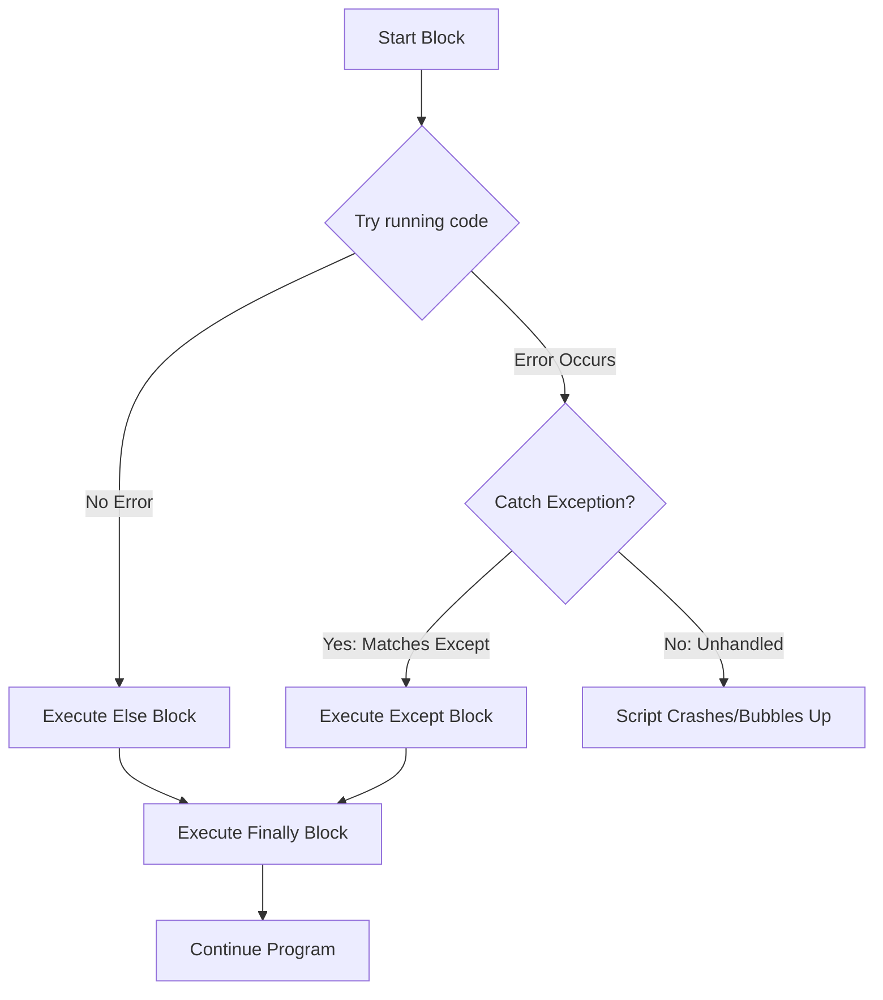

## Why This Matters

Real-world data is chaotic. 
*   A database server you depend on might temporarily drop its connection.
*   An API might return a `"502 Bad Gateway"` status code.
*   A user might upload a spreadsheet where the `"Age"` column contains the word `"twenty"` instead of the number `20`.
*   A configuration file might be missing from the server.

If your Python script does not have error handling, the moment it encounters any of these situations, it will crash immediately. For a data analyst, this is a disaster. If your script crashes on row 99,999 of a 100,000-row database ingest after running for three hours, you lose everything. 

Error handling is not about writing code that never fails. It is about writing code that **knows how to fail gracefully**, logs the issue, cleans up its resources, and continues processing the rest of the data.

---

## The Metaphor: The Tightrope Net and Server Generator

Think of exception handling through two real-world analogies:

### 1. The Tightrope Safety Net
A tightrope walker performs high above the ground. If they slip, they fall. Without a safety net, a single slip is fatal (the script crashes and exits). 
*   **The `try` block** is the tightrope walker performing the act.
*   **The `except` block** is the safety net. If they fall, the net catches them, prevents them from hitting the ground, and allows them to stand up and walk away.



### 2. The Server Room Backup Generator
In a critical server room, the primary power grid might fail. To prevent the servers from shutting down, the system has a backup generator.
*   If the primary power grid drops (Exception), the system switches to the backup generator (`except` fallback) to keep the system online.
*   Once the grid returns, the system does housekeeping (`finally`) to ensure power loads are balanced, regardless of whether the outage occurred.

---

## Step-by-Step Concept Breakdown

### 1. Built-in Exceptions You Must Know

Python has a hierarchy of built-in exceptions. When Python runs into an operation it cannot perform, it stops execution and raises a specific exception object. Here are the most common ones in data analytics:

*   **`NameError`:** Raised when you try to use a variable or function that has not been defined yet.
*   **`TypeError`:** Raised when an operation or function is applied to an object of an inappropriate type (e.g., trying to add a string to an integer: `"5" + 2`).
*   **`ValueError`:** Raised when a function receives an argument of the correct type but an invalid value (e.g., trying to convert a string of letters into an integer: `int("abc")`).
*   **`KeyError`:** Raised when you try to access a dictionary key that does not exist.
*   **`IndexError`:** Raised when you try to access an index in a list that is out of range.
*   **`FileNotFoundError`:** Raised when you try to open or process a file that does not exist in the specified path.

---

### 2. The `try-except` Block Structure

To catch exceptions, we wrap the risky code inside a `try` block, followed by an `except` block to define how we want to handle the error.

```python
# Standard try-except
raw_value = "N/A"

try:
    # Risky code that might raise a ValueError
    numeric_value = int(raw_value)
    print(f"Success! Value is {numeric_value}")
except ValueError as e:
    # Code that runs ONLY if a ValueError occurs
    print(f"Failed to parse value. Error details: {e}")
    numeric_value = 0 # Default fallback value

print(f"Final value: {numeric_value}")
```

```text
# Output:
Failed to parse value. Error details: invalid literal for int() with base 10: 'N/A'
Final value: 0
```

#### Catching Multiple Specific Exceptions
You can handle different types of errors in different ways by using multiple `except` statements, or by grouping them into a tuple.

```python
def process_data_point(data_dict, key):
    try:
        # Might raise KeyError if key is missing
        val = data_dict[key]
        # Might raise ValueError if val cannot be converted to float
        parsed = float(val)
        return parsed
    except KeyError:
        print(f"KeyError: Key '{key}' not found in dictionary.")
        return 0.0
    except ValueError:
        print(f"ValueError: Could not convert '{data_dict[key]}' to float.")
        return 0.0
```

---

### 3. The Bare Except Anti-Pattern

A common mistake is catching *all* exceptions using a bare `except:` or catching the generic parent `Exception` without processing details.

```python
# THE ANTI-PATTERN (DO NOT DO THIS)
try:
    # Some code
    result = 10 / 0
except:
    pass # Silently swallows everything!
```

#### Why Bare `except:` is Dangerous:
1.  **Swallows System Signals:** A bare `except:` catches system-level interrupts like `KeyboardInterrupt` (triggered when you press Ctrl+C to terminate a running script) or `SystemExit`. This makes it impossible to stop a stuck script from the terminal.
2.  **Hides Typographical Bugs:** If you spell a variable name wrong inside the `try` block (e.g. write `prnt(x)` instead of `print(x)`), it raises a `NameError`. A bare except block will catch this error and ignore it, leaving you wondering why your code isn't working.
3.  **Hinders Debugging:** It prevents you from seeing where or why an error occurred because the original traceback information is discarded.

> [!IMPORTANT]
> Always catch the most specific exceptions possible. If you must catch all standard errors (for example, at the outer loop of a data scraper), catch `Exception` instead of a bare `except`:
> `except Exception as e:`. This catches standard programming errors but lets system commands like Ctrl+C pass through.

---

### 4. The `else` and `finally` Blocks

The complete error handling structure in Python contains four blocks: `try`, `except`, `else`, and `finally`.

```python
try:
    file = open("data.csv", "r")
    data = file.read()
except FileNotFoundError:
    print("File not found! Using fallback data.")
    data = "default_value"
else:
    # Runs ONLY if the try block executed successfully without errors
    print("File read successfully. Formatting data...")
finally:
    # ALWAYS runs, regardless of whether an error occurred or not
    # Even if the try or except blocks run a 'return' statement!
    print("Closing file connection...")
    try:
        file.close()
    except NameError:
        # 'file' was never opened because FileNotFoundError occurred
        pass
```

#### Why use `else`?
Placing code in the `else` block rather than the `try` block is a best practice. It ensures that you do not accidentally catch exceptions that you did not intend to guard. In the example above, if the data formatting step in the `else` block raises a `ValueError`, it will not be caught by the `except FileNotFoundError` block.

#### Why use `finally`?
The `finally` block is used to perform cleanup tasks. This includes releasing system resources, closing database connections, closing files, or terminating network sockets.

---

### 5. Raising Exceptions with `raise`

Sometimes you want to intentionally trigger an exception because a business validation rule was broken (for example, if a transaction amount is negative).

```python
def process_payment(amount):
    if amount <= 0:
        # Intentionally stop execution and flag a ValueError
        raise ValueError(f"Payment amount must be positive. Got: {amount}")
    print(f"Processing payment of ${amount}...")
```

#### Re-raising Exceptions
You can catch an exception, log the occurrence, and then re-raise it so that parent processes know the operation failed.

```python
try:
    # Some database operation
    raise ConnectionError("Timeout connection")
except ConnectionError as e:
    print(f"Log event: Connection failed: {e}")
    # Re-raise the caught exception using a bare 'raise'
    raise 
```

---

### 6. Designing Custom Exceptions

In complex data systems, you should write your own exception classes. This allows you to differentiate between Python's built-in errors and validation errors specific to your business logic.

To create a custom exception, define a class that inherits from Python's built-in `Exception` class.

```python
class DataQualityError(Exception):
    """Base exception class for data quality failures."""
    pass

class NullValueFoundError(DataQualityError):
    """Raised when a critical field contains a null/missing value."""
    def __init__(self, column_name, row_index):
        self.column_name = column_name
        self.row_index = row_index
        super().__init__(f"Data Quality Alert: Null value found in column '{column_name}' at row {row_index}")

# Usage inside a data pipeline
def validate_record(record, index):
    if record.get("email") is None:
        raise NullValueFoundError("email", index)

try:
    validate_record({"name": "Bob", "email": None}, 42)
except NullValueFoundError as e:
    print(f"Quality Check Failed: {e}")
```

```text
# Output:
Quality Check Failed: Data Quality Alert: Null value found in column 'email' at row 42
```

---

### 7. Debugging: `print` vs `breakpoint()`

When things break, you need to inspect the state of your application.

#### The Old Way: Print Debugging
Inserting `print(variable)` statements to inspect values is quick but has downsides:
*   It litters your codebase with temporary print statements that you might forget to remove before deploying to production.
*   It is static; you cannot interact with the code or run test expressions during execution.

#### The Modern Way: Interactive Debugger (`breakpoint()`)
Python 3.7 introduced `breakpoint()`, which pauses your code at runtime and drops you into an interactive terminal called `pdb` (Python Debugger).

```python
def calculate_metrics(revenue, costs):
    margin = revenue - costs
    # Pause execution here to inspect variables
    breakpoint()
    ratio = margin / revenue
    return ratio
```

When Python reaches the `breakpoint()` line, it halts execution and opens a command-line interface:
```text
> d:\projects\metrics.py(4)calculate_metrics()
-> ratio = margin / revenue
(Pdb) 
```

#### Core Debugger Commands:
*   `p variable_name`: Prints the value of a variable (e.g., `p margin`).
*   `n` (next): Executes the current line and moves to the next line in the same function.
*   `s` (step): Steps *into* a function call on the current line.
*   `c` (continue): Resumes normal execution of the program until the next breakpoint.
*   `q` (quit): Immediately terminates the program.

---

## Code / Practical Walkthroughs

### Walkthrough 1: Robust API Ingestion Wrapper

Let's write a data ingestion wrapper that attempts to query a flaky web service, handles common network errors, implements retries, and returns structured data.

```python
import time
import random

class APIConnectionError(Exception):
    """Custom exception representing an unrecoverable connection issue."""
    pass

def query_external_api():
    """Simulates a flaky API that randomly succeeds, times out, or returns bad data."""
    roll = random.random()
    if roll < 0.3:
        raise ConnectionTimeoutError("Network latency exceeded 5000ms")
    elif roll < 0.5:
        return {"status": "success", "data": [10, 20, 30]}
    elif roll < 0.8:
        raise ValueError("Invalid payload response received")
    else:
        # Simulate a key error inside the response dictionary
        return {"wrong_key": "data"}

# Dummy connection exception for simulation
class ConnectionTimeoutError(Exception):
    pass

def safe_api_ingest(max_retries=3):
    """Wrapper that handles failures and retries queries."""
    for attempt in range(1, max_retries + 1):
        try:
            print(f"API Access Attempt #{attempt}...")
            response = query_external_api()
            
            # Validate response keys
            if "status" not in response:
                raise KeyError("Missing 'status' key in API response")
                
            print("API Query Successful!")
            return response["data"]
            
        except ConnectionTimeoutError as e:
            print(f"  Attempt failed due to timeout: {e}")
            if attempt < max_retries:
                sleep_time = attempt * 2
                print(f"  Retrying in {sleep_time} seconds...")
                time.sleep(sleep_time)
            else:
                raise APIConnectionError("API failed to respond after max retries")
                
        except (ValueError, KeyError) as e:
            print(f"  Data corruption error detected: {e}")
            print("  Skipping retries (data issue is unrecoverable).")
            return []

# Run the pipeline safely
try:
    dataset = safe_api_ingest()
    print(f"Resulting Dataset: {dataset}")
except APIConnectionError as e:
    print(f"ETL pipeline terminated: {e}")
```

---

### Walkthrough 2: File Directory Processor with Audit Logging

This script processes multiple files in a directory. It handles missing files, logs parsing errors, and ensures that cleanups are handled in the `finally` block.

```python
import csv
from pathlib import Path

# Create some directories and files to test with
Path("raw_data").mkdir(exist_ok=True)
Path("raw_data/sales_jan.csv").write_text("item,qty\nLaptop,10\nMonitor,abc\n") # File with a ValueError
Path("raw_data/sales_feb.csv").write_text("item,qty\nKeyboard,15\nMouse,22\n") # File with clean data
# Note that we do not create sales_mar.csv, so it will raise FileNotFoundError

files_to_process = ["raw_data/sales_jan.csv", "raw_data/sales_feb.csv", "raw_data/sales_mar.csv"]
audit_log = []

for file_path in files_to_process:
    p = Path(file_path)
    print(f"\nProcessing File: {p.name}")
    
    file_handle = None
    try:
        # 1. Attempt to open file
        file_handle = open(p, "r")
        reader = csv.DictReader(file_handle)
        
        # 2. Iterate and process rows
        for row_idx, row in enumerate(reader, start=1):
            try:
                item = row["item"]
                qty = int(row["qty"]) # Might raise ValueError if not numeric
                print(f"  Processed {item}: {qty} units")
            except ValueError as ve:
                print(f"  [Row {row_idx}] Data Type Error: {ve}")
                audit_log.append((p.name, row_idx, f"ValueError: {ve}"))
                
    except FileNotFoundError as fnf:
        print(f"  Critical Error: File not found: {p}")
        audit_log.append((p.name, 0, "FileNotFoundError"))
        
    finally:
        # 3. Clean up the resource safely
        if file_handle:
            print(f"  Closing file: {p.name}")
            file_handle.close()

# Print audit report
print("\n--- Processing Audit Log Summary ---")
for filename, row, issue in audit_log:
    print(f"File: {filename:<15} | Row: {row:<3} | Issue: {issue}")
```

```text
# Output:
Processing File: sales_jan.csv
  Processed Laptop: 10 units
  [Row 2] Data Type Error: invalid literal for int() with base 10: 'abc'
  Closing file: sales_jan.csv

Processing File: sales_feb.csv
  Processed Keyboard: 15 units
  Processed Mouse: 22 units
  Closing file: sales_feb.csv

Processing File: sales_mar.csv
  Critical Error: File not found: raw_data\sales_mar.csv

--- Processing Audit Log Summary ---
File: sales_jan.csv   | Row: 2   | Issue: ValueError: invalid literal for int() with base 10: 'abc'
File: sales_mar.csv   | Row: 0   | Issue: FileNotFoundError
```

---

## Edge Cases & Common Mistakes

### Gotcha 1: Modifying variables inside the `try` block
If an error occurs halfway through a `try` block, execution stops immediately. Any variables defined *after* the line that raised the error will not be initialized, causing a subsequent `NameError` if you try to reference them in the `except` or `finally` blocks.

```python
# BUGGY CODE
try:
    connection = connect_to_db()
    # If connection fails, the next line never runs
    cursor = connection.cursor() 
except ConnectionError:
    # Cursor was never initialized, raising a NameError!
    cursor.close() 
```

```python
# CORRECT CODE
connection = None
cursor = None
try:
    connection = connect_to_db()
    cursor = connection.cursor()
except ConnectionError:
    print("Database connection failed.")
finally:
    # Safely close only if they were initialized
    if cursor:
        cursor.close()
    if connection:
        connection.close()
```

### Gotcha 2: Silencing Errors Completely
Writing `except Exception: pass` is dangerous. It masks critical system failures and logical bugs, making troubleshooting impossible. 

If you must pass (for example, if you intentionally want to ignore a specific value format error), include a comment explaining why, or log the event as a warning:
```python
try:
    revenue = float(row["revenue"])
except ValueError:
    # Silent bypass is acceptable here because we default missing revenue values to 0.0
    revenue = 0.0
```

---

## Practice Exercises & Mini-Projects

### Exercise 1: Retry Logic Generator
Write a Python function called `retry_decorator(func, retries=3, delay=1)` that:
1.  Accepts a function parameter.
2.  Attempts to run the function.
3.  If the function fails, it catches the error, prints a warning message, waits for the duration specified by `delay`, and retries.
4.  If the function fails after the maximum number of attempts, it raises an exception.

### Exercise 2: Row Validation Engine
Create a script that validates records from a list of users.
*   If a user is under 18 years old, raise a custom exception `UnderageUserError`.
*   If the email does not contain `@`, raise a `ValueError`.
*   Iterate through the list. Catch each exception individually, print the details to the console without halting execution, and store the invalid users in a list for reporting.

---

## Section Recaps

*   **Graceful Failures:** Use `try` and `except` blocks to handle errors and prevent your scripts from crashing.
*   **Specific Exceptions:** Avoid bare `except:` blocks. Catch specific exceptions (`ValueError`, `KeyError`) to prevent masking typo bugs or blocking system exits.
*   **The complete structure:**
    *   `try`: code that might fail.
    *   `except`: code that runs only if an exception is raised.
    *   `else`: code that runs only if the `try` block succeeds.
    *   `finally`: code that always runs (for cleanups).
*   **Custom Exceptions:** Inherit from the `Exception` class to create custom exceptions tailored to your business rules.
*   **Breakpoint Debugging:** Use `breakpoint()` to halt your code at runtime, inspect variables, and step through execution using the interactive command line interface.

---

## Common Interview Questions

### Q1: What is the difference between a bare `except:` and `except Exception:`?
**Answer:**
*   `except Exception:` catches all standard exceptions that inherit from the base `Exception` class. This includes programming errors like `ValueError`, `TypeError`, `ZeroDivisionError`, and system errors like `FileNotFoundError`.
*   A bare `except:` catches **literally everything**, including exceptions that inherit from `BaseException` but not `Exception`. This includes system exits (`SystemExit`), keyboard interrupt signals (`KeyboardInterrupt` / Ctrl+C), and generator exits (`GeneratorExit`).
Always use `except Exception:` or catch specific exceptions. Using a bare `except:` can prevent you from stopping a running script in the terminal.

### Q2: What is exception chaining, and why is `raise ... from` useful?
**Answer:**
Exception chaining allows you to associate a caught exception with a new exception that you raise. This is useful when you want to wrap a low-level system error inside a higher-level business validation error while preserving the original error's traceback.

```python
try:
    open("credentials.json")
except FileNotFoundError as e:
    # Chains the new custom error to the original FileNotFoundError
    raise DatabaseConfigurationError("Config missing") from e
```
The console output will display both exceptions, showing that the `DatabaseConfigurationError` was directly caused by the `FileNotFoundError`.

### Q3: If a function has a `return` statement in the `try` block, the `except` block, and the `finally` block, which value is returned?
**Answer:**
The return value inside the `finally` block will **always** override all other returns. 

```python
def check_return():
    try:
        return "returned_from_try"
    finally:
        return "returned_from_finally"

print(check_return()) # Prints: "returned_from_finally"
```
Because the `finally` block is guaranteed to execute before leaving the function, its return statement is evaluated last, overwriting any values returned in the `try` or `except` blocks. This is a common interview gotcha. 

### Q4: Explain the difference between syntax errors and exceptions.
**Answer:**
*   **Syntax Errors:** Raised by Python's parser when the code violates language syntax rules (e.g. missing colons, unbalanced brackets, incorrect indentation). Syntax errors prevent the script from starting execution.
*   **Exceptions:** Occur during runtime when syntactically correct code encounters an invalid operation (e.g. division by zero, database timeout). Exceptions can be caught and handled using `try-except` blocks, whereas syntax errors cannot.

### Q5: How do you catch multiple exceptions in a single `except` block?
**Answer:**
You can catch multiple exceptions by passing them as a parentheses-wrapped tuple to the `except` statement:

```python
try:
    # Risky operation
    result = float(record["revenue"])
except (KeyError, ValueError, TypeError) as e:
    print(f"Failed to process revenue: {e}")
```
You cannot use a list or separate them with commas without parentheses, as Python will interpret that as syntax assigning the exception to a variable name.
