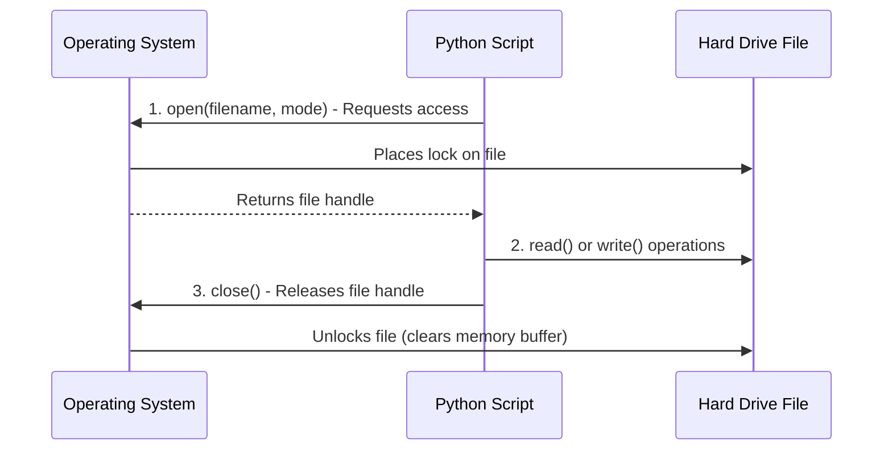

## Why This Matters

Data does not live inside your Python script. In the real world, data lives in files stored on disks, servers, or cloud storage buckets. Whether you are building an automated pipeline that imports daily CSV transactions, fetching JSON config files from an API server, or auditing system log files, you must know how to open, read, parse, write, and close files.

If you don't know file handling, you can't build data pipelines. You will be stuck manually copying and pasting data. Understanding how Python interfaces with your operating system's filesystem allows you to automate ingest workflows and export clean reports for your stakeholders.

---

## The Metaphor: Checking Out a Library Book

Think of file handling as checking out a physical book from a library:



1.  **Requesting the Book (Opening a File):** You ask the librarian for a specific book (`open()`). You must tell them what you plan to do with it: read it only (`"r"`), write notes in it (`"w"`), or append a page to the back (`"a"`).
2.  **Using the Book (Reading or Writing):** While the book is checked out, you can scan the pages (`read()`), go line-by-line (`readline()`), or scribble notes into it (`write()`).
3.  **Returning the Book (Closing the File):** When you are done, you *must* return the book (`close()`). If you keep the book, the library locks you out. Other scripts cannot access it, and any notes you wrote might stay in your head (buffered memory) instead of actually being written on the paper (saved to disk).

---

## Step-by-Step Concept Breakdown

### 1. The Core Lifecycle of a File

In Python, the traditional way to handle files involves three steps: opening, processing, and closing.

```python
# The Traditional Way (Not Recommended)
f = open("sales_report.txt", "r")
content = f.read()
print(content)
f.close() # CRITICAL! Releases the file back to the OS
```

#### Why Closing Files is Critical:
If you do not call `.close()`, several bad things can happen:
*   **File Lockouts:** Your operating system may keep a lock on the file, preventing other programs or users from deleting or renaming it.
*   **Memory Leaks:** Each open file consumes a file descriptor in system memory. If you run a loop that opens 10,000 files without closing them, your program will crash with an `OSError: Too many open files`.
*   **Data Corruption:** When you write to a file, Python buffers the data in RAM and writes it to disk in batches to improve speed. If your program exits unexpectedly before `.close()` is run, that buffered data is lost forever.

---

### 2. The Context Manager: `with open()`

To prevent developers from forgetting to close files, Python introduced **Context Managers** using the `with` statement. This is the industry-standard way to handle files.

```python
with open("sales_report.txt", "r") as f:
    content = f.read()
    print(content)
# The file is automatically closed here! Even if the code crashes inside the block.
```

Under the hood, the file object implements two special methods: `__enter__` (runs when starting the `with` block) and `__exit__` (runs when exiting the block). The `__exit__` method guarantees that the file is closed, acting like a safety net.

---

### 3. Understanding File Access Modes

When opening a file, you must specify the file access mode. Choosing the wrong mode can result in deleted data or program crashes.

| Mode | Name | Description | If File Exists | If File Missing |
| :--- | :--- | :--- | :--- | :--- |
| **`'r'`** | Read | Opens file for reading only. | Opens successfully. | Raises `FileNotFoundError` |
| **`'w'`** | Write | Opens file for writing. | **Overwrites entire file (erases it)**. | Creates new file. |
| **`'a'`** | Append | Opens file for writing. | Appends new text to the end. | Creates new file. |
| **`'x'`** | Exclusive | Opens file for write-only. | Raises `FileExistsError` (prevents overwrite). | Creates new file. |
| **`'b'`** | Binary | Read/write raw bytes (for images, audio, PDFs). | Combined with other modes (e.g., `'rb'`, `'wb'`). | Depends on companion mode. |

```python
# Exclusive Creation Example: prevents accidental overwrites of existing reports
try:
    with open("annual_report_2025.txt", "x") as f:
        f.write("Highly sensitive sales summary...")
except FileExistsError:
    print("Warning: File already exists! Access denied to prevent overwriting.")
```

```text
# Output:
Warning: File already exists! Access denied to prevent overwriting.
```

---

### 4. Reading Methods: `.read()` vs `.readline()` vs `.readlines()`

*   `.read(size=-1)`: Reads the entire file content into a single string. If the file is 20 Gigabytes, it attempts to load all 20GB into RAM, which will crash your computer.
*   `.readlines()`: Reads all lines of the file and stores them as a list of strings. Every string ends with a newline character (`\n`).
*   **Iterating Line-by-Line (Best Practice):** You can loop directly over the file object. Python reads one line at a time from disk into memory, processes it, and discards it. This allows you to process files of any size.

```python
# Memory-Efficient Line-by-Line Reading
with open("large_system_logs.txt", "r") as log_file:
    for line in log_file:
        if "ERROR" in line:
            print(line.strip()) # Process one line at a time
```

---

## Deep Dive: The Standard `csv` Module

Comma-Separated Values (CSV) are the flat-file currency of data science. While libraries like Pandas are great for big datasets, Python’s built-in `csv` module is faster for simple pipelines and requires no external installations.

### 1. `csv.reader` vs `csv.DictReader`

*   `csv.reader` returns each row as a raw list of strings. You must access fields using numerical indexes (e.g., `row[0]`), which makes your code brittle if columns shift.
*   `csv.DictReader` parses each row into a Python dictionary, mapping the headers to the values. This makes your code self-documenting and easier to maintain.

Let's compare them:

#### Setup: Creating a sample file
```python
import csv

# Create our demo file
employees_csv_data = [
    ["name", "department", "salary"],
    ["Alice Johnson", "Engineering", "95000"],
    ["Bob Smith", "Marketing", "72000"],
    ["Carol Davis", "Engineering", "98000"]
]

with open("employees.csv", "w", newline="") as f:
    writer = csv.writer(f)
    writer.writerows(employees_csv_data)
```

#### Approach A: Using `csv.reader`
```python
with open("employees.csv", "r") as f:
    reader = csv.reader(f)
    header = next(reader) # Grab first row to skip column headers
    print("Headers:", header)
    for row in reader:
         print(f"Employee: {row[0]}, Salary: ${row[2]}") # Relies on index!
```

```text
# Output:
Headers: ['name', 'department', 'salary']
Employee: Alice Johnson, Salary: $95000
Employee: Bob Smith, Salary: $72000
Employee: Carol Davis, Salary: $98000
```

#### Approach B: Using `csv.DictReader` (Highly Recommended)
```python
with open("employees.csv", "r") as f:
    reader = csv.DictReader(f)
    for row in reader:
        # Access elements by column name
        print(f"Employee: {row['name']} | Dept: {row['department']} | Salary: ${int(row['salary']):,}")
```

```text
# Output:
Employee: Alice Johnson | Dept: Engineering | Salary: $95,000
Employee: Bob Smith | Dept: Marketing | Salary: $72,000
Employee: Carol Davis | Dept: Engineering | Salary: $98,000
```

---

### 2. Writing CSV Files: `csv.writer` and `csv.DictWriter`

When writing data, you can output it using lists (`csv.writer`) or dictionaries (`csv.DictWriter`).

```python
import csv

sales_records = [
    {"item": "Laptop", "price": 1200, "qty": 5},
    {"item": "Monitor", "price": 350, "qty": 12},
    {"item": "Keyboard", "price": 80, "qty": 45}
]

# Write dictionary records
with open("sales_summary.csv", "w", newline="") as f:
    # 1. Define column headers
    headers = ["item", "price", "qty"]
    writer = csv.DictWriter(f, fieldnames=headers)
    
    # 2. Write headers to file
    writer.writeheader()
    
    # 3. Write rows
    writer.writerows(sales_records)
```

> [!IMPORTANT]
> Always open files with `newline=""` when working with the `csv` module. If you omit this, Python on Windows will write an extra carriage return (`\r`) at the end of each line, resulting in blank lines between every data row in your CSV.

---

### 3. Handling Custom Delimiters and Quoting

What happens if your data contains commas inside the text (e.g. `"New York, NY"`), or uses tabs (`\t`) instead of commas?

```python
import csv

# Writing tab-separated data (TSV) with quotes around everything
data = [
    {"name": "Alice Johnson", "city": "New York, NY"},
    {"name": "Bob Smith", "city": "Austin, TX"}
]

with open("locations.tsv", "w", newline="") as f:
    writer = csv.DictWriter(
        f, 
        fieldnames=["name", "city"], 
        delimiter="\t", # Use tab instead of comma
        quoting=csv.QUOTE_ALL # Put quotes around every single field
    )
    writer.writeheader()
    writer.writerows(data)

# Let's see the output file content
with open("locations.tsv", "r") as f:
    print(f.read())
```

```text
# Output:
"name"	"city"
"Alice Johnson"	"New York, NY"
"Bob Smith"	"Austin, TX"
```

---

## Deep Dive: Working with JSON Files

JavaScript Object Notation (JSON) is the structural language of APIs and configuration files. It maps perfectly to Python dictionaries and lists.

*   `json.load(f)`: Reads JSON data from a **file object** and converts it into a Python dict/list.
*   `json.loads(s)`: Reads JSON data from a **string variable** (load string).
*   `json.dump(obj, f)`: Writes Python dict/list objects to a **file** as JSON.
*   `json.dumps(obj)`: Converts Python objects into a **string variable** (dump string).

```python
import json

# Setup: Python dict with nested types
configuration = {
    "project_name": "ETL Ingest Pipeline",
    "batch_size": 250,
    "target_regions": ["Northeast", "West Coast", "Midwest"],
    "credentials": {
        "user": "analytics_bot",
        "api_key": "sec_89231"
    }
}

# 1. Write Python Dictionary to file as formatted JSON
with open("config.json", "w") as f:
    # indent=4 formats the file with human-readable indentation
    json.dump(configuration, f, indent=4)

# 2. Read JSON back into Python
with open("config.json", "r") as f:
    loaded_config = json.load(f)

print(f"Project: {loaded_config['project_name']}")
print(f"First Region: {loaded_config['target_regions'][0]}")
```

```text
# Output:
Project: ETL Ingest Pipeline
First Region: Northeast
```

---

## Modern Path Handling with `pathlib.Path`

In the past, developers manipulated file paths using the `os.path` module (e.g., `os.path.join("data", "raw_files", "daily.csv")`). This was error-prone because Windows uses backslashes (`\`) while macOS and Linux use forward slashes (`/`).

Python 3.4 introduced `pathlib`, which treats paths as objects rather than plain strings. This solves path compatibility issues automatically.

```python
from pathlib import Path

# 1. Get current working directory
cwd = Path.cwd()
print(f"Current Directory: {cwd}")

# 2. Build paths using the slash operator '/'
# Path handles the direction of the slashes based on the running OS
target_path = Path("data") / "raw_files" / "sales_report.csv"
print(f"Target Path: {target_path}")

# 3. Path inspection methods
print(f"File Name: {target_path.name}")
print(f"File Stem (No Ext): {target_path.stem}")
print(f"File Extension: {target_path.suffix}")
print(f"Parent Directory: {target_path.parent}")

# 4. Safe Directory Creation
output_dir = Path("output") / "reports"
# parents=True creates intermediate folders (output/ and reports/)
# exist_ok=True prevents raising an error if they already exist
output_dir.mkdir(parents=True, exist_ok=True)
print(f"Directory exists: {output_dir.exists()}")
```

```text
# Output:
Current Directory: D:\Data Startup
Target Path: data\raw_files\sales_report.csv
File Name: sales_report.csv
File Stem (No Ext): sales_report
File Extension: .csv
Parent Directory: data\raw_files
Directory exists: True
```

---

## Code / Practical Walkthroughs

### Walkthrough 1: System Log Aggregation Pipeline

Let's build a script that reads a pipe-separated server log file, filters entries to keep only `"ERROR"` status lines, extracts details, and writes the summary to a JSON file.

```python
import json
from pathlib import Path

# Let's generate a mock server log file
mock_log_data = """2025-01-24 08:30:12 | INFO | User login successful for admin
2025-01-24 08:31:05 | WARNING | Database connection slow
2025-01-24 08:32:00 | ERROR | Connection timeout on DB_CLUSTER_1
2025-01-24 08:35:45 | INFO | Report generation scheduled
2025-01-24 08:40:19 | ERROR | Permission denied on system write
"""

log_file_path = Path("system_activity.log")
log_file_path.write_text(mock_log_data) # Convenient pathlib way to write strings directly

# The ETL pipeline
error_logs = []
error_count_by_type = {}

# Process line by line to protect memory
with open(log_file_path, "r") as log_file:
    for line in log_file:
        # Skip empty lines
        if not line.strip():
            continue
            
        # Parse fields split by pipe
        parts = [p.strip() for p in line.split("|")]
        timestamp, status, message = parts[0], parts[1], parts[2]
        
        # Check condition
        if status == "ERROR":
            error_logs.append({
                "timestamp": timestamp,
                "message": message
            })
            
            # Simple category aggregation
            first_word = message.split()[0] # e.g. "Connection" or "Permission"
            error_count_by_type[first_word] = error_count_by_type.get(first_word, 0) + 1

# Save summary metrics to JSON
output_report_path = Path("error_summary.json")
report_data = {
    "total_errors": len(error_logs),
    "aggregations": error_count_by_type,
    "details": error_logs
}

with open(output_report_path, "w") as out_file:
    json.dump(report_data, out_file, indent=4)

# Print verification output
print(f"Execution complete. Output written to {output_report_path}")
print(output_report_path.read_text())
```

```text
# Output:
Execution complete. Output written to error_summary.json
{
    "total_errors": 2,
    "aggregations": {
        "Connection": 1,
        "Permission": 1
    },
    "details": [
        {
            "timestamp": "2025-01-24 08:32:00",
            "message": "Connection timeout on DB_CLUSTER_1"
        },
        {
            "timestamp": "2025-01-24 08:40:19",
            "message": "Permission denied on system write"
        }
    ]
}
```

---

## Edge Cases & Common Mistakes

### Gotcha 1: The Windows Path Escape Trap
Windows folder directories start with backslashes. If you store these paths in plain Python strings, Python may parse the backslashes as escape sequences (like `\n` for newline or `\t` for tab).

```python
# BUGGY CODE
file_path = "C:\new_project\totals.txt"
# Python parses '\n' in '\new_project' as a newline character!
# This throws a FileNotFoundError!

# FIX 1: Use Raw Strings by adding 'r' prefix
file_path = r"C:\new_project\totals.txt"

# FIX 2: Use pathlib (best practice)
file_path = Path("C:/new_project/totals.txt") # Standardizes path regardless of OS
```

### Gotcha 2: CSV Newlines on Windows
If you write files using `csv.writer` or `csv.DictWriter` and do not include the parameter `newline=""` inside the `open()` statement, Python will append `\r\r\n` (carriage return twice) on Windows machines. This results in blank rows between every line of data.

```python
# BUGGY CODE
with open("report.csv", "w") as f:
    writer = csv.writer(f) # Output will have blank lines!

# CORRECT CODE
with open("report.csv", "w", newline="") as f:
    writer = csv.writer(f) # Clean, uniform lines
```

### Gotcha 3: Overwriting ('w') vs Appending ('a')
Opening a file in write mode (`"w"`) wipes out the existing file content instantly before writing new lines. If you want to log new data without losing old records, always use append mode (`"a"`).

```python
# Create file
with open("audit.log", "w") as f:
    f.write("Line 1\n")

# Overwrites completely
with open("audit.log", "w") as f:
    f.write("Line 2\n")
    
# Result is just "Line 2\n"! Use 'a' to get both lines.
```

---

## Practice Exercises & Mini-Projects

### Exercise 1: Build a CSV-to-JSON Converter
Write a function `convert_csv_to_json(csv_path, json_path)` that reads any standard CSV file using `csv.DictReader` and writes the rows out as a structured JSON list of dictionary objects.

### Exercise 2: Log Rotation System
Imagine you are building a tool that monitors network security logins. 
1.  Read a file named `raw_logins.txt`.
2.  Iterate over each row. If the login is marked as `"FAILED"`, write it to a file named `security_alerts.csv` using the append mode.
3.  If the file `security_alerts.csv` does not exist yet, your code must write headers: `timestamp, username, status`. If it already exists, write only the transaction row without repeating the headers.

---

## Section Recaps

*   **File Lifecycle:** Every opened file must be closed. Keep track of file handles to avoid memory leaks.
*   **Context Managers:** Always use `with open(...)` to automate the opening and closing of files safely.
*   **File Access Modes:** Read (`"r"`), Write/Overwrite (`"w"`), Append (`"a"`), and Exclusive write (`"x"`). Add `"b"` for binary files.
*   **CSV Parsing:** Use `csv.DictReader` to parse columns as dictionaries to keep code independent of index changes. Always add `newline=""` to write files.
*   **JSON Serialization:** Use `json.load()` and `json.dump()` to transfer Python data structures to and from JSON files.
*   **Path Manipulation:** Use `pathlib.Path` to build cross-platform paths using the `/` slash operator.

---

## Common Interview Questions

### Q1: What is the difference between `json.load()` and `json.loads()`? What about `json.dump()` and `json.dumps()`?
**Answer:**
*   **With 's' (String):** `loads` (load string) and `dumps` (dump string) work with Python **string variables** stored in memory. They do not interact with your hard drive.
*   **No 's' (File):** `load` and `dump` work directly with **file objects** opened on your disk.

```python
# Worked on String variable
json_string = '{"user": "alice"}'
data = json.loads(json_string)

# Worked on File object
with open("user.json", "r") as f:
    data = json.load(f)
```

### Q2: Why is it important to specify `newline=""` when opening a CSV file in Python?
**Answer:**
If `newline=""` is not specified, Python's write engine does not override standard line ending characters on Windows. The standard `csv` writer translates its own line endings and outputs carriage returns (`\r\n`). If Python's default text wrapper also processes newlines, it converts the output to `\r\r\n`. This creates an empty line between every row in the file. Specifying `newline=""` tells Python to let the `csv` module handle newlines.

### Q3: How do you read a 10GB file on a machine that has only 4GB of RAM?
**Answer:**
You must never load the entire file into memory using `.read()` or `.readlines()`. Instead, stream the file line-by-line by looping directly over the file generator:
```python
with open("massive_file.txt", "r") as f:
    for line in f:
        # Process the single line of text
        pass
```
Python reads a buffer block from the hard drive, parses it into lines, yields one line at a time, and garbage-collects old lines as you iterate. This uses almost no memory.

### Q4: Explain the difference between file modes `'w'`, `'a'`, and `'x'`.
**Answer:**
*   `'w'` (write) opens a file for writing. If the file exists, it empties it (truncates it to 0 bytes) and overwrites the contents. If it doesn't exist, it creates a new file.
*   `'a'` (append) opens a file for writing. If the file exists, it places the pointer at the end of the file so new writes are added. It does not overwrite old data.
*   `'x'` (exclusive creation) opens a file for writing but raises a `FileExistsError` if the file already exists. This prevents files from being overwritten.

### Q5: Why is `pathlib` preferred over the older `os.path` module?
**Answer:**
1.  **Object-Oriented Design:** `pathlib` represents paths as objects, allowing you to run methods directly on them (e.g. `path.exists()`), whereas `os.path` treats paths as raw strings and requires passing them to function calls.
2.  **OS Portability:** `pathlib` handles path separators (`\` on Windows, `/` on Linux/Mac) automatically.
3.  **Readability:** It supports the `/` operator to chain folders together (e.g., `folder / subfolder / file.txt`), which is cleaner than nested `os.path.join` statements.
