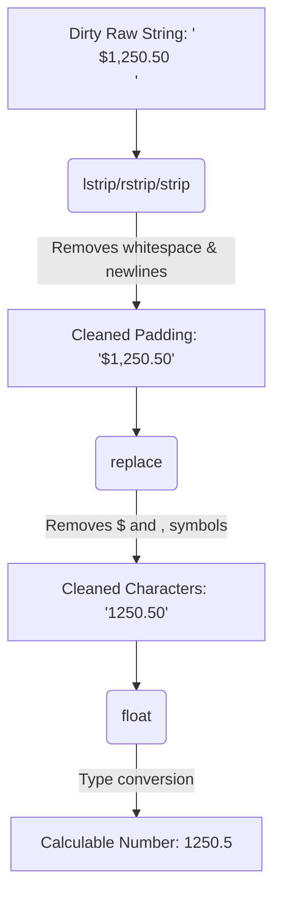

## Why This Matters

Dirty text data is the number one headache in data analytics and data engineering. When you extract data from real-world sources—whether it's web-scraped HTML, customer survey responses, CSV exports from outdated databases, or raw server logs—it is almost never clean. 

You will routinely encounter issues like:
*   **Extra whitespace:** Customer names written as `"  Alice Johnson   \n"` or emails with leading tab characters (`"\talice@company.com"`).
*   **Inconsistent case:** The same country represented as `"United States"`, `"united states"`, `"UNITED STATES"`, or `"United states"`.
*   **Messy numbers:** Financial revenue fields stored as text strings containing currency symbols and commas (e.g., `"$1,250,000.00"`).
*   **Combined fields:** Full names that need to be separated into `"First Name"` and `"Last Name"`, or email addresses from which you must extract domain names.

Data analysts spend **60% to 80% of their time cleaning and preparing data** before they can run a single machine learning model or generate a dashboard. In Python, string methods are your primary tools for this task. Knowing how to efficiently clean strings is what separates a novice from an industry-ready data professional.

---

## The Metaphor: The String Laundry Machine

Think of raw, dirty data as a pile of unwashed laundry. It comes in stained with extra spaces (mud), written in mismatched cases (inside-out shirts), and clumped together (tangled socks). 



To clean this:
1.  **Stripping (`.strip()`)** is like shaking off the loose dirt and lint. It trims away the unnecessary packaging at the edges.
2.  **Case Conversions (`.lower()`, `.upper()`, `.title()`)** are like sorting your clothes by color and standardizing them so everything looks uniform.
3.  **Replacing (`.replace()`)** is like spot-treating specific stains—finding a specific unwanted pattern (like a `$` sign) and replacing it with what you want (or removing it entirely).
4.  **Splitting and Joining (`.split()`, `.join()`)** is like untangling a pair of socks so you can organize them individually, or folding them together into a neat stack.

Let's learn how to operate this machine step-by-step.

---

## Step-by-Step Concept Breakdown

### 1. The Immutability Rule (The Absolute Most Important Concept)

Before writing a single string method, you must understand a fundamental property of Python strings: **Strings are immutable**. 

Once a string is created in Python's memory, it cannot be changed in place. Every single string method you run does *not* modify the original string; instead, it creates and returns a brand-new string in memory.

```python
# The Immutability Gotcha
name = "   Alice   "
name.strip() # This evaluates to "Alice" but does NOT modify name!
print(f"Original: '{name}'") # Still has spaces!

# Correct Usage
name = name.strip() # You must reassign the result to save it
print(f"Reassigned: '{name}'")
```

```text
# Output:
Original: '   Alice   '
Reassigned: 'Alice'
```

If you forget to reassign the result of a string method, your cleaning step will silently fail to apply. Always remember: **No reassignment, no change!**

---

### 2. Whitespace Removal: `.strip()`, `.lstrip()`, and `.rstrip()`

These three methods are used to remove characters from the beginning and end of strings. By default, they remove whitespace characters, which include spaces, tabs (`\t`), newlines (`\n`), and carriage returns (`\r`).

*   `strip()`: Removes specified characters from **both** the left (beginning) and right (end) of the string.
*   `lstrip()`: Removes specified characters from the **left** side only.
*   `rstrip()`: Removes specified characters from the **right** side only.

#### Default Usage (Removing Whitespace)
```python
dirty_input = " \t  Bob Smith \n"
print(f"Raw:      {repr(dirty_input)}")
print(f"lstrip(): {repr(dirty_input.lstrip())}")
print(f"rstrip(): {repr(dirty_input.rstrip())}")
print(f"strip():  {repr(dirty_input.strip())}")
```

```text
# Output:
Raw:      ' \t  Bob Smith \n'
lstrip(): 'Bob Smith \n'
rstrip(): ' \t  Bob Smith'
strip():  'Bob Smith'
```

#### Strip Specific Characters
You can pass a string of characters to these methods. Python will remove **any** character that appears in that set from the ends of the target string, repeating until it hits a character that is *not* in the set.

```python
# Strip currency symbols and quotes
raw_price = "\"$149.99\""
print(raw_price.strip('"$')) # Removes both quotes and dollar signs

# Beware: It treats the argument as a SET of characters, not a sequence!
url = "www.datalogify.com"
print(url.strip("w.com")) # Removes 'w', '.', 'c', 'o', 'm' from ends
```

```text
# Output:
149.99
datalogify
```

> [!WARNING]
> Because `.strip()` treats its argument as a set of characters, `"website.com".strip("w.com")` will output `"ebsite"` rather than `"website"`. It strips the `"w"` from the left and `"o"`, `"m"`, `"."`, `"c"` from the right! To remove precise prefixes or suffixes, use `.removeprefix()` and `.removesuffix()` instead (introduced in Python 3.9).

---

### 3. Case Conversion: Standardizing Text

Case mismatches make matching strings impossible (e.g., `"New York"` is not equal to `"new york"` in Python). Standardizing cases is standard practice for indexing and deduplication.

*   `.lower()`: Converts all characters to lowercase.
*   `.upper()`: Converts all characters to uppercase.
*   `.title()`: Capitalizes the first letter of every word and lowercases the rest.
*   `.capitalize()`: Capitalizes the first letter of the *entire* string and lowercases the rest.

```python
raw_text = "tHe aNALyTiCs pIPeLiNe"

print(f"Original:   {raw_text}")
print(f"lower():    {raw_text.lower()}")
print(f"upper():    {raw_text.upper()}")
print(f"title():    {raw_text.title()}")
print(f"capitalize(): {raw_text.capitalize()}")
```

```text
# Output:
Original:   tHe aNALyTiCs pIPeLiNe
lower():    the analytics pipeline
upper():    THE ANALYTICS PIPELINE
title():    The Analytics Pipeline
capitalize(): The analytics pipeline
```

> [!TIP]
> When performing case-insensitive lookups, always convert both sides of the comparison to lowercase using `.lower()`. For example: `if user_input.strip().lower() == target_value.lower():`.

---

### 4. Splitting & Joining: Re-structuring Columns

#### `.split(sep=None, maxsplit=-1)`
Splits a string into a list of substrings based on a delimiter (`sep`). 
*   If `sep` is not specified, it splits on *any* run of whitespace characters (multiple spaces, tabs, and newlines are treated as a single delimiter, and leading/trailing whitespace is ignored).
*   If `sep` is specified (e.g., `","`), Python splits on *every* instance of that exact character.

```python
# Case A: Default splitting (collapses whitespace)
words_default = "Python   is   fun".split()
print("Default split:", words_default)

# Case B: Delimiter splitting (does not collapse whitespace)
words_comma = "Python,   is,   fun".split(",")
print("Comma split:  ", words_comma)

# Parsing an email address to get the domain
email = "developer@datalogify.com"
parts = email.split("@")
username, domain = parts[0], parts[1]
print(f"User: {username} | Domain: {domain}")
```

```text
# Output:
Default split: ['Python', 'is', 'fun']
Comma split:   ['Python', '   is', '   fun']
User: developer | Domain: datalogify.com
```

#### `.join(iterable)`
The inverse of `.split()`. It glues a list (or any iterable) of strings back together using the string it is called on as the connector.

```python
words = ["Data", "Science", "Tutorial"]

# Glue with spaces
print(" ".join(words))

# Glue with hyphens to make a slug for a URL
print("-".join(words).lower())

# Glue with commas to create a CSV line
print(",".join(words))
```

```text
# Output:
Data Science Tutorial
data-science-tutorial
Data,Science,Tutorial
```

> [!WARNING]
> `.join()` only accepts iterables containing **strings**. If you attempt to run `",".join([1, 2, 3])`, Python will raise a `TypeError`. You must convert numbers to strings first: `",".join(str(x) for x in [1, 2, 3])`.

---

### 5. Replacing Characters: `.replace(old, new, count=-1)`

Searches for all occurrences of the substring `old` and replaces them with `new`. The optional `count` argument limits the number of replacements made from left to right.

```python
# Cleaning dirty currency fields
price_str = "$1,450,230.00"
clean_price = price_str.replace("$", "").replace(",", "")
print(f"Numeric float: {float(clean_price)}")

# Limit replacements
text = "banana"
print(text.replace("a", "o", 2)) # Replace only the first 2 'a's
```

```text
# Output:
Numeric float: 1450230.0
bonona
```

---

### 6. Pattern Matching: `.startswith()` and `.endswith()`

These methods return `True` or `False` based on whether a string starts or ends with a specific substring. They are highly efficient alternatives to regular expressions when checking prefixes or suffixes.

```python
filename = "daily_sales_export_2025_01.csv"

# Basic checks
print(filename.startswith("daily_"))
print(filename.endswith(".csv"))

# Checking multiple possibilities using a tuple (lists are not allowed!)
valid_extensions = (".csv", ".tsv", ".xlsx")
print(filename.endswith(valid_extensions))
```

```text
# Output:
True
True
True
```

---

### 7. Character Classification Methods

These methods inspect the characters inside a string and return `True` only if *all* characters in the string match the criteria. If the string is empty, they return `False`.

*   `.isdigit()`: Returns `True` if all characters are digits (0-9).
*   `.isalpha()`: Returns `True` if all characters are alphabetic letters.
*   `.isspace()`: Returns `True` if the string contains only whitespace characters.
*   `.isalnum()`: Returns `True` if all characters are alphanumeric (letters or numbers).

```python
values = ["42", "42.5", "Python3", "Hello", "   "]

print(f"{'Value':<10} | {'isdigit':<8} | {'isalpha':<8} | {'isalnum':<8}")
print("-" * 45)
for val in values:
    print(f"{repr(val):<10} | {str(val.isdigit()):<8} | {str(val.isalpha()):<8} | {str(val.isalnum()):<8}")
```

```text
# Output:
Value      | isdigit  | isalpha  | isalnum 
---------------------------------------------
'42'       | True     | False    | True    
'42.5'     | False    | False    | False   
'Python3'  | False    | False    | True    
'Hello'    | False    | True     | True    
'   '      | False    | False    | False   
```

> [!NOTE]
> `.isdigit()` returns `False` for decimals (like `"42.5"`) because the decimal point `.` is neither a digit nor an alphanumeric character. To validate floating-point strings, check them using error handling or regular expressions.

---

### 8. F-String Formatting: Interpolation, Padding, and Alignment

F-strings (formatted string literals) let you embed expressions inside string literals using curly braces `{}`. You can append format specifiers after a colon `:` to format floats, percentages, dates, and control spacing.

#### Format Specifiers
*   `:.2f`: Formats a float to exactly 2 decimal places.
*   `:,`: Adds thousands separators (commas).
*   `:.1%`: Multiplies the value by 100 and formats as a percentage with 1 decimal place.
*   `:+`: Forces the output to display a sign (+ or -) for numbers.

```python
revenue = 1250800.756
margin = 0.2345
growth = -0.054

print(f"Revenue: ${revenue:,.2f}")
print(f"Margin:  {margin:.2%}")
print(f"Growth:  {growth:+.1%}")
```

```text
# Output:
Revenue: $1,250,800.76
Margin:  23.45%
Growth:  -5.4%
```

#### Alignment and Padding
You can align strings within a fixed width:
*   `<`: Left-aligns the text (default for strings).
*   `>`: Right-aligns the text (default for numbers).
*   `^`: Center-aligns the text.
*   You can place a custom character before the alignment symbol to use as filler instead of spaces.

```python
# Formatted Table Headers
header = f"{'Product':<15} | {'Price':>10} | {'Quantity':^8}"
divider = "-" * len(header)
row_1 = f"{'Widget A':<15} | {99.99:>10.2f} | {150:^8}"
row_2 = f"{'Supercomputer':<15} | {45000.00:>10.2f} | {3:^8}"

print(header)
print(divider)
print(row_1)
print(row_2)

# Custom Padding Characters (useful for audit logs or check printing)
print(f"{'Check Total':*<20}${1450.50:>10.2f}")
```

```text
# Output:
Product         |      Price | Quantity
---------------------------------------
Widget A        |      99.99 |   150   
Supercomputer   |   45000.00 |    3    
Check Total*********$   1450.50
```

---

## Code / Practical Walkthroughs

### Walkthrough 1: Manual CSV Record Parsing & Sanitization Pipeline

Let's write a complete parser that processes messy data fields from a database export, performs data cleanup operations, and structure validations.

```python
# Raw lines from a comma-delimited export file
raw_data_lines = [
    "user_id,join_date,full_name,monthly_spend,membership_status",
    " 101 , 2024-01-15 ,   alice johnson   , $1,250.00 , ACTIVE ",
    " 102 , 2024-02-01 , bob SMITH, 850 , Inactive ",
    " 103 , 2024-02-12 ,   carol davis   , $45.50 , pending ",
    " 104 , 2024-03-05 , DAVE    WILSON , $15,000.75 , ACTIVE "
]

# Extract the header line, split it, and strip columns
headers = [h.strip() for h in raw_data_lines[0].split(",")]

cleaned_records = []

for line in raw_data_lines[1:]:
    # Split the fields by comma
    fields = line.split(",")
    
    # Clean each field using list comprehension
    cleaned_fields = [f.strip() for f in fields]
    
    # Map the cleaned fields to headers
    record = dict(zip(headers, cleaned_fields))
    
    # 1. Standardize user_id as an integer
    record["user_id"] = int(record["user_id"])
    
    # 2. Standardize name: title-case and reduce internal multi-spaces to a single space
    raw_name = record["full_name"]
    # Split by any whitespace and rejoin with a single space
    record["full_name"] = " ".join(raw_name.split()).title()
    
    # 3. Clean financial field: remove $ and commas, convert to float
    clean_spend = record["monthly_spend"].replace("$", "").replace(",", "")
    record["monthly_spend"] = float(clean_spend)
    
    # 4. Standardize membership status to uppercase
    record["membership_status"] = record["membership_status"].upper()
    
    cleaned_records.append(record)

# Display the sanitized output in a formatted table
print(f"{'ID':<5} | {'Date':<10} | {'Full Name':<18} | {'Spend':>12} | {'Status':<10}")
print("=" * 66)
for row in cleaned_records:
    print(f"{row['user_id']:<5} | "
          f"{row['join_date']:<10} | "
          f"{row['full_name']:<18} | "
          f"${row['monthly_spend']:>11,.2f} | "
          f"{row['membership_status']:<10}")
```

```text
# Output:
ID    | Date       | Full Name          |        Spend | Status    
==================================================================
101   | 2024-01-15 | Alice Johnson      |    $1,250.00 | ACTIVE    
102   | 2024-02-01 | Bob Smith          |      $850.00 | INACTIVE  
103   | 2024-02-12 | Carol Davis        |       $45.50 | PENDING   
104   | 2024-03-05 | Dave Wilson        |   $15,000.75 | ACTIVE    
```

---

### Walkthrough 2: Email Extractor & Domain Validator

Extract usernames, domains, and check safety lists from raw emails.

```python
raw_emails = [
    "  admin@company.com  ",
    "SPAM_user@badactor.io\n",
    "info@datalogify.com\t",
    "invalid-email-address",  # Edge Case: No '@' symbol
    "hello@company.co.uk",
]

safe_domains = ["company.com", "datalogify.com", "company.co.uk"]

print(f"{'Raw Email':<25} | {'Username':<12} | {'Domain':<18} | {'Status':<10}")
print("-" * 75)

for raw in raw_emails:
    # 1. Strip whitespace
    clean_email = raw.strip()
    
    # 2. Check if the format contains a single '@' character
    if "@" not in clean_email or clean_email.count("@") != 1:
        print(f"{repr(raw):<25} | {'N/A':<12} | {'N/A':<18} | {'INVALID':<10}")
        continue
        
    # 3. Split into username and domain
    username, domain = clean_email.split("@")
    
    # 4. Standardize domain case to lowercase
    domain = domain.lower()
    
    # 5. Check domain list
    status = "TRUSTED" if domain in safe_domains else "UNTRUSTED"
    
    print(f"{clean_email:<25} | {username:<12} | {domain:<18} | {status:<10}")
```

```text
# Output:
Raw Email                 | Username     | Domain             | Status    
---------------------------------------------------------------------------
admin@company.com         | admin        | company.com        | TRUSTED   
SPAM_user@badactor.io     | SPAM_user    | badactor.io        | UNTRUSTED 
info@datalogify.com       | info         | datalogify.com     | TRUSTED   
'invalid-email-address'   | N/A          | N/A                | INVALID   
hello@company.co.uk       | hello        | company.co.uk      | TRUSTED   
```

---

## Edge Cases & Common Mistakes

### Gotcha 1: The Immutability Trap
We discussed this earlier, but it is the number one bug beginners write.
```python
# BUGGY CODE
phone = " (555) 123-4567 "
phone.strip()
phone.replace("(", "").replace(")", "")
print(phone) # Still prints " (555) 123-4567 "

# CORRECT CODE
phone = " (555) 123-4567 "
phone = phone.strip().replace("(", "").replace(")", "")
print(phone) # Prints "555 123-4567"
```

### Gotcha 2: The Character Set Strip Trap
Passing strings to `.strip()` removes *any matching character in the set*, not the exact phrase.
```python
text = "error_log_error"

# If you want to remove the phrase "error" from the edges:
print(text.strip("error")) 

# Wait, why did it output '_log_'? 
# Because it stripped 'e', 'r', 'o', and 'r' from the left, and 'r', 'o', 'r', 'r', 'e' from the right.
# What if we have this:
text_2 = "error_logger"
print(text_2.strip("error")) # Returns '_logg' because 'e' and 'r' in 'logger' were in the set!
```

```text
# Output:
_log_
_logg
```

If you want to strip an exact prefix or suffix string, use Python 3.9+'s `.removeprefix()` and `.removesuffix()`:
```python
text = "error_logger"
print(text.removeprefix("error"))
```

```text
# Output:
_logger
```

### Gotcha 3: Delimiter Splitting with Missing Values
If you split a string with multiple delimiters in a row, `.split(",")` returns empty strings for the missing parts.
```python
# A CSV row where some values are missing
row = "Apple,,0.99,,100"
parts = row.split(",")
print(parts)
```

```text
# Output:
['Apple', '', '0.99', '', '100']
```
When processing these parts, check for empty strings `""` before converting types.

---

## Practice Exercises & Mini-Projects

### Exercise 1: Build a Transaction Data Standardizer
You are given a list of raw transaction logs:
```python
raw_transactions = [
    "tx_id:TX9812,amount:1040.50,status:COMPLETED",
    "tx_id:TX9813,amount: 98.00 ,status: failed",
    "tx_id:TX9814,amount:12,400.00,status:pending"
]
```
Write a script that parses these transactions into a list of clean dictionaries. The output dictionary fields must be structured as:
*   `tx_id` (string, uppercase only)
*   `amount` (float, commas removed)
*   `status` (string, uppercase, no spaces)

### Exercise 2: URL Query String Parser
Web tracking URLs contain query parameters like:
`"https://datalogify.com/courses?category=python&level=beginner&status=active"`

Write a Python script that extracts the query portion (everything after the `?`), splits it by `&` and `=`, and returns a clean dictionary mapping parameter keys to values.
*Input:* `"https://datalogify.com/courses?category=python&level=beginner&status=active"`
*Output:* `{'category': 'python', 'level': 'beginner', 'status': 'active'}`

---

## Section Recaps

*   **Immutability:** Python strings cannot be changed in place. All string methods return a *new* string. You must reassign the result to save changes.
*   **Whitespace Cleaning:** `.strip()`, `.lstrip()`, and `.rstrip()` remove spaces, tabs, and newlines from the edges of strings.
*   **Case Standardization:** Case inconsistencies block comparisons. Use `.lower()` or `.upper()` to normalize text before comparing.
*   **Parsing Records:** Use `.split()` to parse rows into individual components, and `.join()` to combine lists of strings back into a single string.
*   **Safe Substring Testing:** Use `.startswith()` and `.endswith()` with strings or a tuple of strings for fast pattern validation.
*   **Formatting Values:** F-strings support complex alignments (`<`, `^`, `>`), number formatting (`:.2f`, `:,`), and padding characters to build clean data reports.

---

## Common Interview Questions

### Q1: What is the difference between `split()` and `split(" ")`?
**Answer:** 
*   `split()` with no arguments splits on any consecutive run of whitespace characters (spaces, tabs, newlines). It automatically groups consecutive whitespace together and trims leading/trailing spaces before splitting.
*   `split(" ")` splits on *every single space character* individually. It does not group spaces or trim. If there are consecutive spaces, it returns empty strings in the output list.

```python
text = "  A   B  "
print(text.split())    # Returns ['A', 'B']
print(text.split(" ")) # Returns ['', '', 'A', '', '', 'B', '', '']
```

### Q2: Why are strings immutable in Python? What are the benefits of this design?
**Answer:**
Immutability provides two major benefits:
1.  **Security and Performance:** Strings can be cached in memory (string interning) because they will never change. They are safe to share across threads without race conditions.
2.  **Hashability:** Because strings are immutable, their hash value never changes. This allows them to be used as keys in Python dictionaries and elements in sets. Mutable structures like lists cannot be used as dictionary keys because modifying them would break the hash map's internal index.

### Q3: Explain why `"admin_user".strip("user")` returns `"admin_"` but `"user_admin".strip("user")` returns `"_admin"`, while `"user_user".strip("user")` returns `"_"`?
**Answer:**
The `.strip(chars)` method takes a set of characters, not a sequence. The characters in `"user"` are `{'u', 's', 'e', 'r'}`.
*   For `"admin_user"`, checking starts from the right side. `'r'`, `'e'`, `'s'`, `'u'` are in the character set, so they are stripped. It stops when it hits `'_'`, which is not in the set. On the left side, `'a'` is not in the set, so stripping stops immediately. Result: `"admin_"`.
*   For `"user_admin"`, checking starts from the left side. `'u'`, `'s'`, `'e'`, `'r'` are in the set and get stripped, stopping at `'_'`. On the right side, `'n'` is not in the set, so it stops immediately. Result: `"_admin"`.
*   For `"user_user"`, it strips all character matches from both ends until it meets the middle `'_'`. Since `'_'` is not in the set, the middle separator remains. Result: `_`.

### Q4: What is the difference between `.isdigit()`, `.isnumeric()`, and `.isdecimal()`?
**Answer:**
These three methods handle unicode character sets with different levels of strictness:
*   `.isdecimal()` is the strictest. It returns `True` only if the character is a base-10 digit (0-9).
*   `.isdigit()` returns `True` for decimals, plus subscripts/superscripts (e.g., ²).
*   `.isnumeric()` is the broadest. It returns `True` for decimals, digits, subscripts, and unicode representation of fractions (e.g., ½) or Roman numerals.

None of them return `True` for floating-point decimals containing a point (e.g. `"12.34"`).

### Q5: How would you pad a string with zeros on the left so that it reaches a fixed length of 8 characters?
**Answer:**
There are three ways to do this in Python:
1.  Using the dedicated `.zfill(width)` method: `"452".zfill(8)` returns `"00000452"`.
2.  Using f-string formatting with right-alignment and zero padding: `f"{'452':0>8}"` or for numeric variables `f"{452:08}"`.
3.  Using the `.rjust(width, fillchar)` method: `"452".rjust(8, '0')`.
For data engineering pipelines (like padding ZIP codes or ID numbers), `.zfill()` is the most common approach.
