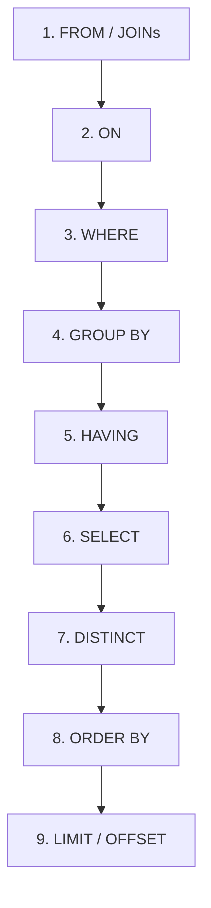

## Why This Matters

Imagine you are standing at the entrance of a busy corporate conference. As attendees walk in, they sign a guestbook. By midday, the guestbook has 1,500 entries. 

Your manager hands you two tasks:
1. **"Give me a list of all the unique companies represented here today."**
2. **"Create a clean summary table of our event sponsors."**

If you simply copy the company column directly from the guestbook, you will end up with a massive list of duplicates: "Google", "Google", "Microsoft", "Google", "Microsoft", "Netflix". To solve this, you need to filter out the noise and keep only the first instance of each company name. In SQL, this is the power of `DISTINCT`. It acts as an automatic deduplicator, collapsing identical rows into a single, clean representative.

For the second task, the guestbook column is labeled `co_snd_pyr_amt_cat` (a cryptic abbreviation for "Company Sponsor Payout Category"). If you hand a report with that heading to your manager, they will have to ask you what it means. By using an alias, you can temporarily rename that column to `sponsor_tier` in your report. It is like putting a clear, readable sticker label over a confusing file folder tab.

In database analytics, writing queries that return duplicate rows wastes computational resources, and leaving column names in their raw database format makes reports unreadable. Mastering `DISTINCT` and aliases (`AS`) is how you transform raw, messy database tables into clean, presentation-ready business insights.

---

## The Tables We're Working With

To practice these concepts, we will use two tables from a mock B2B SaaS startup: `transactions` and `customers`.

### 1. `transactions`
This table logs every transaction made on our platform, tracking the customer, the product bought, the marketing channel, the sales region, the transaction date, and the financial amount.

```sql
-- transactions table schema and sample data:
-- | txn_id | customer_id | product       | category  | amount | txn_date   | channel  | region |
-- |--------|-------------|---------------|-----------|--------|------------|----------|--------|
-- | 1      | 301         | CRM Pro       | Software  | 15000  | 2024-01-10 | online   | East   |
-- | 2      | 302         | Analytics Hub | Software  | 28000  | 2024-01-18 | partner  | West   |
-- | 3      | 301         | Data Vault    | Software  | 8500   | 2024-02-05 | online   | East   |
-- | 4      | 303         | Cloud Backup  | Service   | 3200   | 2024-02-14 | online   | North  |
-- | 5      | 304         | CRM Pro       | Software  | 15000  | 2024-03-01 | partner  | South  |
-- | 6      | 302         | SecureGate    | Security  | 12000  | 2024-03-20 | online   | West   |
-- | 7      | 305         | CRM Pro       | Software  | 15000  | 2024-04-08 | direct   | East   |
-- | 8      | 303         | Analytics Hub | Software  | 28000  | 2024-04-15 | online   | North  |
-- | 9      | 301         | CRM Pro       | Software  | 15000  | 2024-05-02 | online   | East   |
-- | 10     | 306         | Data Vault    | Software  | 8500   | 2024-05-18 | partner  | South  |
-- | 11     | 304         | Cloud Backup  | Service   | 3200   | 2024-06-01 | direct   | South  |
-- | 12     | 305         | Analytics Hub | Software  | 28000  | 2024-06-12 | online   | East   |
```

### 2. `customers`
This table stores structural metadata about each B2B customer account.

```sql
-- customers table schema and sample data:
-- | customer_id | name            | industry   | tier     |
-- |-------------|-----------------|------------|----------|
-- | 301         | Acme Corp       | Technology | gold     |
-- | 302         | GlobalTech Inc  | Technology | platinum |
-- | 303         | RetailMax       | Retail     | silver   |
-- | 304         | DataFlow LLC    | Finance    | silver   |
-- | 305         | CloudNine       | SaaS       | gold     |
-- | 306         | MegaRetail      | Retail     | gold     |
```

---

## Step-by-Step Concept Breakdown

### 1. The Mechanics of `DISTINCT`
When you execute a query, SQL retrieves all matching records. If you select a column that has repeated values (like `region`), SQL returns every single row by default. 

When you insert the `DISTINCT` keyword immediately after `SELECT`, you tell the database engine:
> "Sort or hash the temporary result set, compare adjacent rows, and discard any row that is identical to another row in the final output."

*   **DISTINCT on a Single Column:** Collapses duplicate values in that column.
*   **DISTINCT on Multiple Columns:** Collapses duplicate *combinations* of values across all selected columns. The rows must be identical across *every* selected column to be considered a duplicate.

### 2. The Mechanics of Aliases (`AS`)
An alias is a temporary rename. It is applied using the `AS` keyword.
*   **Column Aliases:** Rename the header of the output table. They are useful for making calculations clear (e.g., `amount * 0.08 AS sales_tax`) or simplifying cryptic column names.
*   **Table Aliases:** Temporary nicknames for tables. They are essential when writing `JOIN` queries, saving you from writing out long table names over and over again (e.g., `FROM transactions AS t JOIN customers AS c`).

---

## Step 1: SELECT DISTINCT — Removing Duplicates

Let's look at how SQL deduplicates data using single-column and multi-column examples.

### Example 1.1: Single-Column Deduplication
Suppose we want to know all the unique regions where transactions occurred.

```sql
-- Query without DISTINCT: Returns every row's region
SELECT region
FROM transactions;
```

```text
# Output:
region
------
East
West
East
North
South
West
East
North
East
South
South
East
(12 rows)
```

Without `DISTINCT`, we get 12 rows, most of which are repetitions. Now let's apply `DISTINCT`:

```sql
-- Query with DISTINCT: Collapses duplicate regions into unique entries
SELECT DISTINCT region
FROM transactions;
```

```text
# Output:
region
------
East
North
South
West
(4 rows)
```

The database engine scanned the `region` column, gathered all 12 entries, identified that only four unique strings existed ("East", "North", "South", "West"), and returned just those four rows.

### Example 1.2: Multi-Column Deduplication
What happens if we select more than one column with `DISTINCT`? The engine checks the uniqueness of the *combined values*.

Let's find all the unique product-channel combinations.

```sql
-- Querying unique product and channel combinations
SELECT DISTINCT product, channel
FROM transactions
ORDER BY product, channel;
```

```text
# Output:
product       | channel
--------------|--------
Analytics Hub | online
Analytics Hub | partner
Cloud Backup  | direct
Cloud Backup  | online
CRM Pro       | direct
CRM Pro       | online
CRM Pro       | partner
Data Vault    | online
Data Vault    | partner
SecureGate    | online
(10 rows)
```

**How to read this output:**
Notice that "Analytics Hub" appears twice: once with "online" and once with "partner". Why? Because the *combination* of `Analytics Hub + online` is different from `Analytics Hub + partner`. 
Meanwhile, "CRM Pro" and "online" appeared multiple times in our raw `transactions` table (txns 1 and 9). The database identified these as duplicates and collapsed them into a single row (`CRM Pro | online`) in the output.

### Example 1.3: DISTINCT with NULL Values
How does `DISTINCT` handle `NULL` values? In SQL, a `NULL` represents a missing or unknown value. When filtering duplicates, **SQL treats all NULL values as identical**. If a column contains multiple `NULL` entries, `DISTINCT` will collapse them all into a single `NULL` row.

Let's assume we had a few transactions with missing regions:
```sql
-- If region column had: 'East', NULL, 'West', NULL, 'East'
-- SELECT DISTINCT region would return:
-- 'East'
-- 'West'
-- NULL
```

---

## Step 2: COUNT(DISTINCT) — Counting Unique Occurrences

In business analytics, you often need to count how many unique entities exist. This is where `COUNT(DISTINCT column_name)` comes in.

### Example 2.1: Basic Unique Count
Let's find out how many unique customers placed orders.

```sql
-- Counts how many unique customer_id values are present in transactions
SELECT COUNT(DISTINCT customer_id) AS unique_customer_count
FROM transactions;
```

```text
# Output:
unique_customer_count
---------------------
6
```

If we had run `SELECT COUNT(customer_id) FROM transactions`, the database would have returned `12` (the total number of transactions). By adding `DISTINCT`, it tells us that only `6` individual customers made those 12 transactions.

### Example 2.2: Aggregating Unique Values per Group
Let's analyze product variety across sales regions. We want to know how many distinct products were sold in each region, alongside the total transaction count.

```sql
-- Group by region and count distinct products vs total transactions
SELECT
    region,
    COUNT(DISTINCT product) AS unique_products_sold,
    COUNT(*)                AS total_transactions
FROM transactions
GROUP BY region
ORDER BY unique_products_sold DESC;
```

```text
# Output:
region | unique_products_sold | total_transactions
-------|----------------------|-------------------
South  | 3                    | 3
East   | 3                    | 5
West   | 2                    | 2
North  | 2                    | 2
```

**Step-by-Step Logic:**
1.  **Group:** The query groups the transactions by `region`.
2.  **Count Distinct:** For the "East" region, the transactions involve products: "CRM Pro" (txn 1), "Data Vault" (txn 3), "CRM Pro" (txn 7), "CRM Pro" (txn 9), and "Analytics Hub" (txn 12). The distinct products are "CRM Pro", "Data Vault", and "Analytics Hub" (3 unique products).
    *   East: 3 unique products ("CRM Pro", "Data Vault", "Analytics Hub") out of 5 total transactions.
    *   South has: txn 5 (CRM Pro), txn 10 (Data Vault), txn 11 (Cloud Backup). That is 3 distinct products.
    *   West has: txn 2 (Analytics Hub), txn 6 (SecureGate). That is 2 distinct products.
    *   North has: txn 4 (Cloud Backup), txn 8 (Analytics Hub). That is 2 distinct products.

---

## Step 3: Column Aliases — Formatting Reports

A column alias lets you rename a column or computation in the final output. The keyword `AS` is optional, but industry best practices strongly encourage using it.

### Example 3.1: Renaming and Performing Calculations
Let's generate a product pricing report showing tax and monthly subscription equivalents.

```sql
-- Renaming columns and naming calculations
SELECT
    product                AS product_name,
    amount                 AS annual_price,
    amount * 0.08          AS estimated_sales_tax,
    (amount * 1.08) / 12.0 AS monthly_cost_with_tax
FROM transactions
WHERE category = 'Software'
ORDER BY monthly_cost_with_tax DESC;
```

```text
# Output:
product_name  | annual_price | estimated_sales_tax | monthly_cost_with_tax
--------------|--------------|---------------------|-----------------------
Analytics Hub | 28000        | 2240.00             | 2520.00
CRM Pro       | 15000        | 1200.00             | 1350.00
CRM Pro       | 15000        | 1200.00             | 1350.00
CRM Pro       | 15000        | 1200.00             | 1350.00
CRM Pro       | 15000        | 1200.00             | 1350.00
Data Vault    | 8500         | 680.00              | 765.00
Data Vault    | 8500         | 680.00              | 765.00
(7 rows)
```

Without the `AS` keyword, the third and fourth columns would be labeled with their raw calculations: `amount * 0.08` and `(amount * 1.08) / 12.0`. Aliases make the report look clean and professional.

### Example 3.2: Aliases with Spaces and Special Characters
If you must use spaces, capital letters, or special characters in your alias, you must wrap the alias in double quotes `""` (in PostgreSQL, SQLite, and Oracle) or square brackets `[]` (in SQL Server).

```sql
-- Using spaces and special characters in column aliases
SELECT
    product  AS "Product Name",
    amount   AS "Gross Revenue ($)",
    txn_date AS "Date of Transaction"
FROM transactions
LIMIT 3;
```

```text
# Output:
Product Name  | Gross Revenue ($) | Date of Transaction
--------------|-------------------|---------------------
CRM Pro       | 15000             | 2024-01-10
Analytics Hub | 28000             | 2024-01-18
Data Vault    | 8500              | 2024-02-05
```

> [!WARNING]
> While spaces in aliases make reports look prettier, they make it harder to query those columns downstream if you are saving the query as a View. Standard practice is to use snake_case (`gross_revenue_usd`) and let the reporting dashboard (like Tableau or Power BI) handle the visual formatting.

---

## Step 4: Table Aliases — Simplifying Joins

When pulling data from multiple tables, you must specify which table each column comes from to avoid ambiguity. This is done by prefixing columns with table names (e.g., `transactions.customer_id`). 

Writing out full table names repeatedly makes your SQL code verbose and difficult to scan. Table aliases solve this.

### Example 4.1: Writing a Clean JOIN Query
Let's join the `transactions` table (aliased as `t`) and the `customers` table (aliased as `c`) to link purchase amounts with customer industries.

```sql
-- Using short, clear table aliases
SELECT
    c.name       AS customer_name,
    c.industry,
    t.product,
    t.amount     AS transaction_amount,
    t.txn_date   AS purchase_date
FROM transactions AS t
JOIN customers AS c ON t.customer_id = c.customer_id
WHERE t.amount > 10000
ORDER BY t.amount DESC;
```

```text
# Output:
customer_name  | industry   | product       | transaction_amount | purchase_date
---------------|------------|---------------|--------------------|--------------
GlobalTech Inc | Technology | Analytics Hub | 28000              | 2024-01-18
RetailMax      | Retail     | Analytics Hub | 28000              | 2024-04-15
CloudNine      | SaaS       | Analytics Hub | 28000              | 2024-06-12
Acme Corp      | Technology | CRM Pro       | 15000              | 2024-01-10
DataFlow LLC   | Finance    | CRM Pro       | 15000              | 2024-03-01
CloudNine      | SaaS       | CRM Pro       | 15000              | 2024-04-08
Acme Corp      | Technology | CRM Pro       | 15000              | 2024-05-02
GlobalTech Inc | Technology | SecureGate    | 12000              | 2024-03-20
(8 rows)
```

**Why this is clean:**
Instead of typing `transactions.amount`, we typed `t.amount`. 
Notice that we did not omit table prefixes for *any* column in the SELECT list. Even though `industry` only exists in `customers`, prefixing it as `c.industry` tells anyone reading the query exactly where that column comes from without checking the schema.

---

## The SQL Query Execution Lifecycle

One of the most common mistakes beginners make is trying to filter by a column alias in the `WHERE` clause:

```sql
-- ❌ THIS QUERY WILL FAIL:
SELECT 
    product, 
    amount * 0.08 AS sales_tax
FROM transactions
WHERE sales_tax > 1000;
```

When you run this, the database will throw an error: `Column "sales_tax" does not exist`.

### Why does this happen?
To understand this, we must look at the **Logical Query Processing Order**. This is the order in which the database engine actually executes the different parts of your SQL statement, which is completely different from the order in which you write it.



### Explaining the Lifecycle
1.  **FROM / JOIN:** First, the database determines which tables it needs to read. It resolves table aliases (like `transactions AS t`) here.
2.  **WHERE:** The database filters the raw rows. *At this point, the SELECT clause has not been executed yet.* Therefore, the database has no idea what `sales_tax` is. Column aliases do not exist yet!
3.  **GROUP BY / HAVING:** The database groups the data and applies group filters. Again, column aliases are still not available (except in some databases like MySQL, which bend standard SQL rules).
4.  **SELECT:** The database projects the requested columns and performs calculations. **This is where column aliases are officially defined.**
5.  **DISTINCT:** The database removes duplicate rows from the projected columns.
6.  **ORDER BY:** The database sorts the output. Because `ORDER BY` executes *after* `SELECT`, **you can safely use column aliases here.**
7.  **LIMIT:** The database restricts the final output row count.

### The Fix
If you need to filter based on a calculation, you must repeat the expression in the `WHERE` clause:

```sql
-- Correct way: Repeat the calculation in the WHERE clause
SELECT 
    product, 
    amount * 0.08 AS sales_tax
FROM transactions
WHERE (amount * 0.08) > 1000;
```

---

## Edge Cases & Common Mistakes

### Gotcha 1: DISTINCT with ORDER BY Restrictions
If you use `DISTINCT`, some databases (like PostgreSQL) restrict what you can put in the `ORDER BY` clause. You can only sort by columns that are present in your `SELECT DISTINCT` list.

```sql
-- ❌ This will fail in PostgreSQL:
SELECT DISTINCT region 
FROM transactions
ORDER BY amount DESC;
```
**Why?** Since multiple rows with different `amount` values are collapsed into a single `region` row, the database doesn't know which `amount` to use for sorting. To fix this, you must either add `amount` to the select list or use `GROUP BY`.

### Gotcha 2: COUNT(DISTINCT) Ignoring NULLs
Unlike `COUNT(*)`, which counts every row regardless of content, `COUNT(DISTINCT column_name)` **ignores NULL values**.

If you have a column with values: `[10, 20, NULL, 10, 20]`:
*   `COUNT(column_name)` returns `4` (counts non-nulls).
*   `COUNT(DISTINCT column_name)` returns `2` (identifies 10 and 20 as distinct, ignores NULL).

### Gotcha 3: The Missing Comma Alias Accident
If you forget a comma between two columns in your `SELECT` statement, the database will interpret the second column as an alias for the first column!

```sql
-- ❌ Accidental Alias:
SELECT 
    product
    amount
FROM transactions;
```
Because the comma is missing, SQL translates this to: `SELECT product AS amount FROM transactions`. You will get a single column labeled `amount` containing the product names! Always double-check your commas.

---

## Practice Exercises & Mini-Projects

### Exercise 1: Clean Regional Channel Audit
**Scenario:** The VP of Marketing wants a clean list of all unique marketing channels that drove sales in the **East** or **West** regions. The list must be sorted alphabetically by channel name.

*   **Task:** Write a query that returns unique channels, filtered by region, and sorted.
*   **Expected Output:**
```text
# Output:
channel
-------
direct
online
partner
```

<details>
<summary>View Solution</summary>

```sql
SELECT DISTINCT channel
FROM transactions
WHERE region IN ('East', 'West')
ORDER BY channel ASC;
```
</details>

---

### Exercise 2: Industry Penetration Analysis
**Scenario:** We want to know how many distinct customer industries have made transactions over $10,000 on our platform. Use table aliases, joins, and column aliases to make the output clean.

*   **Task:** Write a query joining `transactions` and `customers`. Filter for transactions with an amount greater than 10,000. Count the unique customer industries.
*   **Expected Output:**
```text
# Output:
high_value_industries
---------------------
3
```

<details>
<summary>View Solution</summary>

```sql
SELECT COUNT(DISTINCT c.industry) AS high_value_industries
FROM transactions AS t
JOIN customers AS c ON t.customer_id = c.customer_id
WHERE t.amount > 10000;
```
</details>

---

### Exercise 3: Double-Deduplication Verification (Thought Experiment)
**Scenario:** Suppose you run these two queries on the `transactions` table. Will they return the same number of rows? Why or why not?

```sql
-- Query A
SELECT DISTINCT product, category FROM transactions;

-- Query B
SELECT product, category FROM transactions GROUP BY product, category;
```

<details>
<summary>View Answer</summary>

**Yes.** Both queries will return the exact same number of rows and the same data. 
`SELECT DISTINCT` and `GROUP BY` without aggregate functions use the same internal execution mechanics to find unique combinations of the selected columns. 

However, `SELECT DISTINCT` is the preferred semantic choice when you simply want to remove duplicates, while `GROUP BY` should be reserved for when you are calculating aggregations (like `SUM` or `COUNT`).
</details>

---

## Section Recaps

*   **`DISTINCT`** collapses identical rows. It applies to the *entire row* projected by the `SELECT` clause, not just a single column.
*   **`COUNT(DISTINCT column)`** counts the number of unique, non-null values in a column.
*   **`AS`** defines aliases. Column aliases rename query output headers; table aliases provide shorthand names to make joins cleaner.
*   **Execution Order matters:** Because `WHERE` executes before `SELECT`, you cannot use column aliases inside a `WHERE` clause. You can, however, use them in `ORDER BY` since it runs after `SELECT`.
*   **`NULL` handling:** `DISTINCT` groups all `NULL` values into a single unique value, but `COUNT(DISTINCT ...)` ignores them entirely.

---

## Common Interview Questions

### Q1: What is the difference between `DISTINCT` and `GROUP BY`?
**Answer:** 
Conceptually, both remove duplicate values when no aggregate functions are used. For example, `SELECT DISTINCT region FROM transactions` and `SELECT region FROM transactions GROUP BY region` return the same list of regions.

The difference lies in their purpose:
*   `DISTINCT` is used to filter out duplicate rows from the final result set.
*   `GROUP BY` is designed to partition rows into groups so you can perform calculations (like `SUM`, `AVG`, `COUNT`) on each group. 

In terms of performance, most modern query planners compile both to the same execution plan if no aggregation is present. However, you should use `DISTINCT` for deduplication to make your code's intent clear.

---

### Q2: Why does `SELECT DISTINCT col1, col2` not return unique values for `col1` only?
**Answer:** 
Because `DISTINCT` is not a function that applies to a single column; it is a query modifier that applies to the **entire row** defined by the `SELECT` statement. 

When you write `SELECT DISTINCT col1, col2`, SQL evaluates the *combination* of `col1` and `col2` for uniqueness. If `col1` has duplicates but `col2` has different values for those rows, both rows will remain in the output. If you want unique values of `col1` while displaying details from other columns, you must use aggregate functions with `GROUP BY` or use window functions like `ROW_NUMBER()`.

---

### Q3: Why can't I use a column alias in the `WHERE` clause, but I can use it in the `ORDER BY` clause?
**Answer:** 
This is due to the logical order of query execution. The database engine executes the query clauses in a specific order:
1. `FROM` (resolving tables and table aliases)
2. `WHERE` (filtering raw rows)
3. `GROUP BY` / `HAVING`
4. `SELECT` (evaluating expressions and **creating column aliases**)
5. `DISTINCT`
6. `ORDER BY` (sorting the final set)

Because `WHERE` runs before `SELECT`, the column aliases have not been created yet when the filter is applied. Conversely, because `ORDER BY` runs after `SELECT`, the aliases are fully defined and can be used to sort the output.

---

### Q4: How does `COUNT(DISTINCT column_name)` handle `NULL` values compared to `COUNT(*)`?
**Answer:** 
`COUNT(*)` counts every row in the partition or table, regardless of whether the columns contain `NULL` values. 

`COUNT(DISTINCT column_name)` counts only the unique, non-null values in that specific column. If a column has the values `['USA', 'USA', NULL, 'Canada']`, `COUNT(DISTINCT column_name)` will return `2` (counting 'USA' once, 'Canada' once, and ignoring the `NULL`).

---

### Q5: What is the performance impact of using `DISTINCT` on large tables?
**Answer:** 
Using `DISTINCT` on a large table can be computationally expensive. To identify duplicate rows, the database engine must sort the result set or build a hash table in memory to compare the values. 

If the dataset is too large to fit in memory (temp memory allocated to the query), the database must write temp files to disk, which slows down the query. 

To optimize `DISTINCT` queries:
1.  Ensure you are only selecting the columns you actually need (selecting fewer columns reduces the sorting/hashing payload).
2.  Filter the dataset as much as possible using `WHERE` before deduplication.
3.  Ensure there are appropriate indexes on the columns you are selecting, which allows the database to read unique values directly from the index structure without sorting.
