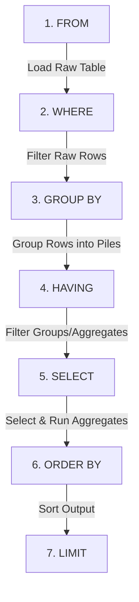

## Why This Matters

Raw database tables are like logs of individual events: a user clicked a button, a customer bought a subscription, an employee completed a shift. If you try to read all these millions of rows individually, you will see nothing but noise.

Analytics is the art of compression. To find insights, you must collapse thousands of raw records into a single summary table:
*   Instead of looking at 10,000 sales transactions, you want to see **total revenue by region**.
*   Instead of reviewing every support ticket, you want to see the **average resolution time by representative**.
*   Instead of listing every signup, you want to calculate the **monthly growth rate of new users**.

The `GROUP BY` clause, paired with SQL aggregate functions, is how you transform a mountain of transactional rows into structured summary reports.

---

## Conceptual Analogy: The Fruit Basket Sorting

Imagine you are handed a massive wicker basket containing a jumble of mixed fruit: Red Apples, Green Apples, Navel Oranges, and Bananas.

```text
       [ Wicker Basket of Fruit ]
 (Apple, Orange, Banana, Apple, Banana, Orange)
```

If you are asked to summarize this basket, you cannot just look at the pile and guess. You must follow a process:

1. **Sort into Piles (GROUP BY)**: You place all the Apples in one pile on the left, all the Oranges in a pile in the middle, and all the Bananas in a pile on the right. 

```text
   [Apples Pile]       [Oranges Pile]       [Bananas Pile]
  (Apple, Apple)      (Orange, Orange)     (Banana, Banana)
```

2. **Measure the Piles (Aggregation)**: Now that the fruits are separated, you can apply measurements to each pile:
    *   **COUNT**: How many pieces of fruit are in this pile?
    *   **SUM**: What is the total weight of this pile?
    *   **AVG**: What is the average weight of a single fruit in this pile?
    *   **MAX/MIN**: What is the heaviest and lightest fruit in this pile?

### The Cardinal Rule of Grouping
Once you have sorted your fruit into piles, you can only ask questions about the **entire pile** or the **grouping attribute**.

If someone points to the Apple pile and asks: *"What is the specific color of the apples?"* you cannot give a single answer because the pile contains both Red and Green apples. If you tried, you would break the rule.

In SQL, this is why: **Every column you select must either be the column you grouped by (the fruit type), or wrapped in an aggregate function (e.g. SUM, COUNT).**

---

## The Table We're Working With

We will query a `sales` table containing transaction details for sales representatives across different territories:

| sale_id | rep_id | product | amount | sale_date | region | status |
| :--- | :--- | :--- | :--- | :--- | :--- | :--- |
| 1 | 101 | CRM Pro | 15000.00 | 2024-01-15 | West | completed |
| 2 | 102 | CRM Pro | 12000.00 | 2024-01-22 | East | completed |
| 3 | 101 | Analytics Hub | 28000.00 | 2024-02-03 | West | completed |
| 4 | 103 | CRM Pro | 15000.00 | 2024-02-18 | East | pending |
| 5 | 101 | Data Vault | 8500.00 | 2024-03-07 | South | completed |
| 6 | 102 | Analytics Hub | *NULL* | 2024-03-12 | East | cancelled |
| 7 | 103 | Dashboard Kit | 5000.00 | 2024-03-25 | East | completed |

---

## Aggregate Functions in Detail

Aggregate functions perform a calculation on a set of values and return a single value. 

### 1. COUNT(*) vs. COUNT(column) vs. COUNT(DISTINCT column)
How SQL counts rows is one of the most common sources of calculation bugs:

*   **`COUNT(*)`**: Counts every single row in the group, including rows that contain `NULL` values. Think of it as counting physical envelopes regardless of what is inside.
*   **`COUNT(column)`**: Counts only rows where the specified column is **not NULL**. If a column contains a NULL, it is ignored in the count.
*   **`COUNT(DISTINCT column)`**: Counts only unique, non-NULL values within that column.

Let's look at how these behave on our `sales` table:

```sql
SELECT 
    COUNT(*) AS total_rows,
    COUNT(amount) AS non_null_amounts,
    COUNT(DISTINCT product) AS unique_products
FROM sales;
```

```text
# Output:
total_rows | non_null_amounts | unique_products
-----------|------------------|----------------
7          | 6                | 4
```
*Why the values differ*: 
*   `total_rows` is 7 because there are 7 records.
*   `non_null_amounts` is 6 because transaction 6 has a `NULL` amount.
*   `unique_products` is 4 because there are only 4 distinct products sold (CRM Pro, Analytics Hub, Data Vault, Dashboard Kit).

---

### 2. SUM() and AVG() NULL Handling
Like `COUNT(column)`, both `SUM()` and `AVG()` ignore NULL values during calculation.

> [!WARNING]
> **The Average Denominator Trap**: Because `AVG(column)` ignores NULL values, it does not include them in the denominator. This can skew calculations if you want NULLs treated as zero.

For example, let's look at average sales in the East region (transactions 2, 4, 6, and 7):
*   Amounts: 12000, 15000, NULL, 5000.
*   `SUM(amount)` = 32,000.
*   `AVG(amount)` = 32,000 / 3 = **10,666.67** (ignores transaction 6 entirely).

If transaction 6 was a cancelled sale that you wanted to count as $0, a simple `AVG(amount)` will give you an inflated number. To treat NULLs as zero, you must use a function like `COALESCE` to replace NULL with 0 before aggregating:

```sql
SELECT 
    AVG(amount) AS average_excluding_nulls,
    AVG(COALESCE(amount, 0)) AS average_including_nulls_as_zero
FROM sales
WHERE region = 'East';
```

```text
# Output:
average_excluding_nulls | average_including_nulls_as_zero
------------------------|---------------------------------
10666.67                | 8000.00
```
*Calculation details*: `8000.00` is derived from `(12000 + 15000 + 0 + 5000) / 4`.

---

### 3. MIN() and MAX()
`MIN()` and `MAX()` return the smallest and largest values in a group. They can be applied to numbers, strings (alphabetical sorting), and dates (earliest and latest). They also ignore NULL values.

---

## WHERE vs. HAVING

The difference between `WHERE` and `HAVING` is the most frequently tested concept in SQL interviews.

*   **`WHERE`** filters individual rows **before** any grouping or aggregation takes place.
*   **`HAVING`** filters the aggregated groups **after** the `GROUP BY` step has executed.

### Logical Query Processing Order with GROUP BY & HAVING



Because of this order:
*   You **cannot** put aggregate functions in a `WHERE` clause (e.g. `WHERE SUM(amount) > 1000` is invalid because aggregates have not been calculated yet).
*   You **can** filter on both raw columns and aggregates in `HAVING`, though standard practice is to place raw column filters in `WHERE` to minimize the number of rows the database must sort.

---

## Code Walkthroughs

### Example 1: Basic Grouping and Multi-Metric Reporting
**Business Scenario**: The Executive Leadership Team wants a regional sales report. For each sales region, they need to know:
1.  Total revenue generated (completed and pending transactions)
2.  Total number of deals closed
3.  The value of the largest deal closed

```sql
SELECT 
    region,
    SUM(amount) AS total_revenue,
    COUNT(sale_id) AS total_deals,
    MAX(amount) AS largest_deal
FROM sales
WHERE amount IS NOT NULL                    -- Discard rows with missing values
GROUP BY region;                            -- Sort sales into territorial piles
```

```text
# Output:
region | total_revenue | total_deals | largest_deal
-------|---------------|-------------|-------------
West   | 43000.00      | 2           | 28000.00
East   | 32000.00      | 3           | 15000.00
South  | 8500.00       | 1           | 8500.00
(3 rows)
```

---

### Example 2: Grouping by Multiple Columns
**Business Scenario**: The Sales Operations Director wants to inspect rep productivity by region. They want to check how much revenue each sales representative generated in each specific region.

```sql
SELECT 
    rep_id,
    region,
    SUM(amount) AS revenue_generated,
    COUNT(*) AS transactions_count
FROM sales
WHERE amount IS NOT NULL
GROUP BY rep_id, region                      -- Create unique rep-region combinations
ORDER BY revenue_generated DESC;
```

```text
# Output:
rep_id | region | revenue_generated | transactions_count
-------|--------|-------------------|-------------------
101    | West   | 43000.00          | 2
103    | East   | 20000.00          | 2
102    | East   | 12000.00          | 1
101    | South  | 8500.00           | 1
(4 rows)
```
*Note*: Rep 101 appears twice because they generated sales in both the West and South regions. The database creates a separate group for each unique combination of `rep_id` and `region`.

---

### Example 3: Filtering Groups with HAVING
**Business Scenario**: The VP of Sales wants to reward high-performing sales representatives. They need a list of sales representatives who have generated **more than $20,000 in total completed sales**.

```sql
SELECT 
    rep_id,
    SUM(amount) AS completed_revenue
FROM sales
WHERE status = 'completed'                   -- Filter raw rows BEFORE grouping
GROUP BY rep_id
HAVING SUM(amount) > 20000;                  -- Filter groups AFTER aggregation
```

```text
# Output:
rep_id | completed_revenue
-------|------------------
101    | 51500.00
(1 row)
```

*Detailed Step-by-Step Execution*:
1.  **`FROM sales`**: Loads all 7 sales records.
2.  **`WHERE status = 'completed'`**: Filters out transaction 4 (pending) and transaction 6 (cancelled). 5 rows remain.
3.  **`GROUP BY rep_id`**: Groups the remaining transactions:
    *   Rep 101: deals 1 ($15,000), 3 ($28,000), 5 ($8,500). Total = $51,500.
    *   Rep 102: deal 2 ($12,000). Total = $12,000.
    *   Rep 103: deal 7 ($5,000). Total = $5,000.
4.  **`HAVING SUM(amount) > 20000`**: Discards Rep 102 ($12,000) and Rep 103 ($5,000). Only Rep 101 remains.
5.  **`SELECT`**: Renders Rep 101 and their completed revenue of $51,500.

---

## Edge Cases & Common Mistakes

### 1. The SELECT-GROUP BY Non-Match Error
This is the most common SQL error for beginners.

```sql
-- ❌ THIS WILL FAIL in standard SQL:
SELECT rep_id, product, SUM(amount)
FROM sales
GROUP BY rep_id;
```
*Why it fails*: You grouped by `rep_id`, which means all rows for Rep 101 will be collapsed into one. However, Rep 101 sold both "CRM Pro" and "Analytics Hub". The database does not know which product name to show in the output.
*The Rule*: If it's not in the `GROUP BY` clause, it *must* be inside an aggregate function. To fix this query, either add `product` to the grouping clause or aggregate it:
```sql
--  Fix Option A: Group by both
SELECT rep_id, product, SUM(amount)
FROM sales
GROUP BY rep_id, product;

--  Fix Option B: Aggregate the column
SELECT rep_id, COUNT(product) AS products_sold, SUM(amount)
FROM sales
GROUP BY rep_id;
```

### 2. Aggregating Aggregates
You cannot nest aggregate functions inside one another.
*   `SELECT SUM(AVG(amount)) FROM sales GROUP BY region` (Invalid).
*   If you need to calculate the sum of averages, you must use a subquery or Common Table Expression (CTE) to perform the first aggregation, and then run the second aggregation on that temporary result.

---

## Practice Exercises & Mini-Projects

### Exercise 1: Finding Active Products
**Scenario**: You are a Product Performance Analyst. The product team needs to identify which products are driving volume. Write a query to return the **product name**, the **number of transactions** containing that product, and the **total amount** generated. 

Exclude any transactions that are `'cancelled'`. Only return products that have appeared in **more than 1 transaction**.

*   **Target Table**: `sales`
*   **Expected Output**:
    ```text
    product | transactions | total_amount
    --------|--------------|-------------
    CRM Pro | 3            | 42000.00
    ```

**Answer & Logic Walkthrough**:
```sql
SELECT 
    product,
    COUNT(*) AS transactions,
    SUM(amount) AS total_amount
FROM sales
WHERE status <> 'cancelled'
GROUP BY product
HAVING COUNT(*) > 1;
```
1.  `WHERE status <> 'cancelled'` filters out transaction 6 before grouping.
2.  `GROUP BY product` sorts transactions into piles by product name.
3.  `HAVING COUNT(*) > 1` filters out products like "Analytics Hub" (which only has 1 valid transaction left) and "Data Vault", leaving only "CRM Pro" in the output.

---

### Exercise 2: Regional Average Deal Size Audit
**Scenario**: Finance wants to audit average deal sizes across regions. They need to find regions where the **average deal size is greater than $10,000**. Write a query to return the region and its average amount, ignoring NULL values.

*   **Target Table**: `sales`
*   **Expected Output**:
    ```text
    region | average_deal
    -------|-------------
    West   | 21500.00
    East   | 10666.67
    ```

**Answer & Logic Walkthrough**:
```sql
SELECT 
    region,
    AVG(amount) AS average_deal
FROM sales
WHERE amount IS NOT NULL
GROUP BY region
HAVING AVG(amount) > 10000;
```
1.  `WHERE amount IS NOT NULL` removes row 6 before grouping.
2.  `GROUP BY region` calculates the average amounts: West ($21,500), East ($10,666.67), and South ($8,500).
3.  `HAVING AVG(amount) > 10000` filters out the South region.

---

## Section Recaps

*   **Aggregation Collapse**: Aggregate functions collapse multiple rows of data into a single row. This means any column selected must be present in the `GROUP BY` clause or wrapped in an aggregate.
*   **COUNT Behavior**: `COUNT(*)` counts all rows including NULL values. `COUNT(column)` only counts rows where that specific column has a value (non-NULL).
*   **AVG & NULLs**: `AVG()` ignores NULLs. This means those rows are not counted in the denominator, which can inflate averages. Use `COALESCE(column, 0)` to count NULLs as zero.
*   **WHERE vs. HAVING**: `WHERE` filters rows before grouping; `HAVING` filters aggregated groups after grouping. Never put an aggregate function in the `WHERE` clause.

---

## Common Interview Questions

### Q1: What is the difference between WHERE and HAVING?
**Answer:** The primary differences are timing and the level of data they filter:
*   `WHERE` is executed **before** rows are grouped. It filters individual records. It cannot reference aggregate functions (e.g., `WHERE SUM(amount) > 100` is invalid).
*   `HAVING` is executed **after** rows have been grouped and aggregated. It filters the resulting groups. It can reference aggregate functions (e.g., `HAVING SUM(amount) > 100`).

### Q2: What is the difference between `COUNT(*)` and `COUNT(column_name)`?
**Answer:** 
*   `COUNT(*)` counts every row in the dataset or group, including rows where columns contain `NULL` values.
*   `COUNT(column_name)` only counts rows where the specified column contains a non-NULL value. If the value in that column is `NULL`, it is skipped.

### Q3: Why does standard SQL reject a query like `SELECT region, product, SUM(amount) FROM sales GROUP BY region`?
**Answer:** This query violates the structural rules of grouping. Because the table is grouped by `region`, the output will have one row per region. However, a single region can contain multiple different products. Because `product` is not in the `GROUP BY` clause and is not wrapped in an aggregate function (like `MAX` or `MIN`), the database engine cannot determine which product name to display in the single regional output row, resulting in a syntax error.

### Q4: How does the AVG() function handle NULL values, and how can this cause analytical bugs?
**Answer:** The `AVG()` function ignores NULL values. When calculating an average, the database sums all non-NULL values and divides by the count of non-NULL records. If you are calculating metrics where a NULL should represent a zero (such as a customer who made zero purchases), this behavior will inflate your average because those customers are excluded from the denominator. To fix this, you must convert the NULLs to zero before averaging: `AVG(COALESCE(column, 0))`.

### Q5: Can you group by multiple columns? If so, how does the database process it?
**Answer:** Yes. When you group by multiple columns (e.g., `GROUP BY region, product`), the database engine creates a distinct group for every unique combination of values across those columns. The engine will calculate aggregates for each combination. For example, it will calculate the sum of sales for "West - CRM Pro", "West - Analytics Hub", "East - CRM Pro", and so on.
