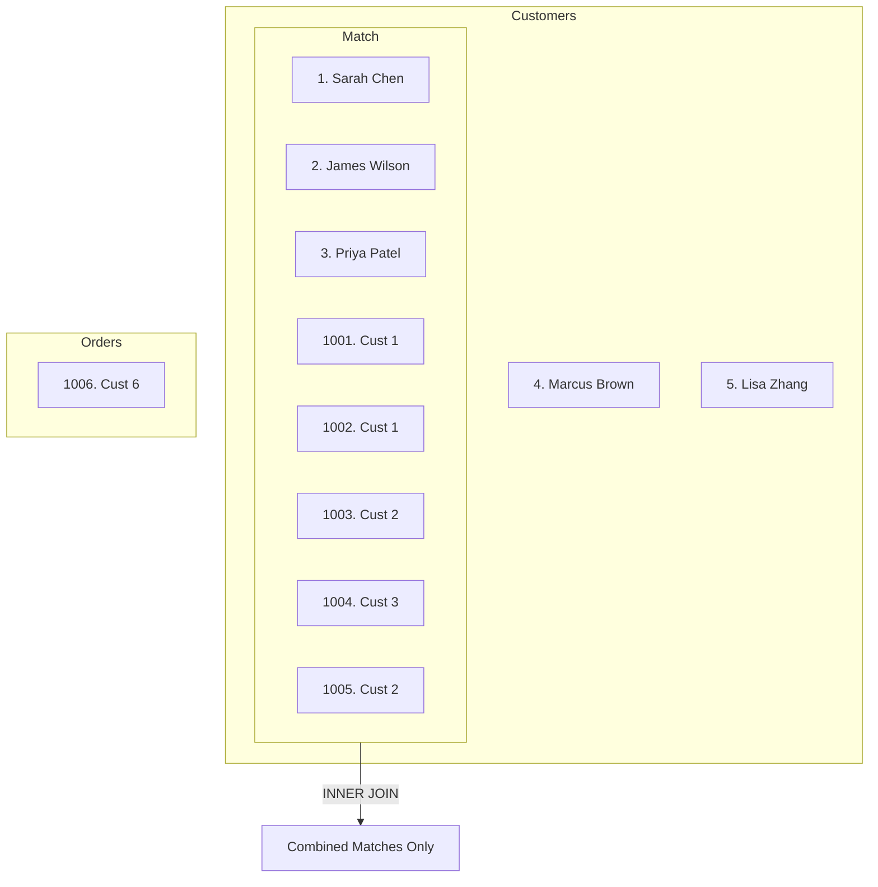
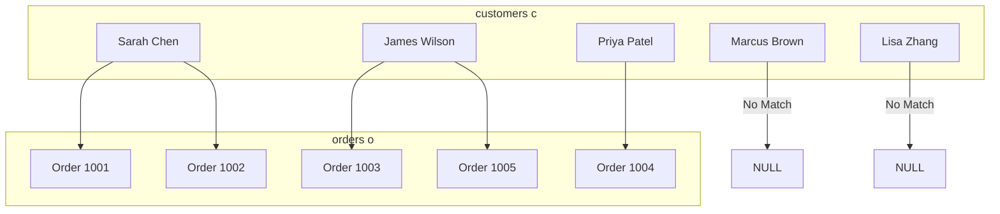

## Why This Matters

In a database, data is rarely stored in a single table. Storing everything in one massive sheet leads to redundancy, data bloat, and massive maintenance nightmares. Instead, databases are designed using a concept called **normalization**—splitting data into logical, independent entities.

For example, an e-commerce platform stores customer details in a `customers` table, individual transaction records in an `orders` table, and catalog information in a `products` table. 

```text
  [customers]             [orders]             [products]
+--------------+     +----------------+     +--------------+
| customer_id  | <-> |  customer_id   |     |  product_id  |
| name, city   |     |  product_id    | <-> |  name, price |
+--------------+     |  amount, date  |     +--------------+
                     +----------------+
```

When it is time to perform data analytics—such as calculating which city generated the most revenue or listing which customer ordered which software product—you must stitch these tables back together. That is the job of the **`JOIN`** clause. Master JOINs, and you unlock the true power of relational databases.

---

## Conceptual Analogy: The Sticker Book and the Matching Sheets

Imagine you have a sticker collector's book (the Left Table) and a sheet of decorative stickers (the Right Table). 

*   Each page in your sticker book represents a customer.
*   Each sticker represents a transaction order.

```text
STICKER BOOK (Left Table)                 STICKER SHEET (Right Table)
+------------------------------------+    +------------------------------------+
| ID: 1 | Name: Sarah Chen           |    | Sticker ID: 101 | Cust_ID: 1       |
| ID: 2 | Name: James Wilson         |    | Sticker ID: 102 | Cust_ID: 1       |
| ID: 3 | Name: Priya Patel          |    | Sticker ID: 103 | Cust_ID: 2       |
| ID: 4 | Name: Marcus Brown         |    | Sticker ID: 106 | Cust_ID: 99      |
+------------------------------------+    +------------------------------------+
```

You want to pair the stickers with the corresponding pages by matching the **Customer ID**.

*   **INNER JOIN**: You only place stickers in the book if the customer has actually placed an order. If a page has no matching sticker (e.g., Marcus Brown, Cust_ID 4), you leave it out of your final display. If a sticker has no corresponding page (e.g., Cust_ID 99), you throw it in the trash. You only display **perfect matches**.
*   **LEFT JOIN**: You keep every single page in your book, regardless of whether they have a sticker. If a page matches a sticker, you paste the sticker on it. If a page has no matching stickers (Marcus Brown), you leave that spot blank (**`NULL`**).
*   **RIGHT JOIN**: You keep every single sticker from the sticker sheet. If a sticker has a matching page in the book, you paste it. If a sticker lists a Customer ID that doesn't exist in your book (Cust_ID 99), you still display the sticker, but the customer name page section is left completely blank (**`NULL`**).
*   **FULL OUTER JOIN**: You keep everything. You display all pages from the book and all stickers from the sheet. Where they match, you combine them. Where they don't, you leave the missing halves blank (**`NULL`**).

---

## Left Table vs. Right Table Designation

In any SQL join query, table positions are defined relative to the `JOIN` keyword:

```sql
SELECT columns
FROM customers c           -- <-- LEFT TABLE (declared first in FROM)
LEFT JOIN orders o         -- <-- RIGHT TABLE (declared second in JOIN)
  ON c.customer_id = o.customer_id;
```

*   **The Left Table** is the table declared directly after the `FROM` clause.
*   **The Right Table** is the table declared after the `JOIN` clause.

This distinction is crucial because swapping the table positions in a `LEFT JOIN` or `RIGHT JOIN` changes the entire output of your query.

---

## The Tables BEFORE the Join

Let's define the dataset we will use throughout this lesson. Note the missing links:
1.  **Marcus Brown** (ID 4) and **Lisa Zhang** (ID 5) have **no orders**.
2.  **Order 1006** references **customer_id 6**, which does not exist in our customers directory.
3.  **ML Toolkit** (ID 205) has **never been ordered**.

### 1. The `customers` Table (Left Table)

| customer_id | name | city | signup_date |
| :--- | :--- | :--- | :--- |
| 1 | Sarah Chen | San Francisco | 2023-01-15 |
| 2 | James Wilson | New York | 2023-03-22 |
| 3 | Priya Patel | Chicago | 2023-06-10 |
| 4 | Marcus Brown | Austin | 2023-09-05 |
| 5 | Lisa Zhang | Seattle | 2024-01-20 |

### 2. The `orders` Table (Right Table)

| order_id | customer_id | product_id | amount | order_date |
| :--- | :--- | :--- | :--- | :--- |
| 1001 | 1 | 201 | 299.99 | 2024-01-15 |
| 1002 | 1 | 203 | 149.50 | 2024-02-10 |
| 1003 | 2 | 201 | 299.99 | 2024-01-22 |
| 1004 | 3 | 202 | 499.00 | 2024-03-05 |
| 1005 | 2 | 204 | 79.99 | 2024-03-18 |
| 1006 | 6 | 201 | 299.99 | 2024-04-01 |

### 3. The `products` Table

| product_id | product_name | category | price |
| :--- | :--- | :--- | :--- |
| 201 | Analytics Pro | Software | 299.99 |
| 202 | Data Vault | Software | 499.00 |
| 203 | Dashboard Kit | Add-on | 149.50 |
| 204 | Report Builder | Add-on | 79.99 |
| 205 | ML Toolkit | Software | 899.00 |

---

## Step-by-Step Join Types Walkthrough

### 1. INNER JOIN (Intersection)

An `INNER JOIN` filters out all rows that do not have a match in both tables. It looks for matching values between the join key of the Left table (`customers.customer_id`) and the Right table (`orders.customer_id`).



#### SQL Syntax:
```sql
SELECT
    c.customer_id,
    c.name AS customer_name,
    o.order_id,
    o.amount,
    o.order_date
FROM customers c
INNER JOIN orders o ON c.customer_id = o.customer_id;
```

#### The Table AFTER INNER JOIN:

| customer_id | customer_name | order_id | amount | order_date |
| :--- | :--- | :--- | :--- | :--- |
| 1 | Sarah Chen | 1001 | 299.99 | 2024-01-15 |
| 1 | Sarah Chen | 1002 | 149.50 | 2024-02-10 |
| 2 | James Wilson | 1003 | 299.99 | 2024-01-22 |
| 3 | Priya Patel | 1004 | 499.00 | 2024-03-05 |
| 2 | James Wilson | 1005 | 79.99 | 2024-03-18 |

*   **Analysis of Results**:
    *   **Sarah Chen** appears twice because she has two matching orders. The engine duplicates the customer details to pair them with each order.
    *   **Marcus Brown** (ID 4) and **Lisa Zhang** (ID 5) are dropped because they have no records in the `orders` table.
    *   **Order 1006** is dropped because `customer_id` 6 has no corresponding record in the `customers` table.

---

### 2. LEFT JOIN (Left Outer Join)

A `LEFT JOIN` preserves all records from the Left table, and brings in matching records from the Right table. If no match is found, the columns from the Right table are populated with `NULL`.



#### SQL Syntax:
```sql
SELECT
    c.customer_id,
    c.name AS customer_name,
    o.order_id,
    o.amount,
    o.order_date
FROM customers c
LEFT JOIN orders o ON c.customer_id = o.customer_id;
```

#### The Table AFTER LEFT JOIN:

| customer_id | customer_name | order_id | amount | order_date |
| :--- | :--- | :--- | :--- | :--- |
| 1 | Sarah Chen | 1001 | 299.99 | 2024-01-15 |
| 1 | Sarah Chen | 1002 | 149.50 | 2024-02-10 |
| 2 | James Wilson | 1003 | 299.99 | 2024-01-22 |
| 3 | Priya Patel | 1004 | 499.00 | 2024-03-05 |
| 2 | James Wilson | 1005 | 79.99 | 2024-03-18 |
| 4 | Marcus Brown | *NULL* | *NULL* | *NULL* |
| 5 | Lisa Zhang | *NULL* | *NULL* | *NULL* |

*   **Analysis of Results**:
    *   **Marcus Brown** and **Lisa Zhang** are preserved in the output dataset. Their transaction columns (`order_id`, `amount`, `order_date`) are padded with `NULL`s.
    *   **Order 1006** is excluded because it only exists in the Right table, and a `LEFT JOIN` only preserves unmatched rows from the Left table.

---

### 3. RIGHT JOIN (Right Outer Join)

A `RIGHT JOIN` is the mirror opposite of a `LEFT JOIN`. It preserves all records from the Right table, filling in columns from the Left table with `NULL` where no match occurs.

#### SQL Syntax:
```sql
SELECT
    c.customer_id,
    c.name AS customer_name,
    o.order_id,
    o.amount,
    o.order_date
FROM customers c
RIGHT JOIN orders o ON c.customer_id = o.customer_id;
```

#### The Table AFTER RIGHT JOIN:

| customer_id | customer_name | order_id | amount | order_date |
| :--- | :--- | :--- | :--- | :--- |
| 1 | Sarah Chen | 1001 | 299.99 | 2024-01-15 |
| 1 | Sarah Chen | 1002 | 149.50 | 2024-02-10 |
| 2 | James Wilson | 1003 | 299.99 | 2024-01-22 |
| 3 | Priya Patel | 1004 | 499.00 | 2024-03-05 |
| 2 | James Wilson | 1005 | 79.99 | 2024-03-18 |
| *NULL* | *NULL* | 1006 | 299.99 | 2024-04-01 |

*   **Analysis of Results**:
    *   **Order 1006** is preserved, even though it was placed by a non-existent customer (`customer_id` 6). The customer metadata fields (`customer_id`, `customer_name`) are populated with `NULL`.
    *   **Marcus Brown** and **Lisa Zhang** are discarded because they exist on the Left side without matching records on the Right.
*   **In Practice**: You will rarely see `RIGHT JOIN` used in production environments. Any `RIGHT JOIN` query can be rewritten as a `LEFT JOIN` simply by swapping the table placement in the query. Most software engineering teams standardize on using `LEFT JOIN` exclusively to keep SQL logic readable from top to bottom.

---

### 4. FULL OUTER JOIN (Union)

A `FULL OUTER JOIN` combines the behavior of both `LEFT` and `RIGHT` joins. It returns all records from both tables. Where a match occurs, columns are joined. Where no match occurs, missing values are filled with `NULL`.

#### SQL Syntax:
```sql
SELECT
    c.customer_id,
    c.name AS customer_name,
    o.order_id,
    o.amount
FROM customers c
FULL OUTER JOIN orders o ON c.customer_id = o.customer_id;
```

#### The Table AFTER FULL OUTER JOIN:

| customer_id | customer_name | order_id | amount |
| :--- | :--- | :--- | :--- |
| 1 | Sarah Chen | 1001 | 299.99 |
| 1 | Sarah Chen | 1002 | 149.50 |
| 2 | James Wilson | 1003 | 299.99 |
| 3 | Priya Patel | 1004 | 499.00 |
| 2 | James Wilson | 1005 | 79.99 |
| 4 | Marcus Brown | *NULL* | *NULL* |
| 5 | Lisa Zhang | *NULL* | *NULL* |
| *NULL* | *NULL* | 1006 | 299.99 |

*   **Dialect Warning**: MySQL does not native support `FULL OUTER JOIN`. To achieve this output in MySQL, you must write a `LEFT JOIN` query and a `RIGHT JOIN` query, and merge their outputs using a `UNION` operator.

---

## ON Clause vs. WHERE Clause Filtering During Joins

One of the most common mistakes SQL developers make is placing filter criteria in the wrong clause when using **Outer Joins** (`LEFT`, `RIGHT`, or `FULL`).

When executing an outer join:
*   **Filters in the `ON` clause** determine whether a row from the right table matches the left table. If the condition is false, the left table row is **still kept**, but joined with `NULL` columns.
*   **Filters in the `WHERE` clause** are evaluated **after** the join is complete. If the condition is false, the row is **completely removed** from the output.

Let's look at the difference with two examples.

### Scenario A: Filter in the ON Clause
We want to list all customers, and join their orders *only* if the order amount is greater than $200.

```sql
SELECT c.name, o.order_id, o.amount
FROM customers c
LEFT JOIN orders o 
  ON c.customer_id = o.customer_id 
  AND o.amount > 200.00;              -- Filter is part of the JOIN criteria
```

```text
# Output:
name         | order_id | amount
-------------|----------|-------
Sarah Chen   | 1001     | 299.99
Sarah Chen   | NULL     | NULL       -- Order 1002 ($149.50) was filtered out of matching, but Sarah remains!
James Wilson | 1003     | 299.99
Priya Patel  | 1004     | 499.00
James Wilson | NULL     | NULL       -- Order 1005 ($79.99) filtered out of matching, but James remains!
Marcus Brown | NULL     | NULL
Lisa Zhang   | NULL     | NULL
(7 rows)
```
*Why this happened*: The database engine preserved all customers. It only evaluated the join connection if the amount was greater than $200.

---

### Scenario B: Filter in the WHERE Clause
We write what looks like the same query, but place the amount filter in the `WHERE` clause:

```sql
SELECT c.name, o.order_id, o.amount
FROM customers c
LEFT JOIN orders o 
  ON c.customer_id = o.customer_id
WHERE o.amount > 200.00;              -- Filter evaluated AFTER the join
```

```text
# Output:
name         | order_id | amount
-------------|----------|-------
Sarah Chen   | 1001     | 299.99
James Wilson | 1003     | 299.99
Priya Patel  | 1004     | 499.00
(3 rows)
```
*Why this happened*: The engine joined all customers and orders (generating NULLs for Marcus and Lisa). Then, the `WHERE` step executed. It evaluated `o.amount > 200.00` for every row. Since NULL values fail comparison operators, Marcus, Lisa, and the smaller orders were all deleted. This effectively converted our `LEFT JOIN` into an `INNER JOIN`.

---

## Special Joins

### 1. CROSS JOIN (Cartesian Product)
A `CROSS JOIN` pairs every single row of Table A with every single row of Table B. It does not use an `ON` clause because it is not matching records—it is generating all mathematical permutations.

If Table A has $M$ rows and Table B has $N$ rows, the resulting dataset will have $M \times N$ rows.

```sql
-- Generating all customer and product combinations for marketing packages
SELECT 
    c.name AS customer_name,
    p.product_name
FROM customers c
CROSS JOIN products p;
```

```text
# Output:
customer_name | product_name
--------------|---------------
Sarah Chen    | Analytics Pro
Sarah Chen    | Data Vault
...
Lisa Zhang    | ML Toolkit
(25 rows - 5 customers * 5 products)
```

**Use Case**: Generating a matrix shell. For example, creating a report grid showing sales numbers for every store location combined with every month of the year, including months with zero sales.

---

### 2. Self-JOIN (Joining a Table to Itself)
A self-join occurs when you reference the same database table twice in a single query. To prevent errors, you must use table aliases to give the table two distinct names (usually `e` for employee and `m` for manager).

Let's assume our `employees` table has a `manager_id` column that stores the `emp_id` of the supervisor.

| emp_id | name | manager_id |
| :--- | :--- | :--- |
| 101 | Sarah Chen | 102 |
| 102 | James Wilson | 105 |
| 105 | Lisa Zhang | NULL |

```sql
SELECT 
    e.name AS employee_name,
    m.name AS manager_name
FROM employees e                     -- Aliased as 'e' (acting as Employee table)
LEFT JOIN employees m                -- Aliased as 'm' (acting as Manager table)
  ON e.manager_id = m.emp_id;
```

```text
# Output:
employee_name | manager_name
--------------|-------------
Sarah Chen    | James Wilson
James Wilson  | Lisa Zhang
Lisa Zhang    | NULL
(3 rows)
```

**Use Case**: Hierarchy reporting (manager/employee structures, subcategory/parent category models, or matching flight departures and arrivals within the same airport routes table).

---

## Practice Exercises & Mini-Projects

### Exercise 1: Finding Unordered Products
**Scenario**: The Product Marketing team is auditing the active software catalog. They want to identify products from the `products` table that have **never been ordered**. 

Write a query that returns the product name, category, and price for all products with zero sales.

*   **Tables Needed**: `products` and `orders`
*   **Expected Output**:
    ```text
    product_name | category | price
    -------------|----------|--------
    ML Toolkit   | Software | 899.00
    ```

**Answer & Logic Walkthrough**:
```sql
SELECT 
    p.product_name,
    p.category,
    p.price
FROM products p
LEFT JOIN orders o ON p.product_id = o.product_id
WHERE o.order_id IS NULL;
```
1.  We start with `FROM products p` to ensure all products are loaded.
2.  We perform a `LEFT JOIN orders o` matching on the common key `product_id`. This pairs each product with its orders, leaving the `ML Toolkit` order fields blank (`NULL`) because it has no sales.
3.  We apply `WHERE o.order_id IS NULL` to filter out all products that had matches, leaving only the unpurchased item.

---

### Exercise 2: Three-Table Revenue Report
**Scenario**: The CEO wants a summary report of all completed sales. Write a query to return:
1.  The customer name
2.  The product name they purchased
3.  The amount spent
4.  The transaction date

Sort the final list by date in descending order.

*   **Tables Needed**: `customers`, `orders`, and `products`
*   **Expected Output**:
    ```text
    customer     | product_name   | amount | order_date
    -------------|----------------|--------|------------
    Priya Patel  | Data Vault     | 499.00 | 2024-03-05
    Sarah Chen   | Dashboard Kit  | 149.50 | 2024-02-10
    James Wilson | Analytics Pro  | 299.99 | 2024-01-22
    Sarah Chen   | Analytics Pro  | 299.99 | 2024-01-15
    ```

**Answer & Logic Walkthrough**:
```sql
SELECT 
    c.name AS customer,
    p.product_name,
    o.amount,
    o.order_date
FROM orders o
INNER JOIN customers c ON o.customer_id = c.customer_id
INNER JOIN products p  ON o.product_id = p.product_id
ORDER BY o.order_date DESC;
```
1.  We start with `orders` because it contains the transaction records.
2.  We `INNER JOIN customers` on `customer_id` to get the customer names. 
3.  We `INNER JOIN products` on `product_id` to retrieve the product name.
4.  We sort the list chronologically from newest to oldest using `ORDER BY o.order_date DESC`.

---

## Section Recaps

*   **INNER JOIN**: Only keeps rows with matching values in both tables. Any unmatched records are discarded.
*   **LEFT JOIN**: Retains all rows from the Left table, and appends columns from the Right table. Unmatched elements are filled with `NULL`.
*   **RIGHT JOIN**: Retains all rows from the Right table, and appends columns from the Left table. It can always be rewritten as a `LEFT JOIN` and is rarely used.
*   **FULL OUTER JOIN**: Combines all rows from both tables, filling in missing connections with `NULL`.
*   **ON vs WHERE**: Filters placed in the `ON` clause happen during the join step (leaving outer rows intact). Filters placed in the `WHERE` clause run after the join, filtering out any resulting NULL rows and potentially breaking your outer join logic.

---

## Common Interview Questions

### Q1: What is the difference between an INNER JOIN and a LEFT JOIN?
**Answer:** The primary difference lies in how unmatched rows are handled:
*   An `INNER JOIN` only returns rows where there is a match in both tables based on the join condition. Unmatched rows in either table are discarded.
*   A `LEFT JOIN` returns all rows from the left table, regardless of whether a match exists in the right table. If no match is found, columns from the right table are populated with `NULL`.

### Q2: What happens if you place a filter condition on the right table inside the WHERE clause of a LEFT JOIN query?
**Answer:** Placing a filter condition on the right table in the `WHERE` clause (e.g. `WHERE o.amount > 100`) evaluates that filter **after** the join has completed. Any rows from the left table that did not have a match in the right table will have `NULL` values in the right table's columns. Since comparisons like `NULL > 100` evaluate to `UNKNOWN`, those unmatched rows will be filtered out. This effectively converts your `LEFT JOIN` into an `INNER JOIN`. To preserve all rows from the left table, such conditions must be placed in the `ON` clause.

### Q3: How do you identify records in Table A that do not have a matching record in Table B? Write the SQL pattern.
**Answer:** This can be solved using a `LEFT JOIN` paired with a `WHERE ... IS NULL` filter:
```sql
SELECT a.id
FROM table_a a
LEFT JOIN table_b b ON a.id = b.a_id
WHERE b.a_id IS NULL;
```
This query preserves all rows from Table A, joins matching records from Table B, and then discards any rows that had a match, leaving only the records that exist exclusively in Table A. Other valid methods include using `NOT EXISTS` or `NOT IN` subqueries.

### Q4: What is a Self-JOIN, and when would you use one?
**Answer:** A self-join is when a table is joined to itself. This is achieved by listing the table twice in the query and giving it two distinct aliases (e.g., `FROM employees e JOIN employees m`). It is used to query hierarchical data stored in a single table, such as finding employees and their managers, tracing product category parent-child relationships, or matching flight departure and arrival data from a single routes table.

### Q5: What is a Cartesian Product, and how do you generate one in SQL?
**Answer:** A Cartesian Product is a result set where every row from the first table is paired with every row from the second table. The total number of rows returned is the product of the row counts of both tables ($M \times N$). In SQL, it is generated using a `CROSS JOIN` without an `ON` clause, or by listing multiple tables in the `FROM` clause separated by commas without specifying a join condition (an older syntax style).
