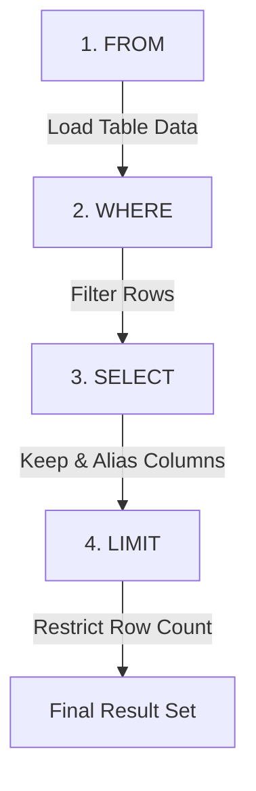

## Why This Matters

Every dashboard, every machine learning model, every financial report, and every customer cohort starts with a `SELECT` statement. If you cannot pull and filter data from a database, you cannot perform analytics. 

Think of SQL as the interface to a company’s memory. An e-commerce brand stores millions of orders, a healthcare provider tracks millions of patient visits, and a social network logs billions of interactions. The `SELECT` and `WHERE` clauses are your scalpel. They allow you to carve out the exact slice of data you need from these massive tables. Master these, and you have built the foundation for everything that follows.

---

## Conceptual Analogy: The Librarian and the Card Catalog

Imagine you are visiting a massive, old-world library. In the center of the room sits a giant physical card catalog—a wooden cabinet filled with thousands of tiny drawers, each containing paper index cards for every book in the library.

Each index card represents a **row** in a database table.
Each section on the card (Title, Author, Genre, Publication Year, Page Count) represents a **column**.

```text
+----------------------------------------+
| Title: SQL for Beginners               | <-- Column: title
| Author: Alex Chen                      | <-- Column: author
| Genre: Technology                      | <-- Column: genre
| Year: 2023                             | <-- Column: pub_year
| Pages: 350                             | <-- Column: page_count
+----------------------------------------+
```

If you want to find specific books, you don't carry the entire wooden cabinet home. Instead, you work with the librarian:

1. **You tell the librarian which cabinet to search**: `"Look in the 'books' cabinet."` (This is your `FROM` clause).
2. **You give the librarian a checklist of criteria**: `"Only pull cards where the Genre is 'Technology' and the Publication Year is after 2020."` (This is your `WHERE` clause).
3. **You specify what details to write down**: `"Once you find those cards, only write down the Title and the Author on my notepad. Don't waste time copying the page counts."` (This is your `SELECT` clause).
4. **You tell them when to stop writing**: `"Just give me the first 10 you find."` (This is your `LIMIT` clause).

By following this step-by-step flow, you receive a tidy, tailored list of books without processing millions of sheets of paper. This is exactly what a SQL database engine does for you behind the scenes.

---

## The Mechanics: How the SQL Engine Processes Queries

One of the biggest hurdles for beginners is writing SQL queries in one order, while the database engine executes them in a completely different order.

When you write a SQL query, you write it in **Lexical Order** (the order of the words on the page). However, the database engine compiles and runs it in **Logical Query Processing Order** (the order of execution).

### Lexical Order (How You Write It)
1. `SELECT` (What columns do I want?)
2. `FROM` (Which table holds the data?)
3. `WHERE` (What conditions must the rows meet?)
4. `LIMIT` (How many rows should be returned?)

### Logical Query Processing Order (How the Database Runs It)



1. **`FROM`**: The database first locates the table specified. It pulls the raw structure into memory. If the table doesn't exist, the query fails immediately here.
2. **`WHERE`**: The database scans the rows of the table one by one. It applies your filter criteria. Rows that evaluate to `TRUE` are kept; rows that evaluate to `FALSE` or `UNKNOWN` are discarded.
3. **`SELECT`**: The database discards the columns you didn't ask for. It only keeps the columns you listed, evaluates any mathematical expressions (like calculations), and applies column aliases (using `AS`).
4. **`LIMIT`**: The database stops returning rows once it reaches the specified number.

### <div class="interview-tip">The Alias Trap</div>
Because `WHERE` runs **before** `SELECT`, you cannot filter on a column alias you created in the `SELECT` clause!

```sql
-- ❌ THIS WILL FAIL:
SELECT name, salary * 1.10 AS salary_with_bonus
FROM employees
WHERE salary_with_bonus > 100000;
```
*Why it fails:* The database engine filters rows (`WHERE`) before it even knows what `salary_with_bonus` means (which is defined later in the `SELECT` step). To fix this, you must write the raw calculation in the `WHERE` clause:
```sql
--  THIS IS CORRECT:
SELECT name, salary * 1.10 AS salary_with_bonus
FROM employees
WHERE (salary * 1.10) > 100000;
```

---

## The Tables We're Working With

For this lesson, we will use two tables that mirror real-world corporate systems: an `employees` table (containing staff metadata) and a `sales` table (containing commercial transactions).

### The `employees` Table
This table represents an organization's directory. Note that some values are deliberately left empty (`NULL`) to simulate real-world data issues.

| emp_id | name | department | salary | hire_date | manager_id | rating |
| :--- | :--- | :--- | :--- | :--- | :--- | :--- |
| 101 | Sarah Chen | Analytics | 95000.00 | 2021-03-15 | 201 | 4.8 |
| 102 | James Wilson | Engineering | 115000.00 | 2020-06-01 | 202 | 4.2 |
| 103 | Priya Patel | Analytics | 88000.00 | 2022-01-10 | 201 | 4.9 |
| 104 | Marcus Brown | Sales | 72000.00 | 2023-05-20 | 203 | 3.8 |
| 105 | Lisa Zhang | Engineering | 108000.00 | 2021-09-12 | 202 | 4.5 |
| 106 | David Kim | Marketing | 82000.00 | 2022-11-01 | *NULL* | 4.0 |
| 107 | Anna Kowalski | Sales | 68000.00 | 2024-02-14 | 203 | *NULL* |

### The `sales` Table
This table records individual software contract sales closed by different employees.

| sale_id | emp_id | product | amount | sale_date | region |
| :--- | :--- | :--- | :--- | :--- | :--- |
| 1 | 104 | CRM Pro | 15000.00 | 2024-01-15 | West |
| 2 | 107 | CRM Pro | 12500.00 | 2024-01-22 | East |
| 3 | 104 | Analytics Hub | 28000.00 | 2024-02-03 | West |
| 4 | 107 | CRM Pro | 15000.00 | 2024-02-18 | East |
| 5 | 104 | Data Vault | 8500.00 | 2024-03-07 | South |

---

## Step-by-Step Concept Breakdown

### 1. SELECT * vs. Selecting Specific Columns
The asterisk (`*`) is a wildcard that tells the database: "Give me every single column in this table."

```sql
-- Grab everything
SELECT * 
FROM employees;
```

While convenient for quick exploration in a database console, using `SELECT *` in production databases is highly discouraged for several critical reasons:

*   **Performance (I/O & Network Overhead)**: Database tables can contain dozens or hundreds of columns, including long text fields or binary data. Fetching columns you don't need consumes excess disk reads (I/O), memory, CPU, and network bandwidth.
*   **Database Indexes**: If you write a query requesting only two columns, the database engine might be able to satisfy the query entirely from a lightweight index without ever reading the actual table from the disk (an index-only scan). `SELECT *` prevents this optimization.
*   **Application Fragility**: If your application code (written in Python, Node.js, etc.) expects 5 columns in a specific order and someone adds a 6th column to the database table, `SELECT *` will return 6 columns, potentially crashing the application.
*   **Query Readability**: When reading someone else's SQL code, explicitly listing columns (e.g., `SELECT name, email`) makes it instantly clear what data points the query depends on.

**The Golden Rule**: In professional code, *always* write out the exact columns you need.

```sql
-- Safe and optimized
SELECT name, department, salary
FROM employees;
```

---

### 2. Renaming Output with Column Aliases
You can rename columns on the fly using the `AS` keyword. This is useful for renaming technical column names (like `emp_id`) to business-friendly headers (like `employee_identifier`), or naming calculations.

```sql
SELECT 
    name AS employee_name,
    salary AS annual_base_salary,
    salary / 12.0 AS estimated_monthly_pay
FROM employees;
```

> [!NOTE]
> The `AS` keyword is technically optional in many SQL dialects (you could write `SELECT name employee_name`), but using it explicitly is a best practice. It prevents readability bugs where a missing comma makes the engine think the next column is an alias for the current one.

---

### 3. The WHERE Clause & Comparison Operators
The `WHERE` clause filters rows. Only rows where the filter condition evaluates to `TRUE` are passed to the `SELECT` clause.

SQL uses a standard set of comparison operators:

| Operator | Meaning | Example |
| :--- | :--- | :--- |
| `=` | Equal to | `department = 'Sales'` |
| `<>` or `!=` | Not equal to | `department <> 'Sales'` |
| `>` | Greater than | `salary > 90000` |
| `<` | Less than | `salary < 80000` |
| `>=` | Greater than or equal to | `rating >= 4.5` |
| `<=` | Less than or equal to | `rating <= 4.0` |

#### Filtering Different Data Types:
*   **Numbers**: Written as raw numbers without quotes (e.g., `salary > 80000`).
*   **Text/Strings**: Must be enclosed in single quotes (e.g., `department = 'Analytics'`).
*   **Dates**: Usually written as strings in ISO format `'YYYY-MM-DD'` (e.g., `hire_date > '2022-01-01'`). The engine automatically parses these into date types.

---

### 4. Text Filtering & Dialect Case Sensitivity
Text comparisons can behave differently depending on the SQL database you are using:

*   **PostgreSQL**: Case-sensitive by default. `WHERE department = 'analytics'` will return zero rows if the database contains `'Analytics'`. You must use `LOWER(department) = 'analytics'` or the case-insensitive operator `ILIKE` (e.g., `department ILIKE 'analytics'`).
*   **MySQL & SQL Server**: Often configured to be case-insensitive by default. `WHERE department = 'analytics'` will match `'Analytics'` without issues.
*   **Oracle**: Case-sensitive by default.

To write query code that works reliably across all database dialects, convert the column to a uniform case before checking:

```sql
SELECT name, department
FROM employees
WHERE LOWER(department) = 'analytics';
```

---

### 5. Simple NULL Checks: Three-Valued Logic
In SQL, `NULL` does not mean zero, an empty string, or spaces. It represents **the complete absence of a value** or an **unknown value**. 

Because `NULL` is unknown, SQL operates on **Three-Valued Logic**:
*   `TRUE`
*   `FALSE`
*   `UNKNOWN` (or `NULL`)

If you compare something to an unknown value, the answer is always unknown. Therefore, any comparison using standard operators with `NULL` returns `NULL`:
*   `5 = NULL` -> `UNKNOWN`
*   `'Sales' = NULL` -> `UNKNOWN`
*   `NULL = NULL` -> `UNKNOWN`

Because a `WHERE` clause only keeps rows where the condition is `TRUE` (and discards both `FALSE` and `UNKNOWN` rows), **using `=` or `<>` with NULL will return nothing!**

```sql
-- ❌ This will return 0 rows:
SELECT name 
FROM employees
WHERE manager_id = NULL;

-- ❌ This will also return 0 rows:
SELECT name
FROM employees
WHERE manager_id <> NULL;
```

To search for empty or populated fields, you must use the special operators **`IS NULL`** and **`IS NOT NULL`**:

```sql
--  This is correct:
SELECT name, department
FROM employees
WHERE manager_id IS NULL;
```

---

## Code Walkthroughs

### Example 1: Basic Column Selection, Calculations, and Aliasing
**Business Scenario**: The HR team needs a list of all employees, their current annual salary, and their estimated monthly paycheck. They also want to calculate a hypothetical 5% raise to plan next year's budget.

```sql
SELECT 
    name AS employee_name,                    -- Rename name column for the report
    department,                               -- Retain original column
    salary AS current_annual_salary,          -- Clarify numeric field
    salary / 12.0 AS monthly_salary,          -- Perform division for monthly projection
    salary * 1.05 AS projected_salary_5pct    -- Calculate salary with a 5% increase
FROM employees;
```

```text
# Output:
employee_name  | department  | current_annual_salary | monthly_salary | projected_salary_5pct
---------------|-------------|-----------------------|----------------|----------------------
Sarah Chen     | Analytics   | 95000.00              | 7916.67        | 99750.00
James Wilson   | Engineering | 115000.00             | 9583.33        | 120750.00
Priya Patel    | Analytics   | 88000.00              | 7333.33        | 92400.00
Marcus Brown   | Sales       | 72000.00              | 6000.00        | 75600.00
Lisa Zhang     | Engineering | 108000.00             | 9000.00        | 113400.00
David Kim      | Marketing   | 82000.00              | 6833.33        | 86100.00
Anna Kowalski  | Sales       | 68000.00              | 5666.67        | 71400.00
(7 rows)
```

---

### Example 2: Numeric and Date Filtering
**Business Scenario**: The engineering director wants to find high earners in the company who were hired early. They want to check employees with a salary greater than or equal to $100,000 who joined the company before January 1, 2022.

```sql
SELECT 
    name,
    department,
    salary,
    hire_date
FROM employees
WHERE salary >= 100000                     -- Keep only salaries of 100k or higher
  AND hire_date < '2022-01-01';            -- Keep only hire dates strictly before Jan 1, 2022
```

```text
# Output:
name         | department  | salary    | hire_date
-------------|-------------|-----------|-----------
James Wilson | Engineering | 115000.00 | 2020-06-01
Lisa Zhang   | Engineering | 108000.00 | 2021-09-12
(2 rows)
```

---

### Example 3: Text Matches and Handling Missing Values (NULL)
**Business Scenario**: A operations manager is auditing reporting lines. They need to find all employees who do not have an assigned manager (the executive leadership team) and those who have not yet received a performance rating.

```sql
SELECT 
    name,
    department,
    manager_id,
    rating
FROM employees
WHERE manager_id IS NULL             -- Finds employees without a manager
   OR rating IS NULL;                -- Finds employees missing a performance review rating
```

```text
# Output:
name          | department | manager_id | rating
--------------|------------|------------|-------
David Kim     | Marketing  | NULL       | 4.0
Anna Kowalski | Sales      | 203        | NULL
(2 rows)
```

*Note*: David Kim is returned because his `manager_id` is NULL (even though rating is populated). Anna Kowalski is returned because her `rating` is NULL (even though manager_id is populated). The `OR` operator ensures both conditions are checked.

---

## Edge Cases & Common Mistakes

### 1. The Empty String vs. NULL Trap
In text fields, an empty string (`''`) is **not** the same as a `NULL`. An empty string means we know the value and it is explicitly blank (like a blank text box on a form). `NULL` means we have no record of the value at all.
*   `WHERE middle_name IS NULL` will **not** find rows where `middle_name = ''`.
*   *Best Practice*: Write filters that catch both if you are unsure how your database stores blanks:
    `WHERE middle_name IS NULL OR middle_name = ''`

### 2. Implicit Data Type Conversion
If a column is defined as a string data type (like `VARCHAR`) but contains numbers (e.g., `'101'`), filtering on it with a raw number can degrade performance:
*   `WHERE string_code = 101` (Slow! The database must implicitly convert every value in the column to a number to check it, preventing the use of indexes).
*   `WHERE string_code = '101'` (Fast! Direct matching on string data).

### 3. Dialect Syntax Differences for Basic SELECTs
While standard SQL works everywhere, databases handle constraints differently:
*   **PostgreSQL/MySQL**: Uses `LIMIT n` at the very end of the query.
*   **SQL Server (T-SQL)**: Uses `SELECT TOP n` right after `SELECT`.
*   **Oracle**: Uses `WHERE ROWNUM <= n` or `FETCH FIRST n ROWS ONLY`.

---

## Practice Exercises & Mini-Projects

### Exercise 1: The High-Performing Rookie Finder
**Scenario**: You are a Talent Analytics Lead. The CEO wants to identify high-performing new hires. Write a query to find all employees hired on or after **January 1, 2022**, who earned a performance rating of **4.5 or higher**. 

Expose their name, department, hire date, and performance rating in the final output, sorted with the highest ratings at the top.

*   **Target Table**: `employees`
*   **Required Criteria**:
    1. Hired on or after `2022-01-01`
    2. Performance rating greater than or equal to `4.5`
*   **Expected Output**:
    ```text
    name        | department | hire_date  | rating
    ------------|------------|------------|-------
    Priya Patel | Analytics  | 2022-01-10 | 4.9
    ```

**Answer & Logic Walkthrough**:
```sql
SELECT 
    name,
    department,
    hire_date,
    rating
FROM employees
WHERE hire_date >= '2022-01-01'
  AND rating >= 4.5;
```
*   `FROM employees` pulls the initial directory.
*   `WHERE` filters down the rows. It looks at the dates and ratings. David Kim matches the date (`2022-11-01`) but has a rating of `4.0`, so he is filtered out. Priya Patel matches both criteria (`2022-01-10` and `4.9`), so she is kept.
*   `SELECT` picks the columns and renders the output.

---

### Exercise 2: Auditing the Sales Pipeline
**Scenario**: A sales auditor needs a list of all closed software deals in the `sales` table. They want to check transactions in the **West** or **East** regions where the deal amount was **strictly greater than $13,000**. 

Pull the sale ID, product, amount, and region.

*   **Target Table**: `sales`
*   **Required Criteria**:
    1. Region is either `'West'` or `'East'`
    2. Amount is `> 13000`
*   **Expected Output**:
    ```text
    sale_id | product       | amount   | region
    --------|---------------|----------|-------
    1       | CRM Pro       | 15000.00 | West
    3       | Analytics Hub | 28000.00 | West
    4       | CRM Pro       | 15000.00 | East
    ```

**Answer & Logic Walkthrough**:
```sql
SELECT 
    sale_id,
    product,
    amount,
    region
FROM sales
WHERE region IN ('West', 'East')
  AND amount > 13000;
```
*   `WHERE region IN ('West', 'East')` acts as a shortcut for `(region = 'West' OR region = 'East')`.
*   `AND amount > 13000` filters out deal ID 2 ($12,500) because it fails the minimum value threshold, even though it was in the East region.

---

## Section Recaps

*   **Logical Execution Order**: Queries execute in the order of `FROM` -> `WHERE` -> `SELECT` -> `LIMIT`. Because of this, you cannot reference aliases defined in your `SELECT` clause within your `WHERE` filter.
*   **SELECT * Pitfall**: Avoid using `SELECT *` in production code. It hurts database performance, increases memory load, and makes application layers fragile to schema changes.
*   **NULL Mechanics**: `NULL` is not a value; it is the absence of a value. It evaluates to `UNKNOWN` in comparison calculations. Therefore, checking for NULL requires writing `IS NULL` or `IS NOT NULL` instead of `= NULL` or `<> NULL`.
*   **Case Sensitivity**: Database engines handle string matching cases differently. PostgreSQL is case-sensitive by default, whereas MySQL and SQL Server are typically case-insensitive. Use `LOWER()` or `UPPER()` to standardize text strings for robust filters.

---

## Common Interview Questions

### Q1: What is the logical execution order of a SQL query? Write down the sequence and explain why it matters.
**Answer:** The logical order of query execution is:
1. `FROM` (defines the data source)
2. `WHERE` (filters the raw rows)
3. `GROUP BY` (aggregates the rows)
4. `HAVING` (filters aggregated groups)
5. `SELECT` (constructs final output columns, calculations, and aliases)
6. `DISTINCT` (deduplicates output rows)
7. `ORDER BY` (sorts the records)
8. `LIMIT` / `OFFSET` (paginates results)

Understanding this sequence matters because it dictates what columns, values, and aliases are visible at any given stage of the compilation. For example, since the `WHERE` clause runs before the `SELECT` clause, aliases established in `SELECT` cannot be evaluated in the `WHERE` clause.

### Q2: Why does `WHERE manager_id = NULL` return no rows, even when there are employees without a manager in the table?
**Answer:** In SQL, `NULL` represents an unknown or missing value rather than a blank or zero. When executing comparisons in SQL, the database uses three-valued logic (`TRUE`, `FALSE`, and `UNKNOWN`). Any direct comparison to a `NULL` using mathematical operators (such as `=` or `!=`) resolves to `UNKNOWN`. Since a `WHERE` filter only keeps rows that evaluate strictly to `TRUE`, all comparisons like `= NULL` or `!= NULL` evaluate to `UNKNOWN` and are filtered out. To successfully test for a missing value, you must use the special unary operator `IS NULL`.

### Q3: What is the difference between single quotes, double quotes, and backticks in SQL?
**Answer:** 
*   **Single Quotes (`'`)** are used to define string literals (text values) and date literals. E.g., `WHERE department = 'Sales'`.
*   **Double Quotes (`"`)** are used to identify database objects (tables, columns, schemas) that contain special characters, spaces, or are case-sensitive. E.g., `SELECT "First Name" FROM employees`.
*   **Backticks (`` ` ``)** are the MySQL-specific dialect equivalent of double quotes, used to quote table and column names to avoid conflict with reserved words. E.g., `SELECT `select` FROM table`.

Using single quotes for text values is universal across all SQL standards.

### Q4: If you want to check if a text column contains a specific word regardless of case (e.g., 'sales', 'Sales', 'SALES') in a case-sensitive database like PostgreSQL, how would you write the query?
**Answer:** In a case-sensitive database, you have two primary options:
1.  Use SQL standard functions to convert both sides of the comparison to a uniform case (usually lower-case):
    `WHERE LOWER(department) = 'sales'`
2.  Use dialect-specific case-insensitive operators if available. For example, PostgreSQL supports `ILIKE` (Case-Insensitive Like):
    `WHERE department ILIKE 'sales'`

Standardizing with `LOWER()` is the most portable approach across different databases.

### Q5: Is a date column filtered using comparison operators (like `>`, `<`, `=`) sorted alphabetically or chronologically?
**Answer:** Under the hood, SQL databases store dates as numeric values representing time elapsed since an epoch, or as binary formats. When you apply comparison operators to dates (e.g., `WHERE hire_date > '2023-01-01'`), the database compares them chronologically.
*   `>` (Greater than) means "after" or "more recent than."
*   `<` (Less than) means "before" or "earlier than."
*   `BETWEEN '2023-01-01' AND '2023-12-31'` filters for dates within that specific calendar year.
The ISO-8601 format (`YYYY-MM-DD`) is the standard format to write dates as literals because it sorts chronologically even when evaluated as text.
