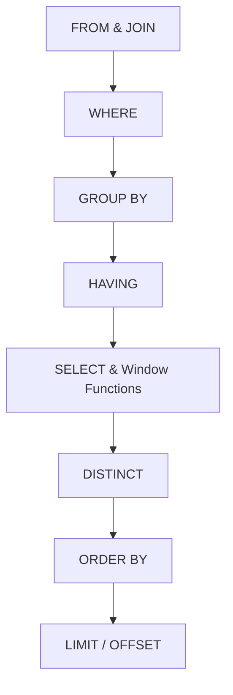
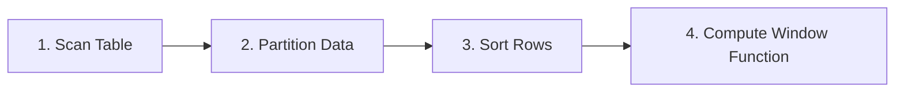

## Introduction & The "Why"

Imagine you are organizing a track-and-field meet. You have runners competing in various events (100m, 400m, 800m) and separated into different age categories (Under 18, Adult, Seniors). 

If you are asked to analyze the race results:
*   **A simple `GROUP BY`** is like looking only at the average time or the fastest time for each age group. The individuals vanish. You get a summary table showing: *Under 18: 10.4 seconds; Adult: 9.8 seconds*. The runners themselves are collapsed into a single statistical row.
*   **A window function** is like letting every runner cross the finish line, keeping their names, lanes, and individual times on the scoreboard, but adding a column that assigns their rank relative to the other runners in their specific age category.

```text
Individual Identity Kept + Group Context Displayed = Window Function
```

In data analytics, we constantly need to look at both the individual row and its group context simultaneously. For example:
*   "Show me every customer transaction, but also rank their purchases from most expensive to least expensive."
*   "Find all employee records, and flag who has the 2nd highest salary in each department."
*   "Look at web signups, and keep only the absolute earliest record for each email address (deduplication)."

Window functions allow you to perform calculations across a set of rows that are related to the current row without merging them. The rows retain their individual identity, which is why window functions are one of the most powerful and widely used features in modern SQL.

---

## Step-by-Step Concept Breakdown

### The Anatomy of a Window Function

Every window function follows a strict syntactic blueprint:

```sql
FUNCTION_NAME() OVER (
    [PARTITION BY partition_column1, partition_column2, ...]
    [ORDER BY sort_column1 [ASC|DESC], sort_column2, ...]
    [ROWS|RANGE frame_specification]
)
```

Let's dissect each component of this blueprint:

#### 1. The Function (`FUNCTION_NAME()`)
This is the instruction of *what* calculation to perform. It can be a ranking function (like `ROW_NUMBER()`, `RANK()`, or `DENSE_RANK()`), an aggregate function (like `SUM()`, `AVG()`, or `COUNT()`), or a value function (like `LAG()`, `LEAD()`, `FIRST_VALUE()`).

#### 2. The Window Trigger (`OVER`)
The `OVER` clause is the syntactic signal to the database engine: *"Treat this function as a window function, not a standard aggregate or scalar function."* Even if you leave the parentheses inside `OVER()` empty, it creates a window consisting of the entire table.

#### 3. Grouping Rows (`PARTITION BY`)
The `PARTITION BY` clause divides the result set into logical groups (partitions). The window function is calculated independently within each partition. If you omit `PARTITION BY`, the entire result set is treated as a single partition.
*   *Analogy*: Grouping runners by their age categories (e.g., Under 18 vs. Seniors).

#### 4. Ordering Rows (`ORDER BY`)
The `ORDER BY` clause inside the `OVER` clause determines the physical sequence in which the rows are processed within each partition. 
*   *Analogy*: Sequencing runners based on their finish times (fastest to slowest).
*   *Crucial Note*: The `ORDER BY` inside `OVER()` determines the order for the *window function calculations only*. It does **not** affect the final sorted output of the query (which is controlled by a standard query-level `ORDER BY` at the very end of the statement).

---

### Execution Lifecycle: Where Window Functions Run

To write correct SQL, you must understand the order in which the database executes query clauses. Standard SQL follows this sequence:



Because window functions are executed during the **SELECT** phase (Step 5), they run **after** the data has been filtered by `WHERE` and grouped by `GROUP BY`. 

This leads to a critical rule:
> [!IMPORTANT]
> You **cannot** use a window function inside a `WHERE` or `HAVING` clause. 
> If you write `WHERE ROW_NUMBER() OVER(...) = 1`, the database will throw an error because the `WHERE` clause tries to filter rows before the window numbers have even been calculated. To filter based on a window function's output, you must wrap the query in a Common Table Expression (CTE) or a subquery.

---

### ROW_NUMBER() vs. RANK() vs. DENSE_RANK()

The differences between these three ranking functions are subtle but have massive business implications. Let's compare how they handle duplicate values (ties).

Assume we are ranking sales reps by their total revenue, and we have a tie where two reps generated exactly $15,000.

| Rep Name | Revenue | ROW_NUMBER() | RANK() | DENSE_RANK() |
| :--- | :--- | :--- | :--- | :--- |
| Alice | $25,000 | **1** | **1** | **1** |
| Bob | $15,000 | **2** (arbitrary) | **2** (tie) | **2** (tie) |
| Charlie | $15,000 | **3** (arbitrary) | **2** (tie) | **2** (tie) |
| David | $10,000 | **4** | **4** (skips 3) | **3** (consecutive) |

#### Mechanics of Each Function:
1.  **`ROW_NUMBER()`**: Assigns a sequential, unique integer to each row starting at 1. If there are duplicates in the `ORDER BY` column (like $15,000), `ROW_NUMBER()` will still assign unique numbers (2 and 3). The order in which it assigns these is non-deterministic unless you provide a unique tiebreaker column in the `ORDER BY` clause.
2.  **`RANK()`**: Assigns the same rank to duplicate values. However, it **leaves gaps** in the sequence. Because two rows tied for rank 2, the next sequence number (3) is skipped, and David is assigned rank 4.
3.  **`DENSE_RANK()`**: Assigns the same rank to duplicate values but **does not leave gaps**. The sequence remains continuous. After the tie at rank 2, the next row (David) is assigned rank 3.

---

### NTILE() — Equal-Sized Bucket Distributions

`NTILE(num_buckets)` splits your partitioned rows into `num_buckets` groups, assigning a bucket number from 1 to `num_buckets` to each row. This is widely used for:
*   **Customer Segmentation**: Dividing customers into top 20% (quintiles) for marketing campaigns.
*   **Performance Tiers**: Dividing sales representatives into quartiles (4 groups).

#### What happens if the row count doesn't divide evenly?
If you have 10 rows and use `NTILE(4)`, the rows cannot be split perfectly. In this scenario, `NTILE` follows two rules:
1.  The group sizes will differ by at most 1 row.
2.  The extra rows are distributed to the first groups (starting from bucket 1).

For 10 rows split into 4 buckets:
*   Bucket 1 gets **3 rows**
*   Bucket 2 gets **3 rows**
*   Bucket 3 gets **2 rows**
*   Bucket 4 gets **2 rows**

---

## Code / Practical Walkthroughs

To run these examples, we will use three tables: `employees`, `sales_transactions`, and `website_events`.

### Schema Setup

```sql
-- Create employees table
CREATE TABLE employees (
    emp_id INT PRIMARY KEY,
    name VARCHAR(50),
    department VARCHAR(50),
    salary DECIMAL(10,2),
    hire_date DATE
);

-- Insert sample records
INSERT INTO employees VALUES
(1, 'Sarah Chen', 'Sales', 85000.00, '2022-01-15'),
(2, 'James Wilson', 'Sales', 78000.00, '2022-06-01'),
(3, 'Priya Patel', 'Sales', 85000.00, '2023-03-10'),
(4, 'Mike Johnson', 'Marketing', 72000.00, '2021-08-20'),
(5, 'Lisa Park', 'Marketing', 72000.00, '2022-11-05'),
(6, 'David Kim', 'Marketing', 68000.00, '2023-07-15'),
(7, 'Emma Davis', 'Engineering', 95000.00, '2021-03-01'),
(8, 'Alex Turner', 'Engineering', 92000.00, '2022-09-12'),
(9, 'Nina Sharma', 'Engineering', 88000.00, '2023-06-20');

-- Create sales_transactions table
CREATE TABLE sales_transactions (
    transaction_id INT PRIMARY KEY,
    rep_id INT,
    region VARCHAR(50),
    amount DECIMAL(10,2),
    transaction_date DATE
);

INSERT INTO sales_transactions VALUES
(101, 1, 'West', 15000.00, '2024-01-15'),
(102, 2, 'East', 12500.00, '2024-01-22'),
(103, 1, 'West', 28000.00, '2024-02-03'),
(104, 3, 'East', 15000.00, '2024-02-18'),
(105, 4, 'South', 8500.00, '2024-03-07'),
(106, 2, 'West', 28000.00, '2024-03-12'),
(107, 3, 'North', 12500.00, '2024-04-01'),
(108, 4, 'West', 15000.00, '2024-04-15'),
(109, 1, 'East', 8500.00, '2024-05-02'),
(110, 3, 'North', 28000.00, '2024-05-20');

-- Create website_events table
CREATE TABLE website_events (
    event_id INT PRIMARY KEY,
    user_id INT,
    event_name VARCHAR(50),
    occurred_at TIMESTAMP
);

INSERT INTO website_events VALUES
(1001, 501, 'signup', '2024-06-01 10:00:00'),
(1002, 501, 'signup', '2024-06-01 10:05:00'), -- Duplicate event!
(1003, 501, 'purchase', '2024-06-01 10:15:00'),
(1004, 502, 'signup', '2024-06-02 11:00:00'),
(1005, 502, 'purchase', '2024-06-02 11:30:00'),
(1006, 502, 'purchase', '2024-06-02 11:30:00'); -- Duplicate event!
```

---

### Walkthrough 1: Top-N Queries (Highest Salaries by Department)

In this scenario, our goal is to find the top 2 highest-paid employees in each department. If there are ties, we want to see them all.

#### Query using `DENSE_RANK()`:

```sql
-- Step 1: Write a CTE to assign ranks within each department
WITH ranked_employees AS (
    SELECT 
        name,
        department,
        salary,
        -- Group by department, sort salary descending
        DENSE_RANK() OVER (
            PARTITION BY department 
            ORDER BY salary DESC
        ) AS salary_rank
    FROM employees
)
-- Step 2: Filter the results in the outer query
SELECT 
    name,
    department,
    salary,
    salary_rank
FROM ranked_employees
WHERE salary_rank <= 2;
```

```text
# Output:
name         | department  | salary   | salary_rank
-------------|-------------|----------|------------
Emma Davis   | Engineering | 95000.00 | 1
Alex Turner  | Engineering | 92000.00 | 2
Mike Johnson | Marketing   | 72000.00 | 1
Lisa Park    | Marketing   | 72000.00 | 1
David Kim    | Marketing   | 68000.00 | 2
Sarah Chen   | Sales       | 85000.00 | 1
Priya Patel  | Sales       | 85000.00 | 1
James Wilson | Sales       | 78000.00 | 2
```

#### Step-by-Step Logic Breakdown:
1.  The database reads the `employees` table.
2.  The `PARTITION BY department` splits the employees into three temporary memory buckets: Sales, Marketing, and Engineering.
3.  Inside each bucket, `ORDER BY salary DESC` sorts the rows.
4.  `DENSE_RANK()` evaluates the rows. In Sales, both Sarah and Priya earn $85,000, so they both receive rank 1. James earns $78,000 and is assigned rank 2.
5.  The CTE completes. The outer query filters `WHERE salary_rank <= 2`, returning all rows that met the condition. Note how we got 3 rows back for Sales because of the tie.

---

### Walkthrough 2: Deduplicating Event Data (Keeping the Earliest Event)

Tracking systems often log duplicate actions due to network retries, browser double-clicks, or system bugs. We need to clean the `website_events` table and keep only the *first* signup event for each user.

#### Query using `ROW_NUMBER()`:

```sql
-- Step 1: Number the events per user, ordered by timestamp
WITH numbered_events AS (
    SELECT 
        event_id,
        user_id,
        event_name,
        occurred_at,
        ROW_NUMBER() OVER (
            PARTITION BY user_id, event_name 
            ORDER BY occurred_at ASC
        ) AS sequence_num
    FROM website_events
    WHERE event_name = 'signup'
)
-- Step 2: Keep only the first event
SELECT 
    event_id,
    user_id,
    event_name,
    occurred_at
FROM numbered_events
WHERE sequence_num = 1;
```

```text
# Output:
event_id | user_id | event_name | occurred_at
---------|---------|------------|--------------------
1001     | 501     | signup     | 2024-06-01 10:00:00
1004     | 502     | signup     | 2024-06-02 11:00:00
```

#### Step-by-Step Logic Breakdown:
1.  The CTE filters the table for only `'signup'` events.
2.  It partitions the filtered rows by `user_id` and `event_name`.
3.  It sorts each partition chronologically using `ORDER BY occurred_at ASC`.
4.  `ROW_NUMBER()` assigns sequential integers starting at 1. For `user_id` 501, event 1001 gets value 1, and event 1002 gets value 2.
5.  The outer query filters for `sequence_num = 1`, discarding the duplicate row 1002.

---

### Walkthrough 3: VIP Customer Segmentation

We want to divide our regional sales transactions into three equal tiers (High Value, Medium Value, and Low Value) to help our marketing team target promotions.

#### Query using `NTILE()`:

```sql
SELECT 
    transaction_id,
    region,
    amount,
    -- Divide transactions into 3 buckets
    NTILE(3) OVER (
        ORDER BY amount DESC
    ) AS value_tier
FROM sales_transactions;
```

```text
# Output:
transaction_id | region | amount   | value_tier
---------------|--------|----------|-----------
103            | West   | 28000.00 | 1
106            | West   | 28000.00 | 1
110            | North  | 28000.00 | 1
101            | West   | 15000.00 | 1
104            | East   | 15000.00 | 2
108            | West   | 15000.00 | 2
102            | East   | 12500.00 | 2
107            | North  | 12500.00 | 3
105            | South  | 8500.00  | 3
109            | East   | 8500.00  | 3
```

#### Step-by-Step Logic Breakdown:
1.  The query retrieves all 10 transactions.
2.  The `ORDER BY amount DESC` clause sorts all transactions from largest to smallest.
3.  The database divides the 10 rows into 3 buckets (`NTILE(3)`).
4.  Applying the uneven distribution rules:
    *   10 divided by 3 is 3 with a remainder of 1.
    *   Bucket 1 gets 4 rows (3 + 1 remainder).
    *   Bucket 2 gets 3 rows.
    *   Bucket 3 gets 3 rows.
5.  Rows are assigned their corresponding bucket number.

---

## Performance and Optimization Costs

Window functions are incredibly useful, but they do not come cheap. To write efficient production queries, you must understand their execution cost.

### How Window Functions Execute Behind the Scenes

Unlike simple table scans, window functions require the database engine to perform a physical sort operation on your data. 



When you call a window function, the database must:
1.  Scan the input dataset.
2.  Distribute the data into partitions in memory based on your `PARTITION BY` columns.
3.  Sort the data within each partition based on your `ORDER BY` columns.
4.  Evaluate the window function across the sorted partitions.

The most expensive step here is the **Sort Phase (Step 3)**. If your dataset contains millions of rows, sorting them in memory can exhaust available RAM, forcing the database to spill the data to disk (using `TempDB` in SQL Server, or temp files in Postgres/MySQL). This degrades query performance.

### Indexing Strategies: The POC Rule

To optimize window functions, you should build indexes that match your window definitions. Use the **POC Rule** (Partition, Order, Coverage) to design these indexes:

*   **Partition**: Add your `PARTITION BY` columns as the first columns in the index.
*   **Order**: Add your `ORDER BY` columns next in the index.
*   **Coverage**: Add any remaining columns referenced in the `SELECT` clause to the index using `INCLUDE` (or as trailing columns) to avoid performing lookup operations on the base table.

#### Example:
For the window function:
```sql
ROW_NUMBER() OVER (PARTITION BY department ORDER BY hire_date DESC)
```

The optimal index would be:
```sql
CREATE INDEX idx_emp_dept_hire ON employees (department, hire_date DESC);
```

This index allows the database to skip the expensive partitioning and sorting steps entirely because the data is already physically partitioned and sorted inside the index tree structure.

---

## Edge Cases & Common Mistakes

### 1. The WHERE Clause Evaluation Gotcha
As detailed in the execution lifecycle section, you cannot reference a window alias or calculation directly in the `WHERE` clause of the same query block.

*   **Incorrect Code**:
    ```sql
    -- THIS WILL FAIL!
    SELECT name, salary, 
           ROW_NUMBER() OVER (ORDER BY salary DESC) AS rn
    FROM employees
    WHERE rn = 1;
    ```
*   **Correct Code (using a CTE)**:
    ```sql
    WITH ranked AS (
        SELECT name, salary, 
               ROW_NUMBER() OVER (ORDER BY salary DESC) AS rn
        FROM employees
    )
    SELECT name, salary 
    FROM ranked
    WHERE rn = 1;
    ```

---

### 2. Non-Deterministic Output with ROW_NUMBER()
If you sort on a column with duplicate values using `ROW_NUMBER()`, the database engine will break ties arbitrarily based on how the rows are physically read from disk. This means running the same query twice can yield different results.

*   **Risky Code (Non-deterministic)**:
    ```sql
    SELECT name, department, salary,
           ROW_NUMBER() OVER (PARTITION BY department ORDER BY salary DESC) AS rn
    FROM employees;
    ```
    Sarah Chen and Priya Patel both earn $85,000. Sarah might get rank 1 today, and Priya might get rank 1 tomorrow.

*   **Safe Code (Deterministic)**:
    Add a unique column (like the primary key) as a tiebreaker to guarantee the same output every time:
    ```sql
    SELECT name, department, salary,
           ROW_NUMBER() OVER (
               PARTITION BY department 
               ORDER BY salary DESC, emp_id ASC -- emp_id guarantees determinism
           ) AS rn
    FROM employees;
    ```

---

### 3. Null Values in Ordering
By default, databases treat `NULL` values as either the absolute lowest or absolute highest possible values:
*   **Postgres / Oracle**: `NULL` is treated as the largest value.
*   **MySQL / SQL Server**: `NULL` is treated as the smallest value.

If you rank rows by salary descending, a `NULL` salary could show up at rank 1. To avoid this, use `NULLS LAST` (supported in Postgres and Oracle) or filter out nulls in your `WHERE` clause.

*   **Using NULLS LAST (Postgres)**:
    ```sql
    RANK() OVER (ORDER BY salary DESC NULLS LAST)
    ```

---

### 4. Partitioning by Columns with NULLs
If a row has a `NULL` value in the partition column, the database engine does not ignore it. Instead, it groups all rows with `NULL` partition values into a single partition and runs the window calculation across them.

---

## Practice Exercises & Mini-Projects

### Exercise 1: Finding the Second Transaction
**Goal**: Write a query that finds the second transaction made in each region. If a region has fewer than 2 transactions, it should not appear in the output.

*   *Hint*: Use a CTE and `ROW_NUMBER()`.

<details>
<summary>View Solution</summary>

```sql
WITH ranked_transactions AS (
    SELECT 
        transaction_id,
        region,
        amount,
        transaction_date,
        ROW_NUMBER() OVER (
            PARTITION BY region 
            ORDER BY transaction_date ASC
        ) AS tx_sequence
    FROM sales_transactions
)
SELECT 
    transaction_id,
    region,
    amount,
    transaction_date
FROM ranked_transactions
WHERE tx_sequence = 2;
```
</details>

---

### Exercise 2: Top Regional Earners with Ties Included
**Goal**: Find all sales transactions that represent the highest transaction amount in each region. If multiple transactions tie for the top spot, return all of them.

*   *Hint*: Think about whether to use `ROW_NUMBER()`, `RANK()`, or `DENSE_RANK()`.

<details>
<summary>View Solution</summary>

```sql
WITH regional_ranks AS (
    SELECT 
        transaction_id,
        region,
        amount,
        transaction_date,
        RANK() OVER (
            PARTITION BY region 
            ORDER BY amount DESC
        ) AS rank_amt
    FROM sales_transactions
)
SELECT 
    transaction_id,
    region,
    amount,
    transaction_date
FROM regional_ranks
WHERE rank_amt = 1;
```
</details>

---

### Exercise 3: User Event Audit Trail
**Goal**: Identify the exact event details of the two most recent events for each user in our system.

*   *Hint*: Sort the partition descending.

<details>
<summary>View Solution</summary>

```sql
WITH ordered_events AS (
    SELECT 
        event_id,
        user_id,
        event_name,
        occurred_at,
        ROW_NUMBER() OVER (
            PARTITION BY user_id 
            ORDER BY occurred_at DESC
        ) AS recency_sequence
    FROM website_events
)
SELECT 
    event_id,
    user_id,
    event_name,
    occurred_at
FROM ordered_events
WHERE recency_sequence <= 2;
```
</details>

---

## Section Recaps

*   **Window functions** perform calculations across groups of rows without collapsing the dataset, preserving individual row details.
*   **The `OVER` clause** defines the window partitions and sorting rules.
*   **`ROW_NUMBER()`** assigns unique, consecutive numbers starting at 1. Excellent for deduplication.
*   **`RANK()`** leaves gaps in sequence numbering when duplicate values occur.
*   **`DENSE_RANK()`** preserves continuous numbering without gaps when duplicate values occur.
*   **`NTILE(n)`** buckets rows into `n` groups of nearly equal sizes, which is useful for percentiles and segmentations.
*   **Performance cost** is driven by the sorting operation. Create indexes following the **POC Rule** (Partition, Order, Coverage) to optimize performance.

---

## Common Interview Questions

### Q1: What is the difference between ROW_NUMBER, RANK, and DENSE_RANK?

**Answer:**
All three functions assign integer sequences to rows based on the order defined in the `OVER` clause, but they differ in how they handle duplicate sorting values:
*   `ROW_NUMBER()` always assigns unique numbers to every row, even if the values are identical.
*   `RANK()` assigns the same number to duplicate values, but skips subsequent numbers in the sequence (e.g., 1, 2, 2, 4).
*   `DENSE_RANK()` assigns the same number to duplicate values without skipping subsequent numbers (e.g., 1, 2, 2, 3).

---

### Q2: How does a window function differ from a GROUP BY query?

**Answer:**
*   `GROUP BY` collapses the individual rows in your dataset to return a single summarized row per group. Individual row details are lost.
*   `Window Functions` calculate aggregate or ranking values over defined groupings of rows, but they append this calculation as a new column to each row in the result set. Every row keeps its unique identity.

---

### Q3: How do you write a query to find duplicates and delete all but the latest?

**Answer:**
You can identify duplicate records by partitioning by the columns that define a duplicate and ordering by the timestamp column in descending order.

```sql
WITH duplicate_audit AS (
    SELECT 
        row_id,
        ROW_NUMBER() OVER (
            PARTITION BY duplicate_column_1, duplicate_column_2 
            ORDER BY created_at DESC
        ) AS rn
    FROM my_table
)
DELETE FROM my_table
WHERE row_id IN (
    SELECT row_id 
    FROM duplicate_audit 
    WHERE rn > 1
);
```

---

### Q4: What is NTILE, and how are rows divided if the count is not divisible?

**Answer:**
`NTILE(n)` divides an ordered partition of rows into `n` buckets, assigning a bucket number from 1 to `n` to each row. 
If the total number of rows is not perfectly divisible by `n`, `NTILE` distributes the remaining rows starting with bucket 1. The maximum difference in size between any two buckets will be at most 1 row. For example, dividing 11 rows into 3 buckets results in Bucket 1 getting 4 rows, Bucket 2 getting 4 rows, and Bucket 3 getting 3 rows.

---

### Q5: Why can't we use window functions in WHERE clauses, and how do we bypass this limitation?

**Answer:**
Under the SQL standard execution order, the `WHERE` clause runs before the `SELECT` clause. Because window functions are calculated during the `SELECT` phase, the calculations have not yet run when the `WHERE` clause filters rows. 
To bypass this, we wrap the query with the window function in a CTE or a subquery. This makes the window calculation output available to the outer query, which runs a separate `WHERE` filter on the calculated column.
