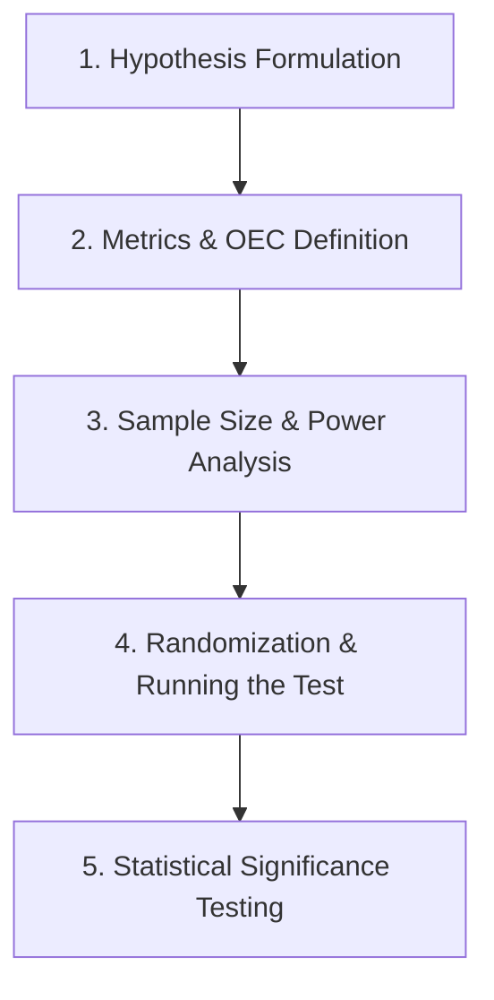

## Why This Matters

A/B testing is the gold standard for causal inference in data-driven companies. Without a rigorous experimentation framework, business leaders often fall victim to the "HIPPO" (Highest Paid Person's Opinion) effect, launching features that hurt metrics or wasting development resources on flat designs. Designing tests with proper power analysis, monitoring for execution slips via A/A tests, and avoiding early-stopping bias ensures that product decisions are backed by true mathematical significance rather than random noise.

---

## The Analogy: Testing a New Drug vs. Placebo

Imagine a pharmaceutical company developing a new pill designed to lower blood pressure. They cannot simply give it to a few patients, observe a decrease, and declare success. 

```text
    Placebo Group (A)                      Treatment Group (B)
  ┌───────────────────┐                  ┌───────────────────┐
  │ Given sugar pill  │                  │ Given new formula │
  │ Establishes base  │                  │ Evaluates impact  │
  └─────────┬─────────┘                  └─────────┬─────────┘
            │                                      │
            └───────────────┬──────────────────────┘
                            ▼
              Is the difference real or noise?
```

* **The Placebo Group (A):** Establishes the baseline. Some patients' blood pressure will drop naturally due to psychological factors or daily fluctuations (random noise).
* **The Treatment Group (B):** Receives the actual drug.
* **The Clinical Question:** Is the average drop in Group B large enough that it is mathematically impossible to attribute to random chance? If we only test 5 patients per group, even a miracle drug might look like a fluke (underpowered). If we test 10,000 patients, we will detect even the tiniest change, but we might spend millions of dollars to prove a drop of 0.1 mmHg, which has zero clinical value (economically insignificant).

A/B testing in software operates on the exact same principles. The sugar pill is the current layout (Control), the new drug is the redesigned checkout (Treatment), and the blood pressure change is your conversion rate or revenue.

---

## Step-by-Step Concept Breakdown: The A/B Test Lifecycle

A professional experimentation program follows a structured 5-step lifecycle:



### 1. Hypothesis Formulation
State clearly what change you are making and the expected impact.
* **Bad Hypothesis:** "Let's make the signup button green and see what happens."
* **Good Hypothesis:** "By changing the signup button color from blue to green (Change), we will increase the visibility of the primary call-to-action, leading to a 5% relative increase in registration rate (Impact)."

### 2. Metrics & Overall Evaluation Criterion (OEC)
Do not just monitor a single metric. You must track a hierarchy of metrics:
* **Primary Metric (OEC):** The single, long-term metric used to make the go/no-go decision. It balances short-term wins and long-term health. For example, search engine companies don't just optimize for Click-Through Rate (CTR) on ads; they use an OEC that balances ad revenue with user retention (search query volume per user).
* **Secondary Metrics:** Supporting metrics that explain *why* the primary metric changed (e.g., add-to-cart rate, page load speed).
* **Guardrail Metrics:** Metrics that must not degrade (e.g., page-load latency, customer unsubscribe rate, error rates).

### 3. Sample Size Calculation (Power Analysis)
Before collecting any data, you must calculate exactly how many users need to enter your experiment. Running a test without this calculation is like sailing a ship without a map.

### 4. Randomization Engine
Every user must have an equal, independent probability of being assigned to either Control (A) or Treatment (B). This is typically done using hashing:
$$\text{hash}(\text{User ID} + \text{Experiment Salt}) \pmod{100} < 50 \implies \text{Group A}$$
This ensures assignments are deterministic, user-consistent, and balanced.

### 5. Significance Testing
Once the target sample size is reached, run a statistical test (such as a two-proportion z-test or Welch's t-test) to calculate the p-value and confidence intervals.

---

## Power Analysis: The Four Levers

Power Analysis is the mathematical relationship between four variables. If you know three of them, you can solve for the fourth.

```text
                 The Four Levers of Power Analysis
  ┌──────────────────────────────────────────────────────────────┐
  │  1. Alpha (α)                  2. Power (1 - β)              │
  │     False Positive Rate           Probability of detecting    │
  │     (Industry default: 5%)        effects (Default: 80%)      │
  ├──────────────────────────────────────────────────────────────┤
  │  3. MDE (Min. Detectable)      4. Sample Size (N)            │
  │     Smallest lift that is         Number of subjects needed   │
  │     worth detecting               per variant                 │
  └──────────────────────────────────────────────────────────────┘
```

### 1. Significance Level ($\alpha$)
The probability of rejecting the null hypothesis when it is actually true (Type I error / False Positive). 
* *Industry standard:* $\alpha = 0.05$. You accept a 5% chance of declaring a winner when the change did nothing.

### 2. Statistical Power ($1 - \beta$)
The probability of correctly rejecting the null hypothesis when a true effect exists (detecting a real winner). $\beta$ is the Type II error rate (False Negative).
* *Industry standard:* $1 - \beta = 0.80$. You accept a 20% chance of missing a true winner.

### 3. Minimum Detectable Effect (MDE)
The smallest relative change in your metric that you care about detecting.
* **Trade-off:** Lower MDE (detecting tiny changes) requires exponentially larger sample sizes. If you want to detect a 1% lift, you need many more users than if you want to detect a 10% lift.

$$\text{Approximate Sample Size Formula for Proportions: } N \approx \frac{16 \sigma^2}{\delta^2}$$

Where $\sigma^2$ is the baseline variance, and $\delta$ is the absolute difference (MDE) you want to detect. Notice that the sample size is inversely proportional to the *square* of the MDE! Halving your MDE requires **four times** the sample size.

---

## Code Walkthrough: Sample Size Calculation

Let's calculate the required sample size per variant for a website with a baseline conversion rate of 10%. The product team wants to detect a relative lift of 10% (which means an absolute increase from 10% to 11%, so MDE = 1%).

```python
import numpy as np
import scipy.stats as stats
import statsmodels.stats.api as sms

# Baseline conversion rate (p1) and target conversion rate (p2)
baseline_cr = 0.10
relative_lift = 0.10
target_cr = baseline_cr * (1 + relative_lift) # 0.11

# Calculate Effect Size using Cohen's h for proportions
effect_size = sms.proportion_effectsize(baseline_cr, target_cr)

# Run Power Analysis
power_analysis = sms.NormalIndPower()
required_n = power_analysis.solve_power(
    effect_size=effect_size,
    power=0.80,
    alpha=0.05,
    ratio=1.0, # Equal allocation between groups
    alternative='two-sided'
)

print(f"Baseline Conversion Rate: {baseline_cr * 100:.1f}%")
print(f"Target Conversion Rate: {target_cr * 100:.1f}% (Relative Lift: {relative_lift * 100:.1f}%)")
print(f"Required Sample Size per variant: {int(np.ceil(required_n)):,}")
print(f"Total Traffic Needed: {int(np.ceil(required_n)) * 2:,}")
```

```text
# Output:
Baseline Conversion Rate: 10.0%
Target Conversion Rate: 11.0% (Relative Lift: 10.0%)
Required Sample Size per variant: 14,744
Total Traffic Needed: 29,488
```

---

## A/A Testing: Auditing the System

Before you trust your A/B testing framework, you must run A/A tests. In an A/A test, you split your users into two groups but serve them the **exact same page**.

```text
     A/A Test Pipeline (Same experience in both groups)
  ┌────────────────────────────────────────────────────────┐
  │                  Traffic (100% Users)                  │
  └───────────────────────────┬────────────────────────────┘
                              ▼
                       [ Hashing Engine ]
               ┌──────────────┴──────────────┐
               ▼                             ▼
         Group A1 (Control)            Group A2 (Control)
         Serve: Blue Button            Serve: Blue Button
```

### Why run an A/A test?
1. **Verify the Randomization Engine:** If your hashing function has a bias, one group might naturally have higher-value customers. An A/A test checks for this.
2. **Verify the False Positive Rate ($\alpha$):** If you run 1,000 independent A/A tests at $\alpha = 0.05$, exactly 5% (50 tests) should return a significant p-value ($p < 0.05$). If your system flags 15% of A/A tests as significant, your system is broken (e.g., data pipeline leaks, telemetry delay differences).
3. **Determine Baseline Variance:** It allows you to calculate the actual standard deviation of your metrics under natural conditions.

---

## Code Walkthrough: Analyzing a Finished A/B Test

Once the test completes, you analyze the results using a two-proportion z-test.

```python
from statsmodels.stats.proportion import proportions_ztest

# Completed experiment data
visitors_control = 15000
conversions_control = 1500

visitors_treatment = 15100
conversions_treatment = 1620

# Formulate count and observation arrays
count = np.array([conversions_treatment, conversions_control])
nobs = np.array([visitors_treatment, visitors_control])

# Compute Two-Proportion z-test
stat, p_val = proportions_ztest(count, nobs, alternative='two-sided')

cr_control = conversions_control / visitors_control
cr_treatment = conversions_treatment / visitors_treatment
relative_lift = (cr_treatment - cr_control) / cr_control

print(f"Control Conversion Rate: {cr_control:.4f}")
print(f"Treatment Conversion Rate: {cr_treatment:.4f}")
print(f"Relative Lift: {relative_lift * 100:.2f}%")
print(f"Z-statistic: {stat:.4f}, p-value: {p_val:.4f}")
```

```text
# Output:
Control Conversion Rate: 0.1000
Treatment Conversion Rate: 0.1073
Relative Lift: 7.28%
Z-statistic: 2.3023, p-value: 0.0213
```

* **Interpretation:** The relative lift is 7.28%. The p-value of $0.0213 < 0.05$ indicates that we reject the null hypothesis. The lift in conversions is statistically significant.

---

## Pitfalls & Sins of Experimentation

### 1. The Peeking Sin (Early Stopping)
This is the most common mistake made by practitioners. A product manager launches a test, checks the p-value every morning, and stops the test the moment it hits $p < 0.05$.

```text
         The Peeking Problem (p-value fluctuation over time)
  p-value
   1.0 ┼────────────────────────────────────────────────────────
       │   /\
       │  /  \    /\
   0.5 ┼─/────\──/──\───────────────────────────────────────────
       │/      \/    \       /\
  0.05 ┼──────────────\─────/──\─────── [ Significance Line ]
       │               \___/    \______
       └──────────────────────────────────────────────────────── Time
                        ▲
                     PEEKED HERE! Stopped test prematurely.
```

**Why this is a sin:** Because of random fluctuations, the p-value will cross the 0.05 threshold multiple times during the course of a test, even if there is absolutely no difference between Control and Treatment. If you peek and stop early, you are selecting for the random peaks, inflating your true Type I error rate from 5% to **30% or more!**
* *The Rule:* You must calculate the sample size upfront and only check the p-value once you have reached that target.

### 2. The Multiple Comparisons Trap
If you track 20 different metrics (add-to-cart, home page clicks, logout clicks, page scroll depth, etc.) and run a significance test on all of them at $\alpha = 0.05$, the probability of finding at least one false positive is:
$$1 - (0.95)^{20} \approx 64\%$$
You are almost guaranteed to find a "winner" purely by chance.
* *Fix:* Use corrections like **Bonferroni Correction** ($\alpha_{new} = \alpha / m$, where $m$ is the number of metrics) or limit decisions to a single pre-declared OEC.

### 3. Novelty Effects vs. Learning Effects
* **Novelty Effect:** Users are attracted to a new design because it is new. Click rates spike initially but decay back to baseline once the novelty wears off.
* **Learning Effect (Usability Hit):** Users struggle with a new layout because their muscle memory is disrupted. Performance drops initially but improves over time as users learn the new interface.
* *Mitigation:* Run the test for a minimum duration (typically 2 full business weeks) to allow behavior to stabilize, and segment metrics by "New Users" vs. "Returning Users".

---

## Edge Cases & Gotchas

### 1. Ignoring Day-of-Week Seasonality
Even if you hit your sample size in 4 days, you must not stop the test. User behavior on weekends (e.g., higher mobile usage, relaxed browsing) differs significantly from weekdays. 
* **Rule:** Run experiments in full weekly cycles (usually 14 days) to capture complete seasonality.

### 2. Network Effects (Interference)
In social networks or marketplaces (e.g., Uber, eBay), the action of a treatment user affects control users. For instance, if treatment drivers get higher ride matches, they take rides away from control drivers in the same region. This violates the Stable Unit Treatment Value Assumption (SUTVA).
* **Fix:** Use cluster-based randomization (e.g., randomizing by city instead of individual user) or switchback testing (switching the whole city between treatment and control every hour).

<div class="interview-tip">
If asked how to handle the peeking problem in interviews, explain that the standard solution is to commit to a fixed sample size determined by power analysis before the test. If business needs require real-time monitoring and early stopping, suggest sequential testing frameworks (like Wald's Sequential Probability Ratio Test - SPRT) which adjust significance thresholds continuously.
</div>

---

## Practice Exercises & Mini-Projects

<div class="challenge">
### Challenge 1: The Premium Pricing Experiment
A SaaS company wants to test a pricing page redesign.
* Baseline Conversion Rate: 5%
* MDE: 5% relative lift (meaning a target rate of 5.25%)
* Significance Level: 5%
* Power: 80%

Calculate the sample size required using Python. What is the impact on sample size if the product manager insists on detecting a 2% relative lift instead? Write down both sample sizes.
</div>

<div class="challenge">
### Challenge 2: Peeking Simulator
Write a Python simulation where you generate two groups with the exact same conversion rate (A/A test) of 10%. 
1. Simulate 10,000 users entering each group sequentially.
2. Calculate the p-value after every 100 users.
3. Track how many times the p-value dips below 0.05 at any point during the run.
4. Run this simulation 100 times. What percentage of these A/A tests would have been incorrectly stopped as "winners" if the product manager peeked and stopped early?
</div>

---

## Section Recaps

* **The OEC** is the north-star metric of an experiment, balancing immediate wins with long-term platform health.
* **Power analysis** ensures you collect enough data to detect your MDE without wasting traffic or time.
* **A/A tests** are critical diagnostic runs used to verify randomization and rule out pipeline bugs.
* **Early stopping (peeking)** without sequential correction is a statistical sin that inflates false positives.
* **Network effects** violate independence assumptions; they require cluster randomization or switchback designs.

---

## Common Interview Questions

### Q1: What is statistical power, and what are the levers we can pull to increase it? Explain the trade-offs of each.
**Answer:**
Statistical power ($1 - \beta$) is the probability of correctly rejecting the null hypothesis when a true difference exists between the control and treatment. In other words, it is the probability that our experiment will successfully detect a real winner. The standard industry target is 80%.

To increase statistical power, we can adjust the following four levers:
1. **Increase Sample Size ($N$):** 
   * *Mechanism:* More data reduces standard error, making the test statistic more precise.
   * *Trade-off:* Running the test longer increases time-to-market and developer waiting times.
2. **Increase the Minimum Detectable Effect (MDE):**
   * *Mechanism:* Larger effects are easier to detect.
   * *Trade-off:* You will miss smaller, incremental lifts that are still economically valuable to the business.
3. **Increase the Significance Level ($\alpha$):**
   * *Mechanism:* Raising $\alpha$ (e.g., from 5% to 10%) makes it easier to reject the null.
   * *Trade-off:* This directly increases the Type I error rate (false positive risk).
4. **Reduce Metric Variance ($\sigma^2$):**
   * *Mechanism:* You can use homogeneous cohorts, covariate adjustment (e.g., CUPED), or switch to less noisy metrics (e.g., binarizing a highly skewed continuous variable).
   * *Trade-off:* CUPED requires historical user data and engineering complexity; binarizing variables throws away raw scale information.

### Q2: Why is it problematic to stop an A/B test early as soon as the p-value drops below 0.05? Explain the concept of "peeking."
**Answer:**
Stopping a test early based on the p-value crossing the significance threshold is known as **peeking bias** or the **early-stopping problem**. 

A p-value is calculated under the assumption that the sample size is fixed *prior* to running the test. When you check the p-value repeatedly (e.g., daily) and stop as soon as it drops below 0.05, you are performing multiple hypothesis tests. Even if the null hypothesis is true (no difference), the sample statistics will fluctuate randomly. Over time, the p-value will occasionally dip below 0.05 by chance.

If you stop the experiment immediately at that moment, you lock in the false positive. However, if you let the experiment continue to its calculated sample size, the p-value would likely float back up. By peeking, you fail to allow the random fluctuations to regress to the mean. Mathematically, peeking 10 times during a test can inflate your true Type I error rate from 5% to over 15%, rendering your statistical claims invalid.

### Q3: What is an A/A test, how does it help audit an experimentation platform, and what percentage of A/A tests should theoretically return a p-value < 0.05?
**Answer:**
An A/A test is an experiment where both Group A and Group B are served the exact same user experience. 

It helps audit the experimentation platform in three ways:
1. **Validating Randomization:** If we run an A/A test and find a statistically significant difference in customer attributes (e.g., historical spending, device ratios), it indicates the hashing engine or user allocation system is biased.
2. **Checking the False Positive Rate:** By running thousands of simulated or live A/A tests, we count how often the system flags a significant difference. If we use a significance level of $\alpha = 0.05$, then **exactly 5%** of A/A tests should return a p-value $< 0.05$ purely due to random chance. If the empirical rate is much higher (e.g., 12%), it indicates a bug in our calculation pipelines or data lag.
3. **CUPED Calibration:** It provides the clean historical variance data required to run variance reduction techniques.

### Q4: What is the Overall Evaluation Criterion (OEC), and how does it differ from a local conversion metric? Give a real business example.
**Answer:**
An Overall Evaluation Criterion (OEC) is a single, composite metric that serves as the decision-making driver for an experiment. It combines short-term indicators (such as click-through rates) with long-term indicators of platform health, business value, and user satisfaction to prevent teams from optimizing local metrics at the expense of global business objectives.

**Example:**
Suppose an e-commerce platform tests a search page update. 
* **Local Metric:** Search page CTR. The team could add aggressive, clickbait badges to items, which spikes the CTR locally.
* **The Downside:** Users get frustrated by poor quality recommendations, return their purchases, and cancel subscriptions.
* **OEC Approach:** Instead of CTR, the OEC is defined as:
  $$\text{OEC} = \text{Conversion Rate} + 0.5 \times \text{Customer Satisfaction Score (1-5)} - 2 \times \text{Return Rate}$$
By incorporating returns and user feedback into a single metric, the team is forced to optimize for long-term customer value rather than short-term clicks.

### Q5: How do novelty effects and learning effects skew A/B test results, and how can you mitigate them?
**Answer:**
Both novelty and learning effects represent temporal changes in user behavior when introduced to a new feature:

1. **Novelty Effect:**
   * *Phenomenon:* Users interact with a new button or layout because it is novel and different. This creates a temporary spike in engagement (positive lift). Over time, the novelty wears off, and engagement returns to baseline.
   * *Risk:* Declaring a feature a winner based on early data, only to find no long-term business value after full rollout.

2. **Learning Effect (Usability Hit):**
   * *Phenomenon:* Users are accustomed to a specific navigation path. When you change it, their muscle memory is disrupted, causing confusion, higher task completion times, or drop-offs (negative lift). Once users learn the new pattern, performance recovers and may exceed the baseline.
   * *Risk:* Killing a structurally superior feature prematurely because of early negative metrics.

**Mitigation Strategies:**
* **Run Tests Longer:** Let experiments run for at least 2-4 weeks to allow user behavior to stabilize.
* **Cohort Segmentation:** Analyze the results by segmenting users into **New Users** (who have no bias or muscle memory) vs. **Returning Users** (who are susceptible to both effects). If a feature shows a positive lift for new users but a negative lift for returning users, it points to a learning effect that will disappear over time.
