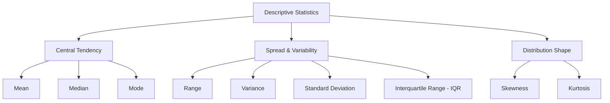

## Why This Matters

Before running complex models or launching testing programs, you must know what your data looks like. Descriptive statistics provides the initial baseline mapping of your features, revealing where values cluster, how widely they disperse, and whether outliers or structural skews will distort your downstream business insights and machine learning models.

---

## The Visual Analogy: The Seesaw vs. The Lined-Up Family

When we summarize data, we try to reduce millions of rows into a few key metrics. To understand the two most common measures of central tendency, we can use two distinct physical models:

### 1. The Mean as a Seesaw's Balance Point
Imagine a seesaw with blocks placed along its plank. Each block represents a data point. The arithmetic **Mean** is the exact location of the fulcrum (the pivot point) where the seesaw balances perfectly. 

```text
               Mean (Fulcrum) = Balance Point
              
                 [Data]                   [Data]  [Data]
       ┌───────────■────────────────────────■───────■───────────┐
                               ▲
                       (Balance Point)
```

If you place a block extremely far to the right (an outlier), the seesaw tilts immediately. To keep it balanced, you must slide the fulcrum (the mean) significantly to the right. This is why the mean is highly sensitive to extreme outliers.

### 2. The Median as the Middle Child in a Lined-Up Family
Now, imagine a family of five children lined up by their height, from shortest to tallest. The **Median** is simply the middle child standing in the 3rd position. 

```text
       Shortest                                           Tallest
        [Child]      [Child]      [Child]      [Child]    [Child]
          1st          2nd          3rd          4th        5th
                                     ▲
                              Median (Middle)
```

It does not matter if the tallest child undergoes a growth spurt and grows to 10 feet tall; the middle child is still the 3rd child. The median remains completely unchanged. This is why the median is robust to outliers.

---

## Step-by-Step Concept Breakdown

Descriptive statistics is divided into three core categories: **Central Tendency** (where the middle is), **Spread/Variability** (how spread out the data is), and **Shape** (how the data is distributed).



### 1. Central Tendency
Central tendency describes the center or typical value of a distribution.

#### The Mean (Arithmetic Average)
Mathematically, the population mean ($\mu$) and sample mean ($\bar{x}$) are calculated by summing all observations ($X_i$) and dividing by the total number of observations ($N$ or $n$):

$$\bar{x} = \frac{\sum_{i=1}^{n} X_i}{n}$$

* **Pros:** Every data point contributes to the calculation, making it mathematically stable and useful for algebraic manipulation.
* **Cons:** Highly sensitive to outliers. A single massive value pulls the mean toward it.

#### The Median (Middle Value)
The median is the value that splits the ordered dataset exactly in half. 
* To find the median, sort the data from smallest to largest:
  * If $n$ is **odd**, the median is the value at index $\frac{n+1}{2}$.
  * If $n$ is **even**, the median is the average of the two middle values at indexes $\frac{n}{2}$ and $\frac{n}{2} + 1$.
* **Pros:** Completely immune to extreme outliers.
* **Cons:** Ignores the actual magnitude of values on either side of the center.

#### The Mode (Most Frequent Value)
The mode is the value that occurs most frequently in the dataset.
* A dataset can have one mode (unimodal), two modes (bimodal), multiple modes (multimodal), or no mode at all if all values are unique.
* **Pros:** The only measure of central tendency applicable to nominal categorical data (e.g., "Which marketing channel converted the most users?").
* **Cons:** Often useless for continuous variables (e.g., transaction amounts to the penny) because every transaction might have a unique value.

---

### 2. Spread and Variability
Knowing the center is not enough. Two groups of customers might both spend an average of \$100 per month, but Group A consists of customers who all spend exactly \$100, while Group B consists of half who spend \$0 and half who spend \$200. We measure this difference using variability.

#### The Range
The difference between the maximum and minimum values in a dataset:

$$\text{Range} = X_{\text{max}} - X_{\text{min}}$$

* **Gotcha:** The range only uses two values. If one customer spends \$10,000 and everyone else spends \$5, the range suggests massive variability throughout the entire dataset, which is misleading.

#### Variance ($s^2$)
Variance measures the average squared deviation of each data point from the mean. It tells us how far, on average, the values are from the center.

$$\text{Sample Variance } (s^2) = \frac{\sum_{i=1}^{n} (X_i - \bar{x})^2}{n - 1}$$

$$\text{Population Variance } (\sigma^2) = \frac{\sum_{i=1}^{N} (X_i - \mu)^2}{N}$$

#### Why $n - 1$? Explaining Bessel's Correction
When calculating **sample variance**, we divide by $n - 1$ instead of $n$. This is called **Bessel's Correction**. 
* **The Reason:** A sample is only a subset of the population. By definition, sample data points are naturally closer to their own sample mean ($\bar{x}$) than they are to the true population mean ($\mu$). 
* If we divided by $n$, our sample variance calculation would consistently underestimate the true population variance. 
* Dividing by a slightly smaller number ($n - 1$) increases the resulting variance slightly, correcting this systematic downward bias and making the sample variance an unbiased estimator of the population variance.

#### Standard Deviation ($s$ or $\sigma$)
Standard deviation is the square root of the variance:

$$s = \sqrt{s^2}$$

* **Why it exists:** Variance is measured in squared units (e.g., "squared dollars" or "squared kilograms"), which makes no physical sense to report. Taking the square root returns the metric to the original unit of measurement (e.g., dollars or kilograms), making it intuitive to explain.

#### Interquartile Range (IQR)
The IQR is the range of the middle 50% of the dataset. It is calculated by subtracting the 25th percentile ($Q_1$) from the 75th percentile ($Q_3$):

$$\text{IQR} = Q_3 - Q_1$$

* Percentiles split sorted data into 100 equal parts:
  * **$Q_1$ (25th percentile):** 25% of data lies below this value.
  * **$Q_2$ (50th percentile/Median):** 50% of data lies below this value.
  * **$Q_3$ (75th percentile):** 75% of data lies below this value.
* **Why it's useful:** Unlike standard deviation, the IQR is resistant to outliers because it completely ignores the bottom 25% and top 25% of the data.

```text
                   ┌───────────────┬───────────────┐
      ───│─────────│               │               │─────────│───
        Min        Q1            Median            Q3       Max
                   └───────────────┴───────────────┘
                           IQR = Q3 - Q1
```

---

### 3. Distribution Shape
A distribution's shape tells us how the values are distributed relative to the center.

#### Skewness
Skewness measures the asymmetry of a distribution.

```text
       Negative Skew                   Symmetric                    Positive Skew
      (Left-Tailed)                   (Bell-Curve)                 (Right-Tailed)
      
          ┌───┐                          ┌───┐                          ┌───┐
         /     \                        /     \                        /     \
      __/       \                      /       \                      /       \__
      
  Mean < Median < Mode             Mean = Median = Mode          Mode < Median < Mean
```

* **Positive Skew (Right-Skewed):** The tail extends to the right. Most values are clustered on the left (low values), with a few extremely high values pulling the mean to the right. 
  * *Relationship:* $\text{Mode} < \text{Median} < \text{Mean}$
  * *Real-world example:* Household income, customer lifetime value.
* **Negative Skew (Left-Skewed):** The tail extends to the left. Most values are clustered on the right (high values), with a few low values pulling the mean to the left.
  * *Relationship:* $\text{Mean} < \text{Median} < \text{Mode}$
  * *Real-world example:* Age at retirement, exam scores on an easy test.
* **Zero Skew:** Perfectly symmetrical (e.g., standard normal distribution).
  * *Relationship:* $\text{Mean} = \text{Median} = \text{Mode}$

#### Kurtosis
Kurtosis measures the "tailedness" of a distribution, indicating how often extreme outliers occur.

```text
    Leptokurtic (Kurtosis > 0)    Mesokurtic (Kurtosis = 0)     Platykurtic (Kurtosis < 0)
    Tall, thin, fat tails         Normal Bell Curve             Flat top, thin tails
           /\                            /\                            ┌───┐
          /  \                          /  \                          /     \
        _/    \_                       /    \                        /       \
      ──────────────                 ──────────                    ─────────────
```

* **Mesokurtic (Kurtosis = 0 / Excess Kurtosis = 0):** The distribution has the same outlier frequency as a normal distribution.
* **Leptokurtic (Kurtosis > 0 / Excess Kurtosis > 0):** The distribution is highly peaked near the center and has thick, fat tails. This means extreme positive or negative outliers are much more common than in a normal distribution.
  * *Real-world example:* Daily changes in stock prices (heavy tail risk).
* **Platykurtic (Kurtosis < 0 / Excess Kurtosis < 0):** The distribution has a flatter peak and very thin tails. Outliers are rare.
  * *Real-world example:* Uniform distributions (e.g., rolling a fair die).

---

## Code & Practical Walkthroughs

Let's explore descriptive statistics using Python and Pandas on real-world datasets.

### Example 1: E-commerce Order Value Analysis (Handling Skew & Outliers)
In this scenario, we analyze sales transactions for an online retailer. E-commerce transaction datasets often feature highly right-skewed data due to a few high-value enterprise purchases.

```python
import numpy as np
import pandas as pd

# 1. Generate mock transaction data
np.random.seed(42)
n_transactions = 1000

# Base transactions: standard consumer orders around $20 to $150
consumer_orders = np.random.normal(loc=75.0, scale=25.0, size=950)

# Outlier orders: corporate buyers spending large sums
corporate_orders = np.random.exponential(scale=1200.0, size=50) + 200

# Combine and ensure positive values
all_orders = np.concatenate([consumer_orders, corporate_orders])
all_orders = np.clip(all_orders, a_min=5.0, a_max=None)

df_sales = pd.DataFrame({"order_value": all_orders})

# 2. Compute central tendency metrics
mean_val = df_sales["order_value"].mean()
median_val = df_sales["order_value"].median()
# Rounding values to find the mode on grouped intervals
mode_val = df_sales["order_value"].round(-1).mode()[0] 

# Trimmed Mean: exclude top and bottom 5% of data to see core user average
trimmed_mean_val = df_sales["order_value"].clip(
    lower=df_sales["order_value"].quantile(0.05),
    upper=df_sales["order_value"].quantile(0.95)
).mean()

print("--- Central Tendency Metrics ---")
print(f"Mean Order Value:         ${mean_val:.2f}")
print(f"Median Order Value:       ${median_val:.2f}")
print(f"Mode (Rounded to $10s):   ${mode_val:.2f}")
print(f"Trimmed Mean (Middle 90%):${trimmed_mean_val:.2f}")
```

```text
# Output:
--- Central Tendency Metrics ---
Mean Order Value:         $131.78
Median Order Value:       $76.10
Mode (Rounded to $10s):   $70.00
Trimmed Mean (Middle 90%):$82.54
```

Notice that the **mean (\$131.78)** is almost double the **median (\$76.10)**. This is a classic indicator of a right-skewed distribution. The few high-ticket corporate orders pull the seesaw's balance point (mean) upward, whereas the middle child (median) is unaffected.

Now let's compute the variability and shape of the transaction distribution:

```python
# 3. Compute spread and shape
std_dev = df_sales["order_value"].std()  # Pandas defaults to sample std (N-1)
variance = df_sales["order_value"].var()  # Pandas defaults to sample variance (N-1)
min_val = df_sales["order_value"].min()
max_val = df_sales["order_value"].max()
order_range = max_val - min_val

q1 = df_sales["order_value"].quantile(0.25)
q3 = df_sales["order_value"].quantile(0.75)
iqr = q3 - q1

skewness = df_sales["order_value"].skew()
kurt = df_sales["order_value"].kurt() # Pandas returns excess kurtosis (Normal = 0)

print("\n--- Spread & Shape Metrics ---")
print(f"Range:                    ${order_range:.2f} (Min: ${min_val:.2f}, Max: ${max_val:.2f})")
print(f"Variance:                 {variance:.2f}")
print(f"Standard Deviation:       ${std_dev:.2f}")
print(f"IQR:                      ${iqr:.2f} (Q1: ${q1:.2f}, Q3: ${q3:.2f})")
print(f"Skewness:                 {skewness:.2f}")
print(f"Excess Kurtosis:          {kurt:.2f}")
```

```text
# Output:

--- Spread & Shape Metrics ---
Range:                    $6222.18 (Min: $5.00, Max: $6227.18)
Variance:                 131454.12
Standard Deviation:       $362.57
IQR:                      $42.50 (Q1: $58.55, Q3: $101.05)
Skewness:                 8.75
Excess Kurtosis:          100.99
```

An excess kurtosis of **100.99** indicates that the distribution has extremely fat tails (leptokurtic) compared to a normal distribution (excess kurtosis of 0). The skewness of **8.75** confirms a strong positive skew.

---

### Example 2: Employee Payroll Analysis (Detecting Disparities & Auditing Spread)
In this example, we examine a company's salary structure across different departments to audit pay equity and spot outliers.

```python
import pandas as pd

# Create employee dataset
payroll_data = {
    "employee_id": range(1, 11),
    "department": ["Engineering", "Engineering", "Engineering", "Engineering", "Sales", "Sales", "Sales", "HR", "HR", "Executive"],
    "salary": [120000, 125000, 118000, 130000, 70000, 75000, 180000, 60000, 65000, 450000]
}

df_payroll = pd.DataFrame(payroll_data)

# Aggregate descriptive statistics by department
dept_stats = df_payroll.groupby("department")["salary"].agg(
    Count="count",
    Mean="mean",
    Median="median",
    Std_Dev="std",
    Min="min",
    Max="max"
)

# Calculate IQR for each department
dept_stats["IQR"] = df_payroll.groupby("department")["salary"].apply(lambda x: x.quantile(0.75) - x.quantile(0.25))

print("--- Salary Statistics by Department ---")
print(dept_stats)
```

```text
# Output:
--- Salary Statistics by Department ---
             Count          Mean    Median        Std_Dev     Min     Max      IQR
department                                                                        
Engineering      4  123250.000000  122500.0    5315.072905  118000  130000   6500.0
Executive        1  450000.000000  450000.0            NaN  450000  450000      0.0
HR               2   62500.000000   62500.0    3535.533906   60000   65000   2500.0
Sales            3  108333.333333   75000.0   62115.483845   70000  180000  55000.0
```

<div class="interview-tip">
Notice that the standard deviation for the <b>Executive</b> department is <code>NaN</code>. This occurs because the department has only one employee ($n=1$). When calculating sample standard deviation, the denominator is $n-1$, which equals $0$. Dividing by zero yields an undefined result. Keep this in mind when computing statistics on small groupings.
</div>

From this summary, we can also see that the **Sales** department has a mean salary of \$108,333, but a median of \$75,000. The standard deviation is \$62,115, and the range spans from \$70,000 to \$180,000. The high mean and standard deviation are driven by a single high earner (\$180,000), which distorts the typical compensation metrics for Sales.

---

### Example 3: Website Load Times (System Latency SLA Auditing)
Engineers monitor page load latency to ensure a fast user experience. Let's analyze website page load times in seconds.

```python
import pandas as pd

# Load times in seconds
load_times = [0.24, 0.31, 0.28, 0.45, 0.35, 12.40, 0.29, 0.38, 0.41, 0.33, 0.27, 0.36]
df_latency = pd.DataFrame({"load_time_sec": load_times})

# Standard summary
summary = df_latency["load_time_sec"].describe(percentiles=[0.5, 0.9, 0.95, 0.99])
print("--- Page Load Time Diagnostics ---")
print(summary)
```

```text
# Output:
--- Page Load Time Diagnostics ---
count    12.000000
mean      1.339167
std       3.483863
min       0.240000
50%       0.340000
90%       0.446000
95%       5.827500
99%      11.743100
max      12.400000
Name: load_time_sec, dtype: float64
```

* The **median load time (50%) is 0.34 seconds**, which indicates excellent performance for the majority of users.
* However, the **mean load time is 1.34 seconds**, dragged up by a single server timeout of **12.40 seconds**.
* If the company relies solely on the mean load time to evaluate their Service Level Agreement (SLA), they would conclude that the site is slow. If they look only at the median, they might miss the fact that a subset of users are experiencing catastrophic timeouts. Relying on percentiles ($90\%$, $95\%$, $99\%$) allows them to monitor both typical performance and extreme outliers.

---

## Edge Cases & Common Mistakes

### 1. Calculating Mean on Ordinal Data
A common mistake among beginners is treating ordinal rating scales (like Likert surveys: 1 = Dislike, 2 = Neutral, 3 = Like) as continuous numbers and calculating their mean.

```python
# Feedback scores
scores = pd.Series([1, 1, 1, 5, 5])
print("Mean rating:", scores.mean())
```

```text
# Output:
Mean rating: 2.6
```

Calculating a mean rating of **2.6** suggests that the average customer feels slightly negative-to-neutral. However, the raw data shows that the feedback is highly polarized: three people hated the service, and two loved it. Calculating a mean implies that the distance between "1 and 2" is identical to the distance between "4 and 5", which is a false assumption for ordinal scales. For ordinal data, report the **median** or the **mode**.

### 2. Standard Deviation Sensitivity to Outliers
Standard deviation uses squared differences from the mean. This squaring step amplifies the effect of large deviations, making the standard deviation highly sensitive to outliers.

```python
# Group A: High consistency
group_a = pd.Series([10, 11, 12, 10, 11, 12])
# Group B: Identical values except for one outlier
group_b = pd.Series([10, 11, 12, 10, 11, 100])

print(f"Group A Std Dev: {group_a.std():.2f}")
print(f"Group B Std Dev: {group_b.std():.2f}")
```

```text
# Output:
Group A Std Dev: 0.90
Group B Std Dev: 36.33
```

A single outlier changes the standard deviation from **0.90** to **36.33**. When reporting data dispersion in datasets with heavy tails or outliers, always pair standard deviation with the **IQR** to provide a complete picture.

### 3. Using Range Alone to Describe Variance
Relying on the range ($X_{\text{max}} - X_{\text{min}}$) as your sole measure of spread is risky because it only looks at the two most extreme points, ignoring the distribution of the rest of the data.

```python
# Both series have a range of 99, but completely different spreads
series_1 = pd.Series([1, 2, 2, 2, 2, 2, 100])
series_2 = pd.Series([1, 15, 30, 50, 70, 85, 100])

print(f"Series 1 Range: {series_1.max() - series_1.min()} | Std Dev: {series_1.std():.2f}")
print(f"Series 2 Range: {series_2.max() - series_2.min()} | Std Dev: {series_2.std():.2f}")
```

```text
# Output:
Series 1 Range: 99 | Std Dev: 37.11
Series 2 Range: 99 | Std Dev: 37.77
```

While both datasets have the exact same range of **99**, Series 1 has almost all its data clustered tightly around 2, whereas Series 2 is evenly spread across the entire interval. 

---

## Practice Exercises

<div class="challenge">
<h3>Challenge 1: The Salary Equality Auditor</h3>
<p>You have been hired by a firm to audit salaries across departments. You are provided with a small dataset. Some salaries are missing (marked as NaN). Write a Python script to:</p>
<ol>
  <li>Calculate the mean, median, standard deviation, and IQR of salaries for the entire firm, ignoring NaNs.</li>
  <li>Replace missing salaries with the median salary of their respective departments.</li>
  <li>Recompute the firm-wide mean and standard deviation. Discuss how this imputation method affected the overall spread metrics.</li>
</ol>
</div>

#### Solution Walkthrough:

```python
import pandas as pd
import numpy as np

# 1. Create dataset
raw_data = {
    "dept": ["IT", "IT", "IT", "HR", "HR", "Sales", "Sales", "Sales"],
    "salary": [90000, 95000, np.nan, 60000, 62000, 80000, np.nan, 150000]
}
df_emp = pd.DataFrame(raw_data)

# Baseline metrics (ignoring NaNs)
mean_pre = df_emp["salary"].mean()
median_pre = df_emp["salary"].median()
std_pre = df_emp["salary"].std()
iqr_pre = df_emp["salary"].quantile(0.75) - df_emp["salary"].quantile(0.25)

print("--- Pre-Imputation Metrics ---")
print(f"Mean:   ${mean_pre:.2f}")
print(f"Median: ${median_pre:.2f}")
print(f"StdDev: ${std_pre:.2f}")
print(f"IQR:    ${iqr_pre:.2f}")

# 2. Impute missing values with department median
df_emp["salary"] = df_emp.groupby("dept")["salary"].transform(lambda x: x.fillna(x.median()))

# 3. Recompute metrics
mean_post = df_emp["salary"].mean()
std_post = df_emp["salary"].std()

print("\n--- Post-Imputation Metrics ---")
print(f"Mean:   ${mean_post:.2f}")
print(f"StdDev: ${std_post:.2f}")
print("\nCleaned DataFrame:")
print(df_emp)
```

```text
# Output:
--- Pre-Imputation Metrics ---
Mean:   $89500.00
Median: $85000.00
StdDev: $32588.34
IQR:    $32750.00

--- Post-Imputation Metrics ---
Mean:   $87625.00
StdDev: $28945.45

Cleaned DataFrame:
    dept    salary
0     IT   90000.0
1     IT   95000.0
2     IT   92500.0
3     HR   60000.0
4     HR   62000.0
5  Sales   80000.0
6  Sales   80000.0
7  Sales  150000.0
```

* **Discussion:** Imputing missing values with the median pulled the overall mean down from **\$89,500** to **\$87,625**. More importantly, it shrunk the standard deviation from **\$32,588** to **\$28,945**. Imputing central values artificially reduces the variance of a dataset because you are adding data points with zero deviation from the group center.

---

## Section Recaps

* **Central Tendency:** The **mean** is the mathematical balance point (sensitive to outliers). The **median** is the physical middle value (outlier-resistant). The **mode** is the most frequent value (used for categories).
* **Variability:** **Variance** and **standard deviation** measure dispersion around the mean. **Bessel's Correction ($n-1$)** adjusts for bias in sample variance calculations. The **IQR** measures the middle 50% spread.
* **Distribution Shape:** **Skewness** measures left/right asymmetry. **Kurtosis** measures tail weight and outlier frequency.
* **Best Practice:** Never report a single summary statistic in isolation. A mean should always be accompanied by standard deviation, skewness, and sample size to provide an accurate picture of the distribution.

---

## Common Interview Questions

### Q1: Why do we divide by $n - 1$ instead of $n$ when calculating the sample variance? What is this correction called?
**Answer:**
We divide by $n - 1$ to apply **Bessel's Correction**. 

When we calculate variance from a sample, we use the sample mean ($\bar{x}$) rather than the true population mean ($\mu$). Because the sample mean is calculated directly from the sample's own data points, those points are naturally closer to $\bar{x}$ than they are to the true population mean ($\mu$). 

Consequently, calculating variance by dividing by $n$ would consistently underestimate the true spread of the population. Dividing by $n - 1$ corrects this downward bias, making the sample variance an unbiased estimator of the population variance.

---

### Q2: Under what conditions does the median serve as a better metric of central tendency than the mean? Give a business example.
**Answer:**
The median is a better measure of central tendency when the distribution is highly skewed or contains extreme outliers. Since the mean is calculated by summing all values, extreme outliers pull it toward the tail of the distribution. The median, being the middle value, is resistant to these outliers.

A classic business example is **Customer Lifetime Value (LTV)** or **Household Income**. If a company has 99 customers who spend \$10 a year and 1 enterprise customer who spends \$1,000,000, the mean LTV is approximately \$10,010. Reporting a mean LTV of \$10,010 implies a typical customer is highly valuable, which is incorrect. The median LTV of \$10 accurately reflects that the typical customer spends very little.

---

### Q3: What does a high positive kurtosis (leptokurtic) indicate about a financial asset's return distribution?
**Answer:**
A high positive kurtosis (a leptokurtic distribution, where excess kurtosis > 0) indicates that the distribution has heavy, fat tails and a sharp, thin peak compared to a normal distribution. 

In financial markets, this means that while asset returns cluster tightly around the mean most of the time (high peak), the asset is also prone to extreme price movements (fat tails) in both directions. This indicates a higher risk of "black swan" events or extreme tail risk compared to what a normal distribution would predict.

---

### Q4: If a distribution is left-skewed (negatively skewed), what is the typical relationship between the mean, median, and mode?
**Answer:**
In a left-skewed (negatively skewed) distribution, the tail of the distribution extends to the left, pulled down by a small number of extremely low values. These low values drag the mean down first, and to a lesser extent, the median. The mode remains unaffected at the peak of the distribution. 

The relationship is typically:
$$\text{Mean} < \text{Median} < \text{Mode}$$

---

### Q5: How does the standard deviation differ from the Interquartile Range (IQR) in terms of sensitivity to outliers?
**Answer:**
The standard deviation is highly sensitive to outliers because its formula squares the deviation of each data point from the mean: $(X_i - \bar{x})^2$. An outlier with a large deviation will have a massive squared value, disproportionally increasing the standard deviation.

The Interquartile Range (IQR) is completely resistant to outliers. It is calculated as $Q_3 - Q_1$, which measures the range of the middle 50% of the data. Because it ignores the bottom 25% and top 25% of the values, outliers at the extremes of the distribution do not affect the calculation.
