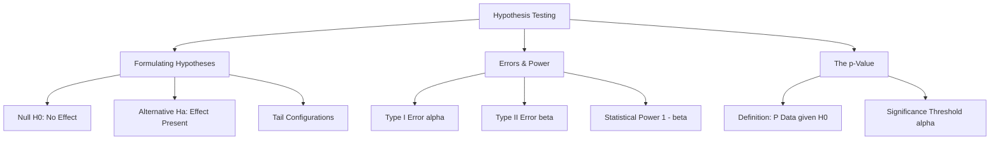

## Why This Matters

How do we prove that a new product feature increases conversion rates rather than being a random fluke? How do we verify that a marketing campaign generated genuine ROI? We cannot rely on intuition or raw averages alone. Hypothesis testing provides a rigorous mathematical framework that filters out random noise, allowing us to make decisions with quantified confidence.

---

## The Visual Analogy: The Courtroom Trial

The logic of hypothesis testing is identical to a criminal courtroom trial.

```text
                               Courtroom Analogy
              ┌──────────────────────────────────────────────────┐
              │ Defendant (Hypothesis) is Assumed Innocent       │
              │                                                  │
              │  Null Hypothesis (H0): Defendant is Innocent     │
              │  Alternative (Ha):     Defendant is Guilty       │
              └────────────────────────┬─────────────────────────┘
                                       │
                                       ▼
                       Evaluate Evidence (Data Collected)
                                       │
              ┌────────────────────────┴─────────────────────────┐
              │  Is evidence beyond a reasonable doubt (alpha)?  │
              │                                                  │
              │  Yes --> Reject H0 (Convict)                     │
              │  No  --> Fail to Reject H0 (Acquit)              │
              └──────────────────────────────────────────────────┘
```

1. **The Presumption of Innocence (The Null Hypothesis):** Under the law, a defendant is assumed innocent until proven guilty. In statistics, we start with the assumption that nothing has changed, or that there is no difference between our groups. This baseline is the **Null Hypothesis ($H_0$)**.
2. **The Burden of Proof (The Alternative Hypothesis):** The prosecutor's goal is to present evidence showing that the defendant is guilty. This is the **Alternative Hypothesis ($H_a$)**.
3. **Beyond a Reasonable Doubt (Significance Level, $\alpha$):** The jury does not convict if there is any small doubt. They convict only if the evidence of guilt is so overwhelming that it would be highly unlikely to occur by chance if the defendant were innocent. In statistics, this threshold is the **significance level ($\alpha$)**, typically set to $5\%$ ($\alpha = 0.05$).
4. **The Verdict:**
   * **Reject $H_0$ (Convicted):** The evidence is beyond a reasonable doubt. We conclude the defendant is guilty.
   * **Fail to Reject $H_0$ (Acquitted):** The evidence was not strong enough to prove guilt. Note that the court does not declare the defendant "innocent"—they simply state there was "not enough evidence to convict." In statistics, we never say we "accept the null hypothesis"; we only **"fail to reject the null hypothesis."**

### Courtroom Decisions and Errors
Just like a jury, our statistical tests can make mistakes:

```text
                                  True State of the World
                                ┌────────────────────────┬────────────────────────┐
                                │   Defendant Innocent   │    Defendant Guilty    │
 ┌──────────────────────────────┼────────────────────────┼────────────────────────┤
 │ Verdict: Acquit (Fail to Rej)│    Correct Decision    │     Type II Error      │
 │                              │                        │   (Missed criminal)    │
 ├──────────────────────────────┼────────────────────────┼────────────────────────┤
 │ Verdict: Convict (Reject H0) │      Type I Error      │    Correct Decision    │
 │                              │     (False alarm)      │    (Power of Test)     │
 └──────────────────────────────┴────────────────────────┴────────────────────────┘
```

---

## Step-by-Step Concept Breakdown



### 1. Formulating Hypotheses
A hypothesis test starts by declaring two mutually exclusive statements:

#### The Null Hypothesis ($H_0$)
The status quo. It states that there is no effect, no difference, or no association between variables.
* *Example:* The new landing page has the same conversion rate as the old landing page ($\mu_{\text{new}} = \mu_{\text{old}}$).

#### The Alternative Hypothesis ($H_a$ or $H_1$)
What you hope to support. It states that there is an effect, a difference, or an association.
* *Example:* The new landing page has a different conversion rate than the old landing page ($\mu_{\text{new}} \ne \mu_{\text{old}}$).

#### Tail Configurations
Depending on your business question, you must configure the direction of the test:

```text
      Left-Tailed Test              Two-Tailed Test             Right-Tailed Test
     (Ha: μ_new < μ_old)          (Ha: μ_new ≠ μ_old)          (Ha: μ_new > μ_old)
     
        Rejection                    Rejection Rejection             Rejection
          Region                      Region    Region                Region
          ┌───┐                        ┌───┐                        ┌───┐
         / \   \                      / \ / \   \                  /   / \
      __/___\   \                  __/___\/___\   \              _/   /___\__
```

* **Two-Tailed Test ($H_a: \mu_1 \ne \mu_2$):** You want to detect a difference in either direction (positive or negative). The rejection region is split equally between both tails of the distribution.
* **Right-Tailed Test ($H_a: \mu_1 > \mu_2$):** You only want to detect if the new variant is statistically greater than the control. The rejection region is entirely in the right tail.
* **Left-Tailed Test ($H_a: \mu_1 < \mu_2$):** You only want to detect if the new variant is statistically less than the control. The rejection region is entirely in the left tail.

---

### 2. Type I and Type II Errors
Because we work with samples, our decisions are subject to probabilistic errors.

#### Type I Error ($\alpha$)
Occurs when we **reject the null hypothesis when it is actually true**. This is a **False Alarm**.
* *Example:* Concluding a new marketing campaign works when it actually has no effect. 
* We set this probability ourselves using the **significance level ($\alpha$)**, commonly $0.05$. A value of $\alpha = 0.05$ means we accept a $5\%$ risk of committing a Type I error.

#### Type II Error ($\beta$)
Occurs when we **fail to reject the null hypothesis when it is actually false**. This is a **Missed Signal**.
* *Example:* Concluding a new medicine does not work when it actually does.
* The probability of a Type II error is denoted by $\beta$.

#### Statistical Power ($1 - \beta$)
Statistical power is the probability of **correctly rejecting the null hypothesis when it is false** (detecting an effect that actually exists).
* We aim for a power of at least **$80\%$** ($1 - \beta = 0.80$, meaning $\beta = 0.20$).
* **How to increase power:**
  1. Increase the **sample size ($n$)** (reduces variance and makes the standard error smaller).
  2. Increase the **significance level ($\alpha$)** (widens the rejection region, making it easier to reject $H_0$, but increases Type I error risk).
  3. Increase the **effect size** (a larger difference between groups is easier to detect).

---

### 3. The p-Value
The p-value is the tool we use to draw conclusions from a hypothesis test.

#### Definition
The p-value is the probability of obtaining test results **at least as extreme** as the observed results, **assuming that the null hypothesis is true**.

$$p\text{-value} = P(\text{Observed or More Extreme Data} \mid H_0 \text{ is True})$$

#### What it is NOT:
* It is **NOT** the probability that the null hypothesis is true.
* It is **NOT** the probability that the alternative hypothesis is false.
* It is **NOT** the probability that the data occurred by chance.

#### The Decision Rule
Compare the calculated p-value to your chosen significance level ($\alpha$):
* **If $p\text{-value} \le \alpha$:** Reject $H_0$. The result is statistically significant.
* **If $p\text{-value} > \alpha$:** Fail to reject $H_0$. The result is not statistically significant.

---

## Code & Practical Walkthroughs

### Example 1: Website Landing Page A/B Testing
Let's analyze an A/B test for an online store. 
* Group A (Control) is shown the current landing page.
* Group B (Treatment) is shown a new landing page.
* We want to test whether the conversion rate of Group B is different from Group A.

$$H_0: p_A = p_B \quad (\text{No difference in conversion rates})$$

$$H_a: p_A \ne p_B \quad (\text{A difference exists})$$

```python
import numpy as np
import pandas as pd
import scipy.stats as stats

# 1. Generate A/B test conversion data
np.random.seed(42)
n_A = 2000
n_B = 2100

# True conversion rate: Group A = 10%, Group B = 12%
conversions_A = np.random.binomial(n=1, p=0.10, size=n_A)
conversions_B = np.random.binomial(n=1, p=0.12, size=n_B)

df_A = pd.DataFrame({"group": "A", "converted": conversions_A})
df_B = pd.DataFrame({"group": "B", "converted": conversions_B})
df_ab = pd.concat([df_A, df_B], ignore_index=True)

# 2. Summary stats
summary = df_ab.groupby("group")["converted"].agg(["count", "sum", "mean"])
summary.columns = ["Users", "Conversions", "Conversion_Rate"]
print("--- A/B Test Summary ---")
print(summary)

# 3. Perform a Two-Sample Z-Test for Proportions
# We use statsmodels to run the proportion test
from statsmodels.stats.proportion import proportions_ztest

conversions = np.array([df_A["converted"].sum(), df_B["converted"].sum()])
nobs = np.array([n_A, n_B])

# Two-tailed test
z_stat, p_val = proportions_ztest(conversions, nobs, alternative="two-sided")

print("\n--- Z-Test Results ---")
print(f"Z-Statistic:      {z_stat:.4f}")
print(f"p-Value:          {p_val:.4f}")
```

```text
# Output:
--- A/B Test Summary ---
       Users  Conversions  Conversion_Rate
group                                     
A       2000          189           0.0945
B       2100          265           0.1262

--- Z-Test Results ---
Z-Statistic:      -3.3275
p-Value:          0.0009
```

* **Interpretation:** The Z-test returns a p-value of **0.0009**. Since $0.0009 \le 0.05$, we **reject the null hypothesis**. We conclude that the new landing page has a statistically different conversion rate than the old page.

---

### Example 2: Simulating p-Values Under the Null Hypothesis
To understand what a p-value actually means, let's run a simulation. We will draw two samples from the **same** population (meaning the null hypothesis is true) and run a t-test. We will repeat this 10,000 times and plot/analyze the resulting p-values.

```python
import numpy as np
import scipy.stats as stats
import pandas as pd

# Set random seed
np.random.seed(42)
n_simulations = 10000
sample_size = 50

p_values = []

# Under H0, both groups draw from a normal distribution with mean=100, std=15
for _ in range(n_simulations):
    group_1 = np.random.normal(loc=100, scale=15, size=sample_size)
    group_2 = np.random.normal(loc=100, scale=15, size=sample_size)
    
    # Run two-sample t-test
    _, p_val = stats.ttest_ind(group_1, group_2)
    p_values.append(p_val)

df_pvals = pd.DataFrame({"p_value": p_values})

# Count how often we reject H0 at alpha = 0.05 by pure chance
false_positive_rate = (df_pvals["p_value"] <= 0.05).mean()

print("--- Null Hypothesis Simulation ---")
print(f"False Positive Rate (at alpha=0.05): {false_positive_rate:.4f} (Expected: 0.05)")
print("\nFirst 10 p-values:")
print(df_pvals.head(10))
```

```text
# Output:
--- Null Hypothesis Simulation ---
False Positive Rate (at alpha=0.05): 0.0487 (Expected: 0.05)

First 10 p-values:
    p_value
0  0.505086
1  0.597552
2  0.076839
3  0.021008
4  0.070659
5  0.893110
6  0.096752
7  0.428784
8  0.648354
9  0.923485
```

* **Insight:** When the null hypothesis is true, p-values follow a **uniform distribution** between 0 and 1. This means you have an equal chance of getting a p-value of 0.01 as you do 0.99. 
* Consequently, if you set $\alpha = 0.05$, you will reject the null hypothesis by pure chance **$5\%$** of the time. This is the definition of a Type I error!

---

## Edge Cases & Common Mistakes

### 1. Misinterpreting the p-Value
The most common mistake in data science is stating: *"The p-value is 0.03, which means there is a 3% chance the null hypothesis is true."* 
* This is incorrect. The p-value is calculated **assuming** that the null hypothesis is already true ($P(\text{Data} \mid H_0)$). It cannot tell you the probability that the hypothesis itself is true ($P(H_0 \mid \text{Data})$) without using Bayesian statistics.

---

### 2. p-Hacking (The Multiple Comparisons Trap)
If you run 20 different hypothesis tests on random noise, on average **one of them** will return a significant result ($p \le 0.05$) by pure chance. This is called **p-hacking**.

```python
# 20 independent features containing pure random noise
np.random.seed(42)
n_records = 100
group = np.random.choice(["A", "B"], size=n_records)

significant_features = 0

for i in range(20):
    noise_feature = np.random.normal(loc=0, scale=1, size=n_records)
    df_temp = pd.DataFrame({"group": group, "feature": noise_feature})
    
    g_A = df_temp[df_temp["group"] == "A"]["feature"]
    g_B = df_temp[df_temp["group"] == "B"]["feature"]
    
    _, p_val = stats.ttest_ind(g_A, g_B)
    
    if p_val <= 0.05:
        print(f"Feature {i} is statistically significant! p-val: {p_val:.4f}")
        significant_features += 1

print(f"Total significant noise features: {significant_features} out of 20")
```

```text
# Output:
Feature 12 is statistically significant! p-val: 0.0210
Total significant noise features: 1 out of 20
```

* **Gotcha:** If you test 20 metrics (bounce rate, time on site, click rate, scrolls, etc.) and find that "feature 12" is significant, implementing changes based on this result is risky because it is likely a false positive. 
* **Best Practice:** Use adjustment methods like the **Bonferroni correction** (adjusting your alpha to $\alpha_{\text{new}} = \frac{\alpha}{m}$, where $m$ is the number of tests) to control your false positive rate.

---

### 3. Conflating Statistical Significance with Practical Significance
With a large enough sample size, even a tiny difference between groups will return a significant p-value.

```python
# Large sample size (n = 1,000,000)
n = 1000000
# Mean conversion: Group A = 5.00%, Group B = 5.05% (a tiny 0.05% difference)
conv_A = np.random.binomial(n=1, p=0.05, size=n)
conv_B = np.random.binomial(n=1, p=0.0505, size=n)

_, p_val = proportions_ztest([conv_A.sum(), conv_B.sum()], [n, n])
print(f"p-Value on large sample: {p_val:.4f}")
```

```text
# Output:
p-Value on large sample: 0.0412
```

* **Insight:** The result is statistically significant ($p = 0.0412 \le 0.05$). However, a **0.05%** improvement in conversion rates might not justify the cost of developing, testing, and deploying the new feature. Always pair p-values with **effect sizes** and cost-benefit audits.

---

## Practice Exercises

<div class="challenge">
<h3>Challenge 1: The A/B Test Sign-off</h3>
<p>You are auditing an A/B test for a marketing team. The team wants to launch a new email layout. They report a conversion rate of 8.2% on the new layout vs. 7.5% on the control. They ran the test on 1,500 users per group.</p>
<p>Write a script to:</p>
<ol>
  <li>Run a two-sided Z-test for proportions at a significance level of 0.05.</li>
  <li>Determine whether the team should sign off on the launch based on statistical significance.</li>
  <li>Calculate the 95% confidence interval for the difference in proportions ($p_B - p_A$).</li>
</ol>
</div>

#### Solution Walkthrough:

```python
import numpy as np
from statsmodels.stats.proportion import proportions_ztest, confint_proportions_2indep

n_A = 1500
n_B = 1500

conv_A = int(n_A * 0.075)
conv_B = int(n_B * 0.082)

# 1. Z-test
z_stat, p_val = proportions_ztest([conv_A, conv_B], [n_A, n_B])

# 2. Confidence Interval
ci_low, ci_high = confint_proportions_2indep(conv_B, n_B, conv_A, n_A, method="wald")

print("--- Email Campaign Audit ---")
print(f"Calculated Z-Statistic: {z_stat:.4f}")
print(f"Calculated p-Value:     {p_val:.4f}")
print(f"95% CI for Difference:  [{ci_low:.4f}, {ci_high:.4f}]")

if p_val <= 0.05:
    print("Verdict: Reject H0. The difference is statistically significant. Proceed to launch.")
else:
    print("Verdict: Fail to Reject H0. The difference is NOT statistically significant. Do not launch.")
```

```text
# Output:
--- Email Campaign Audit ---
Calculated Z-Statistic: -0.7303
Calculated p-Value:     0.4652
95% CI for Difference:  [-0.0118, 0.0258]
Verdict: Fail to Reject H0. The difference is NOT statistically significant. Do not launch.
```

* **Insight:** Even though the new layout has a higher conversion rate, the sample size ($1500$) is too small to rule out random variation ($p = 0.4652$). The confidence interval contains $0$, meaning the true difference could be negative. The team should not launch without collecting more data.

---

## Section Recaps

* **Null Hypothesis ($H_0$):** Assumes no effect or change. The baseline.
* **Alternative Hypothesis ($H_a$):** The effect you want to prove.
* **Type I Error ($\alpha$):** Rejecting $H_0$ when it is true (False Alarm). Control this by setting the significance level.
* **Type II Error ($\beta$):** Failing to reject $H_0$ when it is false (Missed Signal).
* **Statistical Power ($1 - \beta$):** The probability of correctly detecting a real effect.
* **p-Value:** The probability of seeing results as extreme as yours, assuming $H_0$ is true. If $p \le \alpha$, reject $H_0$.

---

## Common Interview Questions

### Q1: What is the exact, formal definition of a p-value?
**Answer:**
A p-value is the probability of obtaining test results at least as extreme as the results observed during the test, assuming that the null hypothesis is true. 

It is a conditional probability:
$$P(\text{Data or More Extreme} \mid H_0 \text{ is True})$$

It quantifies how consistent your sample data is with the null hypothesis. A low p-value indicates that your observed data is highly inconsistent with the assumption of no effect, leading you to reject the null hypothesis.

---

### Q2: What are Type I and Type II errors? How are they related?
**Answer:**
* **Type I Error ($\alpha$):** Rejecting the null hypothesis when it is actually true (False Alarm). 
  * *Example:* Concluding that a drug is effective when it is not.
* **Type II Error ($\beta$):** Failing to reject the null hypothesis when it is actually false (Missed Signal).
  * *Example:* Concluding that a drug is ineffective when it actually works.

Type I and Type II errors are inversely related. For a fixed sample size, reducing the probability of a Type I error (e.g., lowering $\alpha$ from 0.05 to 0.01) makes the criteria for rejecting the null hypothesis more strict. This increases the probability of a Type II error ($\beta$) because you are more likely to miss real, subtle effects. 

The only way to decrease the risk of both errors simultaneously is to **increase the sample size ($n$)**.

---

### Q3: What is statistical power, and how do you calculate it? How can an analyst increase power?
**Answer:**
Statistical power is the probability of correctly rejecting the null hypothesis when it is false. It is the probability of detecting an effect if there is one. 

Mathematically, it is calculated as:
$$\text{Power} = 1 - \beta$$
Where $\beta$ is the probability of committing a Type II error.

To increase the power of a test, an analyst can:
1. **Increase the sample size ($n$):** This narrows the standard error and reduces random variation, making true effects easier to spot.
2. **Increase the significance level ($\alpha$):** This makes it easier to reject the null hypothesis, though it increases the risk of a Type I error.
3. **Increase the effect size:** Design experiments where the expected treatment effect is larger.
4. **Reduce measurement noise:** Control for confounding variables to lower the variance of the metrics.

---

### Q4: What is p-hacking, and what strategies can you use to prevent it?
**Answer:**
p-hacking (or data dredging) is the practice of running multiple statistical tests on a dataset without a predefined hypothesis, and then only reporting the tests that return statistically significant p-values. 

Because a significance level of $\alpha = 0.05$ implies a 5% chance of a false positive per test, running 100 tests on random noise will yield roughly 5 false positives.

To prevent p-hacking:
1. **Preregister hypotheses:** Define your primary metrics and hypotheses before collecting or viewing the data.
2. **Apply multiple testing corrections:** Adjust your significance threshold using methods like the **Bonferroni correction** ($\alpha_{\text{adjusted}} = \frac{\alpha}{\text{number of tests}}$) or the **False Discovery Rate (FDR)** control.
3. **Use validation sets:** Hold out a subset of data (a validation or test set) to confirm whether findings from your exploratory analysis hold up on unseen data.

---

### Q5: If you run an A/B test with a massive sample size ($n = 5$ million users) and find a statistically significant improvement with a p-value of 0.0001, what potential pitfalls should you consider?
**Answer:**
The main pitfall to consider is the distinction between **statistical significance** and **practical (or economic) significance**.

With a massive sample size ($n = 5$ million), your statistical test has near-perfect power. The standard error is extremely small, meaning the test will detect even tiny deviations from the null hypothesis, yielding a very low p-value.

However, this small difference might have no business value. For example, if a new feature increases conversion rates from 10.00% to 10.01% ($+0.01\%$), this improvement is likely statistically significant due to the sample size, but the revenue generated might not cover the development, hosting, and maintenance costs of the new feature. 

Always evaluate the **effect size** and calculate the financial return on investment alongside the p-value.
