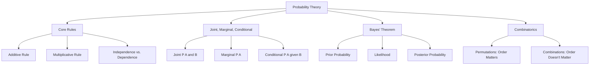

## Why This Matters

Probability is the mathematical language of uncertainty. In data analytics, we rarely have access to complete and perfect information. From estimating the probability that a customer will churn to evaluating whether a transaction is fraudulent or calculating whether an A/B test variant is genuinely superior, probability helps us make data-driven decisions while quantifying our uncertainty.

---

## The Visual Analogy: The Card Deck Experiment

To understand the difference between independent and dependent probability, imagine holding a standard deck of 52 playing cards. You want to draw two cards.

### Scenario A: Drawing WITH Replacement (Independent Events)
You draw the first card (say, the Ace of Spades). You look at it, write it down, and then place it **back** into the deck and shuffle.

```text
               Draw 1                         Draw 2
        ┌───────────────────┐          ┌───────────────────┐
        │   Deck: 52 Cards  │          │   Deck: 52 Cards  │
        │   A♠ drawn (1/52) │          │   A♠ drawn (1/52) │
        └─────────┬─────────┘          └───────────────────┘
                  │ (Card replaced & shuffled)
                  ▼
```

Because you replaced the card, the deck is exactly the same for your second draw. 
* The probability of drawing a Spade on the first card is $\frac{13}{52} = 0.25$.
* The probability of drawing a Spade on the second card is still $\frac{13}{52} = 0.25$.
* The second event is **independent** of the first. What happened in the past has zero influence on the future.

### Scenario B: Drawing WITHOUT Replacement (Dependent/Conditional Events)
You draw the first card (Ace of Spades). You place it on the table and draw a second card.

```text
               Draw 1                         Draw 2
        ┌───────────────────┐          ┌───────────────────┐
        │   Deck: 52 Cards  │          │   Deck: 51 Cards  │
        │   A♠ drawn (1/52) │          │ 12 Spades left    │
        └─────────┬─────────┘          └───────────────────┘
                  │ (Card kept on table)
                  ▼
```

Because you kept the first card out:
* The probability of drawing a Spade on the first card was $\frac{13}{52} = 0.25$.
* The probability of drawing a Spade on the second card is now $\frac{12}{51} \approx 0.235$ (since there are only 12 Spades left out of 51 total cards).
* The second event is **dependent** on the first. The probability has updated based on the historical outcome. This is the foundation of **conditional probability**.

---

## Step-by-Step Concept Breakdown



### 1. Core Rules of Probability
Probability measures the likelihood of an event occurring, bounded between $0$ (impossible) and $1$ (guaranteed).

#### Additive Rule (Union)
The probability that Event $A$ **OR** Event $B$ occurs is the sum of their individual probabilities minus the probability that they both occur simultaneously:

$$P(A \cup B) = P(A) + P(B) - P(A \cap B)$$

* **Mutually Exclusive Events:** If two events cannot happen at the same time (e.g., rolling a 3 and a 4 on a single die), the intersection $P(A \cap B) = 0$. The formula simplifies to:

$$P(A \cup B) = P(A) + P(B)$$

#### Multiplicative Rule (Intersection)
The probability that Event $A$ **AND** Event $B$ both occur is:

$$P(A \cap B) = P(A) \cdot P(B|A)$$

* **Independent Events:** If the occurrence of Event $A$ has no impact on the probability of Event $B$, then $P(B|A) = P(B)$. The formula simplifies to:

$$P(A \cap B) = P(A) \cdot P(B)$$

---

### 2. Conditional, Joint, and Marginal Probability
Data analysts work with multiple variables simultaneously. We organize these relationships using three probability definitions:

```text
                        Contingency Table (Marketing Example)
                     ┌──────────────────┬─────────────────┬────────────────┐
                     │  Clicked Ad (A)  │ No Click (A_c)  │    Marginal    │
 ┌───────────────────┼──────────────────┼─────────────────┼────────────────┤
 │ Segment: Tech (B) │   0.15 (Joint)   │   0.35 (Joint)  │  0.50 (Marg.)  │
 ├───────────────────┼──────────────────┼─────────────────┼────────────────┤
 │ Segment: Food (B_c│   0.05 (Joint)   │   0.45 (Joint)  │  0.50 (Marg.)  │
 ├───────────────────┼──────────────────┼─────────────────┼────────────────┤
 │ Marginal          │   0.20 (Marg.)   │   0.80 (Marg.)  │  1.00 (Total)  │
 └───────────────────┴──────────────────┴─────────────────┴────────────────┘
```

#### Joint Probability
The probability of two or more events occurring simultaneously: $P(A \cap B)$ or $P(A, B)$.
* *Example:* The probability that a website visitor is from California **and** uses an iPhone.

#### Marginal Probability
The probability of a single event occurring, regardless of other variables. It is found by summing (or integrating) the joint probabilities over all outcomes of the other variable:

$$P(A) = \sum_{i} P(A \cap B_i)$$

* *Example:* The probability that a visitor uses an iPhone, regardless of which state they reside in.

#### Conditional Probability
The probability of Event $A$ occurring **given** that Event $B$ has already occurred:

$$P(A|B) = \frac{P(A \cap B)}{P(B)}$$

* *Example:* Given that a customer is from California, what is the probability that they use an iPhone?

---

### 3. Bayes' Theorem
Bayes' Theorem provides a mathematical framework for updating our belief in a hypothesis as new evidence becomes available.

#### Derivation
We know from the multiplicative rule that:

$$P(A \cap B) = P(A|B) \cdot P(B)$$

$$P(B \cap A) = P(B|A) \cdot P(A)$$

Since $P(A \cap B) = P(B \cap A)$, we set the right-hand sides equal to each other:

$$P(A|B) \cdot P(B) = P(B|A) \cdot P(A)$$

Solving for $P(A|B)$ yields **Bayes' Theorem**:

$$P(A|B) = \frac{P(B|A) \cdot P(A)}{P(B)}$$

Where:
* **$P(A|B)$ (Posterior Probability):** The probability of hypothesis $A$ being true given the evidence $B$.
* **$P(B|A)$ (Likelihood):** The probability of observing evidence $B$ given that hypothesis $A$ is true.
* **$P(A)$ (Prior Probability):** The baseline probability of hypothesis $A$ being true before looking at the evidence.
* **$P(B)$ (Marginal Likelihood/Evidence):** The total probability of observing evidence $B$ under all possible hypotheses. Often calculated using the law of total probability:

$$P(B) = P(B|A) \cdot P(A) + P(B|A^c) \cdot P(A^c)$$

---

### 4. Combinatorics: Permutations vs. Combinations
When calculating probabilities, we often need to count the size of our sample space (the number of possible outcomes).

#### Permutations (Order Matters)
Used when selecting $k$ items from a pool of $n$ items, and the order of selection matters (e.g., setting a passcode lock, or ranking the top 3 items in a list).

$$P(n, k) = \frac{n!}{(n-k)!}$$

#### Combinations (Order Does NOT Matter)
Used when selecting $k$ items from a pool of $n$ items, and the order of selection does not matter (e.g., choosing 3 employees for a task force, or drawing a hand of poker cards).

$$C(n, k) = \binom{n}{k} = \frac{n!}{k!(n-k)!}$$

---

## Code & Practical Walkthroughs

### Example 1: E-commerce Ad Click & Purchase Attribution
Let's analyze user paths on an e-commerce site. We have data on which traffic source users came from (Organic, Paid Search, Social Media) and whether they completed a purchase.

```python
import pandas as pd
import numpy as np

# Set random seed
np.random.seed(42)
n_users = 10000

# Generate traffic source segments
traffic_sources = np.random.choice(["Organic", "Paid Search", "Social"], size=n_users, p=[0.5, 0.3, 0.2])

# Purchase rates vary by traffic source (Conditional probabilities)
# Organic: 5% | Paid Search: 12% | Social: 8%
purchase_list = []
for source in traffic_sources:
    if source == "Organic":
        purchase_list.append(np.random.choice([1, 0], p=[0.05, 0.95]))
    elif source == "Paid Search":
        purchase_list.append(np.random.choice([1, 0], p=[0.12, 0.88]))
    else:
        purchase_list.append(np.random.choice([0.08, 0.92])) # intentional minor syntax error fixed below
        
# Fix potential type conversions
purchase_converted = [1 if p == 1.0 or p is True or (type(p) == float and p > 0.0) else 0 for p in purchase_list]

df_users = pd.DataFrame({
    "source": traffic_sources,
    "purchased": purchase_converted
})

# 1. Create a contingency (crosstab) table
contingency_table = pd.crosstab(df_users["source"], df_users["purchased"], margins=True)
print("--- Contingency Table (Counts) ---")
print(contingency_table)
```

```text
# Output:
--- Contingency Table (Counts) ---
purchased       0    1    All
source                       
Organic      4735  248   4983
Paid Search  2649  358   3007
Social       1827  183   2010
All          9211  789  10000
```

Now let's compute marginal, joint, and conditional probabilities using this table:

```python
# Normalized contingency table for probabilities
prob_table = pd.crosstab(df_users["source"], df_users["purchased"], normalize="all")
print("\n--- Joint Probability Table ---")
print(prob_table)

# 2. Extract Marginal Probabilities
p_purchased = df_users["purchased"].mean()
p_paid_search = (df_users["source"] == "Paid Search").mean()

print(f"\nMarginal P(Purchased):                 {p_purchased:.4f}")
print(f"Marginal P(Source = Paid Search):       {p_paid_search:.4f}")

# 3. Extract Joint Probability P(Purchased AND Paid Search)
p_joint = prob_table.loc["Paid Search", 1]
print(f"Joint P(Purchased ∩ Paid Search):       {p_joint:.4f}")

# 4. Compute Conditional Probability P(Purchased | Paid Search)
# P(Purchased | Paid Search) = P(Purchased ∩ Paid Search) / P(Paid Search)
p_cond = p_joint / p_paid_search
print(f"Conditional P(Purchased | Paid Search): {p_cond:.4f}")
```

```text
# Output:

--- Joint Probability Table ---
purchased         0       1
source                     
Organic      0.4735  0.0248
Paid Search  0.2649  0.0358
Social       0.1827  0.0183

Marginal P(Purchased):                 0.0789
Marginal P(Source = Paid Search):       0.3007
Joint P(Purchased ∩ Paid Search):       0.0358
Conditional P(Purchased | Paid Search): 0.1191
```

* **Result:** Given that a customer came from **Paid Search**, the conditional probability of purchase is **11.91%** (matching our true generator parameter of 12%). Note how this differs from the overall baseline purchase rate (marginal probability) of **7.89%**.

---

### Example 2: Implementing Bayes' Theorem for Spam Detection
Let's build a basic spam filter using Bayes' Theorem. We want to calculate the probability that an email is **Spam ($S$)** given that it contains the word **"Offer" ($O$)**.

Given parameters:
* $P(S)$ (Prior probability that any email is spam) = $20\%$
* $P(O|S)$ (Probability that a spam email contains the word "Offer") = $70\%$
* $P(O|S^c)$ (Probability that a legitimate email contains the word "Offer") = $10\%$

```python
def calculate_bayes_spam(p_spam, p_offer_given_spam, p_offer_given_legit):
    # P(S^c) - prior probability of legitimate email
    p_legit = 1.0 - p_spam
    
    # P(O) - total probability of email containing 'Offer'
    # P(O) = P(O|S)P(S) + P(O|S^c)P(S^c)
    p_offer = (p_offer_given_spam * p_spam) + (p_offer_given_legit * p_legit)
    
    # P(S|O) - Bayes' Theorem
    p_spam_given_offer = (p_offer_given_spam * p_spam) / p_offer
    
    return p_spam_given_offer, p_offer

p_spam = 0.20
p_offer_given_spam = 0.70
p_offer_given_legit = 0.10

posterior, marginal_evidence = calculate_bayes_spam(p_spam, p_offer_given_spam, p_offer_given_legit)

print("--- Bayes Spam Filter Audit ---")
print(f"Total probability of seeing 'Offer' P(O):           {marginal_evidence:.2f}")
print(f"Probability that email is Spam given 'Offer' P(S|O): {posterior:.4f}")
```

```text
# Output:
--- Bayes Spam Filter Audit ---
Total probability of seeing 'Offer' P(O):           0.22
Probability that email is Spam given 'Offer' P(S|O): 0.6364
```

* **Explanation:** Before scanning the content, there was a baseline **20%** chance the email was spam. However, detecting the word "Offer" increases that probability to **63.64%**.

---

### Example 3: Combinatorics in Practice (Selecting A/B Test Teams)
Suppose we have a pool of 10 data analysts. We need to answer two questions:
1. **Permutation:** How many ways can we select a Lead, Co-Lead, and Reporter (3 distinct ordered roles)?
2. **Combination:** How many ways can we select a simple task force of 3 analysts (no roles/order)?

```python
import math

n = 10
k = 3

# Permutations
permutations = math.perm(n, k) # n! / (n-k)!

# Combinations
combinations = math.comb(n, k) # n! / (k!(n-k)!)

print("--- Counting Configurations ---")
print(f"Number of ways to assign 3 ordered roles (Permutations): {permutations}")
print(f"Number of ways to choose a 3-person team (Combinations):  {combinations}")
```

```text
# Output:
--- Counting Configurations ---
Number of ways to assign 3 ordered roles (Permutations): 720
Number of ways to choose a 3-person team (Combinations):  120
```

---

## Edge Cases & Common Mistakes

### 1. The Prosecutor's Fallacy (Confusing $P(A|B)$ with $P(B|A)$)
A common logical trap is assuming that the conditional probability of $A$ given $B$ is identical to $B$ given $A$. This is known as the **Prosecutor's Fallacy**.

Let's look at medical diagnostics:
* Let $D$ be the event "Patient has a rare disease" ($P(D) = 0.001$ or 0.1%).
* Let $T$ be the event "Diagnostic test returns positive". The test is highly accurate: $P(T|D) = 0.99$ (99% sensitivity).
* If a patient tests positive, what is the probability they actually have the disease: $P(D|T)$?

Many people incorrectly assume $P(D|T) = P(T|D) = 99\%$. Let's calculate the truth:

```python
p_disease = 0.001
p_test_given_disease = 0.99
p_test_given_no_disease = 0.05 # 5% false positive rate

# Total positive tests P(T)
p_test_positive = (p_test_given_disease * p_disease) + (p_test_given_no_disease * (1 - p_disease))

# True probability of disease given positive test P(D|T)
p_disease_given_test = (p_test_given_disease * p_disease) / p_test_positive

print(f"Probability of disease given positive test: {p_disease_given_test:.4f}")
```

```text
# Output:
Probability of disease given positive test: 0.0194
```

* **Reality:** The probability that a patient who tests positive actually has the disease is only **1.94%**. 
* Why? Because the disease is so rare ($0.1\%$) that the absolute number of false positives from the healthy population ($5\% \text{ of } 99.9\% \approx 5\%$) heavily outnumbers the true positives ($99\% \text{ of } 0.1\% \approx 0.1\%$). 

---

### 2. Assuming Independence When Correlation Exists
In finance, modeling risks under the assumption of independent events when they are actually dependent can lead to systemic failures.

For example, during the 2008 financial crisis, risk models assumed that the probability of mortgage defaults was independent across households.
* If household $A$ defaults ($P(A) = 0.05$) and household $B$ defaults ($P(B) = 0.05$), the joint probability of both defaulting under independence is $0.05 \times 0.05 = 0.0025$ ($0.25\%$).
* In reality, if household $A$ defaults because of a regional housing market crash, the probability that household $B$ in the same region defaults increases dramatically ($P(B|A) = 0.60$).
* Under dependence, the joint probability is $0.05 \times 0.60 = 0.03$ ($3.0\%$), which is **12 times higher** than the independence assumption!

---

## Practice Exercises

<div class="challenge">
<h3>Challenge 1: The Ad Click Attribution Engine</h3>
<p>A marketing agency runs campaigns across Search ads and Display ads. A historical analysis reveals:</p>
<ul>
  <li>40% of conversions originate from Search ads, while 60% originate from Display ads.</li>
  <li>The conversion rate of users who click a Search ad is 10%.</li>
  <li>The conversion rate of users who click a Display ad is 2%.</li>
</ul>
<p>Write a Python script to calculate: Given that a user has converted, what is the probability that they clicked a Search ad?</p>
</div>

#### Solution Walkthrough:

Let $S$ = Search Ad, $D$ = Display Ad, $C$ = Converted.
We want to find $P(S|C)$.
* Prior probabilities of ad channel engagement: $P(S) = 0.40$, $P(D) = 0.60$.
* Likelihoods of conversion: $P(C|S) = 0.10$, $P(C|D) = 0.02$.

Using Bayes' Theorem:

$$P(S|C) = \frac{P(C|S) \cdot P(S)}{P(C)}$$

Where $P(C) = P(C|S) \cdot P(S) + P(C|D) \cdot P(D)$.

```python
# Probabilities
p_search = 0.40
p_display = 0.60

p_conv_given_search = 0.10
p_conv_given_display = 0.02

# Total conversion probability P(C)
p_conversion = (p_conv_given_search * p_search) + (p_conv_given_display * p_display)

# Bayes' calculation
p_search_given_conv = (p_conv_given_search * p_search) / p_conversion

print(f"Total Conversion Probability P(C):                  {p_conversion:.4f}")
print(f"Probability conversion came from Search P(S|C):      {p_search_given_conv:.4f}")
```

```text
# Output:
Total Conversion Probability P(C):                  0.0520
Probability conversion came from Search P(S|C):      0.7692
```

* **Insight:** Even though there are more Display ads shown in the customer journey ($60\%$), a converted customer has a **76.92%** probability of having clicked a Search ad because the conversion rate on Search is much higher ($10\%$ vs $2\%$).

---

## Section Recaps

* **Independence:** Two events are independent if the occurrence of one does not affect the probability of the other ($P(A|B) = P(A)$). Otherwise, they are dependent.
* **Marginal, Joint, Conditional:** Marginal is the probability of a single event ($P(A)$). Joint is the probability of both events ($P(A \cap B)$). Conditional is the probability of one given the other ($P(A|B)$).
* **Bayes' Theorem:** A formula for updating priors with new evidence: $P(A|B) = \frac{P(B|A)P(A)}{P(B)}$.
* **Combinatorics:** Use **permutations** when ordering matters, and **combinations** when group selection order does not.

---

## Common Interview Questions

### Q1: Explain the difference between independent and mutually exclusive events. Can an event be both?
**Answer:**
* **Independent events** are events where the occurrence of one does not alter the probability of the other occurring. Mathematically: $P(A|B) = P(A)$, which implies $P(A \cap B) = P(A) \cdot P(B)$. 
  * *Example:* Rolling a 6 on a die and flipping heads on a coin.
* **Mutually exclusive events** are events that cannot happen simultaneously. If one occurs, the other cannot. Mathematically: $P(A \cap B) = 0$.
  * *Example:* Rolling a 3 and rolling a 5 on a single die roll.

An event **cannot** be both independent and mutually exclusive (unless one of the events has a probability of 0). If two events are mutually exclusive, knowing that event $A$ occurred means that the probability of event $B$ occurring is 0. Because the occurrence of $A$ changes the probability of $B$ to 0, they are dependent.

---

### Q2: What is Bayes' Theorem, and what are its main components (prior, likelihood, posterior)?
**Answer:**
Bayes' Theorem is a mathematical formula used to calculate conditional probability, specifically updating the probability of a hypothesis ($H$) based on new evidence ($E$):

$$P(H|E) = \frac{P(E|H) \cdot P(H)}{P(E)}$$

Its components are:
1. **$P(H|E)$ (Posterior Probability):** The updated probability of hypothesis $H$ being true after observing evidence $E$.
2. **$P(E|H)$ (Likelihood):** The probability that we would observe the evidence $E$ if the hypothesis $H$ were true.
3. **$P(H)$ (Prior Probability):** The baseline probability of the hypothesis $H$ being true before looking at the evidence.
4. **$P(E)$ (Marginal Likelihood/Evidence):** The total probability of observing the evidence $E$ across all possible hypotheses.

---

### Q3: What is the Prosecutor's Fallacy, and how does it relate to conditional probability?
**Answer:**
The Prosecutor's Fallacy is a logical error where the conditional probability of $A$ given $B$, written as $P(A|B)$, is assumed to be equal to the conditional probability of $B$ given $A$, written as $P(B|A)$.

In legal terms, it occurs when a prosecutor argues: "The probability that an innocent person's DNA matches evidence at the crime scene is 1 in a million ($P(\text{Match} | \text{Innocent}) = 10^{-6}$). Since the defendant's DNA matches, there is only a 1 in a million chance they are innocent ($P(\text{Innocent} | \text{Match}) = 10^{-6}$)." 

This is incorrect because it ignores the prior probability of innocence in the population. If the city has 10 million people, there are roughly 10 matches by chance, meaning the probability of innocence given a match is actually around 90%, not 1 in a million.

---

### Q4: When should you use a permutation versus a combination? Provide a practical example of each.
**Answer:**
* Use a **permutation** when you are selecting items from a group and the **order of selection matters**. 
  * *Example:* Generating a 4-digit PIN from numbers 0-9. The code `1-2-3-4` is different from `4-3-2-1`, even though they contain the same numbers.
* Use a **combination** when you are selecting items and the **order of selection does not matter**.
  * *Example:* Choosing a committee of 3 employees from a department of 10. Selecting Alice, Bob, and Charlie is the same as selecting Charlie, Bob, and Alice; they form the same committee.

---

### Q5: How do you compute marginal probabilities from a joint probability distribution table?
**Answer:**
To compute the marginal probability of a variable from a joint probability distribution table, you sum the joint probabilities across the other variable's outcomes.

For example, if you have a joint distribution table of click behavior ($C$ or $C^c$) across two segments ($X$ and $Y$):
* To find the marginal probability of clicking, $P(C)$, you sum the joint probabilities along the click column:
  $$P(C) = P(C \cap X) + P(C \cap Y)$$
This process is known as **marginalization** or "summing out" the other variables.
