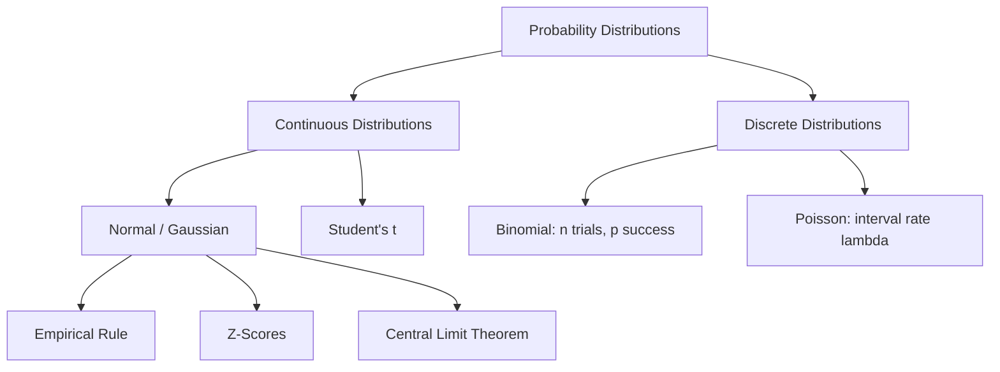

## Why This Matters

A probability distribution is a mathematical function that describes all possible values and likelihoods that a random variable can take within a given range. By matching your real-world data to a known distribution, you unlock a suite of analytical tools, allowing you to calculate the probability of future events, set statistical thresholds, and design valid experiments.

---

## The Visual Analogies

Understanding distributions is easier when you associate each with a physical process:

### 1. The Normal Distribution: The Sandbox Contour
Imagine dry sand pouring from a single point above a table. As the grains fall, gravity pulls them down while they bounce off each other. Over time, the sand naturally settles into a smooth, symmetrical, bell-shaped pile. Most of the sand clusters in the high center (the mean), while the slope tapers off evenly to the left and right. This shape represents the **Normal Distribution**.

```text
                              [Pour Point]
                                  │
                                  ▼
                                ┌───┐
                               /     \
                             _/       \_
                            /           \
                     ───────             ───────
```

### 2. The Binomial Distribution: Flipping a Bucket of Coins
Imagine holding a bucket of 10 coins. You dump them onto the floor and count the number of Heads. If you repeat this process 1,000 times, you will rarely get 0 Heads or 10 Heads. Most of the time, you will get 4, 5, or 6 Heads. This counts-of-successes experiment represents the discrete **Binomial Distribution**.

```text
                     Bucket of Coins --> Dumped on Floor
                     [ H, T, H, H, T, T, H, T, T, H ]
                     Count successes (Heads) out of n trials
```

### 3. The Poisson Distribution: Raindrops on a Sidewalk Tile
Imagine looking at a single square sidewalk tile during a light rain shower. You count how many raindrops hit that specific tile in 10 seconds. Sometimes 0 drops hit, sometimes 3 drops, and occasionally 8 drops. You are counting the frequency of random events occurring within a fixed window of time or space. This represents the **Poisson Distribution**.

```text
                        ┌───────────────────┐
                        │   *       *       │  <-- Raindrops hitting
                        │       *           │      a sidewalk tile
                        │   *           *   │      in a 10-second interval
                        └───────────────────┘
```

---

## Step-by-Step Concept Breakdown



### 1. The Normal (Gaussian) Distribution
The Normal distribution is the foundation of classical statistics. It is continuous, symmetric, and completely defined by two parameters:
* **Mean ($\mu$):** The center or peak of the bell curve.
* **Standard Deviation ($\sigma$):** The spread or width of the bell curve.

#### The Empirical Rule (68-95-99.7 Rule)
For any perfectly normal distribution:
* **$68.2\%$** of the data lies within $\pm 1$ standard deviation of the mean ($\mu \pm 1\sigma$).
* **$95.4\%$** of the data lies within $\pm 2$ standard deviations of the mean ($\mu \pm 2\sigma$).
* **$99.7\%$** of the data lies within $\pm 3$ standard deviations of the mean ($\mu \pm 3\sigma$).

```text
                                  Peak (Mean)
                                      │
                                    ┌─┴─┐
                                  / │   \
                                /   │     \
                              /     │       \
                            /       │         \
                         _/         │           \_
              ───│───────│─────│────┼────│─────│───────│───
               -3σ      -2σ   -1σ   μ   1σ    2σ      3σ
                 │             └─ 68.2% ─┘             │
                 └─────────────── 95.4% ───────────────┘
                 └────────────────── 99.7% ────────────┘
```

#### Z-Scores
A Z-score measures how many standard deviations a data point ($X$) is away from the mean ($\mu$). Calculating a Z-score standardizes different variables onto a standard scale (where mean = 0, std = 1):

$$Z = \frac{X - \mu}{\sigma}$$

* A Z-score of **1.5** means the value is 1.5 standard deviations above the mean.
* A Z-score of **-2.0** means the value is 2.0 standard deviations below the mean.

#### The Central Limit Theorem (CLT)
The CLT is one of the most important theorems in statistics. It states:
* If you take repeated random samples of size $n$ from **any** population distribution (even if it's skewed, uniform, or multi-modal), the distribution of the sample means ($\bar{x}$) will approach a **Normal Distribution** as the sample size $n$ grows larger ($n \ge 30$).
* The mean of this sampling distribution of the means will equal the population mean ($\mu$).
* The standard deviation of the sample means (called the **Standard Error**, $SE$) is given by:

$$SE = \frac{\sigma}{\sqrt{n}}$$

This allows us to make normal-based statistical inferences about populations even when the underlying data is highly skewed.

---

### 2. The Binomial Distribution
The Binomial distribution models the number of successes in a fixed number of independent trials, where each trial has only two possible outcomes (success or failure).

#### Parameters
* **$n$:** The total number of trials.
* **$p$:** The probability of success on any individual trial.

#### Probability Mass Function (PMF)
To calculate the probability of getting exactly $k$ successes in $n$ trials:

$$P(X = k) = \binom{n}{k} p^k (1-p)^{n-k}$$

Where $\binom{n}{k} = \frac{n!}{k!(n-k)!}$ counts the number of ways to arrange the successes.

---

### 3. The Poisson Distribution
The Poisson distribution models the number of events occurring in a fixed interval of time or space, under the assumption that these events occur independently and at a constant average rate.

#### Parameters
* **$\lambda$ (Lambda):** The average number of events that occur per interval. It represents both the mean and the variance of the distribution.

#### Probability Mass Function (PMF)
To find the probability of observing exactly $k$ events in the interval:

$$P(X = k) = \frac{\lambda^k e^{-\lambda}}{k!}$$

---

### 4. Student's t-Distribution
The Student's t-distribution is symmetric and bell-shaped, similar to the normal distribution, but features **heavier tails**.

```text
                 /\      <-- Standard Normal (Thin tails)
               /    \
             /        \
           _/          \_
         ──────────────────
                 /\      <-- Student's t (Heavy tails)
               /    \
             /        \
           _/          \_
          /              \  <-- More area in tails (outliers)
         ──────────────────
```

* **When to use it:** When you are analyzing sample means, but the population standard deviation ($\sigma$) is unknown, and the sample size is small ($n < 30$).
* **Degrees of Freedom ($df$):** The shape of the t-distribution is defined by its degrees of freedom, which equals $n - 1$.
  * As $df$ increases (sample size grows), the t-distribution approaches the standard normal distribution.
  * For small sample sizes, the t-distribution features heavier tails to account for the added uncertainty of estimating the standard deviation.

---

## Code & Practical Walkthroughs

We will use the Python library `scipy.stats` to calculate probabilities and run simulations.

### Example 1: Central Limit Theorem Simulation
Let's visually prove the Central Limit Theorem. We will start with a population that is highly right-skewed (an Exponential distribution representing customer wait times). Then, we will take 5,000 samples of size $n=30$ and check the distribution of their means.

```python
import numpy as np
import pandas as pd
import scipy.stats as stats

# 1. Create a highly skewed population wait time dataset
np.random.seed(42)
population_size = 100000
# Exponential distribution with mean of 10 minutes
wait_times = np.random.exponential(scale=10.0, size=population_size)

pop_mean = np.mean(wait_times)
pop_std = np.std(wait_times)

print("--- Population Stats (Highly Skewed) ---")
print(f"Population Mean:               {pop_mean:.4f} mins")
print(f"Population Std Dev:            {pop_std:.4f} mins")
print(f"Population Skewness:           {stats.skew(wait_times):.4f}")

# 2. Simulate Sampling Distribution of the Mean
n_samples = 5000
sample_size = 30
sample_means = []

for _ in range(n_samples):
    sample = np.random.choice(wait_times, size=sample_size, replace=False)
    sample_means.append(np.mean(sample))

# Analyze the sample means
sampling_mean = np.mean(sample_means)
sampling_std = np.std(sample_means) # Standard Error
sampling_skew = stats.skew(sample_means)

expected_se = pop_std / np.sqrt(sample_size)

print("\n--- Sampling Distribution Stats (n=30) ---")
print(f"Mean of Sample Means:          {sampling_mean:.4f} mins (Expected: {pop_mean:.4f})")
print(f"Observed Standard Error (SE):  {sampling_std:.4f} mins")
print(f"Expected Standard Error:       {expected_se:.4f} mins")
print(f"Sampling Dist Skewness:        {sampling_skew:.4f} (Notice how close to 0!)")
```

```text
# Output:
--- Population Stats (Highly Skewed) ---
Population Mean:               9.9880 mins
Population Std Dev:            10.0076 mins
Population Skewness:           2.0152

--- Sampling Distribution Stats (n=30) ---
Mean of Sample Means:          9.9786 mins (Expected: 9.9880)
Observed Standard Error (SE):  1.8219 mins
Expected Standard Error:       1.8272 mins
Sampling Dist Skewness:        0.3541 (Notice how close to 0!)
```

* **CLT Proof:** The population distribution was highly skewed (skewness of **2.01**). Yet, the distribution of the sample means is nearly symmetrical (skewness reduced to **0.35**), and the observed standard error matches the theoretical formula ($SE = \frac{\sigma}{\sqrt{n}}$).

---

### Example 2: Marketing Conversion Probability (Binomial Distribution)
Suppose a marketing agency knows that their historical baseline click-to-purchase conversion rate ($p$) is $3\%$. They launch a new campaign and send traffic to a landing page.
1. If 100 users visit the landing page ($n = 100$), what is the probability that **exactly 5 users** complete a purchase?
2. What is the probability that **at least 5 users** complete a purchase?

```python
from scipy.stats import binom

n = 100
p = 0.03

# 1. Exact probability: P(X = 5) using the PMF
prob_exact_5 = binom.pmf(5, n, p)

# 2. Cumulative probability: P(X >= 5)
# P(X >= 5) = 1 - P(X <= 4)
# We use CDF (Cumulative Distribution Function) for P(X <= 4)
prob_at_least_5 = 1 - binom.cdf(4, n, p)

# Expected value: E(X) = n * p
expected_conversions = n * p

print("--- Binomial Campaign Analytics ---")
print(f"Expected conversions:                 {expected_conversions}")
print(f"P(Exactly 5 purchases) P(X=5):        {prob_exact_5:.4f}")
print(f"P(At least 5 purchases) P(X>=5):      {prob_at_least_5:.4f}")
```

```text
# Output:
--- Binomial Campaign Analytics ---
Expected conversions:                 3.0
P(Exactly 5 purchases) P(X=5):        0.1013
P(At least 5 purchases) P(X>=5):      0.1821
```

---

### Example 3: Server Requests & Queue Management (Poisson Distribution)
An IT systems team monitors an API gateway. The average rate of incoming requests ($\lambda$) is **15 requests per second**.
1. What is the probability that the server receives **exactly 10 requests** in a given second?
2. What is the probability that the server receives **more than 20 requests** in a given second (which might overload the buffer)?

```python
from scipy.stats import poisson

lam = 15

# 1. Exact probability: P(X = 10) using PMF
prob_10 = poisson.pmf(10, lam)

# 2. Cumulative probability: P(X > 20)
# P(X > 20) = 1 - P(X <= 20)
prob_over_20 = 1 - poisson.cdf(20, lam)

print("--- Poisson Server Latency Check ---")
print(f"P(Exactly 10 requests) P(X=10):   {prob_10:.4f}")
print(f"P(Over 20 requests) P(X>20):      {prob_over_20:.4f}")
```

```text
# Output:
--- Poisson Server Latency Check ---
P(Exactly 10 requests) P(X=10):   0.0486
P(Over 20 requests) P(X>20):      0.0830
```

---

## Edge Cases & Common Mistakes

### 1. Applying Standard Normal Metrics to Small Sample Sizes
When calculating confidence intervals or testing hypotheses on a small sample size ($n < 30$), you cannot use standard normal $Z$-scores (like $1.96$ for a $95\%$ confidence level). Doing so assumes we know the population standard deviation ($\sigma$) with high certainty. 

Instead, you must use the **t-distribution**, which adjusts the critical value upward to account for the small sample size.

```python
import scipy.stats as stats

confidence_level = 0.95
# Case A: Small sample (n = 10, df = 9)
n_small = 10
t_critical = stats.t.ppf((1 + confidence_level) / 2, df=n_small-1)

# Case B: Standard Normal Z-critical
z_critical = stats.norm.ppf((1 + confidence_level) / 2)

print(f"n=10 Critical Value (t-dist): {t_critical:.4f}")
print(f"Large-n Critical Value (Z):   {z_critical:.4f}")
```

```text
# Output:
n=10 Critical Value (t-dist): 2.2622
Large-n Critical Value (Z):   1.9600
```

* **Gotcha:** If you use $1.96$ instead of $2.26$ for a small sample of 10 observations, your confidence intervals will be too narrow, and you will overestimate your precision.

---

### 2. Assuming Normality in Income or Financial Asset Returns
Assuming that financial returns or incomes are normally distributed is a common error in risk management.

Normally distributed variables have thin tails; values beyond $\pm 3\sigma$ are expected to occur only $0.3\%$ of the time. However, financial markets and income levels follow heavy-tailed distributions (like power-law or Pareto distributions), where extreme events occur far more frequently.

```python
# Daily stock returns often have a kurtosis much higher than normal
returns = pd.Series([-0.05, 0.002, 0.001, -0.003, 0.005, 0.065, -0.08, 0.001, 0.002])
print("Excess Kurtosis of Stock Returns:", returns.kurt())
```

```text
# Output:
Excess Kurtosis of Stock Returns: 3.1977
```

A positive excess kurtosis shows that treating this asset as normally distributed would lead to underestimating the risk of large market drops.

---

## Practice Exercises

<div class="challenge">
<h3>Challenge 1: The Call Center Staffing Calculator</h3>
<p>A customer support hotline receives an average of 8 support calls per hour. The call arrivals follow a Poisson distribution.</p>
<ol>
  <li>Write a script to calculate the probability of receiving no calls (0 calls) in a given hour.</li>
  <li>Calculate the probability of receiving more than 12 calls in an hour, which would exceed the capacity of the current 3-person staff.</li>
  <li>Suppose the team hires a 4th representative, raising the capacity to 16 calls per hour. Re-calculate the probability of exceeding capacity.</li>
</ol>
</div>

#### Solution Walkthrough:

```python
from scipy.stats import poisson

lam = 8

# 1. P(X = 0)
prob_0 = poisson.pmf(0, lam)

# 2. P(X > 12) = 1 - P(X <= 12)
prob_over_12 = 1 - poisson.cdf(12, lam)

# 3. P(X > 16) = 1 - P(X <= 16)
prob_over_16 = 1 - poisson.cdf(16, lam)

print("--- Call Center Staffing Analysis ---")
print(f"P(No calls in an hour):               {prob_0:.4f}")
print(f"P(Exceeding 12-call capacity):        {prob_over_12:.4f}")
print(f"P(Exceeding 16-call capacity):        {prob_over_16:.4f}")
```

```text
# Output:
--- Call Center Staffing Analysis ---
P(No calls in an hour):               0.0003
P(Exceeding 12-call capacity):        0.0638
P(Exceeding 16-call capacity):        0.0028
```

* **Insight:** Adding one more representative reduces the probability of exceeding service capacity from **6.38%** down to **0.28%**, improving service reliability.

---

## Section Recaps

* **Normal Distribution:** Symmetrical, bell-shaped distribution defined by its mean ($\mu$) and standard deviation ($\sigma$). Governed by the **Empirical Rule** ($\pm 1\sigma \approx 68\%$, $\pm 2\sigma \approx 95\%$, $\pm 3\sigma \approx 99.7\%$).
* **Central Limit Theorem:** The sampling distribution of the sample mean approaches normality as the sample size $n$ increases, regardless of the shape of the population distribution.
* **Binomial Distribution:** Discrete distribution modeling the number of successes in $n$ independent trials with a constant probability of success $p$.
* **Poisson Distribution:** Discrete distribution modeling the frequency of events in a fixed window of time or space, given a constant rate $\lambda$.
* **Student's t-Distribution:** Similar to the normal distribution but has heavier tails. Used when the sample size is small and the population variance is unknown.

---

## Common Interview Questions

### Q1: What is the Central Limit Theorem (CLT), and why is it so important in data analytics?
**Answer:**
The Central Limit Theorem (CLT) states that if you take repeated random samples of size $n$ from any population (regardless of its underlying distribution), the distribution of the sample means will approach a normal distribution as the sample size $n$ increases (typically $n \ge 30$). 

This theorem is fundamental to data analytics because it allows us to use parametric hypothesis tests (like t-tests and Z-tests) and construct confidence intervals for population parameters without needing to know the true distribution of the population. It enables us to assume normality for sample averages even when working with highly skewed real-world data like purchase values or web page load latencies.

---

### Q2: What is a Z-score, and how is it used to compare values from two different distributions?
**Answer:**
A Z-score represents the number of standard deviations a specific data point ($X$) is from its distribution's mean ($\mu$). It is calculated as:

$$Z = \frac{X - \mu}{\sigma}$$

Because Z-scores convert values from any normal distribution into a standard normal scale (where mean = 0, standard deviation = 1), they allow for direct comparisons across different units or scales. 

For example, to compare whether an SAT score of 1400 (mean = 1000, std = 200) is better than an ACT score of 30 (mean = 21, std = 5):
* $Z_{\text{SAT}} = \frac{1400 - 1000}{200} = 2.0$
* $Z_{\text{ACT}} = \frac{30 - 21}{5} = 1.8$
The SAT score ($Z = 2.0$) is higher relative to its peers than the ACT score ($Z = 1.8$).

---

### Q3: How do the Binomial and Poisson distributions differ? When would you use one over the other?
**Answer:**
The main differences lie in their parameters and how the events occur:
* The **Binomial distribution** is used when there is a **fixed number of independent trials ($n$)**, and each trial has only two outcomes (success or failure). The probability of success ($p$) is constant.
  * *Example:* The number of conversions out of exactly 500 email campaigns sent.
* The **Poisson distribution** is used when there is **no fixed number of trials**. Instead, you monitor a continuous interval of time or space and count the number of events that occur. It is defined by the average rate of occurrence ($\lambda$).
  * *Example:* The number of support calls received by a call center during an hour.

---

### Q4: Why does the Student's t-distribution have heavier tails than a Standard Normal distribution? How does this change as sample size increases?
**Answer:**
The Student's t-distribution has heavier tails because it accounts for the extra uncertainty of estimating the population standard deviation ($\sigma$) using the sample standard deviation ($s$) on a small sample size ($n < 30$). 

Because the sample standard deviation can vary from sample to sample, we are less certain of our estimate. The heavier tails yield larger critical values, which broaden our confidence intervals to reflect this added uncertainty.

As the sample size ($n$) increases, our estimate of the standard deviation becomes more stable. The degrees of freedom ($df = n-1$) increase, and the t-distribution converges to the Standard Normal distribution.

---

### Q5: If an average rate of customer arrivals at a store is 4 per minute, what distribution models the time *between* arrivals, and what is its mean?
**Answer:**
The time between arrivals in a Poisson process is modeled by the **Exponential distribution**. 

While the Poisson distribution is a discrete distribution that counts the number of events in an interval, the Exponential distribution is a continuous distribution that measures the time between those events.

If the average arrival rate is $\lambda = 4$ customers per minute, the average time between arrivals is the reciprocal:

$$\text{Mean} = \frac{1}{\lambda} = \frac{1}{4} = 0.25 \text{ minutes (or 15 seconds)}$$
